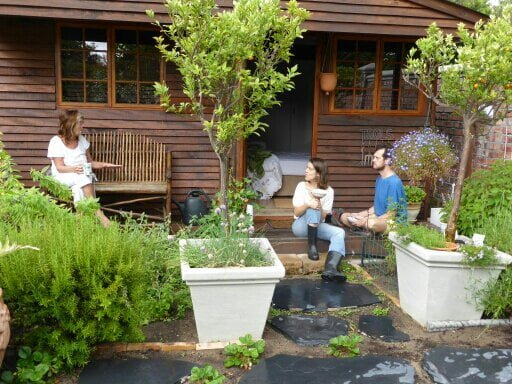
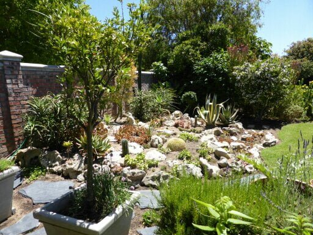
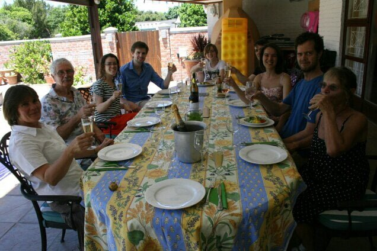
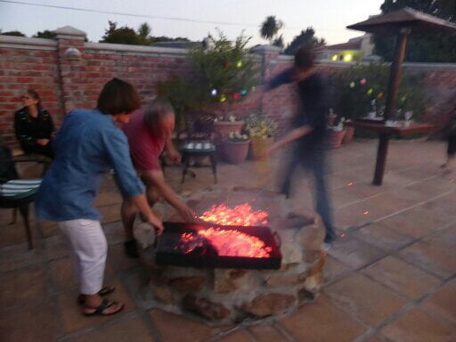
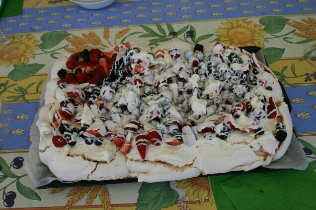
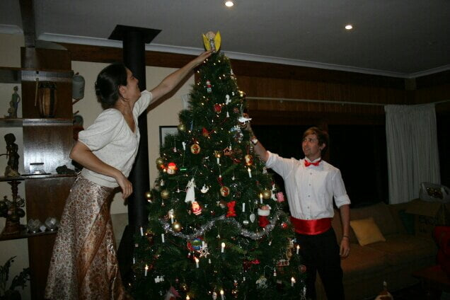
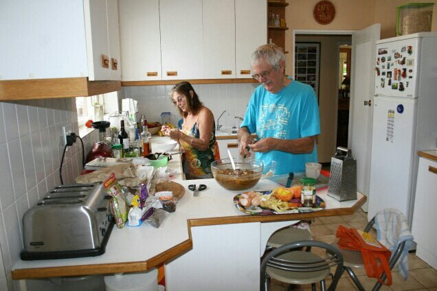

It is 3 pm.... Blue sky sunshine and a cool breeze.....sitting in beautiful surroundings next to a bath warm swimming pool. Has that made you envious. ? Catherines home is so warm and friendly with open doors to all. It seems like Louisa  Alcott could have written little women here  ? Such is the family . We live in Dan and Catherines cabin which Wendy, Catherines mum, built for them. Wendy is a practical and very clever lady. It's very comfortable having a little herb garden outside, a lavender screen, a cacti garden with slate stepping  stones to the front door and a wooden seat for morning tea

The main house is a tardis, the centre being the kitchen, where we all prepare our own food,from overflowing food stores  then maybe eat outside or where ever.

The family are...Joe and Wendy...Jennifer and Ross....David (brother) and Alison (sister) Molly and Wilbur the dogs Saskia, George and Louis the cats Sheila, Chickpea, and Fenton the chickens who like a cuddle and are taller than the dogs

The first evening here Joe, Catherines dad ,did a  braii,( bbq,)and the wind  became so strong  all the red hot wood ashes had to be shovelled to an under cover bbq., After which we enjoyed delicious spare ribs and chicken

Sunday was Joe and Wendy's anniversary so we cooked a roast dinner complete with risen Yorkshire puddings followed by Berry pavlova made from 12 egg whites. Delicious

Decorating the tree meant a tradition of egg nog using 12 egg yolks and a vast quantity of rum, drunk with delivered pizzas, lots of fun and carols 

Next Day we made a huge Christmas pudding for 21 folk on Christmas day. 

Today is the the memorial service for Nelson Mandela and a history lesson for me -what an amazing person .. every one is celebrating his life. The singing so emotional and straight from the heart

<iframe width="560" height="315" src="//www.youtube.com/embed/MHHjP7XrBq0" frameborder="0" allowfullscreen></iframe>

Catherines grand parents invited us to dinner at their residential home complex last evening. A delicious meal, Angel fish, eaten with the residents . They have a beautiful home too. We are going to their holiday home at

Langebaan lagoon on Sunday and will celebrate Christmas there Friday  we will picnic at an outside Carol concert each one holding a little light

After lunch..so time for a swim... Then maybe to Hout Bay with Dan

RIP Madiba 1918 - 2013
