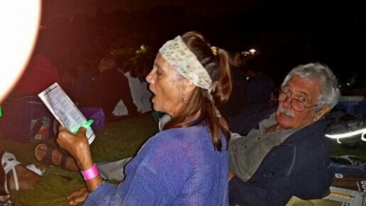
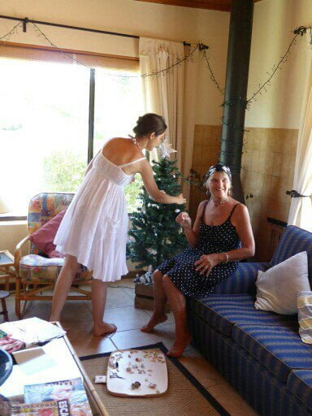
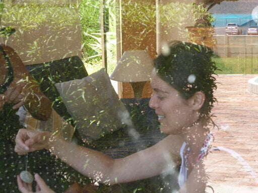
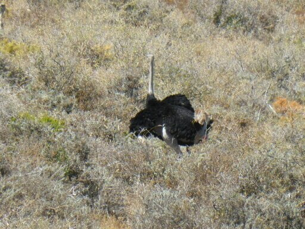
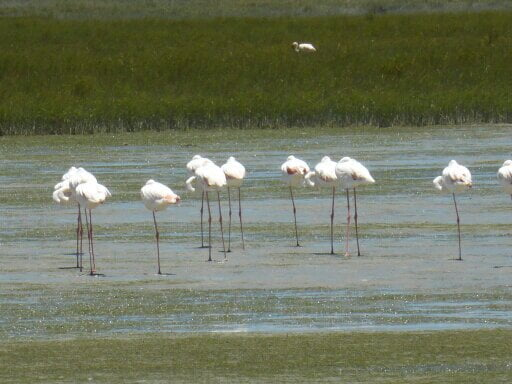

After 10 days of celebratory induced champagne toasts.... our arrival; grandparents dinner; Wendy and Joe s anniversary; David's birthday; and Alison's  graduation, we have journeyed 2hrs North to this beautiful lagoon where we will spend Christmas. The old but trusty family Landrover packed up to its gunnels.       So peaceful here with just Dan and Catherine at the moment.

Friday evening before we left was the Kirstenbosch Christmas carol concert. Loaded with picnic hampers and suitable beverages, 5 of us went to secure a good spot 3 hours before' lift off '.Dan and I had a buggy lift up the hill with all the consumables meeting Catherine and Mike at the top. The setting is in a botanical park, flanked by table mountain, complete with some truly original sculptures. Joe disappeared with his' hip attachment' a camera that can capture feeling as well as pictures. A brilliant photographer escaping his seemingly 18 hour day as a lawyer. We filled our time doing crosswords, listening to some excellent music and singing and sneaking an aperitif. The rest of family arrived and carols began. Amazing! Singing from the soul. Picnics finished, we all waved our glow sticks which also served to see the carol sheets , 17 in all. Whilst we were lusting (a mo' ism) our lungs, a nativity concert was performing on stage. A remarkable evening. 

A quiet day today, hence the blog. All playing in our own corners. We have decorated the tree with collected sea shells and pomegranate seed heads.    So pretty.....a foil star on top. 

Two days of strong winds...... Just about managed to stay upright on a beach walk ...a few catastrophes with wind surfers and their kites... enough fresh air for a week! 

Bill and Peggy, (grandparents) and Catherine's aunt and uncle, who are staying 2 bungalows along have invited us for a braai and more champagne to celebrate 58 years of marriage tomorrow evening. ....

  So no escaping the bubbly!!!

The evening was a chilly one as wind was still whirling but braai was delicious.

Now in bed updating before going to Internet cafe as no connection here.

Had a trip to local nature reserve, yesterday, where we were amongst the animals and spied from bird hides on the salt marshes. Had coffee surrounded by some pretty and amusing birds under the trees. Then to the beach only used by nature reserve visitors so not too crowded. A rocky, nooky, but sandy beach, we picniced under umbrella next to a turquoise lagoon. (Smoked salmon, salad and crisps) . Walked with Catherine who whooped with delight when she spotted a baby octopus, so tiny it had probably not long been hatched. Soon, after it was homed in a plastic bottle , we could watch it. Am amazing sight. The head was a tiny transparent bubble with protruding 'teddy bear' eyes and its eight legs flailing around like a flower head. It changed colour according to the light and environment. Soon Catherine was showing this wonder to children and mums close by then returned it to the sea. (Del boy would have cashed in on this) All had a swim. Dan was stronger today so could enjoy it too .....cold at first then divine! Driving back, Catherine with her fantastic perception and eyesight spotted various creatures hiding in the fynbos (grassland) and braked, thankfully, when 5 spooked ostriches fled across the track in front of us. 

Gradually getting used to Samsung pad and swipe writing but sometimes predictive text takes over so please excuse if I miss correcting it. Dan has now presented me with another technological challenge...an all singing and dancing Samsung Mobile phone just to make sure my brain doesn't rest! !! Now for the big test , for which you must close your ears , whilst I try to remember what to do.... Downloading the photos. Fortunately my expert has already downsized them. .. Not up to that stage yet!

So with that, must get up, breakfast , and get to Internet before time to write another day. .. All for now

With love from us both

Mo and Mike xxxxx

Enjoyed your comments, would be great to hear some more.
