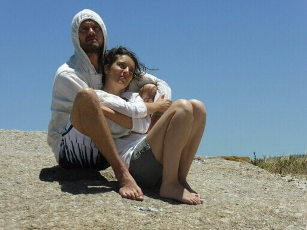
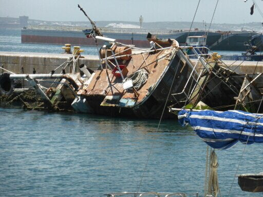
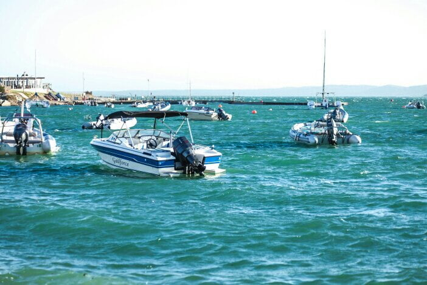
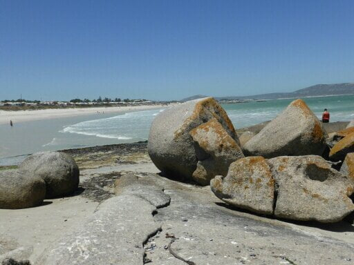
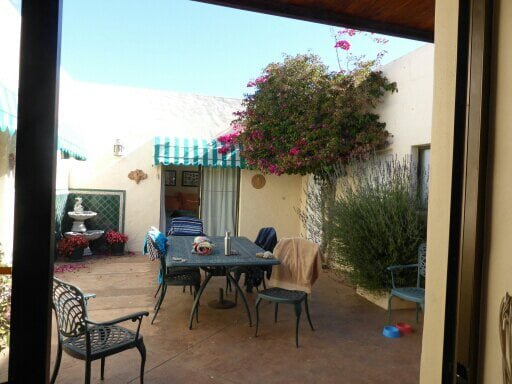
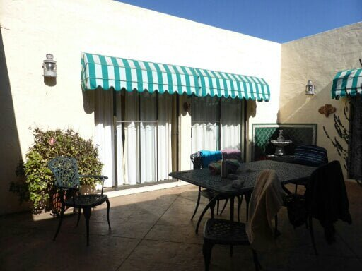
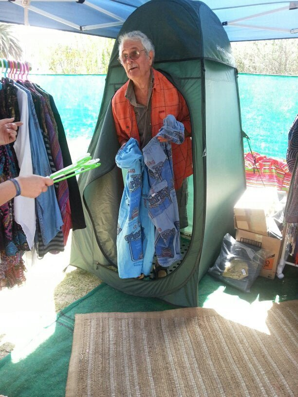
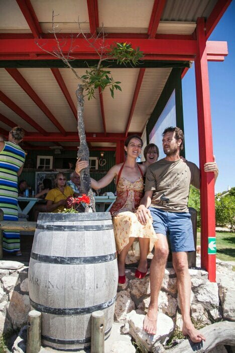
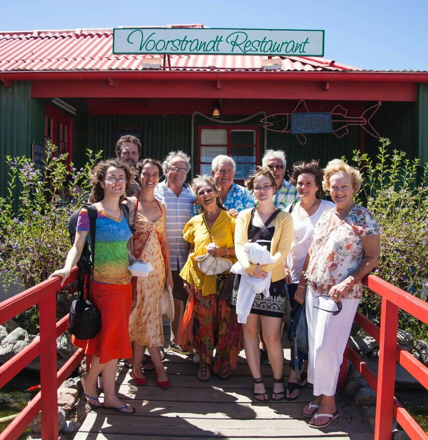

Just returned from yet another celebration! After 3 years of diligent hard labour,  Catherine has excelled in her degree results, in herbal medicine. Another 2 years to become a herbal doctor. So the 4 of us went to an old fishing port, complete with decayed skeletal boats still tethered to the dock. We enjoyed delicious mussels cooked with garlic,  celery and whole peppercorns, sitting in a little pavilion overlooking the boats and entertained by some young children with fishing nets. A pink net to match her outfit. ... How decadent can one be? 

I've just been looking at some sketches I attempted yesterday afternoon. What a mess! Leaving the others to their afternoon snooze,  l took pencils and pad to the waters edge, found a sun and wind free spot,  then had to move because of close proximity to some dog poo (albeit dehydrated and free from pong! ), then chose my subject. ..... Some bobbing boats with a small building and vehicles in the back ground. A good start, then the wind turned the bobs into 180 degree turns, up, down, round and back, then the bobs got out of sync.with the turns. I now understand why Picasso  chose to paint in facets, perhaps he encountered a similar problem. Turned over the pad and me the other way. ... Some fishermen silhouetted in the sun, meaning I did not have to bodge up their details. Planned it out, and then spent so long on the light and share of the boulders on which they stood, that I failed to notice in the meantime they had packed up and gone home. So, I ended up with Picasso cubes and Lowry match sticks. Maybe a fortune when l'm gone.! 

Now to the point of the heading. Realised it must be time for our daily dose of Dan's Dollop. (Brings back memories of a weekly dose of California syrup of figs, as a child, to keep us regular! ) This dose is quarter litre of freshly juiced organic vegetables . It comes in various shades according to content. .... sludge green, sludge red or sludge yellow. Sworn to give you energy , we are waiting to awaken with vital vitamin vitality and rejuvination Actually it's not bad if you down it in one like an after dinner tot. It will never replace the conventional aperitif, though. Thanks Dan, just joking. .. can't wait for the next surprise in half an hour! 

Now the next morning

... stepped out of our room to a whirlwind of cerise confetti..... did we have the bridal suite?...come off that cloud!!!!... the bougainvillea tree in the corner of the courtyard was losing its bloom to a somewhat frisky breeze. Each of the en suite bedrooms open on to this 'quadrangle'with table and chairs. ..... It also has sliding glass doors to the lounge, dining area and kitchen, plus bedroom number 5 so comfortably housing 10 of us over Christmas? 

Catherines aunt and family (11) are next door where we will all dine on Christmas Eve. Mike and I walked  our 'golden mile 'along the shore of the lagoon..... climbing over boulders and then across flat stretches of sand. Seems like all the world and his boat was out. ... All happy friendly people, mostly Afrikaners, having a good time on a Sunday morning, breakfasting in a beach bar where we had coffee. Catherines next door family went Cray fishing in their boat, but some engine trouble meant an empty net return.

A local Christmas craft fayre I meant Mike buying his Christmas outfit. ... Just a little too big! !!

Now waiting for Catherines parents and sisters to arrive, the boys arrive tomorrow........

23rd December.   Catherines birthday...... presents and candles....I made a candle tray from 3 strips of Sea weed, moulded and sun dried. .... These match the shell tree decorations. ... so a nautical Christmas tide. Along the'golden mile' for coffee, then on to lunch a at a sea food restaurant on the beach. With the family.

Hope to add photos & publish today 

so I can send tomorrow with all our good wishes for Christmas and New Year. Thank you for yours Lots of love from us both Mo xxx
