Last minute Christmas Eve. shopping. ..... The golden mile along beach to super market. Crowds ! .... there are none. .... Decorations!.... there are few,  except a family Christmas tree and maybe a few fairy lights ....No glare or garishness to announce the big day here. Like France , the event, in comparison with UK, is refreshingly under stated......except for a small band outside the shop. (We thought it might have been Christmas carols they were murdering.) Shops,  restaurants and menus stay unchanged , some cards in shops but few sent. Dan & Catherine met us in the land rover to  help us carry shopping. ...... Some bread and a packet of dried apricots. ! Coffee in beach bar then home to prepare Christmas dinner for the evening. Concurrently to this , Jennifer & Ross' s bed was being repaired .... With just a little bit of advice! [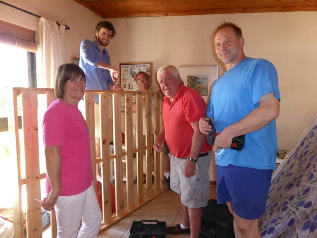](https://www.artamo.click/wp-content/uploads/2014/01/wpid-P1010407.jpg)

We did half the meal, 'next door ' cooked the other half. Two turkeys cooked in the Weber outside whilst next door two gammon hams were prepared. Whole potatoes were boiled , skinned,  then deep fried..... really yummy. .. delicious stuffing sewn into each end of bird. ... 'ouch!' , lots of vegs, and tasty gravy . After champagne aperitif , food, and us migrated next door. A chilly evening, so tables for 21of us attractively set indoors, opening  onto the garden with a brazier burning. [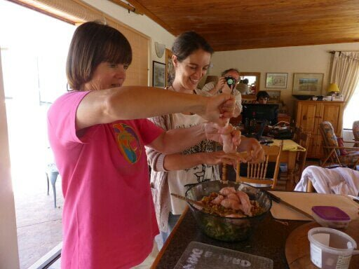](https://www.artamo.click/wp-content/uploads/2014/01/wpid-P1010417.jpg)

[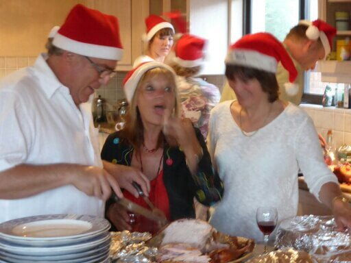](https://www.artamo.click/wp-content/uploads/2014/01/wpid-P1010422.jpg)

[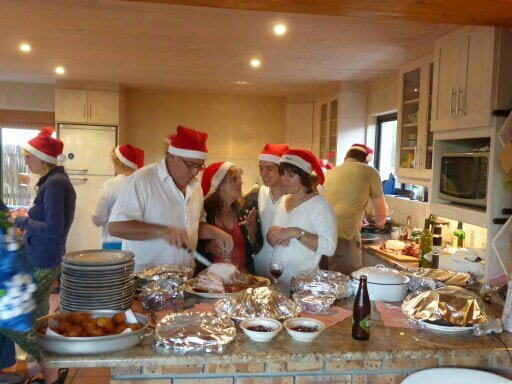](https://www.artamo.click/wp-content/uploads/2014/01/wpid-P1010424.jpg)

More champagne, then the meal commenced. Really scrumptious and so well organised. Before dessert, we all had to throw 2 dice in order to receive a gift which each of us had donated anonymously. Some rules were loosely applied which meant two of us jostling for the same gift. ... A family tradition and good fun. Then the other ' piece de resistance ' my pud.!! It already contained a huge overdose of brandy (Joe's influence) and with more poured over it became a blazing inferno when lit. The German guests had made a Stollen cake,  so a bit of rivalry here. (Don't mention the war! )  Think it was the flames that  topped it! [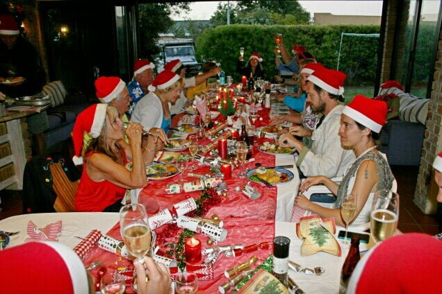](https://www.artamo.click/wp-content/uploads/2014/01/wpid-2013-12-24-201913_IMG_1448.jpg)

[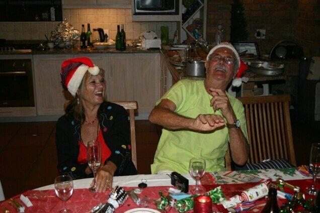](https://www.artamo.click/wp-content/uploads/2014/01/wpid-2013-12-24-205850_IMG_1467.jpg)

[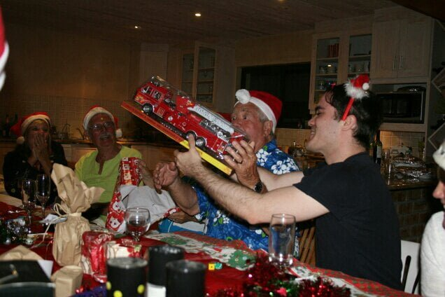](https://www.artamo.click/wp-content/uploads/2014/01/wpid-2013-12-24-213847_IMG_1524.jpg)

[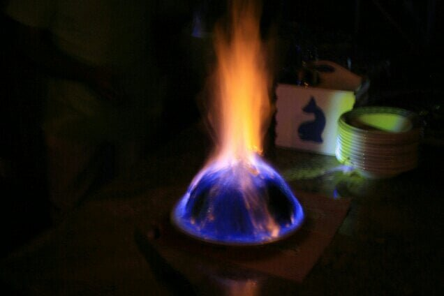](https://www.artamo.click/wp-content/uploads/2014/01/wpid-2013-12-24-221200_IMG_1554.jpg)

"We wish you a merry Christmas, we wish you a merry Christmas. ....." The non too dulcit vocals are emitted with gusto. .... At what time is it. ? 6.30 am...... and we thought we'd had Christmas last night! No response. ..... So, not giving up , we hear. .."Day Oh. ....DAY..Ay...Ay...AY..OH..... Day light come. ....la la lala la la......."

A hearty rendition from Joe, getting excited at playing Father Christmas to his offspring,  bidding them to be there when he starts. It works. ... We are the last to assemble round the tree. .... All in various forms of night attire, clutching a mug of our choice of brew in one hand and a compulsory,  customary mince pie in the other. Presents are distributed, each one being opened to "Oohs and aahs " of jubilation and delight , before the next one is given. We were delighted to be given a well stocked hamper of goodies to take on our trip, from the family ; a rag dress for me (fits perfectly) , and trendy long pants for Mike, from Daniel and Catherine. All these surprises were so well chosen, every one was delighted. The grand finale to the present giving was the ritual ball throwing for Wilbur and Molly. A year's supply of tennis balls are bounced across the quadrangle,  resulting in highly excited doggies not knowing which way to turn and a good laugh for us! [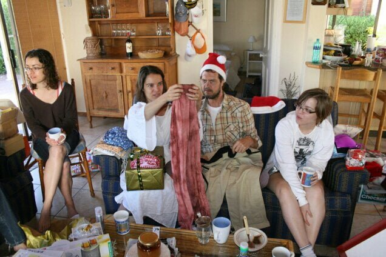](https://www.artamo.click/wp-content/uploads/2014/01/wpid-2013-12-25-085020_IMG_1597.jpg)

[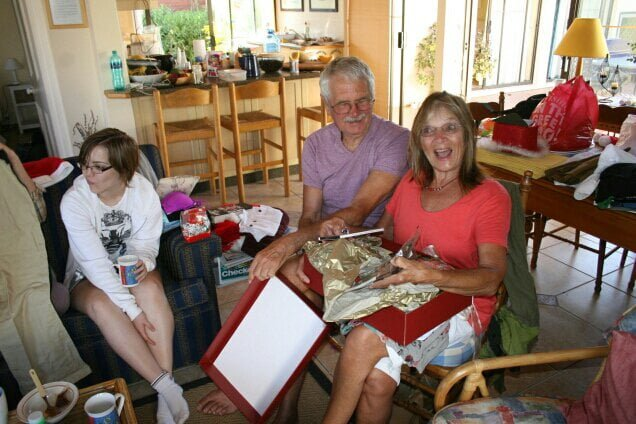](https://www.artamo.click/wp-content/uploads/2014/01/wpid-2013-12-25-085017_IMG_1596.jpg)

[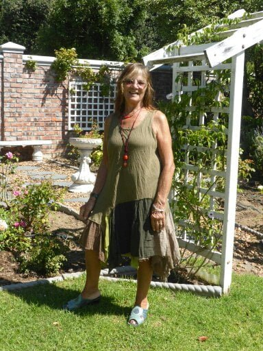](https://www.artamo.click/wp-content/uploads/2014/01/wpid-P1010482.jpg)

I

Jennifer, Ross and David then left to go to Ross' s family for lunch. We walked to beach for a swim, but too shivery past waist level.  Mike managed a quick plunge,  but we didn't like the look of him when he surfaced so passed on that idea.   Had a 'Wendy' brunch, mushrooms in wine with fried bananas, bacon & eggs, downed with pink champagne, followed by mince  pies. Very nice! !!  We all did or own thing in the afternoon and finished the day with a fry up and cold turkey plus the. usual tipple. [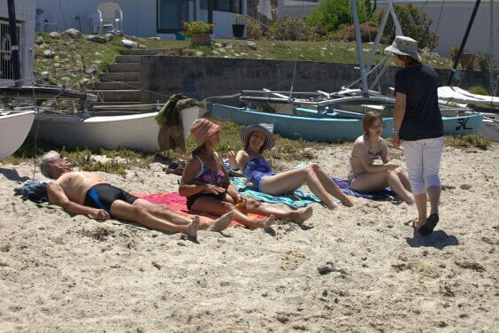](https://www.artamo.click/wp-content/uploads/2014/01/wpid-2013-12-25-111556_IMG_5979.jpg)

Wendy and Joe left next morning to visit Joe's family and then to their farm way out yonder. They took the trusty land rover to accommodate the rough ride, leaving us the more sedate Musso (African Buckie).                        We had our second breakfast in the beach cafe,  then lunch before returning  home to Chorley. [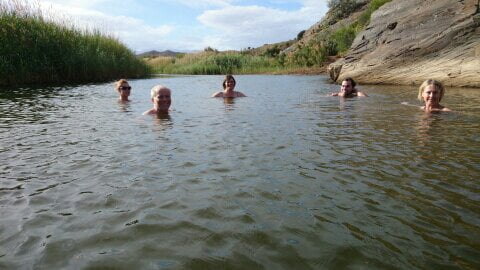](https://www.artamo.click/wp-content/uploads/2014/01/wpid-2013-12-28-173813_DSC_00891.jpg)

A relaxing few days here, just the 4 of us, with occasional visits from Catherine's siblings.  We already miss Selena, their beautiful bouncy, bosomy (she totally envelopes you in a hug ) black helper, who has been a part of the family for 17 years and to whom they have been a big support in some times of some hardship .

It is now Sunday morning, so deciding what to do after Catherine & Mike finish cutting back the vine, which threatened to engulf us in the cabin...

Now moving on to New Year's Eve. Wendy and Joe have returned. We spent the morning sight seeing and being blown away at Chapman's peak. Such stunning scenery, so blown in mind as well as body! We spent New year's eve at home, just the six of us, having a braii under a beautiful starry sky, sitting until the embers died, hearing fireworks from local events. The following day Wendy and Joe hosted a 2014 family lunch for 17 of us another champagne toasting opportunity! Siesta then a one off 'Downton Abbey' to round off a lovely day. ....

HAPPY NEW YEAR to you all ........
