The year started relatively quietly with a leisurely meander along Diep river and having coffee close by. Lazy swimming, reading, crosswording, without a single cross word between us all. It's become a really fun thing, solutions pop up at the most inconvenient times into one or another's brain and then forgotten as soon as putting pencil to paper..... an ongoing ritual.

[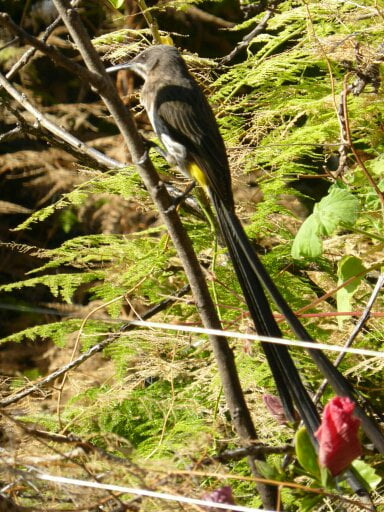](https://www.artamo.click/wp-content/uploads/2014/01/wpid-P10105241.jpg)

Mike and I took a trip to Kalk Bay to change his Christmas pants  (trousers) and to wander round the boutiques and antique shops there. The density of holiday traffic meant we about turned and consequently found a huge market on the beach, plus a very fortunate parking space. Mainly blacks and coloureds, it was was a happy cacophony of voices, musicians, children with dancing from the locals. For them, lunch out was a chip and bean roll, or an overflowing sandwich, in one hand and a drink in the other... One lad had a live fish in the other, I wonder if he was eating from both hands!!!!  No purchases for us there,  but we came away lifted by the feel good ambience of it all. [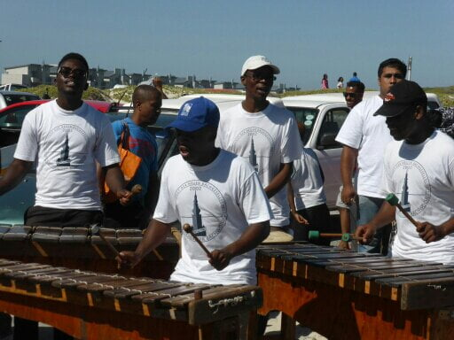](https://www.artamo.click/wp-content/uploads/2014/01/wpid-P10104961.jpg)

[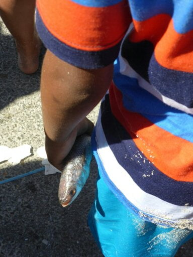](https://www.artamo.click/wp-content/uploads/2014/01/wpid-P10104971.jpg)

The next attempt to reach Kalk Bay found us on the wrong route, where we dawdled in sweltering hot traffic for 45 minutes, after which we needed a refreshing cold drink and a scrumptious cinnamon lemon crepe, leaving just 2 minutes to shop as all closed at 5pm. Shows how incompetent we are without Jane our 'sat nav'. Sorry, Jane, "all's forgiven, we'll never argue with you again !"     3rd time lucky maybe!

[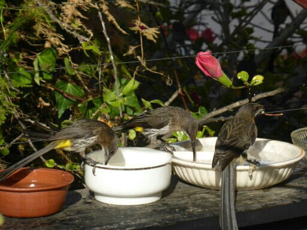](https://www.artamo.click/wp-content/uploads/2014/01/wpid-P10105231.jpg)

[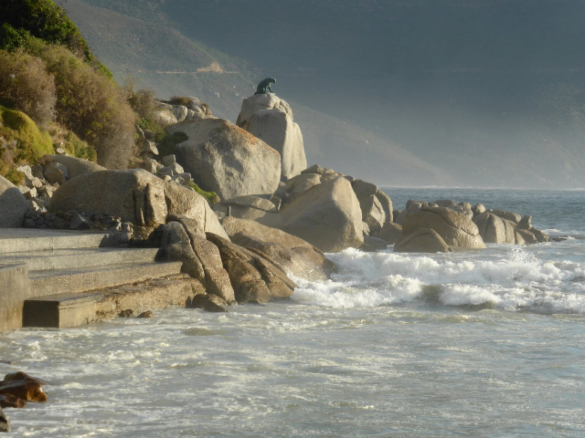](https://www.artamo.click/wp-content/uploads/2014/01/wpid-P10105671.jpg)

Saturday was carnival day in Cape Town which comprised 17 minstrel groups who were judged before the parade. Joe and Wendy took us, Catherine and Dan were going to a wedding. Both looked very smart and sophisticated. I'd forgotten what Dan looked like in a suit, he just stayed for the service as needed to rest. Catherine made and beautifully embroidered a handbag and a handkerchief for bride and groom respectively. A truly personal gift, one to be cherished.

In the mean time we made our way to the carnival route. Crowds everywhere, again all coloureds and blacks. It was their festival! Some had been there all night with tents erected along the route by the side of the road. .... babies sleeping....... youngsters perched on cool boxes or on dads' shoulders. Through colourful hats and turbans, we jostled our way to find a viewpoint in the shade. We stayed for just 3 of the processional groups...... All in costumes or coloured 'uniforms'.... All ages from tots to totterers... All with one thing in common. .. inherent rhythm!  Dances and movement,  practised or improvised,  all came from the soul and performed for the waving cheering audience. [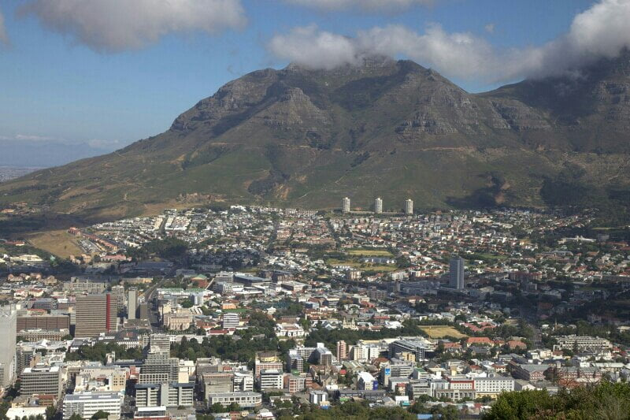](https://www.artamo.click/wp-content/uploads/2014/01/wpid-IMG_68981.jpg)

[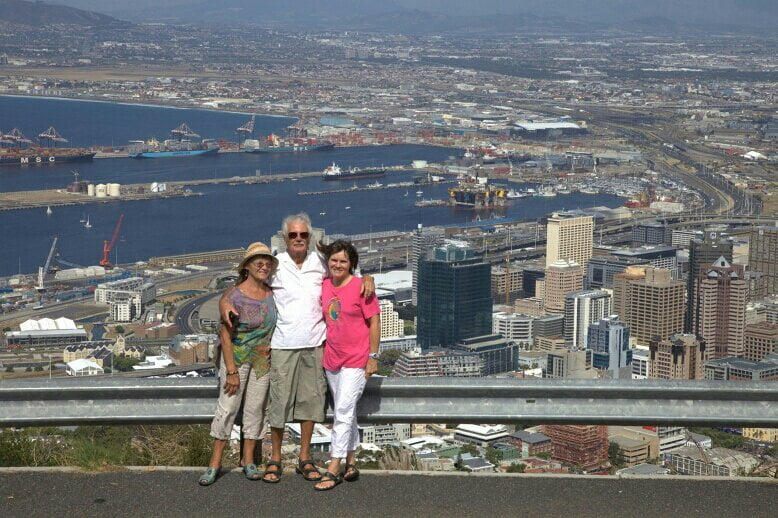](https://www.artamo.click/wp-content/uploads/2014/01/wpid-IMG_69041.jpg)

[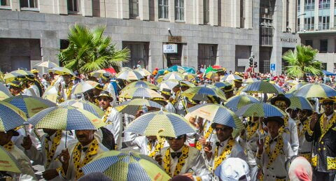](https://www.artamo.click/wp-content/uploads/2014/01/wpid-IMG_67571.jpg)

[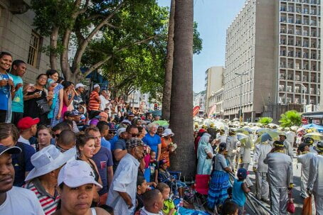](https://www.artamo.click/wp-content/uploads/2014/01/wpid-IMG_67671.jpg)

[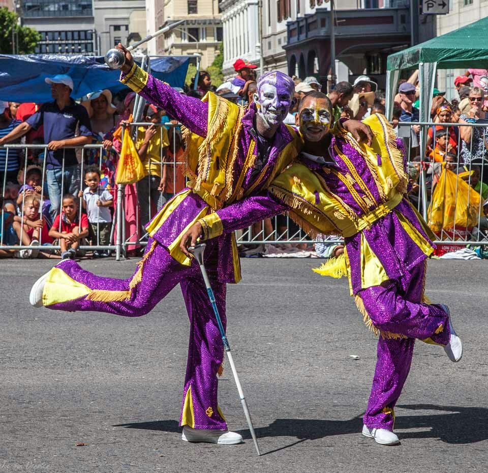](https://www.artamo.click/wp-content/uploads/2014/01/wpid-01-IMG_68611.jpg)

[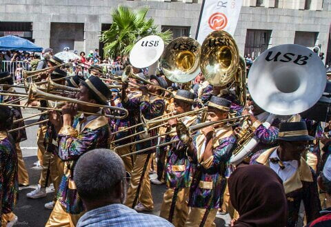](https://www.artamo.click/wp-content/uploads/2014/01/wpid-IMG_67951.jpg)

[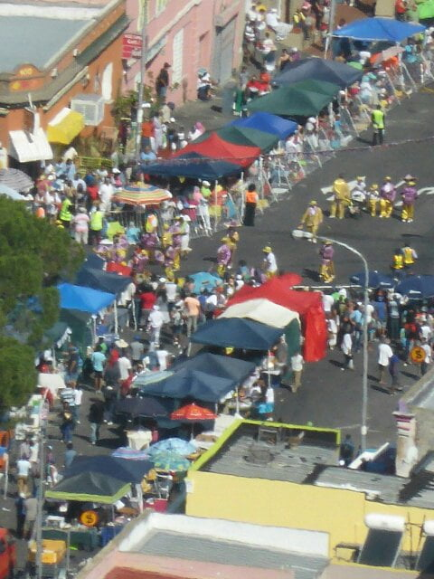](https://www.artamo.click/wp-content/uploads/2014/01/wpid-P10105481.jpg)

After fighting or way out and back to the car, Joe drove us along the coast, stopping to watch paragliders and radio controlled aeroplanes, taking off from where we stood.  Bit too close for comfort for me, all flying in close proximity to each other. All it needed was for one person to lose control and then maybe a severed head... (love a bit of drama!) Next stop an earlyish dinner , forced upon us by the hunger inducing smells emitting from 'fish on the rocks' a fish 'n chip restaurant on the coast.......little did it know that by exciting our taste buds, it was giving custom to the next restaurant 'en route'. Quite misty now, the beach scene was ethereal, young children playing in the spray, beauty waiting for an artist's interpretation..... [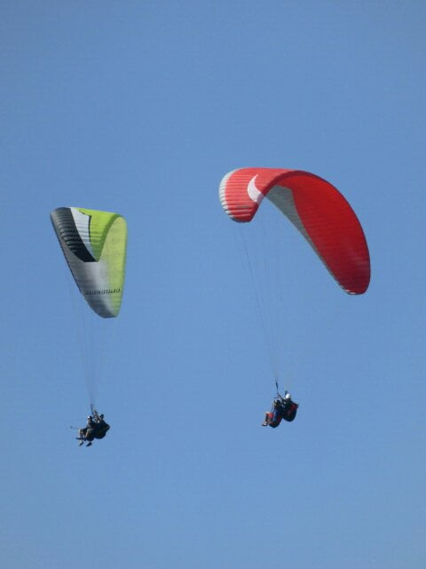](https://www.artamo.click/wp-content/uploads/2014/01/wpid-P10105541.jpg)

[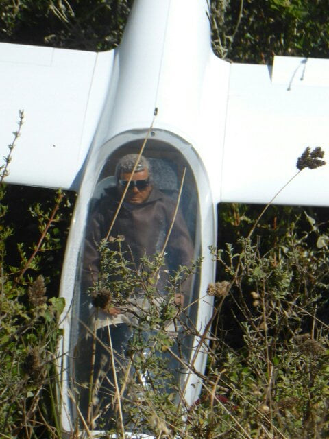](https://www.artamo.click/wp-content/uploads/2014/01/wpid-P1010560.jpg)

[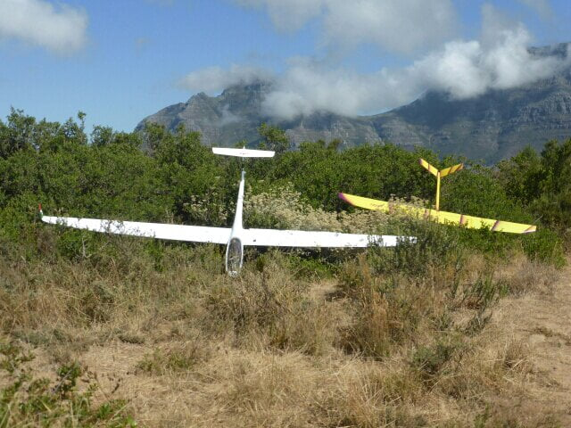](https://www.artamo.click/wp-content/uploads/2014/01/wpid-P1010559.jpg)

To finish our fanciful gastrinomes (a Maureen 'ism), Wendy decided an ice cream was just the thing, enjoyed at Massimo's Italian restaurant in Hout Bay. Massimo and Tracey are friends who made the most delicious pizzas at their home, near to us in Bertric Buree. Massimo has recently had a successful bone marrow transplant and will be returning to work very soon. We hope to see them before our return. [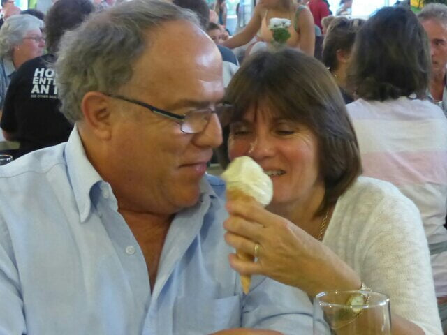](https://www.artamo.click/wp-content/uploads/2014/01/wpid-P1010584.jpg)

Then the rain came!.....almost incessant for a few days, but in the almost time we managed to see the week whizz by. Dan needed to renew his visa, all documentation balls!!!!! (this my computer predicted word, but so apt I'll leave it here), was thought to be valid and just needing police authorization but Oh no!... nothing so easy. After three trips to the police station and two to Cape Town (one at 6am to beat the queue) later, plus a hopefully accurately completed form, fingers are still crossed. [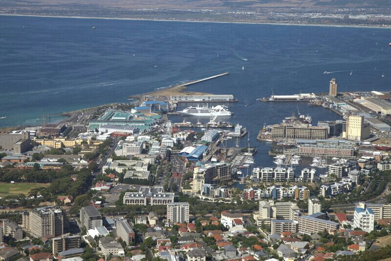](https://www.artamo.click/wp-content/uploads/2014/01/wpid-IMG_6893.jpg)

[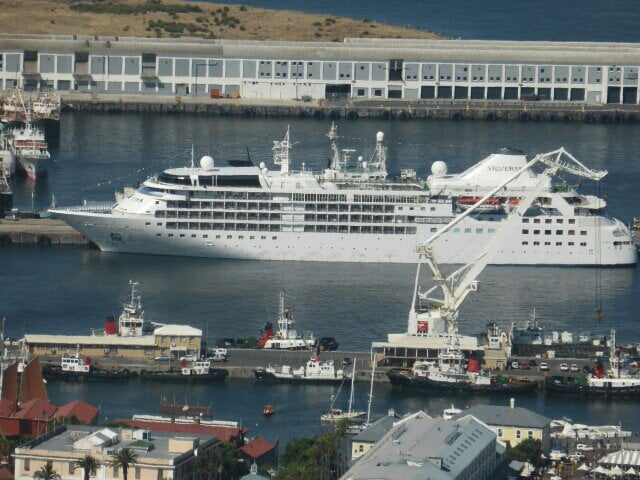](https://www.artamo.click/wp-content/uploads/2014/01/wpid-P1010542.jpg)

Whilst In Cape Town we went to see Mandela's \`Long walk to freedom', a very powerful, heart rending film, giving us a thought provoking insight into the very real meaning of apartheid of which I had only previously known the parameters. Dinner inside for the first time as The Waterfront wind was like a mini hurricane.

Jennifer and Ross are renting a bungalow with David, which meant a minor upheaval at Chorley! Wonder Woman Wendy managed to organize and move beds, desks, fridge etc from one place to another, including importing 2 beds from their farm 5 hours away and reconstructuing them into a king size bed. She is probably glad we are all away so she can now recuperate her study.(and energy!)

The evening meal was eaten with relish, (and a glass of beer), at an undercover  market,  where a multi cuisine from different cultures was was deliciously cooked...just one draw back, the difficulty of choice. [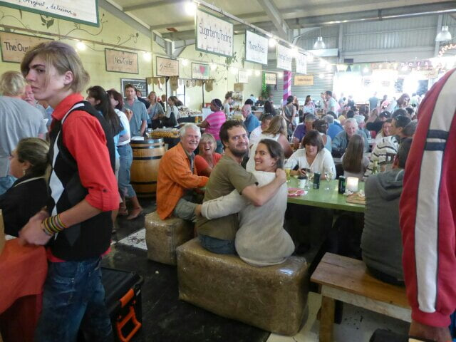](https://www.artamo.click/wp-content/uploads/2014/01/wpid-P1010581.jpg)

[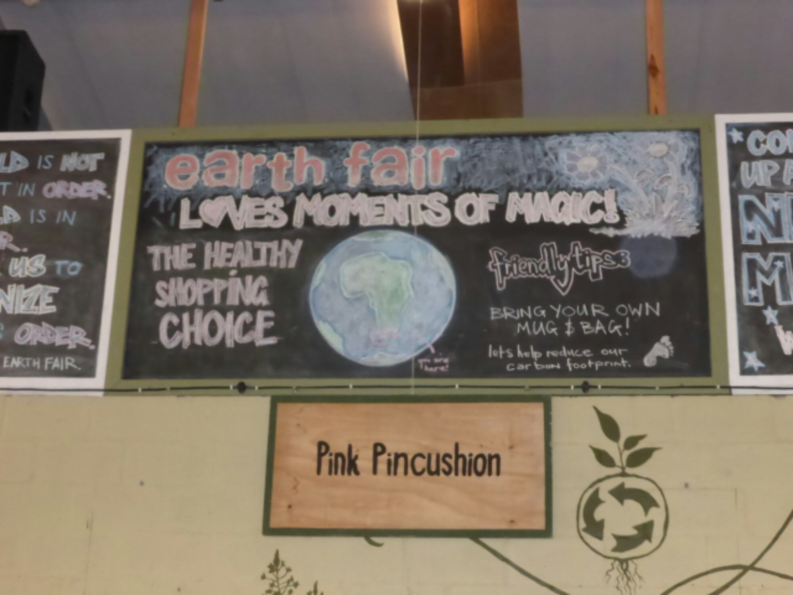](https://www.artamo.click/wp-content/uploads/2014/01/wpid-P1010577.jpg)

A very hectic time from which we have escaped, on a trip to resume our exploration of The Garden Route, a beautiful coastal stretch, where The Atlantic meets The Indian ocean.

A 6 hour drive and we are here at Wilderness. Wendy and Joe have given us their time share in this fantastic place. A villa overlooking the Indian ocean, slumbering amongst Milkwood trees, it is spacious, well equipped and, apart from the sound of the sea, peaceful, using Dan's words "conducive to relaxation". Dan And Catherine can lay in bed and watch the sea, whilst from our upstairs suite we can wave to the sailors from our bathroom balcony. An ideal Loo with a view! Only one handicap, the tree house is reached by a series of wooden steps so its difficult for Dan to come and go, but the benefits far outway this problem. Catherine,   Mike and I went to a local market this morning....lots of organic food, fresh coffee and breakfasts being served and next to this a craft market with so many original ideas incorporated into gifts, clothes, health and beauty products .... it's just as well they don't take credit cards!!!! The weather has stayed dry so far today. We have bought some logs so if dry tomorrow we can have a braai,  if cold we'll have a log fire and a roast dinner.

All three siesta 'ing hence catch up with the blog..... time for a cuppa!!!

I will conclude this blog with some pics of my walk this morning with Catherine along the shore.  The tide was receding revealing some fantastic rock sculptures formed by water erosion.... think salt played a part too. Large stranded jelly fish ,looking like minature fallen UFO's, attracting hungry baby shell fish were worth a photo too.

Sunday lunch over so more siesta time. Zzzzzzzzzzz

Photos next time as need to publish so can send from internet cafe today Looking forward to more comments.    Lovely to hear from you. Thank You!
