Wilderness has a fantastic beach, long and flat, flanked by huge boulder sculptures. Access is via a board walk and steps through the wooded shade and lovely fragrance of Milkwood trees. [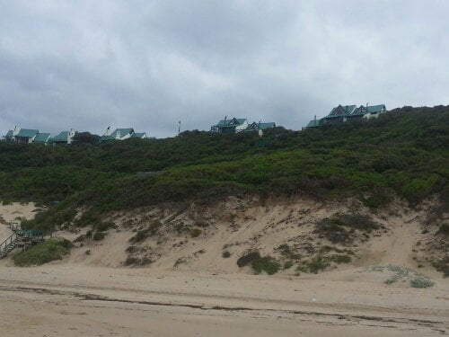](https://www.artamo.click/wp-content/uploads/2014/01/wpid-20140112_1003081.jpg)

[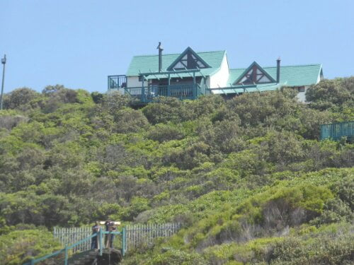](https://www.artamo.click/wp-content/uploads/2014/01/wpid-P10106502.jpg)

We beach combed along the shore through the gentle ripples which belied a very strong current further out.

[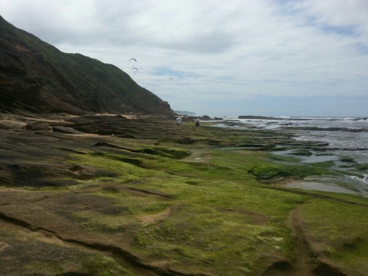](https://www.artamo.click/wp-content/uploads/2014/01/wpid-20140112_1029422.jpg)

[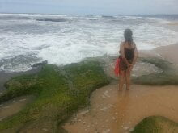](https://www.artamo.click/wp-content/uploads/2014/01/wpid-20140112_1044312.jpg)

Three large jelly fish, washed ashore were already being attacked by miniscule whelks, a welcome, if short lived, tasty lunch. This was an amazing sight to watch. They clung to the stranded mound of living jelly, then through a proboscis type tube, sucked the juices, whilst in constant danger of being washed away. In the case of the small blue stingers they appeared to pull the poisonous sting out. Maybe their last supper !

[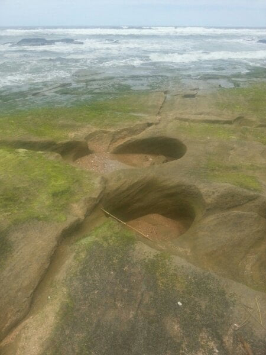](https://www.artamo.click/wp-content/uploads/2014/01/wpid-20140112_1042172.jpg)

[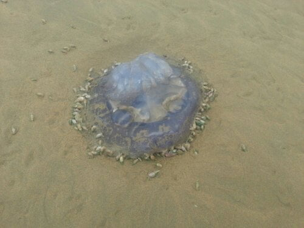](https://www.artamo.click/wp-content/uploads/2014/01/wpid-20140112_1107342.jpg)

Our wooden villa sat high between the beach and village so a winding step climb both ways. Wednesday was the first day Dan felt strong enough to tackle the ascent so a day out was planned ...... a scenic route, culminating in Knysna where we had a delicious sea food lunch at ' 34° South ' by the harbour.  Then another gravel road tour back to Wilderness past some splendid viewpoints, though Mike was deprived of the planned 4 o'clock cuppa as the cafe closed at 3pm. Catherine had even incorporated a detour so his daily ritual should not be interrupted! 

Traveling on gravel road roads to find the 'tallest tree' of which there appeared to be several, (a bit like the capital of fois gras in France), our trusty steed, Roger, developed a limp, which worsened into a full blown puncture. Pumping more air in was of no avail, so necessitated change of wheel. A signal for phone to get instructions from Catherine's parents, was reached on Roger's  roof... all hands on deck..whilst I ponced  around with the camera. Bet Dan wished he'd  stayed in bed. [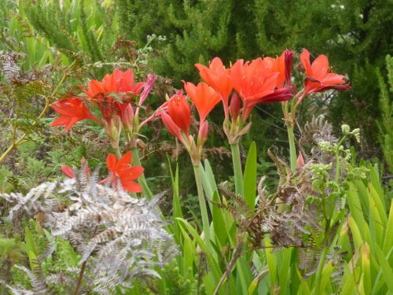](https://www.artamo.click/wp-content/uploads/2014/01/wpid-P10106762.jpg)

Next day was spent locating replacement tyre(s)..only in area one more day. Two were found in Knysna enroute to our next location.

[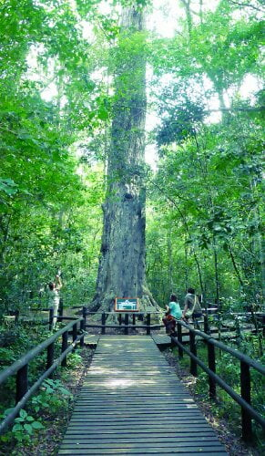](https://www.artamo.click/wp-content/uploads/2014/01/wpid-P10106682.jpg)

[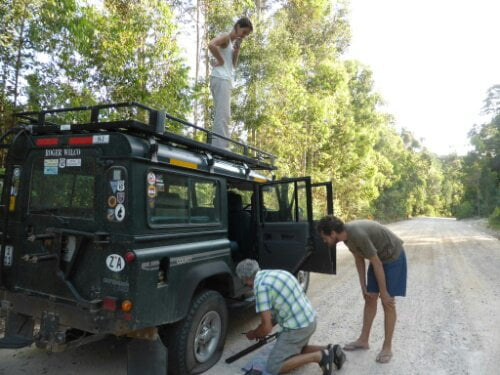](https://www.artamo.click/wp-content/uploads/2014/01/wpid-P10106843.jpg)

Left Friday morning after a swim, stopping for coffee at Timberlake, a small organic settlement. I treated Catherine and myself to delicious dark chocolate organic ice creams, not knowing the 'lads ' had ordered a second breakfast. I took toast, scrambled egg with cheese from Mike's plate, spooned some brown sauce on top, only the sauce was plum jam...what a concoction..... like a child secretly eating sweet before sandwiches on a school picnic.. such relish! Must get used to SA's food mixes.  At Christmas whilst eating sushi, I mistakenly popped a ball of mustard (wasabi) in my mouth..... A huge explosion..... taste buds annihilated .... nearly hit the roof, had to douse the burning with champagne.... did feel good after though!!! [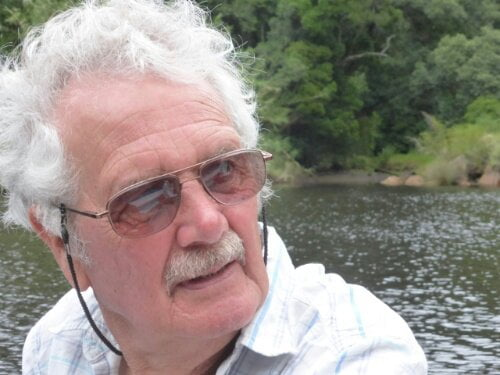](https://www.artamo.click/wp-content/uploads/2014/01/wpid-P10107042.jpg)

We sat outside to eat in a wired enclosure. This was to prevent the monkeys from stealing the food. Strange feeling, being in a cage whilst the primates watched us  eating. Maybe because we refused to lick, pick, or scratch our unmentionables for their amusement, we were offered no bananas! Each shop closed when unattended to avoid these light fingers. I had visions of a monkey party where they were all dressed in stolen children 's clothes eating ice cream! [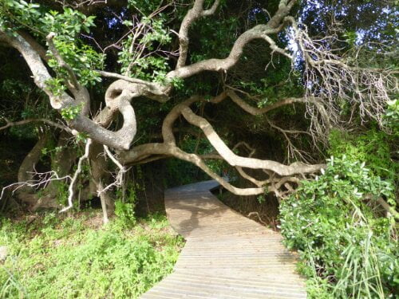](https://www.artamo.click/wp-content/uploads/2014/01/wpid-P10106332.jpg)

[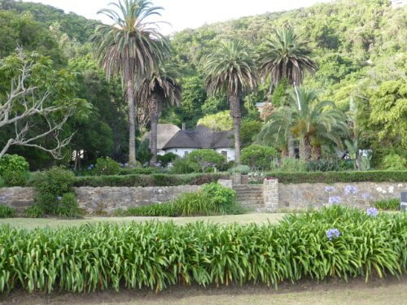](https://www.artamo.click/wp-content/uploads/2014/01/wpid-P10106392.jpg)

On to Knysna, where we lunched , after just having brunched, whilst Roger was re booted ready for the next trek!! [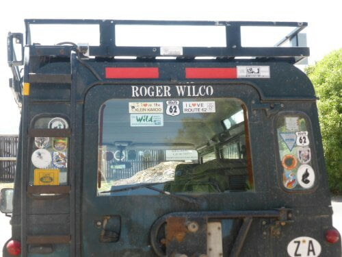](https://www.artamo.click/wp-content/uploads/2014/01/wpid-P10107443.jpg)

Past the townships, where this time I managed to get a good view and therefore a better insight into the lives of these people. All sorts of different residences from just a few sticks crudely roped together with dust bin bags for roofs, to more up market brick or timber buildings with artistic decoration on the walls. Pigs and goats, chickens and maybe a cow or two wander their narrow streets and venture on to the main road too. Education is compulsory for all children between the ages of six to eighteen, I believe, the children wearing supplied  school uniform...not sure about the footwear though.

[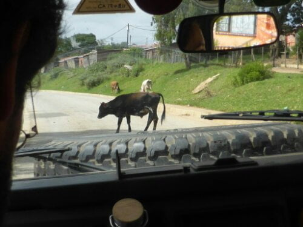](https://www.artamo.click/wp-content/uploads/2014/01/wpid-P10106633.jpg)

[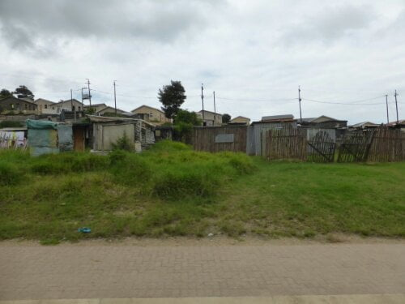](https://www.artamo.click/wp-content/uploads/2014/01/wpid-P10107362.jpg)

[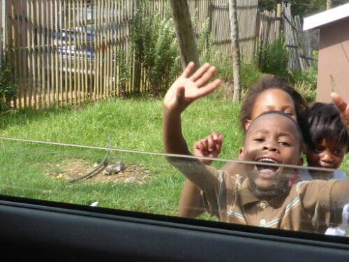](https://www.artamo.click/wp-content/uploads/2014/01/wpid-P10106621.jpg)

[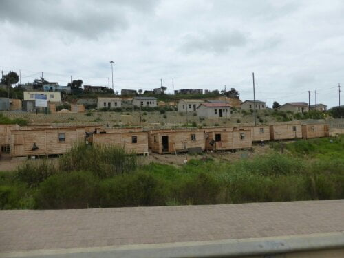](https://www.artamo.click/wp-content/uploads/2014/01/wpid-P10107351.jpg)

[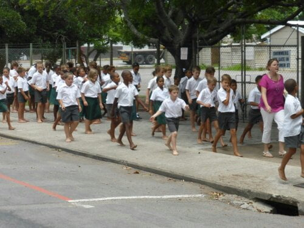](https://www.artamo.click/wp-content/uploads/2014/01/wpid-P10107381.jpg)

So we arrived at our next abode. A log cabin in a small camp site, beside the Keurbooms river in Plettenbergbaai. A complete contrast to the sea side. Set in a wooded nook, it could almost be a bird hide with the number of pretty birds and butterflies around us. Took a little while to get used to the darkness after the luminosity of the sea. We can just see the river through the foliage. Had some fun in a hired motor boat, though the sun decided to hide for the afternoon. Swam in the 'red' river, me with my noodle arm attachment, [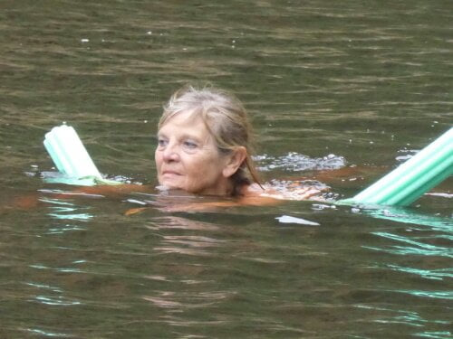](https://www.artamo.click/wp-content/uploads/2014/01/wpid-P10107151.jpg)

fighting the wash from canoes and other adventurers, then a mini mid afternoon picnic to keep our strength up. Back home for a braai supper amongst the trees.

[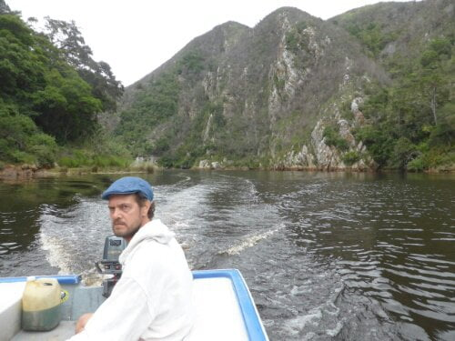](https://www.artamo.click/wp-content/uploads/2014/01/wpid-P10107001.jpg)

[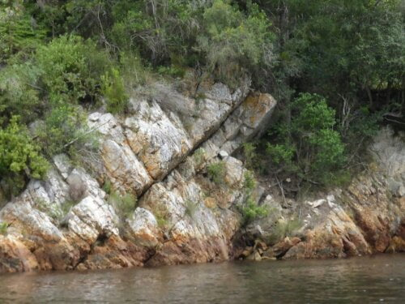](https://www.artamo.click/wp-content/uploads/2014/01/wpid-P10107101.jpg)

A special lunch was planned for my birthday on Sunday. Dan and Catherine had even bought me a dress to wear for the occasion. It proved to be the wettest birthday ever. A noodle assisted river swim in the morning, then shower, then to the beach in the afternoon.... wonderful ....riding the breakers (with noodle of course)....another shower...back to river in wet cossies to wash sand off.. then another shower to wash river off! Then board game and a good laugh to finish the day. Thanks for all my E- cards. Dan's phone just didn't have enough welly to boot them up, (excuse pun) so will have that pleasure when we find WiFi somewhere. [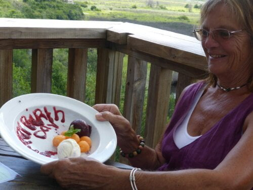](https://www.artamo.click/wp-content/uploads/2014/01/wpid-P10107241.jpg)

[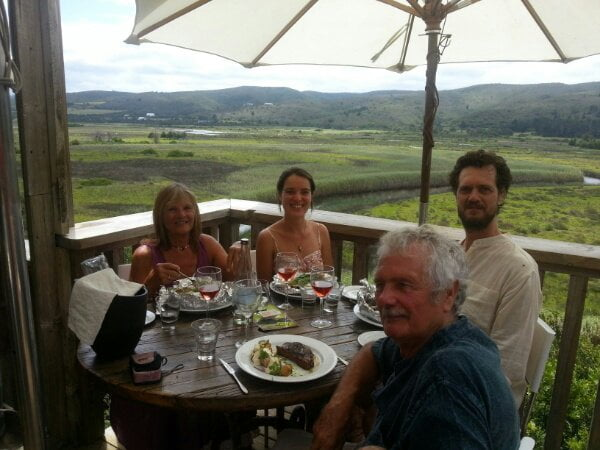](https://www.artamo.click/wp-content/uploads/2014/01/wpid-20140119_1353291.jpg)

In our food parcels are mussels, prawns and pasta in a delicious sauce. Took a doggy bag home for supper too.

Goodnight all ! [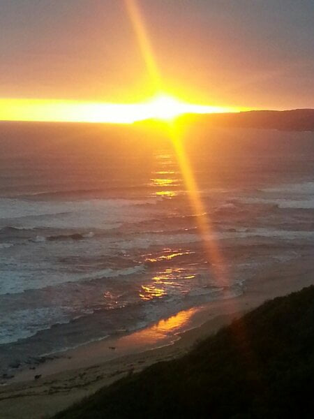](https://www.artamo.click/wp-content/uploads/2014/01/wpid-20140111_1939191.jpg)
