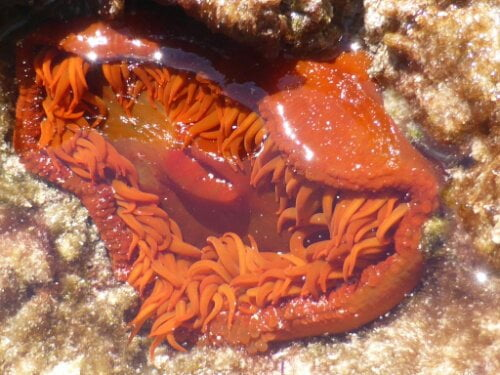

On the move again today to the Southernmost tip of South Africa. Been travelling all day and now installed in accommodation for two nights.

A thatched cottage facing the sea..... well it is from our bedroom's balcony. Our room is so huge, wicker settee and chairs, fridge, bed, shower room and more than enough space for a ball room dance!!!! High A-frame, roof supporting beams and French doors with a beautiful sea view. Downstairs equally huge but divided into 2 twin bedrooms plus lounge and kitchen. We have just returned from a walk to village, but there isn't one, neither shops nor coffee stops. Fish are caught and sold from harbour daily, (looking forward to fish on the braai) but not today.... there is a "meeting taking place" ...so looks like a swim day... beautiful covey beach flanked by dunes, then a notice ........Wonder if I can fend them off with my noodles????

Meanwhile Dan had driven Catherine across the dunes on a hairy (bald really!) boulder hidden route to seek an underwater cavern. This could only be reached (unless wearing diving suits) at low tide at noon.

Whilst Dan rested, Catherine demonstrated her rough terrain driving skills with us. She used the secondary 4\*4 gears... does this mean 8\*8?  Whatever! ... it was like being in a flat bottomed dinghy in force 9 gales. We hung on in there quite confident in Catherine's expertise. She was a 'rough terrain kid' after all!

A track was marked by posts, on which 'pilgrims' had left little piles of boulders to which followers precariously added theirs. We followed suit. It resembled some bizarre ritualistic commemoration (got my long word hat on!).

After climbing down some roughly made steps and scrambling across slippery boulders... me, quite often on all fours doggy style.....(my Capricorn goat sign seems to fail me in my dotage).....we came to the caves. Very deep and dark, the largest one still had waves crashing into it, so imagination had to suffice.

The surrounding rock pools were fantastic (I feel another painting coming on!). The colours, alongside the fish and plant activity were absolutely fascinating. Digital photography.. what a blessing.. would have used metres of film.. must have been yards then!

A nasty smell then engulfed our nostrils... something washed up? Closer investigation produced a mutilated shark. Maybe the same shark that ravaged the whale had got his comeuppance!  Mighty glad to move on from there.  We should have nose plugs, like eyes have lids, to eliminate unwanted stinks... maybe also ear flaps to induce tranquility when we want it...  perhaps man needs modifying so we can control all our senses. Just a thought!

6am cuppa in bed, prepared to leave, before a noodle assisted dip in the briny. We played 'avoid the sharks' and managed to win.......hence this blog! Jumping in and riding the waves was good fun, then Catherine leapt a bit higher, a blue stinger from a jellyfish had found its prey. Time to stop the frolics! Mike then untangled his toe from some stray fishing wire, with a resulting unpleasant tingling in hands and foot.... the offending wire was in fact another sting uncoiling . The length of it could have tied his feet together,and issued from such a small thing. No harm done. Had we been In Australia such a sting could be fatal!!

The route continued with the now obligatory second breakfast in one town followed by lunch in the next.

Standing with one foot in The Atlantic Ocean with other in The Indian Ocean (rock pools really, ocean too tough at this Point), was a weird feeling.......the southernmost point of South Africa, Agulhas.

After the necessary photos taken, (plus T shirt) , Catherine and Mike climbed to the top of the light house.....(more photos) ,  before we departed to seek our next lodgings.

Now at Stanford in an absolutely beautiful setting. A cottage on a cheese making farm, over looking a flowing  river, woods on the far shore  and mountains behind the woods . A lawn stretched down to the river with trees and shrubs, similar to L'Etang but not so steep. Tame rabbits ran, paradoxically, wild and came to be hand fed (no foxes here to fear).There were goats, a pot bellied pig called Lucy, befriended by

Mike, a donkey, chickens, ducks and many other farm animals. It had an amazing park for children, having most equipment made from large (Roger sized) rubber tyres, Picnics were available, parents could de- stress whilst their offspring could feed and pet the animals. School holidays have finished so it was very peaceful. Absolute paradise. We swam in the river which was a muddy brown. On the far bank Catherine was delighted to find some otter tracks which were renewed the next morning, but none of us did a dawn or dusk vigil to actually see the creature.

Yoga alternative style!

The river water was pumped to cottage for washing water indoors, filtered to prevent any debris and fish swimming in the bath water, but still kept its muddy hue. So we came out of a muddy river and had a muddy shower. All had a muddy glow. Drinking water was filtered from a rain water tank so looked much nicer. Lovely swims, walks and even managed to do a drawing, a crap resemblance of the surroundings. The town was interesting, with unusual shops, tasty looking restaurants and a humble Anglican church built in the shadow of the very elaborate Afrikaan Calvinist Church. Does the building make a difference to one's faith? A trip on The African Queen looked promising so went to have a look... the photo says it all!

Now installed in a tiny cottage in the lovely town of Greyton..... our last mini holiday home. Just a minute's walk from yet another river. This one flows shallow over pebbles and rocks with a couple of swim holes that we've discovered so far. The mountains are here but the surroundings are flat so lots of walks or rides.

Saturday morning, so we walked to the weekly local produce market..... Dan came in Roger so could bring back shopping whilst we explored the town. Second breakfast this morning was a pancake filled with really tangy home made lemon curd.... yummy! !

This town really goes back in time, with all the earthy values of the latter year. Home spun shops with some exceptional imaginative crafts... In one shop/restaurant/refreshment bar (many home made fruit drinks, healthy cakes and biscuits), a whole show was devoted to home built doll's houses complete with furniture and its residents. The craftslady had omitted no detail even down to a worn sock with a hole in the toe.... remarkable Original, innovative, sculptures placed in appropriate, or sometimes totally inappropriate places, using it seems any material to hand, amused the mind or evoked the spirit. Clothes from a bygone era, but totally wearable today were a temptation, but as with all the shops, no pressure to buy .

After siesta ing (still keeping our French custom) , we joined the local children in their water hole on the river . Aided by noodles (Catherine enjoys one too) we crawled crocodile style over the pebbles  The children were amazing.... running bare foot over the rocks, chasing each other, then driving with precision into the water hole. Once they saw the camera, the demonstrations got bolder.

We decided that this was a place to revisit so window shopped the agents for a home for Dan and Catherine. Some very 'des res'......small but cottagey quaint, were within their price range should Dan sell Faye.

Dreams start somewhere!

We had our first evening out. ... an after dinner drink in the 'dolls' house restaurant. Tardis like, the shop opened out into a cosy nooky, yet spacious, eating area complete with fountain and squashy settees.

Breakfasting outside Sunday morning, we were entertained by a dozen or so horses gamboling along the lane. Some helped to finish Mike's muesli, one, a beautiful pie bald, with a foal, dominating the others, got the 'lion's' share.

They then continued along the road as a normal occurrence.

A walk to the centre, whilst Catherine tackled a more demanding 2 hour hike,  reinforced our feelings for this town. The sound of melodious hymn singing reached us way before we found its source which was from a free Christian Fellowship Hall. Coloureds, blacks and whites were in the main street, all seemed to be in a care free mood. We returned for lunch here before we left for Cape Town. The same adult horses that were at breakfast with us were being ridden through town at breakneck speed by fearless juveniles, with their foals cantering in a different direction not knowing what to do. The unconcerned cars and bicycles just avoided them.... perhaps another normal occurrence. The Sunday roast, topped by a rosemary adorned Yorkshire pudding, accompanied by a brilliant female guitarist, still lingers in our taste buds.

