We had arranged to move to local accommodation this week to give some space to the family and so as not to hinder Catherine's studies. On their kind insistence that we stay, we're still enjoying sharing the Van Dorsten's beautiful home. A delicious pizza supper welcomed us  back to Chorley. Wendy and Alison prepared a variety of toppings to mix and match, whilst Joe played chief chef of the pizza oven. Lots of wine to complement the different tastes. A tad different from our normal Monday egg'n chips! [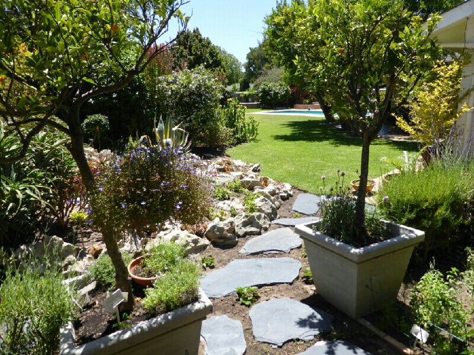](https://www.artamo.click/wp-content/uploads/2014/02/wpid-P1010149_800x600.jpg)

[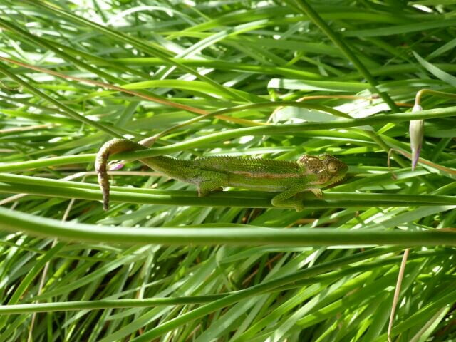](https://www.artamo.click/wp-content/uploads/2014/02/wpid-P1010995.jpg)

                                                                                    A chamelion in hiding!

Catherine's registration and relatively easy first days back were not quite as anticipated. Thrown in at the deep end to an onslaught of 'heavy' lectures, she felt inspired but tired. However her spirits  lifted when she gave an impromptu presentation in a township clinic on the 3rd day. Her talk was received by an enthusiastic and interested audience , crafting a sound rapport for future success. She now has her doctor's jacket and awaits her stethoscope. Meanwhile, Joe, who this week, suffering a tiresome throat and cold virus,was doing the final preparations for a high court hearing on Friday.This was after an appeal a year ago and which he has been investigating for 4 years, a very complicated business case. If it fails then it will have to go to a Supreme Court hearing. Getting some lawful insight here!

Tuesday evening with Joe and Wendy, we went to watch the departure of The Queen Mary 2 from Cape Town, but this was not to be. We found an excellent view point high above the harbour, joining other camera wielding  enthusiasts, when the table cloth of cloud slipped off Table Mountain and enveloped itself around the spectacle we'd hoped to witness. Just a brief glimpse when the cloth lifted , not a puff from the funnel , we had the fog, but what happened to the horn.... Not even a hoot! A ghostly apparition. [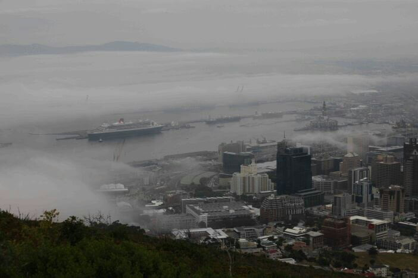](https://www.artamo.click/wp-content/uploads/2014/02/wpid-QM2-IMG_71011.jpg)

Friday morning was time off for Catherine, so the 4 of us donned our swimmers and noodled or swam in Silvermine Dam, a beautiful red water lake in a nearby  nature reserve.The temperature in the high 30's so very welcome. We again emerged with a bronze glow, just need a 'fix it' spray to keep it! This was Joe's day in court so our thoughts were very much with him.

Mike and I cooked a Friday night paella, inviting Catherine's grandparents, Peggy and Bill, and also Claudia, with whom we stayed 3 years ago on our last visit here. This was to give a collective sigh of relief at the end of Catherine's first week and that Joe's trial was over. He will not hear results for some time, so definitely not all cut and dried.

[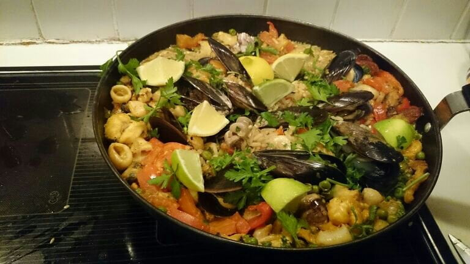](https://www.artamo.click/wp-content/uploads/2014/02/wpid-DSC_02661.jpg)

[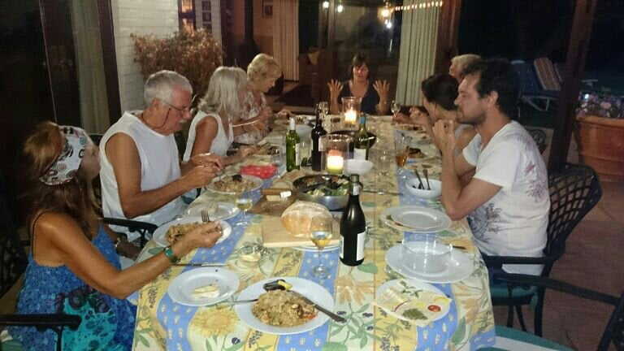](https://www.artamo.click/wp-content/uploads/2014/02/wpid-DSC_02721.jpg)

Wendy decided that I needed yet another birthday treat as they were not with us on the day. Don't know whether I want to age another year yet, but worth another celebration. This was a trip to a wine and cheese tasting centre, where goats living in a tower were the first attraction. [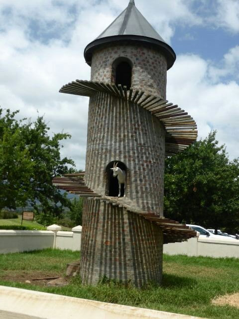](https://www.artamo.click/wp-content/uploads/2014/02/wpid-P10109841.jpg)

[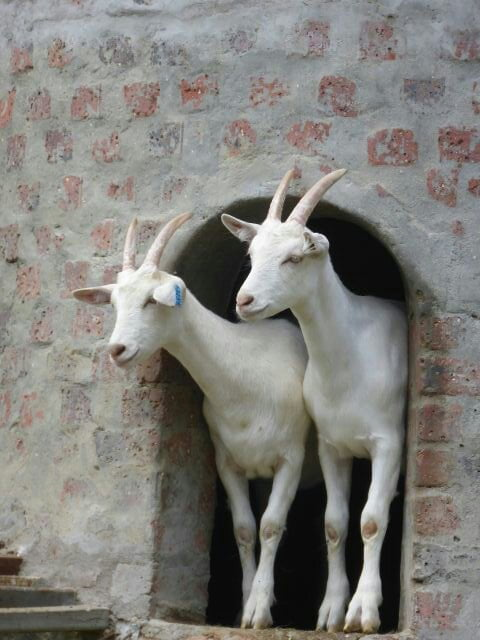](https://www.artamo.click/wp-content/uploads/2014/02/wpid-P1010983.jpg)

Wendy belongs to a wine tasting association, of which she is the lady chairman, both she and Joe being connoisseurs in this field. Non of the cheap Spanish plonk here!  Set in beautiful surroundings we lunched on a selection of cheeses and wine of our own choosing......a variegated ploughman's!  Of all the different cheeses I have tried there is nothing in my opinion to equal the French 'brie de meaux'! 

[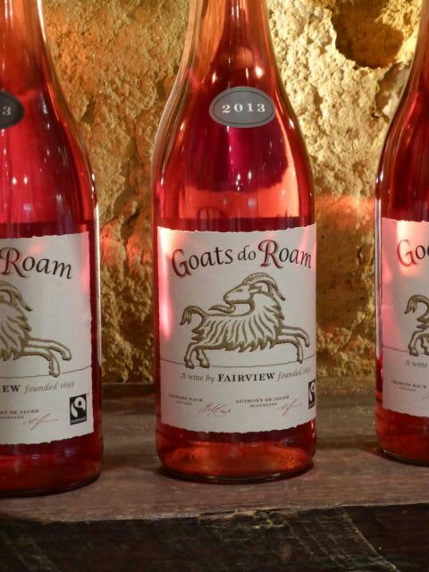](https://www.artamo.click/wp-content/uploads/2014/02/wpid-P10109851.jpg)

The French viticultures we're not amused with this brand!

The drive back was through more interesting towns and land marks, unraveling more of SA's tangled history. We have very knowledgeable tour leaders!  [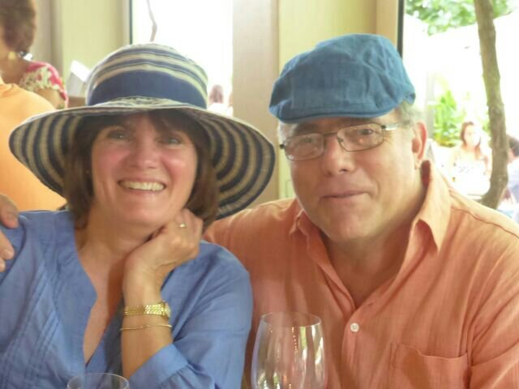](https://www.artamo.click/wp-content/uploads/2014/02/wpid-P10109891.jpg)

Simon (on a sailing course) popped in for left over paella in the evening.

[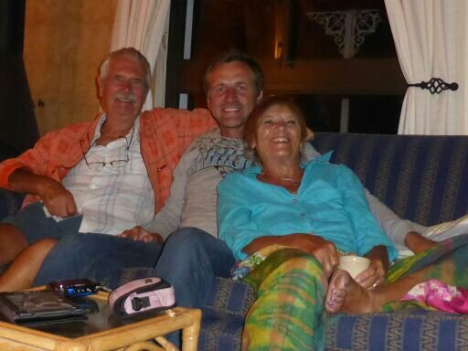](https://www.artamo.click/wp-content/uploads/2014/02/wpid-P10200631.jpg)

Wendy by this time had succumbed to the bug that Joe had cast aside and was quite poorly for the next few days.

Traditionally, as they met in India , Dan and Catherine celebrated their anniversary with an Indian, (meal that is! ), whilst Mike and I went for a river walk then lunched, deliciously , locally.

[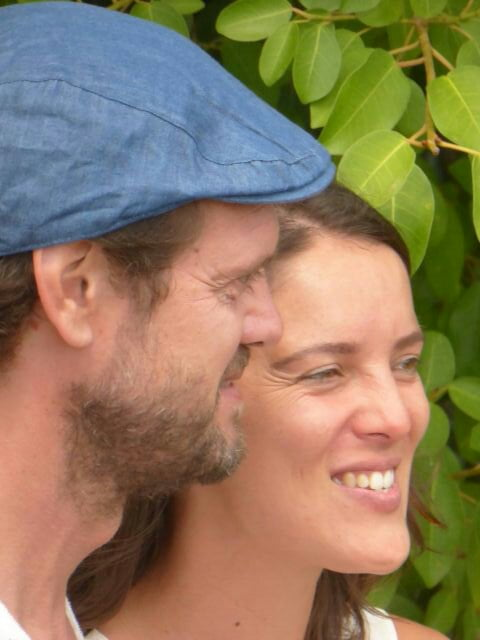](https://www.artamo.click/wp-content/uploads/2014/02/wpid-P10109911.jpg)

Joe needed to be in his Chambers on Monday so kindly gave us a lift into Cape Town, where we explored Long Street. Lots of art, books and antiques so we were in our element, trecking round authentic market stalls with vendors from other parts of Africa.

[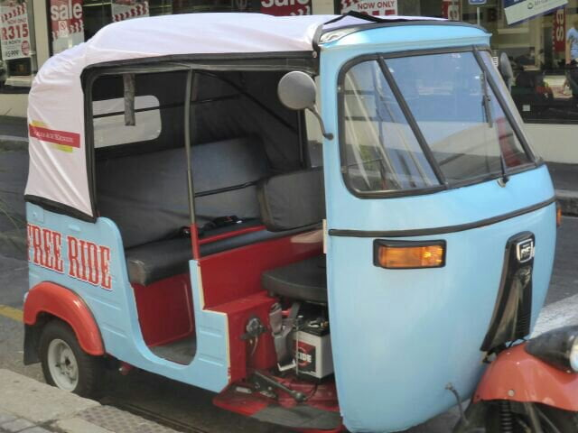](https://www.artamo.click/wp-content/uploads/2014/02/wpid-P10200081.jpg)

[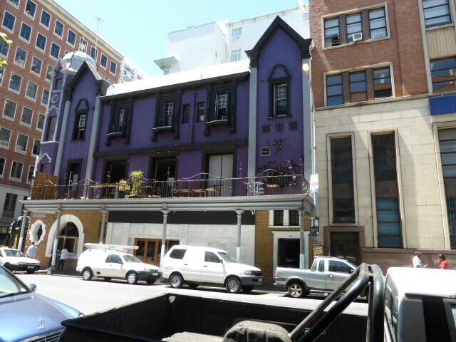](https://www.artamo.click/wp-content/uploads/2014/02/wpid-P10200041.jpg)

We managed to find a skin for a friend's drum, that they had bought some years back, but we didn't realise it would still be in animal form!  It is hanging outside our cabin de-ponging (hope the dogs don't get a fancy for it). Will customs give it a stink test? Thanks for the challenge Kathy and Mike! !!!! And after lunch (mine was a long platter of Greek delights whilst Mike had fish n' chips served in a tin colander ...see pic ) a rest in the Gardens was needed ....It was so hot. 

[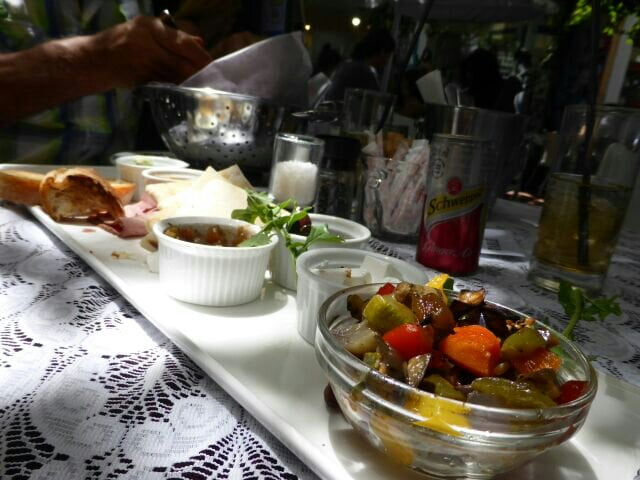](https://www.artamo.click/wp-content/uploads/2014/02/wpid-P1020012.jpg)

[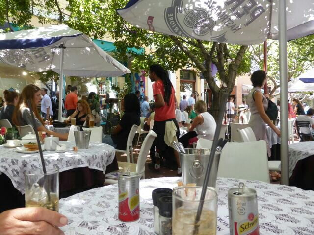](https://www.artamo.click/wp-content/uploads/2014/02/wpid-P1020011.jpg)

We lay on the cool grass under the trees taking a cue from the coloureds, for whom it is a normal life style. Choosing a space away from the others, we found out why, when the sprinklers came on full pelt.....that cooled us !

[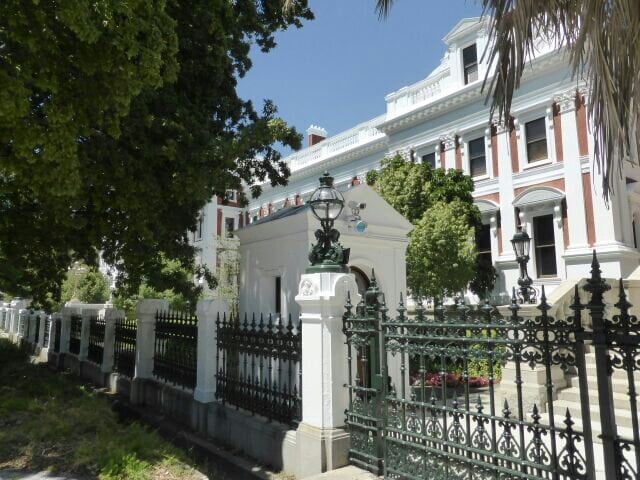](https://www.artamo.click/wp-content/uploads/2014/02/wpid-P1020013.jpg)

[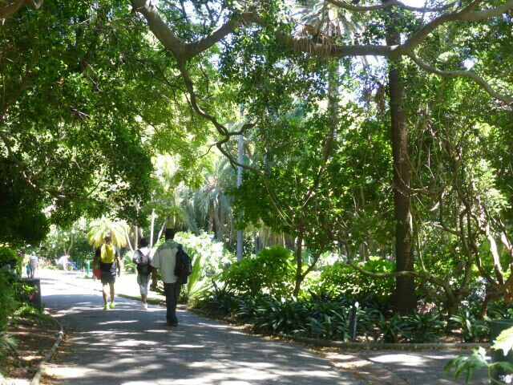](https://www.artamo.click/wp-content/uploads/2014/02/wpid-P10200141.jpg)

We took an afternoon drive along the coast to boulder Bay, a breeding home for South African penguins.  They are so amusing, such strange little beings. A fantastic beach where we found the ideal spot to swim among the penguins and boulders, and an easy access  point for Dan without too much walking. We'll try to fit a picnic in before our return. Still so many things to do!

[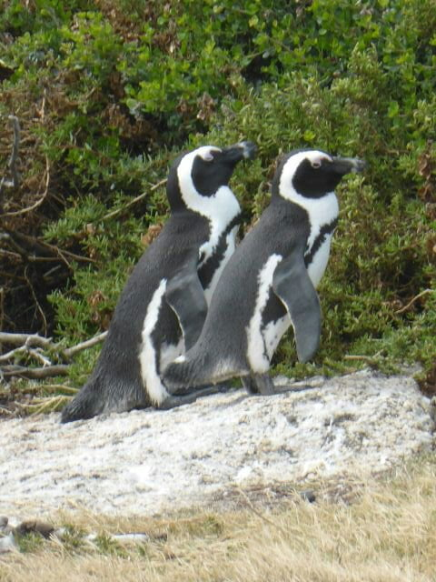](https://www.artamo.click/wp-content/uploads/2014/02/wpid-P1020017.jpg)

[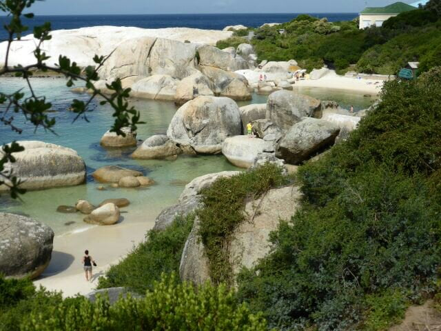](https://www.artamo.click/wp-content/uploads/2014/02/wpid-P1020028.jpg)

A cinnamon and lemon pancake with rooibus tea completed the afternoon , then home to prepare for another trip to Langebaan...
