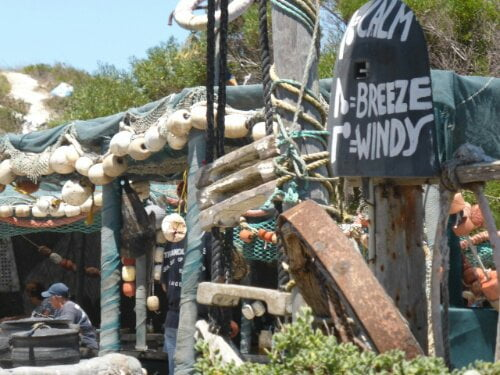
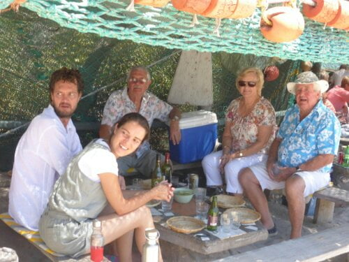

Since the arrival of the Kindle (and others) into our technological world, I must admit I've been a bit of a purist snob when it comes to books. My reading material, whatever content,  must be enclosed in a cover, (albeit coffee cup strained) with dog eared pages to feel and thumb. Almost like a comfort blanket! My mind has changed!  What a fantastic invention. Over 100 pre selected books in one small package, always in my bag so I can choose at whim whatever I fancy, whenever I fancy.......but .....can I clear the shelves at L'Etang?

Now back at Langebaan, we are enjoying some of the best weather, without the usual winds. I have just walked along the lagoon shore, sat alone, pondering, on the boulders, and it is so beautiful I just don't want to leave. Mike,  Dan and I arrived Wednesday evening to witness a lovely sunset.. Catherine's grandparents came Friday.

Friday,  we decided to give Simon (Barb and Ray's son) a visit at the yacht centre where he is on a sailing course. This is in the 'Greek' resort of Mykonos not far from us. Approached through gates with huge white pillars on which perched some statues of indeterminate animals. Perhaps my mythology knowledge is at fault here! All the buildings were  of Greek style and even had loud rock music blasting from the 'Mykonos Club'  The ambience was a bit betrayed by the presence of coloured workers. Still maybe coloureds are employed in Greece!

Swimmers always with us, we could not resist a plunge into the tumbling surf, before meeting Simon. A bit rough but looked like fun, so in we went. My noodle arm replacement refused to act as a surf board,  resulting in me being hurled forward and landing with a graceful belly flop on the beach.   A battered fish.... definitely not in beer nor crispy... a bit of a washout really. Not to be beaten,  I emptied my swim wear of shells, sand and fishlets, then soldiered  back into the briny, only to be tossed back by the next incoming wave. This time like a beached whale with a free kelp sea weed wrap, complete with crinkly hair extensions. Would have cost a fortune at a spa centre!  Smug grins appeared on faces of some clever clog youngsters nearby, sailing on the crest of a wave. Wait until they reach my maturity.. that will wipe the smile off!

l left Dan searching the water for my lost hat and went and dripped all over Mike, who was feigning sleep and pretending not to have witnessed the drama. No comb, so put on my hat which hadn't been lost at all, donned a frock,then went to our rendez-vous. Couldn't risk another catastrophe so did not limbo under or hop over wire to board the boat so sat demurely on the side. Then ordered a shandy at the bar. 6 types of lager and 3 of lemonade to choose from, after explaining what a shandy was. It arrived several long minutes later... lager in a full half litre glass and a can of lemonade..!!!!! This also happens when I ask for a single espresso with a jug of hot water...a tiny full cup...Perhaps they think I need to wash my hands!!

Catherine had already arrived for the weekend when we got home, so happy greetings and a braai.....

Bill cutting lavender for a fragrant braai.

Yet another birthday treat was in store! A treat we would have had, had we been here, but we weren't, so we didn't and now we are, so we can.....sort that one out!

Lunch in another beach restaurant, 'Die Strandloper' or 'beach walker', balanced among the rocks. Looking more like a shanty town ......no frills or fancy bits here, but boasted a ten course meal of gastronomic delights. We couldn't wait.!

" Bring your own " it said.... and that Mike did.....looked like we were going on a fortnight's holiday!  This turned out to be good foresight . (in case he gets grumpy) We did need the cushions,  refrigerator and the kitchen sink.... non of us had thought of that.

Primitive conditions are the order of the day here. the restaurant itself is a makeshift structure with fishing nets  casually flung over it as a kind of practical decor. Crude benches and tables are scattered around the dining area. In the centre are lots of braai pits and at one side 3 large tubular bread ovens. A local guitarist completed the scene. We were shown to our 'Shack' (booking In advance is essential) , arranged ourselves on our cushions, imbibed on our chilled aperitifs from fridge, and surveyed the scene. Mussel shells served as our cutlery, paper towels as serviettes, with shell finger bowls with lemon slices in water for hand washes.

The menu in the form of a friendly Africaan, announced each course in turn. We commenced with on site baked crusty bread fresh from the oven, accompanied by jam to be eaten with bowls of mussels, and/or shelled mussels in garlic..a new combination for us... Mike loved it.. still getting his bread and jam. With intervals to cook, and for digestion this was followed by different types of fish cooked on the braais, sweet and jacket potatoes, a fish curry, a lamb stew, some dumplingy balls, and then,  best, in my opinion, half a crayfish... like a small lobster for each person. Finally, some sticky, sugary dessert which I declined, and coffee. The whole experience lasted about 4 hours, with a wander  between courses. l must just mention the toilets, as doesn't one judge a restaurant by this little room?  Little it was, just enough room to turn round, place feet on a small platform, grip on to a wooden rail and hover!!!!  But very clean with water hand wash after. Needless to say we deserved a long siesta that afternoon! 

Keraaaash!!!!!  What on earth???  Bill had only gone to mow the lawn! There he stood...  crest fallen.... there was Roger with a big headache and integrated with the metal gate... perhaps it should have been open... his back pane shattered. No real harm done and he now stoically supports a made to measure replacement piece of board.Just adds to his experiencial character, more for folk to wonder about.

We decided on a challenge for Sunday.....a canoe to the next isolated bay. By now Mike had a gammy knee.... something about loose bits floating around that a jet hose I proposed won't cure......me with my noodle prothese....though Dan was a little stronger that day.

Catherine proved not only to have brains and beauty, but brawn as well. With agility as nimble as the local baboons (perhaps she's been taking note!), she mounted Roger ......Whoops!!!..... and hauled the two heavy canoes, then roped them to the top....the lads were pushing from below... I dealt with the paddles and noodle. Precariously down the steep slope to the water, then the process was reversed. Life jackets donned and we we were  off.....Hoppy and Armless in first canoe, one with paddle and other with the rudder foot controls, to suit our disabilities, followed by the youngsters. 

Such fun!!!!!     Mike barking orders that the wind cancelled, (my excuse anyway). A dousing every time the paddle was raised, an erratic course to avoid running over the fish, and a battle with the swell.....  we'd lost the knack of our former life.!   Canoe 2 rode the waves effortlessly...... Safely at our destination, we picnicked on crisps, chocolate cake and plums. No one around.....a bit Robinson Crusoe'ish, we swam and lazed... then the return trip.... wind up... more clouds... but it was great.

Catherine was up at the crack of dawn to return to her studies in Cape Town. The next couple of days were spent eating mussels and shopping..... Peggy and I had a girly day out, or rather an OAP'y hour out!

Before leaving we revisited our favorite beach bar, had or usual coffee and eggy bread .Then Dan drove us through the nature reserve going to the places we love, seeing all the wild life, avoiding ostriches on the route and reliving the overwhelming emotions (even more so this time) felt at the absolutely stunning beauty of this place. No camera, no canvas could capture this.

Lunch here was the icing on the cake.
