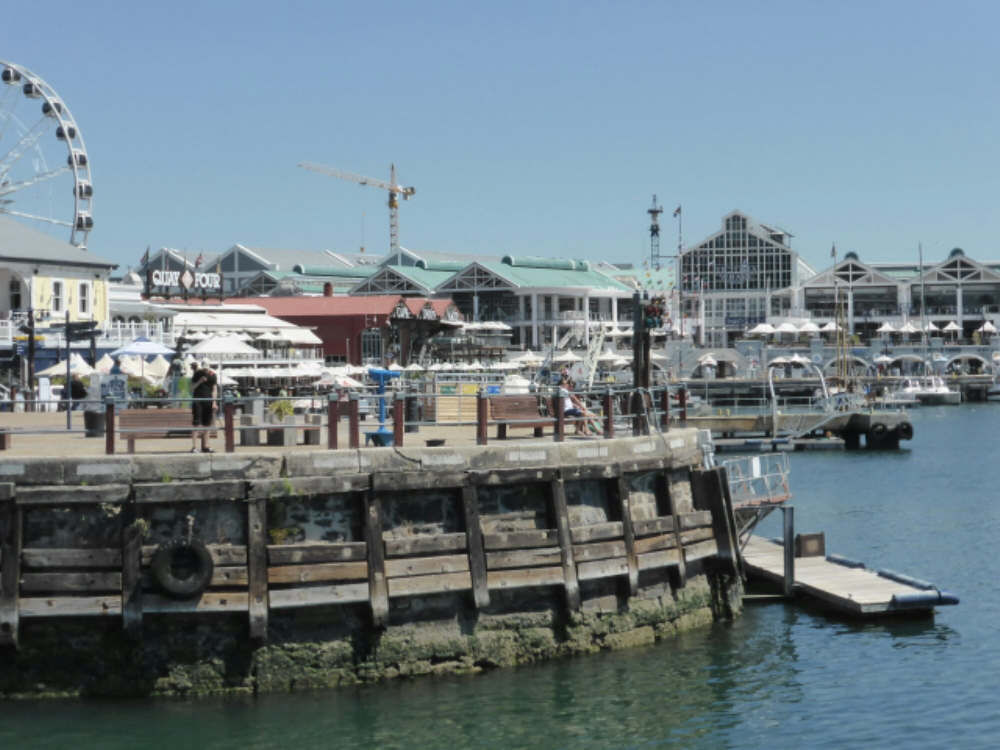

We knew we were near 'home' when the perfect outline of Table mountain loomed ahead....a similar feeling to seeing our  church at Bertric Buree in the distance...just a slightly different scale !!!!!! 

We were in for our last few days of even more treats. Laundry and cleaning attended to by Selena... I would love to wrap her up and bring her home... a slight excess in baggage!!!!

Selena cooking umgombothi.......

Thursday lunch time, Bill and Peggy collected and took us for lunch. More wine tasting... beginning to get the hang of this now....no wasteful spitting out though.....too good for that ! A cooler day so a comfortable stroll around the wine club's ground, viewing an 18th century general's home, stylish old buildings if somewhat austere. Seemed to lack a bit of T L C.

In the evening we went to Jennifer and Ross's new home which they share with David.She cooked a delicious vegetarian meal. It was a fun time with lots of laughing. Catherine's siblings are all play mates, all love being together, enjoying life. 

I

Dan practicing pool yoga with noodle.

Friday, Wendy had planned another birthday surprise..... I can't keep ageing at this rate ! What should I wear.....posh frock, cut offs, or shorts..... no!!!... not the latter..... legs in shorts are now censored to Joe public (wonder why it's your name Joe? )

" Bring something warm "......the temperature was in the 30's.....Caves maybe! Leave home 9.30 ......Destination time 10 45........Catherine had to be at uni. at 2pm....so what was happening between those hours?

We arrived on time at a beautiful place in the mountains. Our chauffeur was ready to whisk us away. His driver's uniform was somewhat casual and the limo even more casual. A safari ranger and an open top jeep, plus sun cover. What an exciting surprise, a trip to the mountain top surrounded by wild animals in their natural environment. Obviously not on the same scale as Addo Elephant  Park, as was our last visit, but this had the advantage of being much closer to the wild life. Even the expressions on their faces could be seen. The  brown zebras, the colour peculiar to here, displayed their exquisite markings, especially facially.Their short manes were like fine toothed combs , standing up punk style.  I can even visualise an ear ring in one ear. A rustic picnic had been packed, and we lunched in the shade of a tree, overlooking a patchwork panorama of freshly manicured farmland. The follow up wine tasting (my palate is totally confused now) , plus the promise of hand made ice cream on the way home was enough reason for Catherine to ' bunk' school that afternoon!

o

Saturday was organised by Dan and Catherine who arranged a circuit route to take in all our  favorite places.

Our rude awakening at 6.40 am was a rap on the door and " be ready at 7 "

What !!!!!!

We'd only just gone back to sleep after battling with a demented mosquito all night! The same one.... we can tell by it's baritone buzz..... gets hungry about 3am each morning.  It refuses to be intimidated by my mosquito buzzer which sings in a higher key. I tuck the cover around me, exposing nothing and it goes away, but not last night. It was persistent.... must have been starving...I mistakenly stuck out a couple of my extremities.. ..it replenished itself and went back into hiding. Still have the swollen ankle as proof of my foolishness.

To continue.... our first port of call was to the first, and indeed a favorite, restaurant, Olympus,  which we have visited and re-visited , in a chic  , sophisticated yet trendy town, made for art and all things nice, lovers, Kalk Bay. Breakfast of fresh fruit.. raspberries, blueberries and strawberries in a delicious yoghurt, followed by a, shared with Catherine, ham and tomato filled croissant... mmmmmmm! The ' lads ' had egg and bacon.

A walk along the front revealed these tunnels under the railway line which served as beach huts for early arrivals, bringing their own mini pools for babies and even a braai.... A bit thundery when a train goes over to add to the excitement.

I had wandered off schedule so a call from Dan to return to car for next excursion. This was to Simonstown, another favorite but for different reasons. It is a famous naval center .......some lovely architecture, but lacking the Bohemianess of Kalk Bay Nearby Boulder Bay is the breeding ground for Jackass penguins.It belongs to the National Trust, but worth the entry fee (C and D are members) to bathe in the amazing warm boulder pools with the penguins. The kelp swayed in the current representing Swan lake synchronised ballet in water. Absolutely mind blowing. Another world.. and another potential home for Catherine and Daniel.(Wishes do come true! )

Our leader summoned his group so we could proceed  to a coffee stop. This was in Scarborough. A town constantly in the mist. Going to the beach explains why. Ginormous breakers crashing on the rocks caused mountain high surf which then landed in the sky. .. It was surreal ..a bit spooky! Coffee was in an old converted building which also hosted some of the most ingenious wood and stone carvings.

From there we continued to Monkey Valley for lunch.The restaurant was set in woodland overlooking the sea. After eating we sat with our feet dancing in the pool. One more venue to complete the day, to Silvermine Dam, but decided to give this a miss as a 9 hour day is quite long enough, so home for a cuppa and a swim. Thanks Dan and Catherine for a fantastic trip to our special places..

Our penultimate day, Mike and I browsed around The Waterfront in Cape Town. In the evening the whole family enjoyed  Wendy 's scrummy Sunday roast. 

Now on our very last day, Catherine has gone to 'school' armed with a forged sickness note  from mummy! Dan took us to a local organic restaurant... lovely home grown food and fresh juice, so feeling fit and healthy. That is until we imbibe this evening at our last supper  with the Van Dorsten gang...... a Thai take away.

It's going to be so very hard to say good bye to this wonderful family who have excelled at hospitality, throwing in love and kindness as a bonus. Thank you from the bottom of our hearts for a truly amazing time with memories we'll always treasure.

NB

Lost !!!!!      ...... green noodle.....  believed left drying on edge of someone's boat
