Thought I had completed the set of ten, but had my fingers convinced to write another. So here goes.......

After family goodbyes, Dan and Catherine drove us to the airport. The worst bit, parting from them.....

[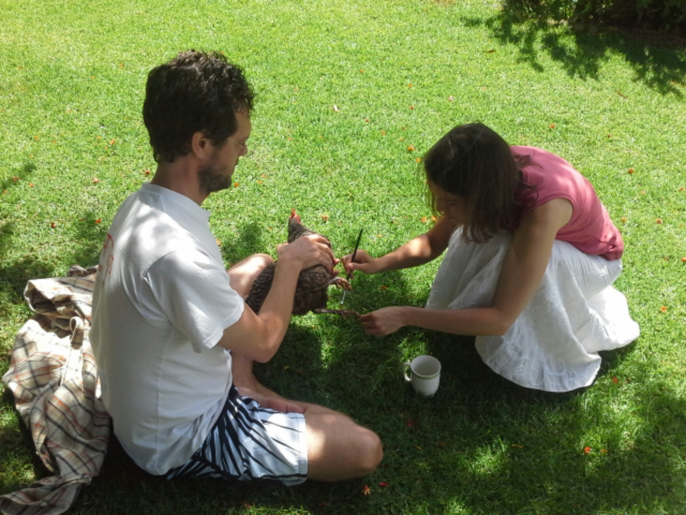](https://www.artamo.click/wp-content/uploads/2014/02/wpid-20131213_142657.jpg)

Olive oiling, Sheila, the chicken, 's feet !

The custom's officials are friendly here, they smile whilst they search and grope!  With helpful, and equally friendly cabin crew and usual discomforts of night flying, we had a fast driver,  arriving half an hour early in Amsterdam.

By 11.30 am we were on the train to the centre,  muffled up in coats and hats, but left the gloves off. Overcast 8 degrees, a slight drop from 38 degrees the previous day. [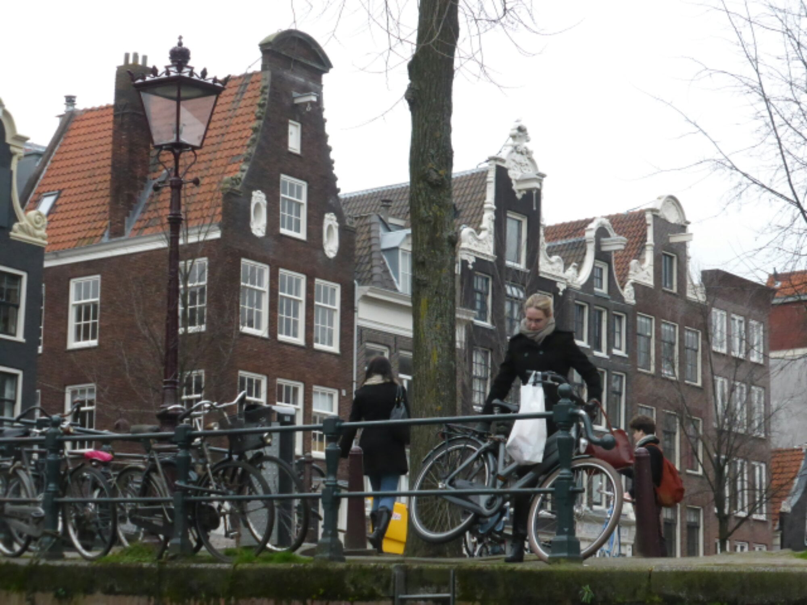](https://www.artamo.click/wp-content/uploads/2014/02/wpid-P1020406.jpg)

Arrival in the centre was a bit of a culture shock. Even more cosmopolitan than Cape Town,  and the traffic..... trams crossing roads.....more bicycles than we saw In China...... cars..... taxis..... mopeds..... and even a Sudan chair crossed our path!  Think we should had jumped in it.. a much safer way to traverse the town. ...not sure where to walk! But we wandered..... up the main street then explored the back streets, hoping to find a small cafe for lunch, usually not a rip off like the main road. [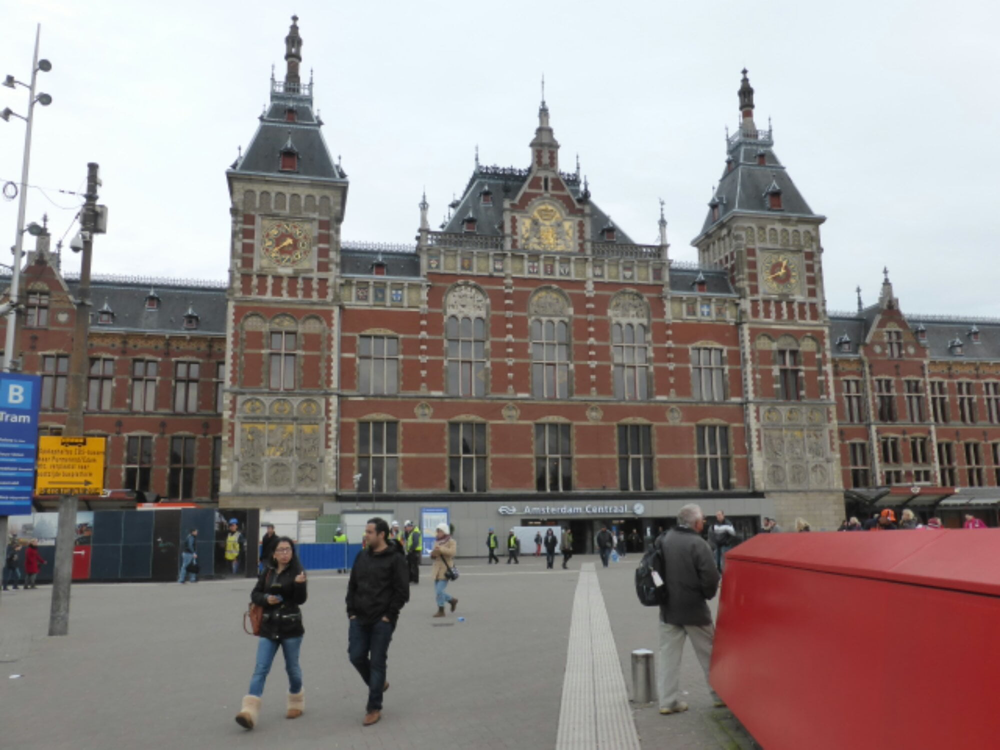](https://www.artamo.click/wp-content/uploads/2014/02/wpid-P1020355.jpg)

[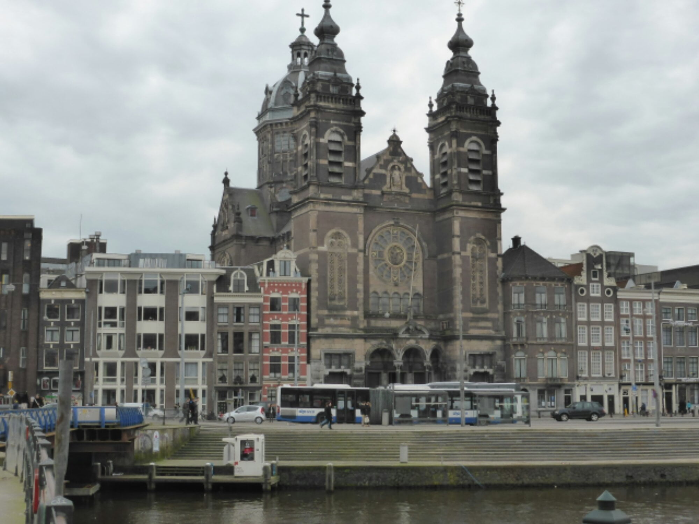](https://www.artamo.click/wp-content/uploads/2014/02/wpid-P1020359.jpg)

[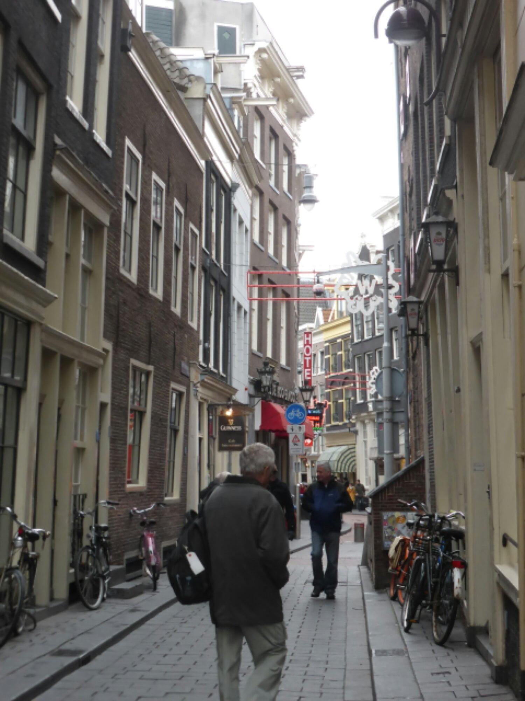](https://www.artamo.click/wp-content/uploads/2014/02/wpid-P1020361.jpg)

Our window shopping changed, with the confrontation of the 'ladies of the night'..... although still lunch time... perhaps  shift work or overtime!  Ladies (is that their title ? ) adorned in very little attire, with huge red lips and pantomime rouge, lounging in doors and windows,......on such a murky day too, ....... maybe their skimpies were fleecy lined! Having lived a sheltered life, this was our first encounter with the world's oldest profession in the flesh... and quite a lot of it too.   We knew prostitution was legitimate here but did not expect it to be quite so blatant.  This will embellish our future reading! [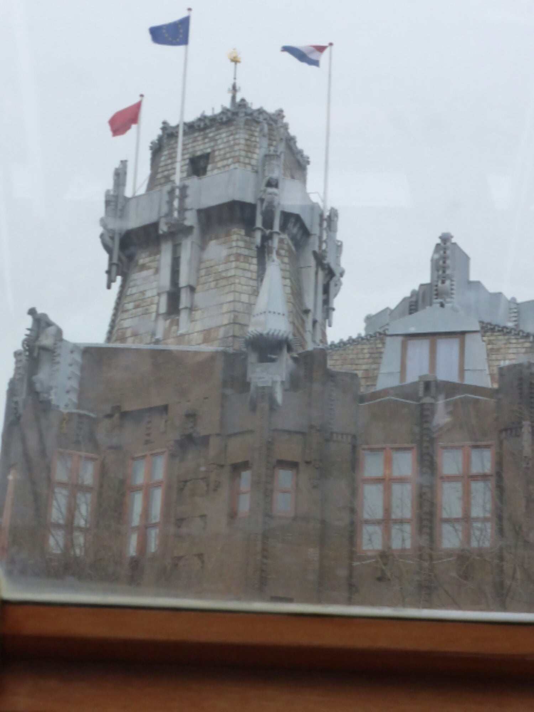](https://www.artamo.click/wp-content/uploads/2014/02/wpid-P1020366.jpg)

[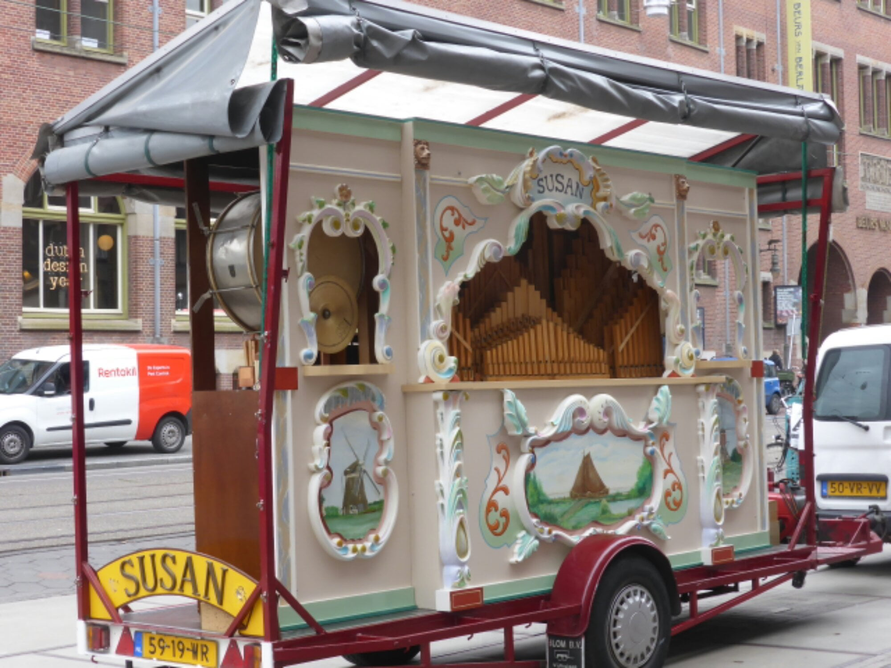](https://www.artamo.click/wp-content/uploads/2014/02/wpid-P1020364.jpg)

Back to the main street, where we found a charming little restaurant, in which we had a window table, so we could people watch whilst eating. This was an education in itself. Folks from all walks of life.....singles... couples.. groups... all shapes, colours and sizes, all dressed for different seasons... some a little unsteady.. some a lot spaced out...some relatively normal by our standards. All this endorsing Amsterdam's reputation of open mindedness and liberal thinking. [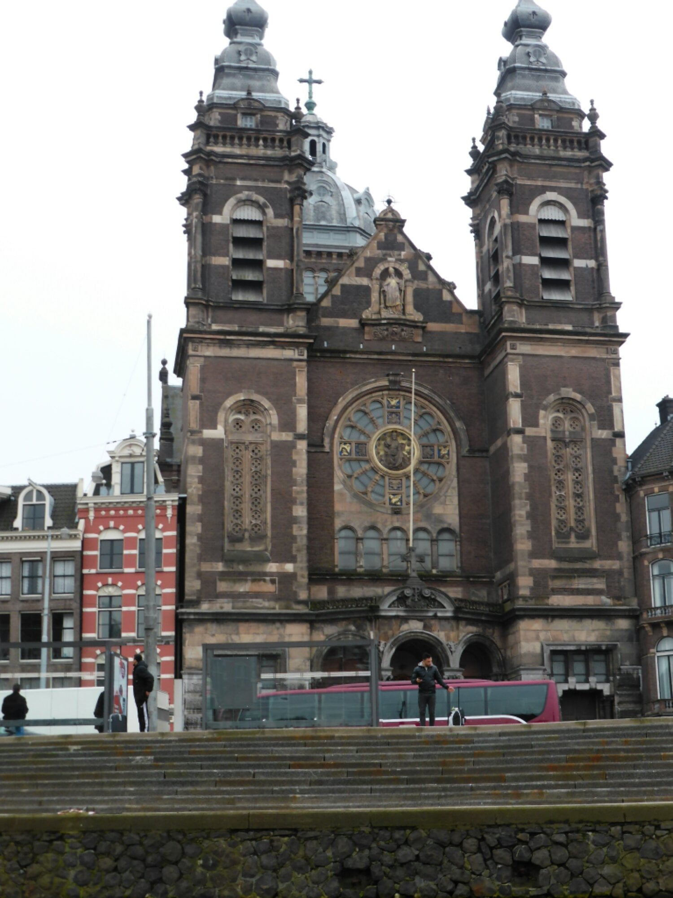](https://www.artamo.click/wp-content/uploads/2014/02/wpid-P1020365.jpg)

The food was delicious if somewhat large portions (a doggy bag not suitable for boat, train and plane travellers. ) [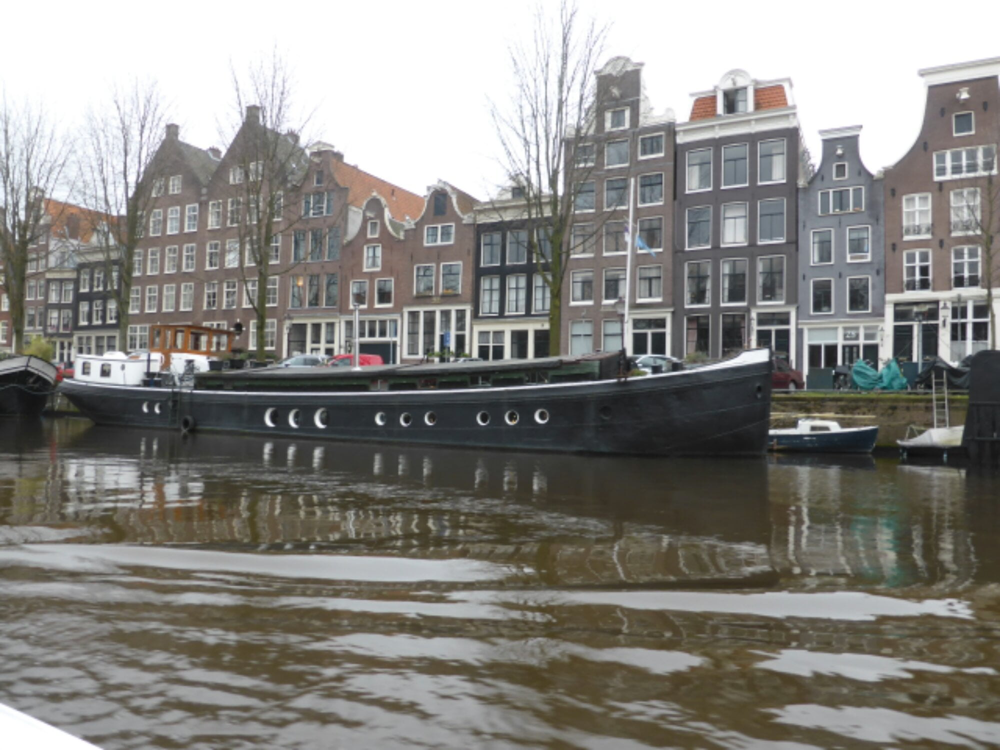](https://www.artamo.click/wp-content/uploads/2014/02/wpid-P1020369.jpg)

Now to experience some history, the main reason for this trip, before we were distracted. This we found in a mini cruise along the canals. It was brilliant in spite of the now drizzling rain. The stories of these fantastic buildings, dating back to the16th century, with their changing roles were interestingly told through headphones in your chosen language. The architecture and colours we're amazing.. no two buildings were alike. No wonder Holland has such bold and innovative art. Sadly we did not have time or energy to visit any art museums, especially The Van Gogh, which I particularly wanted to see, but was the other side of town. [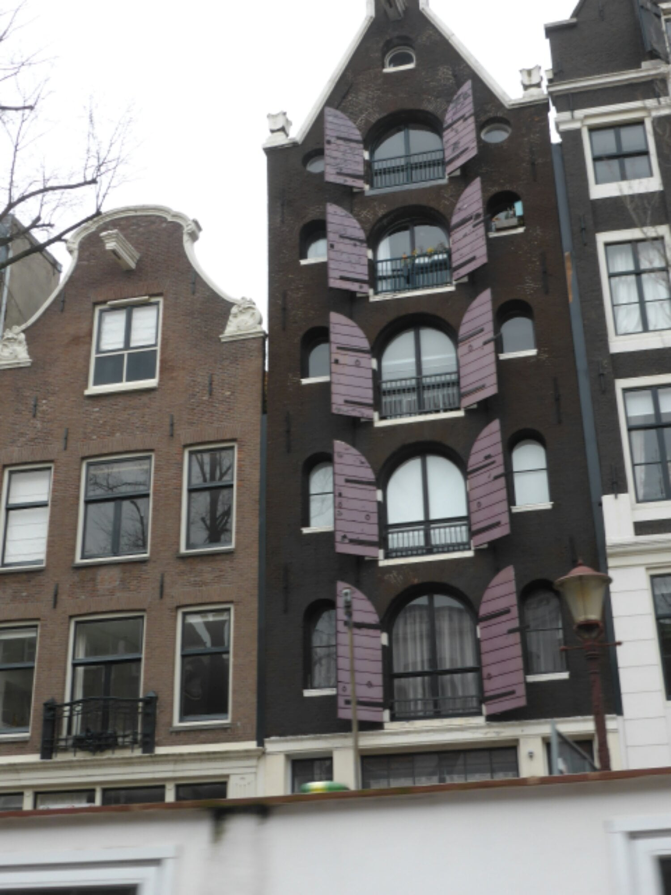](https://www.artamo.click/wp-content/uploads/2014/02/wpid-P1020404.jpg)

[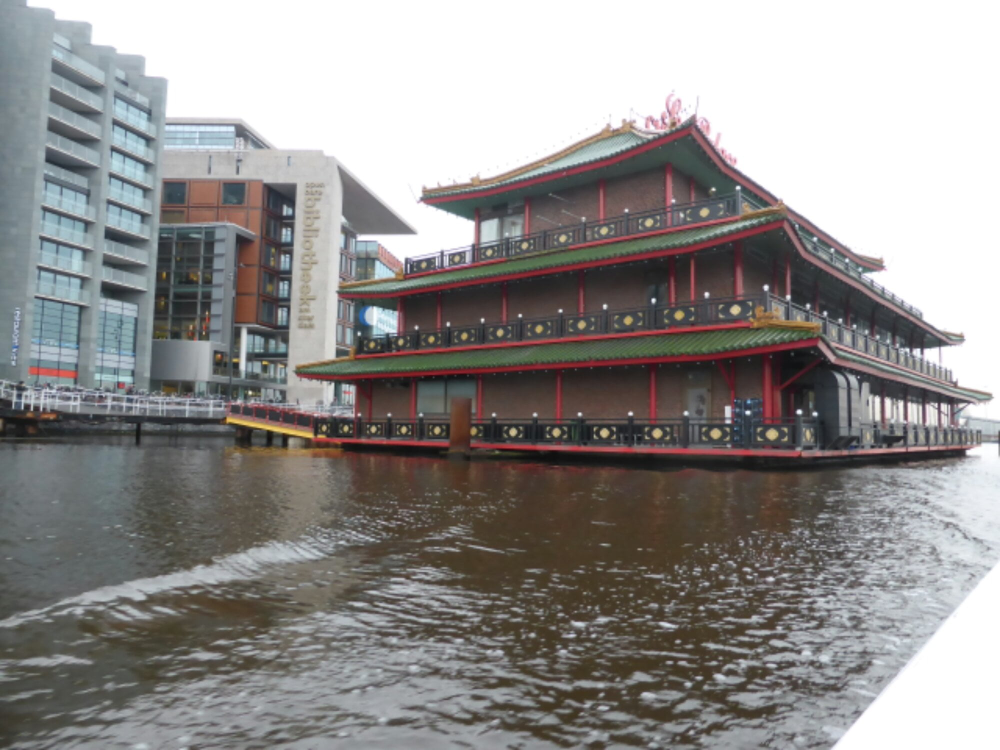](https://www.artamo.click/wp-content/uploads/2014/02/wpid-P1020422.jpg)

[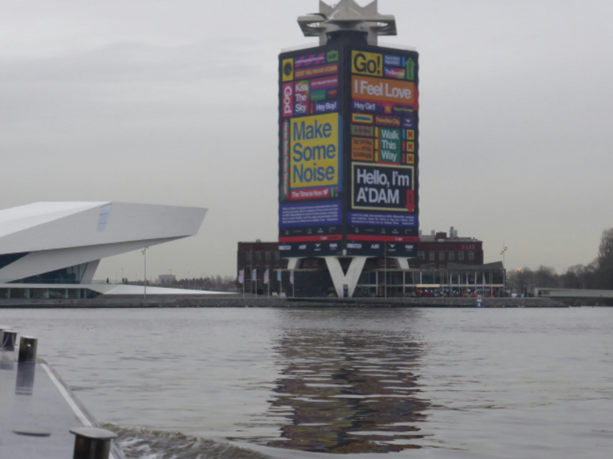](https://www.artamo.click/wp-content/uploads/2014/02/wpid-P1020413.jpg)

[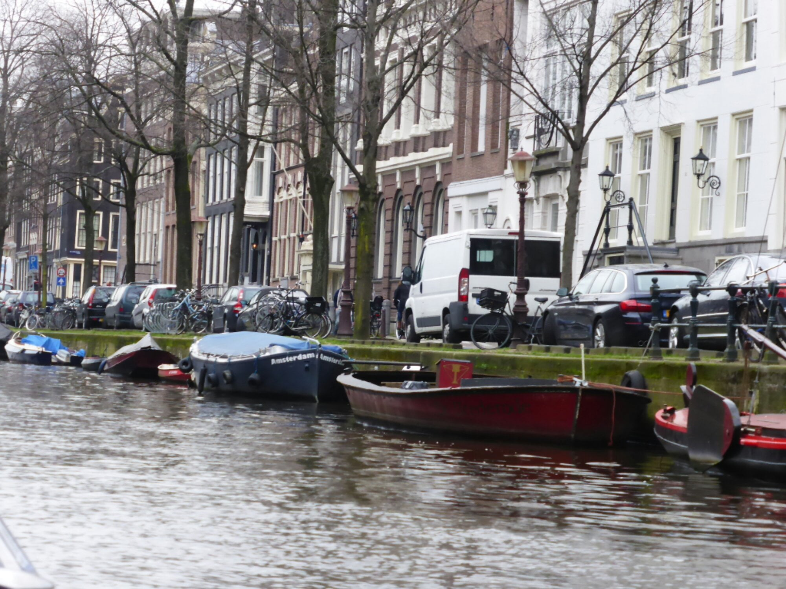](https://www.artamo.click/wp-content/uploads/2014/02/wpid-P1020400.jpg)

[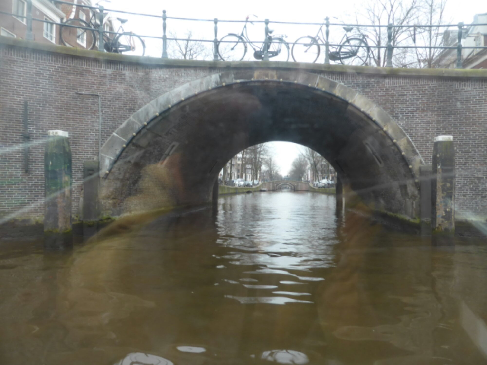](https://www.artamo.click/wp-content/uploads/2014/02/wpid-P1020388.jpg)

   You can see 7 bridges through this bridge..... with good eye sight.

Back at the airport we had a couple of hours to wait so went to the observation gallery for a cuppa. Gazing through the window, I sat, reminiscing, I could see in my dream like state, blue sea and white sails moving across the panorama as though in a trance. I was back at Langerbaan lagoon. What a lovely feeling !  In actual fact the lagoon was the blue of The K L M planes, the sails were the white fins showing just above my eye line. What a lovely transformation. Wish I'd taken a picture!

A small very comfortable plane, with more leg room (who am I to compare...... lady little legs!! ) than the transworld one, transported us to Bordeaux, offering a sandwich snack, very tasty.... think it was sandwich spread like I used to take for school lunch. Taxi to hotel, with price doubled because it was a short trip... now we'd heard it all! Hotel entry code wouldn't work... how were we to know it was the bedroom code? A coffee machine customer let us in. Just dying for a cuppa...but not a tea bag in sight...Just 2 flimsy tooth mugs ...served us right for choosing budget. Just one euro in change (rands not accepted) so decided to share machine hot chocolate... extra strong... extra sweet too!  Mike took it up for his night crap (whoops ! ), tripped  over the foot of the bed.. extra strong hot chocolate up the wall and down his shirt... and a big moan from bruises encountered en route. The beautiful white fluffy towels became soggy brown extra strong blodges !

However we slept well...our lovely friend Jane collected us in the morning, then Sat Nav Jane took us home the scenic route...we enjoyed all the twisty lanes... could have been enhanced with a ray or two of sunshine.

Back to normality.....market shopping in the rain...... Tractor with a problem!

But lots of invites to tea!!!!!! 

[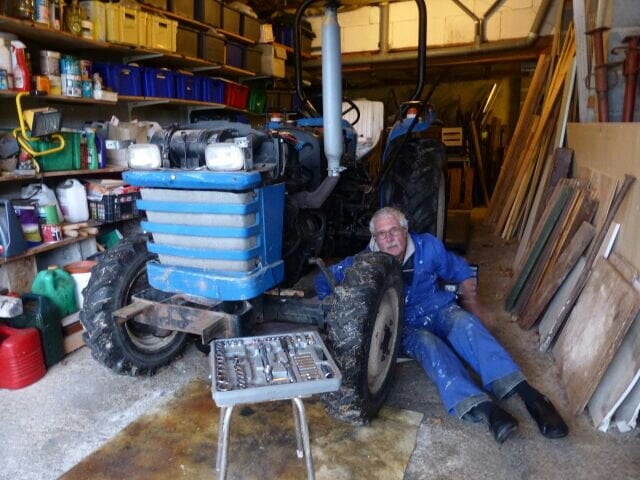](https://www.artamo.click/wp-content/uploads/2014/02/wpid-P1020429.jpg)

Love from us both to all..... "au revoir".

Maureen and Mike
