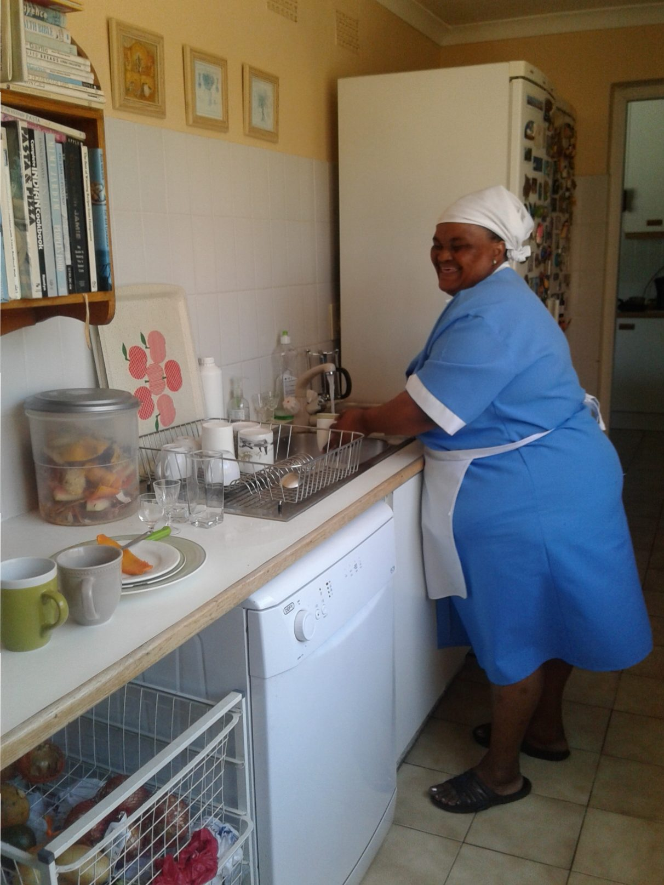
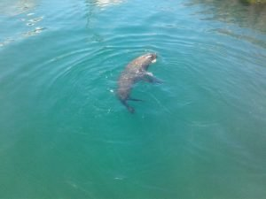
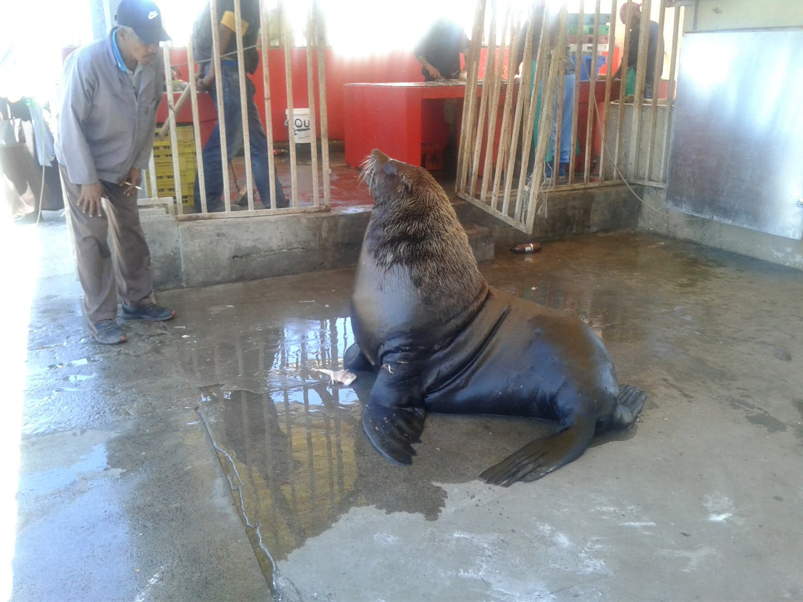
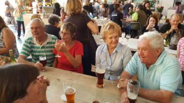
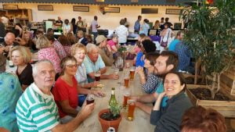
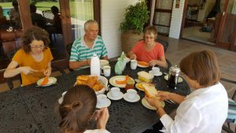

Back home!!!    Such was the welcome we received on our arrival in Cape Town. The biggest hug which totally enveloped, and almost smothered me, was from Selina the house maid, who insists  to Dan.  "She's my mum not yours" !!!

We are so happy that Dan has the support of such a warm and loving family, who gave up their beds for us and Catherine, giving us comfort on the other side of the globe.

\[caption width="1212" id="attachment\_509" align="alignnone"\] Selina\[/caption\]

Day 2, we lunched by the coast from the best ever fried freshly caught fish, and chips. Our fish purchases for the freezer, yellow tail and red snapper (chosen for the colours of course), were gutted on site, the innards and heads being tossed to waiting seals who entertained us whilst waiting.

\[caption width="1616" id="attachment\_493" align="alignnone"\] Kalk Bay feeding time\[/caption\]

A bit scary if too close !!

\[caption width="300" id="attachment\_519" align="alignnone"\] Earth Fair Market, Tokai\[/caption\]

The evening meant eating again....a good start to weight production... This time at the local producers market, with Catherine's parents Jo and Wendy, and grandparents Bill (a lovable  even if incorrigible , 85 yrs old character , who although partially sighted still whizzes around in his topless car) and Peggy his so tolerant beautiful forever young wife of  60 plus  years.

\[caption width="300" id="attachment\_517" align="alignnone"\] Earth Fair Market, Tokai\[/caption\]

A super talented guitarist/singer enhanced our enjoyment of a sumptuous hour or two, then home to lounge and chat.

\[caption width="300" id="attachment\_518" align="alignnone"\] Breakfast at Chorley\[/caption\]
