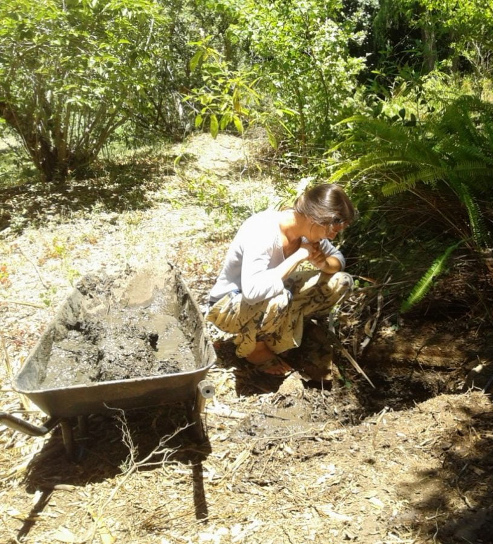

The terrain is an undiscovered adventure waiting to happen.

Just outside the back of the cottage, is a lae water, a forever flowing stream, that gives all homes access to water, to fill their dams, each proprietor, having contributed, given a time slot for the refill. Wonderful for dipping hot smelly toes into ... Cool and fast straight from the mountain.

Daniel and Catherine are converting their dam into a natural swimming pool with specially chosen vegetation as a filter system.

The cheerful local laborers are hard working and willing to please, always with lunch thrown  in.

Whilst sitting with Catherine by the lae water idly chatting , her sharp eye detected a quick movement in the bushes. The first guess was that it was some sort of small rodent scavenging. She then spied the bulgy eyes of a small frog or toad. Closer, very quiet observation, showed the reason for the bulge. It's little squirming body was being squashed to pulp to aid digestion by a mole snake. Harmless to us, but that's not much use to the victim. Too dark in there to get a good photo, but just as well.... Not a pretty sight!!

Off to an open air children's carol service, when a wet patch was seen by the back door. Each of us saw it and decided it had been thrown to water nearby tree. On our return 2 hours later the patch had spread and still growing. A  leak somewhere underground. So water off, quick licks and a dabble in the lae water sufficed for ablutions, that night.A dig next morning revealed the cause, which gave Mike the excuse to get stuck into something. Pipes replaced, water diverted , showers taken, so pongs gone in next to no time!

Then discovery time. A 'reason for being there' slab was upended, and a mini excavation resulted in a pool of under ground water and the remains of a water pipe with a tap. Catherine was in her element, grovelling in the mud, even with her best dress on!! This means another water supply, free of charge, to the dam......'Mum's the word!',

A bientot
