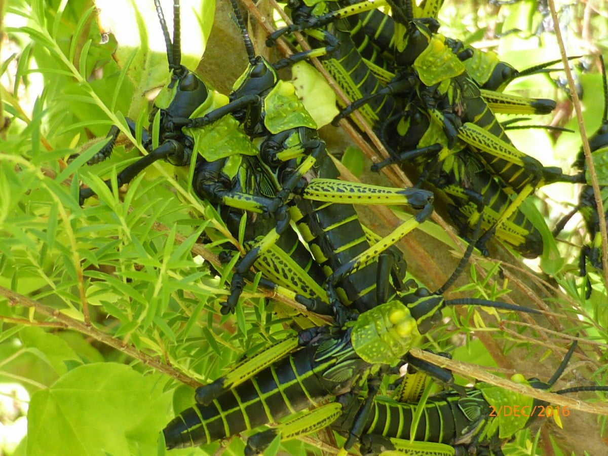
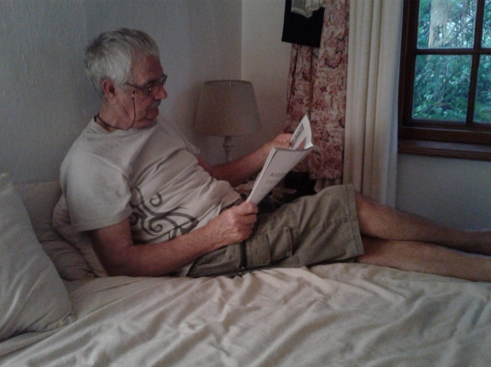
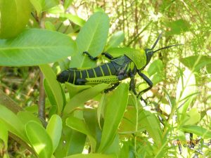
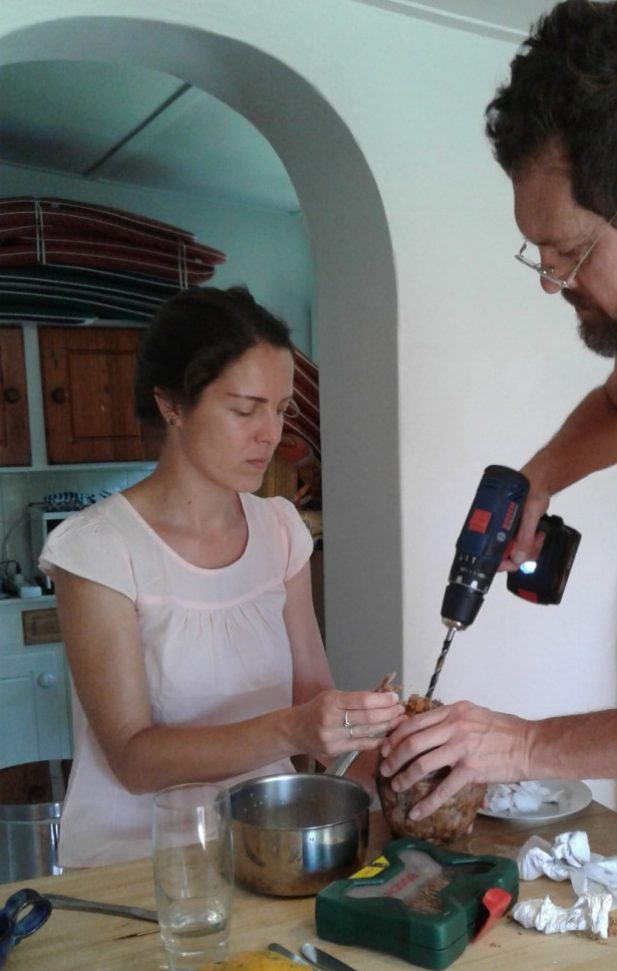
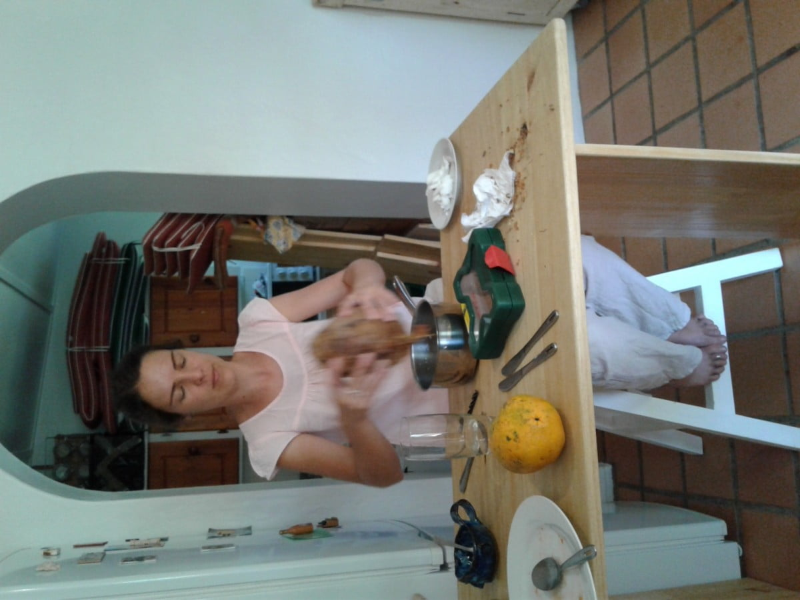
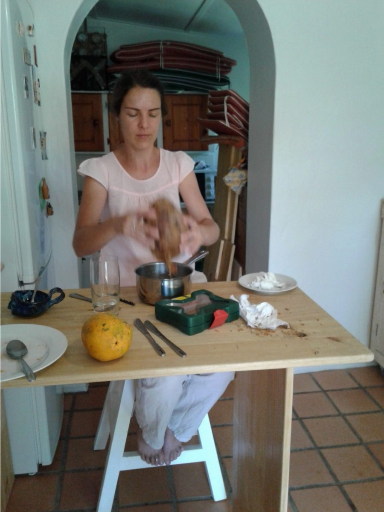

And stare as long as sheep or cows. No time to see, when woods we pass, Where squirrels hide their nuts in grass. No time to see, in broad daylight, Streams full of stars, like skies at night. No time to turn at Beauty's glance, And watch her feet, how they can dance. No time to wait till her mouth can Enrich that smile her eyes began. A poor life this is if, full of care, We have no time to stand and stare. _William Henry Davies_

One of my favourite poems and now the time to fulfil it's words. Quietly watching, seeing things so easily missed.

A beautiful bird, just a bit bigger than a sparrow, sporting a long tail of brightly coloured plumage, foraging for insects in the earth around my feet. A mouse bird....a name most unworthy of its  miniscule splendour.

A field mouse, scuttling by, also looking for its breakfast.

 An undetected movement in the undergrowth, the bulbous eyes of frog or toad revealing its identity. l need to have my camera always at hand.

A plague of locusts???  This was Catherine's discovery!  Not really a plague just my sparse biblical knowledge and over active imagination kicking in. This time luckily a camera was at hand to record a happy gathering of these brightly coloured insects, having never seen a locust before. Apparently, harmless, but not a risk I'd take.

So much more to watch and wonder.

Rain today so inside jobs and pleasures

Then the Hadadas who ha de da at the most inappropriate times. Haven't learnt that morning doesn't start at 4am! I stalked a couple this time with a camera.... They knew I was coming, walking duck style into the trees for camouflage but when in the sunlight , beautiful hues reflected from them. No photo though.

 

\[caption id="attachment\_559" align="alignnone" width="300"\] Locust\[/caption\]

 

 

\[caption id="attachment\_561" align="alignnone" width="617"\] Coconut milk modern style\[/caption\]

 

