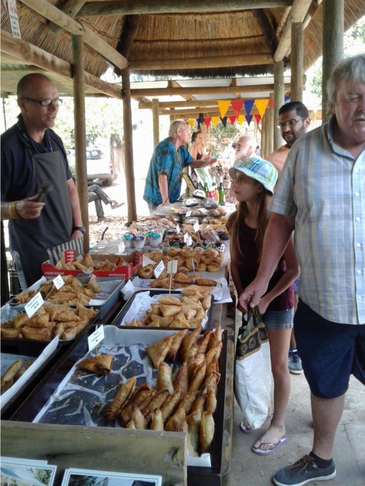
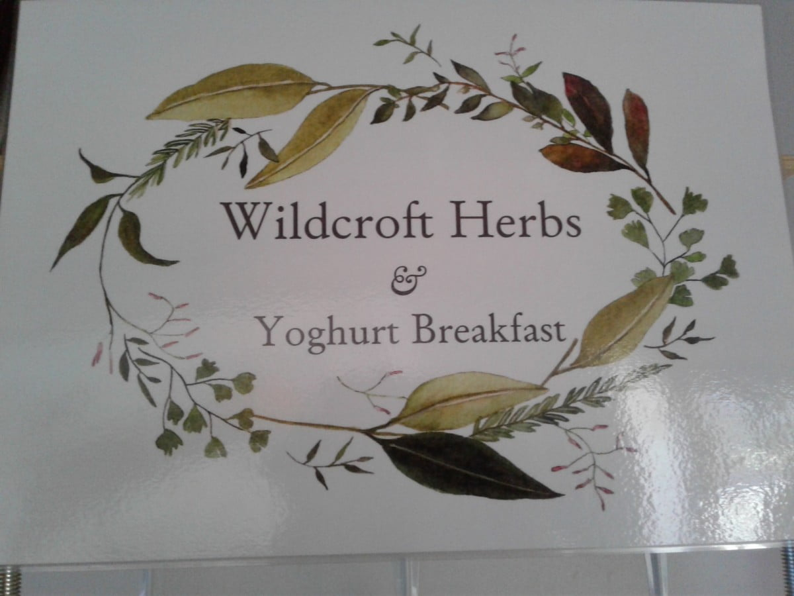
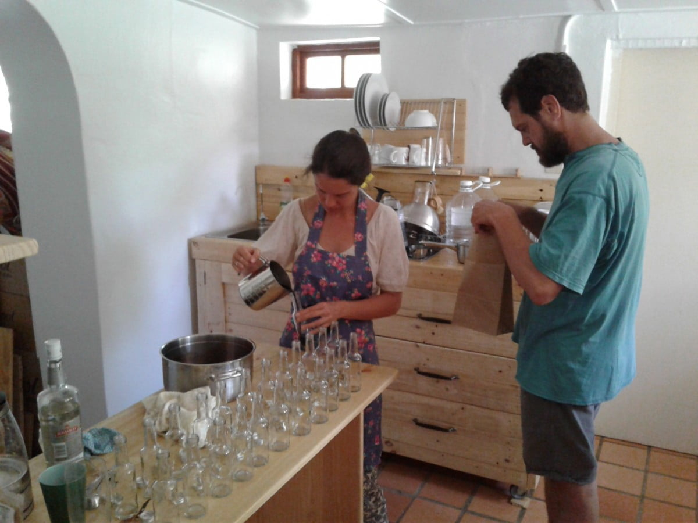
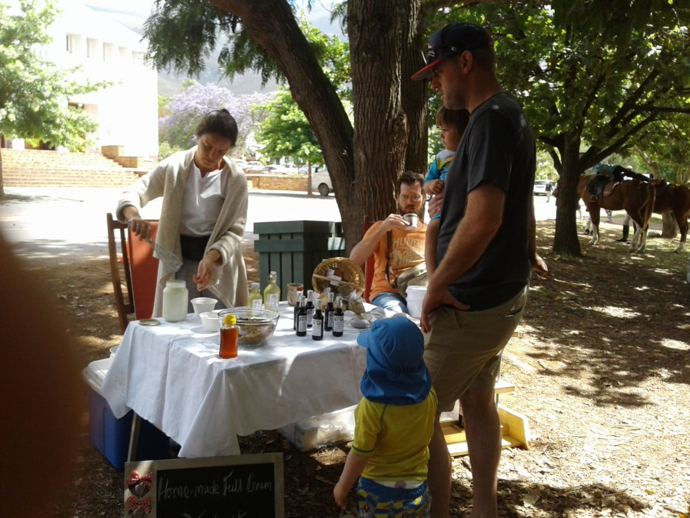

This happens every Saturday morning with smaller veg n bread one on Wednesday. A very lively atmosphere prevails among vendors of home baked goodies, home grown veggies, crafts of many different skills, and their customers. A horse drawn cart is the local taxi, children enjoy pony rides. Benches and tables are set out under the trees so you can enjoy a coffee or other beverage and sample the mouth watering cakes. 

The 10th December was a very special market day. Catherine set up her own stall selling her home produce. Healthy breakfasts of home made yogurt and granola, advertised on a blackboard enticed folk to try. This was served in small dishes with a spoon.

Alongside breakfast, Catherine's cordials were beautifully displayed, made from hand picked blueberries and elderflower. The latter growing amongst brambles in marshy land, so she set off before the sun was too hot, 9 in long wellies, on her bicycle.

Much time and thought was put into the cordial making and label designs. Small packets of herbal tea, were arranged in a basket, and to complete her table Catherine had painstakingly made beautiful herb bags, from muslin and lace tied with a ribbon.

Catherine and Daniel set off early and  we  followed a bit later. Big smiles greeted us... Customers already sampling and happy with their buys. So worth all the preparation and a confident start to the enterprise. Another well done both.

Lunch that day was  delicious home made duck and cherry pies . So many enterprising people. Think these will be our Saturday special.
