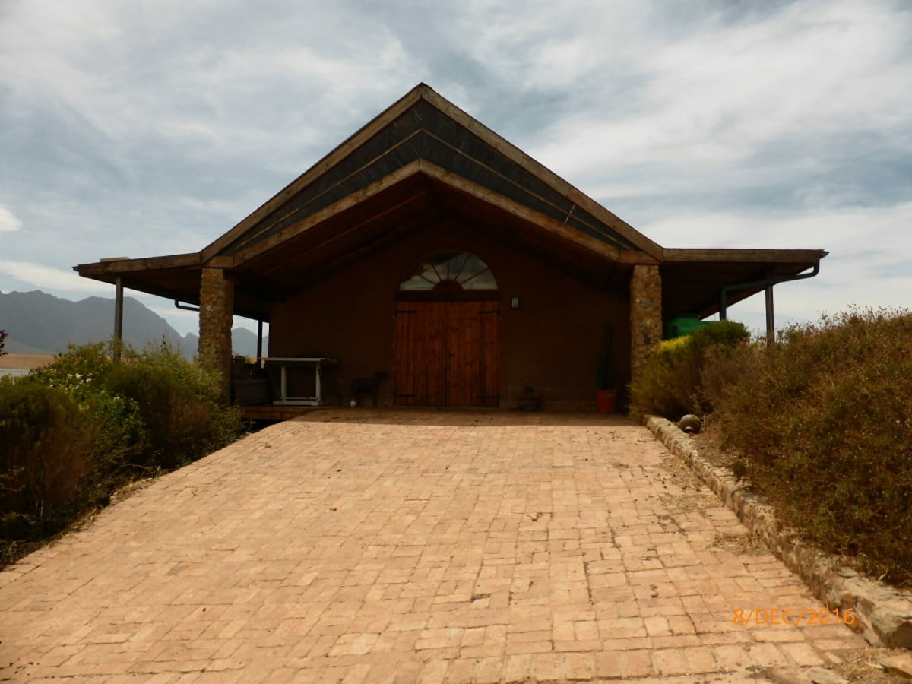
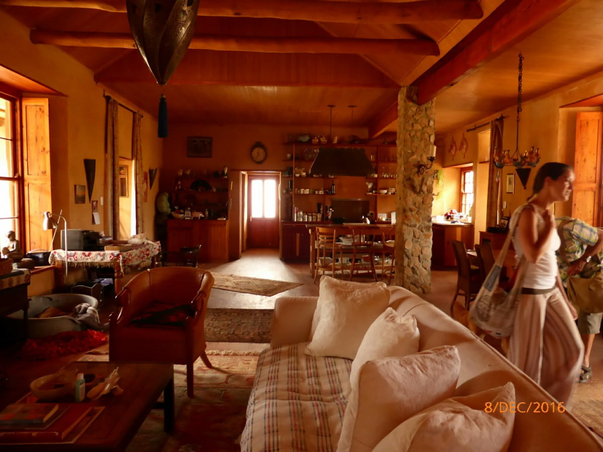
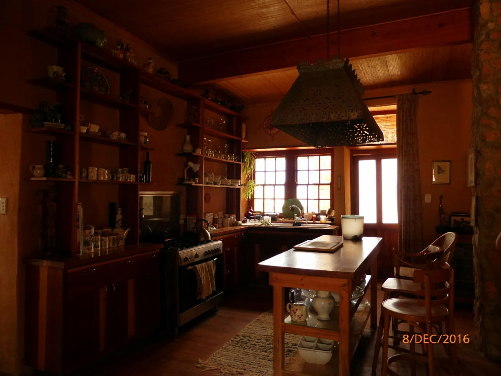
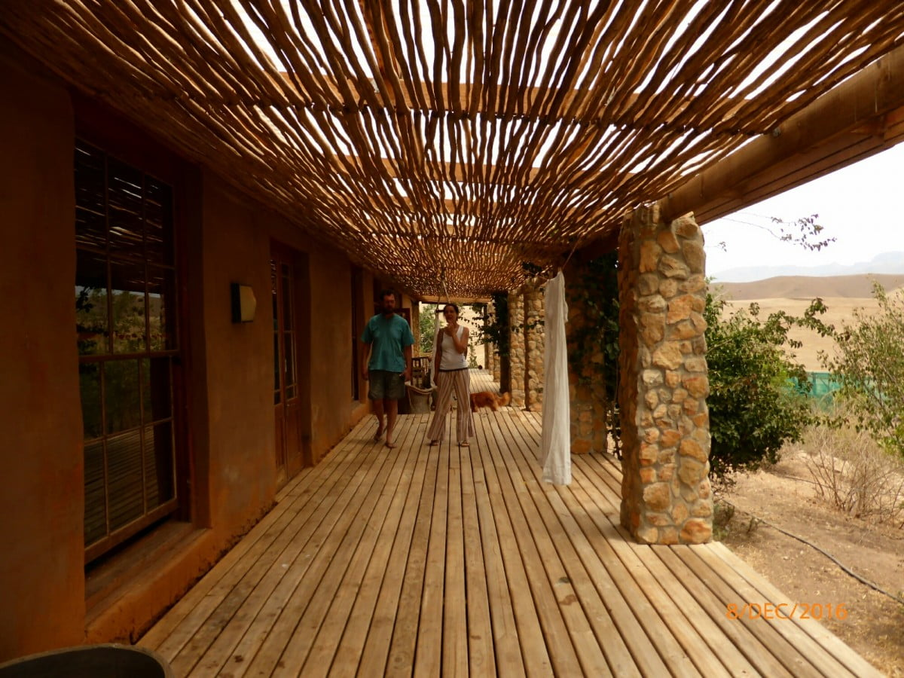

Dan and Catherine were invited to see some straw bale houses, built by their owners. These very delightful people had attended courses and done much research before starting.

So mum and dad go along too, to be a nuisance and add opinions.

It seemed like we were driving forever along a long and dusty track the other side of 'their' mountains. The experience was well worth the dust enshrouded car. Certainly lost its newly polished look now!

Our mouths were agape as we entered the first building. It was magnificent!... Enhanced by very individual selected furniture and furnishings.

The ceilings were from bamboo supported by beams of poplar tree trunks. An enormous lounge with kitchen was comfortably cushioned and a five star nest for adored felines. A long shady porch was asking to be rested in with big comfy sofas. Books and journals exhibited the owner's many interests, mainly of freedom, a healthy lifestyle and belief in nature.

There were two more dwellings on this site, each displaying the same philosophy.  All content to live away from society, but aid the needy. All were vegans, but outside and inside too, housed animals. The favourite seemed to be a breed of vicious looking boar. One even has its own kennel.

The lady of the largest house was in the process of hosing down the boar, talking to and stroking them as she did so. Sheep wandered freely no door was shut to them. It was amazing.

Our host spent an hour and a half explaining the builds and problems he'd overcome. He offered help and contacts when Dan and Catherine start their build. A remarkable person and certainly an asset to their friendship list!
