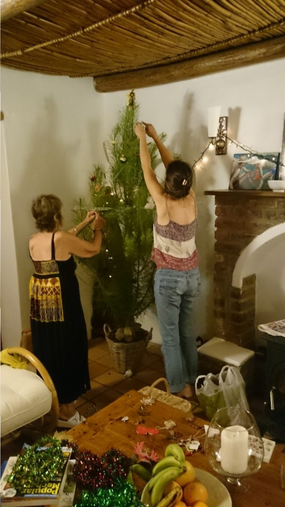
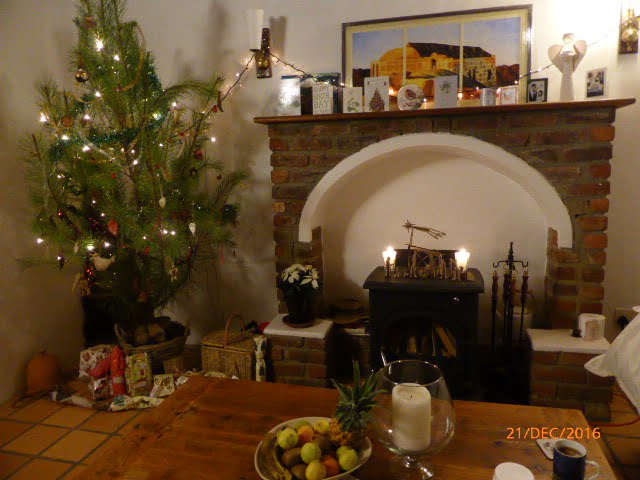
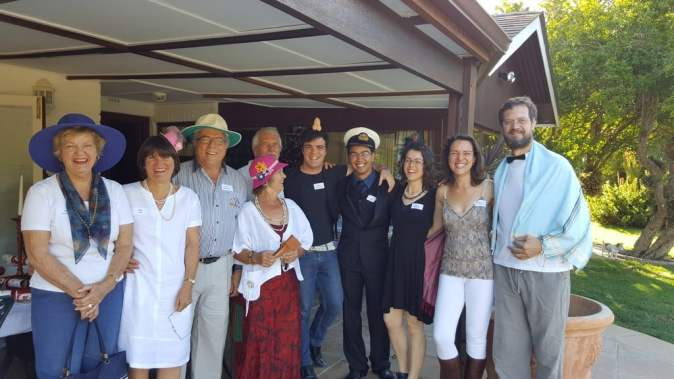
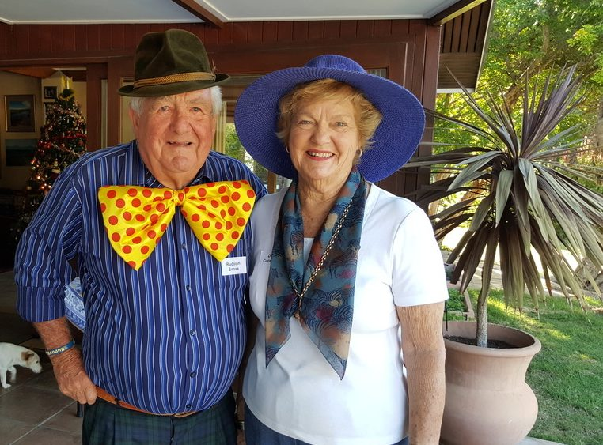
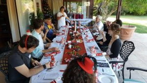
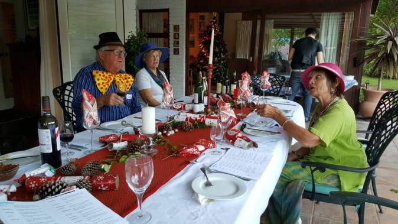
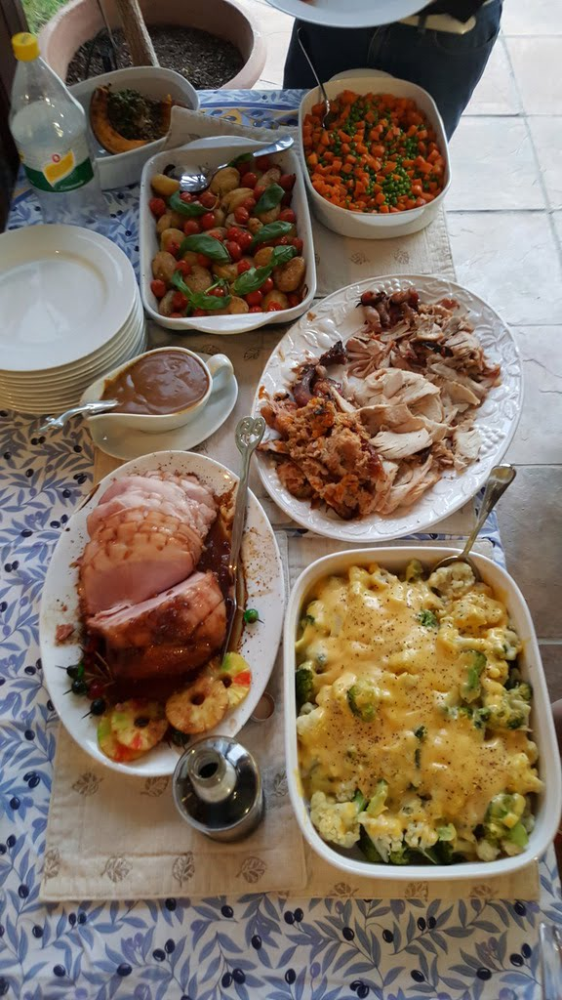
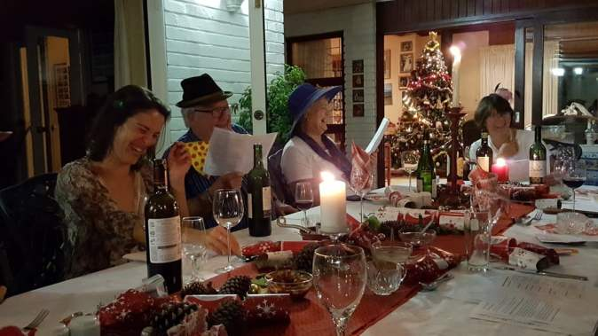
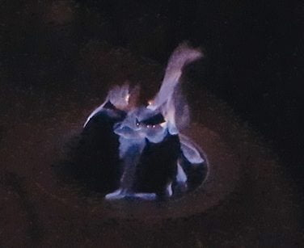

Catherine and Daniel decided they would like to spend their first Christmas in Greyton in their cottage, Columba.  Hardly  room for all the family, so we felt privileged to spend it with them,   just the 4 of us. We decorated a fir branch with treasured hangings and some simple lights. A small wooden nativity scene which I bought at the local craft market completed the scene. It is so pretty at virtually no expense 

No way were the Van Dorstens not going to have a family celebration so they hosted a Christmas murder dinner for 12 of us. We were given our characters the previous week so we could dress appropriate to our role. 



The event started with wine tasting. Wendy, Catherine's mum, succeeded her father as chairperson of the Wine Tasters' Guild, so our guesses  tended to be a bit random, alongside the professionals.  As we were type cast we could use our roles to disguise or ignorance especially me,  a flutter the eyelashes,  actress,  Candy Cane.  Darling!

[](https://www.artamo.click/wp-content/uploads/2016/12/20161217_181322.jpg) The game started well with Evan Song (Mike) knocking a full glass of wine over me. Luckily the dress was red so no long lasting damage, so I changed from my silk number into cotton culottes and top - a greenish ensemble. Important for later on!  The game hilariously progressed, between pulling crackers  trading  jokes, losing our scripts and generally having a lot of fun. One of my questions to Bill totally irrelevant to the script was "where did you get that tie?", which  provoked a duet from us both "where did you get that tie(hat)".

The home made pate with jam (strange combination, but very more ish)  was followed by roast turkey with a delicious stuffing,  smoked gammon garnished with pineapple  and a sticky sauce.... Roast potatoes , butternut squash, carrots and peas and crowned with gravy. Thank you Wendy and Jennifer for a generous helping of your culinary skills.    More cracker pulling , jokes and lubrication, before getting to the meaty  part of the game. One of us was the murderer and not even the murderer knew. 

Molly the dog was itching to join in. Thinking she might know the culprit, and reveal the identity, I picked her up.She rewarded me by peeing in my lap.. Again an appropriate colour(see earlier)  She is old and was excited....an excuse us oldies can bear in mind..... and.... .I had just finished a pastel of her.... Should've put a wicked gleam in her eye!

 Getting near the end, and the finger of suspicion was pointing at no one...We replenished our thoughts whilst devouring the Christmas pud. I had made 3 the previous week , well marinated in brandy to satisfy the taste buds of Joe. instructed us as to the quantity the last time we had Christmas here .We did dilute the alcohol with brandy custard,though . This was ignited to dramatize the end of an excellent meal.

 Guessing time.!

Not one of us deduced the culprit.... So he is more a free man. We'll  get you next time Joe, alias Phil Stockings.

Guest list:

```
Joe - Phil Stockins
Wendy - Rita List
Bill -  Rudolph Snose
Peggy - Dee Coration
Dan - Frank Incense
Catherine - Holly Sprig
David - Robin Redbreast
Jennifer - Paula Cracker
Jason - Si Lentnight
Alison - Gaye Garland
Mike - Evan Song
Maureen - Candy Cane

```
