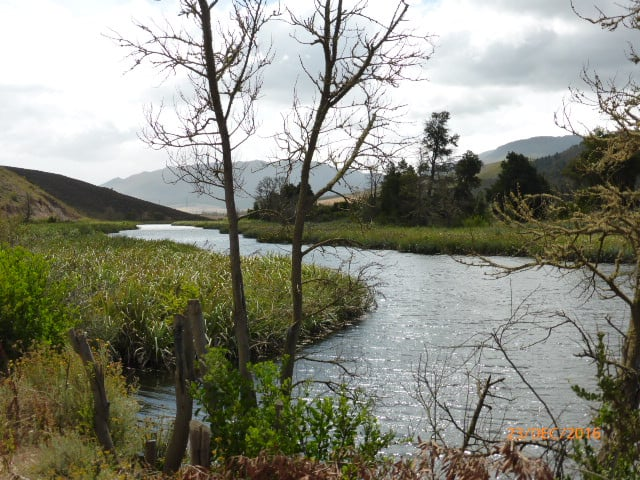
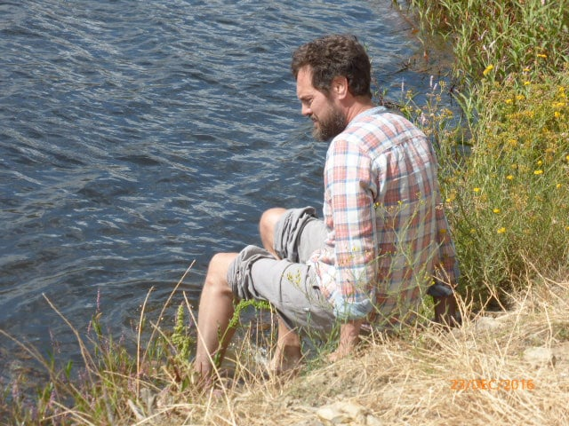
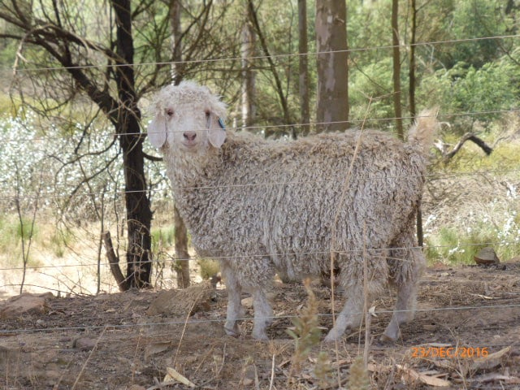
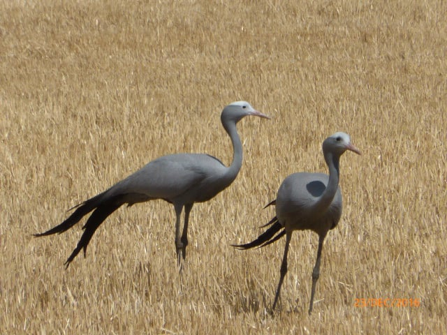
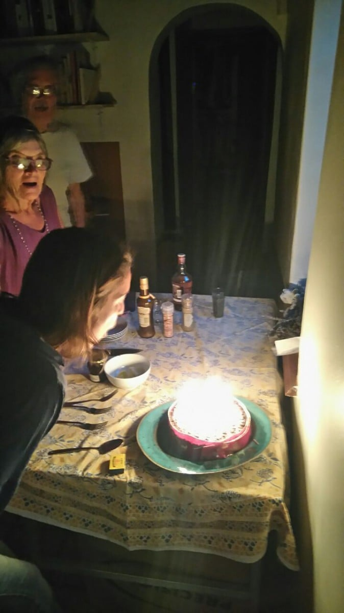
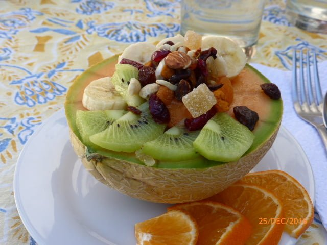
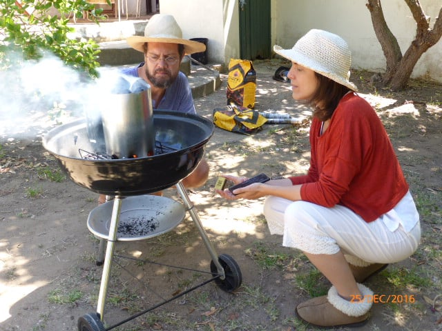
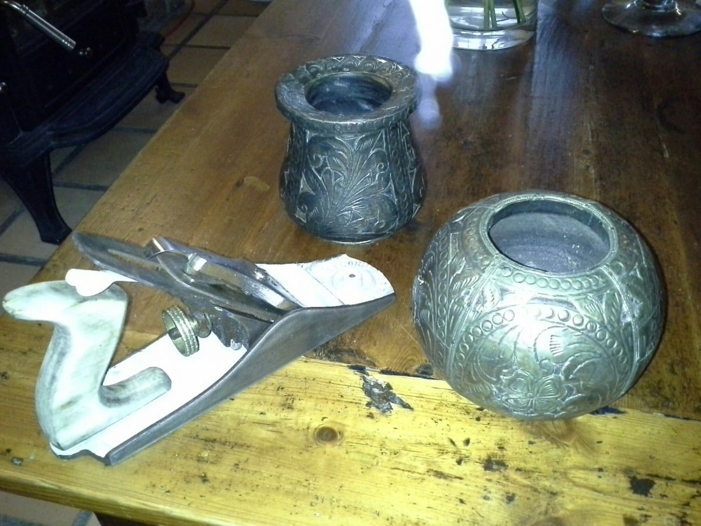
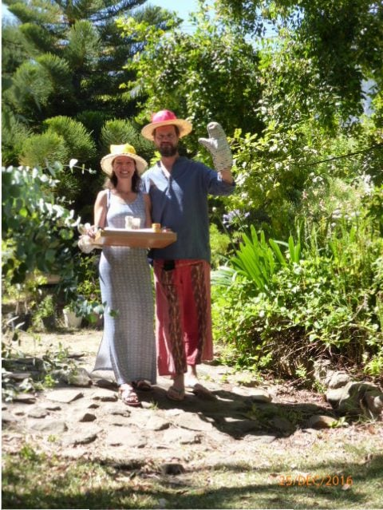
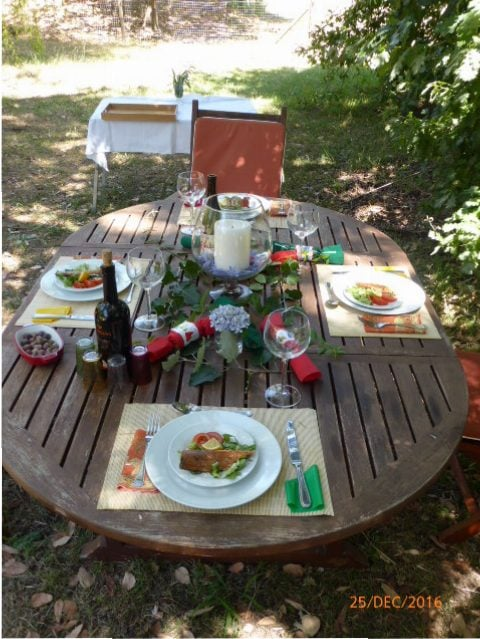

Celebrating Catherine's birthday meant lunch out. Dan organized a surprise picnic for us all in the mountains, but due to inclement weather.... high winds and promised rain, chose a restaurant close by. It was like a French cafe , but with smiling, coloured staff. A lovely meal,three of us had yellow tail fish and Catherine had a lamb curry. We returned via the back roads mostly unmade and winding through townships. Some of these have become quite upmarket, having wooden or bamboo structures. It amazes me how many people fit into such a small home. They all seem so happy. Most have no transport, and walk for miles or hope for a lift. Catherine stayed in two of these 'huts' whilst on a course so was our travel guide for the afternoon. There are mostly indigenous folk here who speak Africaans, but their smiles know no barriers.

​ We stopped by the river so Dan could have a paddle, or so he thought.. a big bit of a drop!. It was just a lazy drive home where storks in magnificent poses asked to be photographed then strutted off with their bulbous heads held high , their plumage blowing in the wind. I wondered if they are the same 'grues' who fly over us each spring and autumn reminding us of the imminent change of season. Our 'guide' verified these particular ones did not migrate so wouldn't be seen flying over Bergerac. Have to catch one and put a rose in its lapel so we know it's flown across from us to here!    Tiny sheep with coats like alpacas came to have a nose. So many simple things happening and we had time to "stop and stare".

​

​

​

Home to candles on the Christmas cake and a little tipple completed a very pleasant day, although shadowed by the death of my brother in law, who was more like a brother to me since I was about 7 years old .It is sad being away from family at times like this.

​

Christmas morning was welcomed with an alfresco  fresh fruit breskfast,served in melon cups,  accompanied with some beautiful carol renditions. We  all contributed to preparing the meal. Dan stoked up the braii, using a coal starter drum,  a present from Wendy and Joe. Veggies were scrubbed , stuffing in oven , coffee pot on and I cooked mince pies to eat warm whilst opening presents.

​​

In spite of each of us choosing what we wanted the previous week , we had added surprises too.  Mike had renovated a rusty plane (the woodworking type), costing next to nothing,  for Dan. It looked fantastic and was much appreciated.  I found a 'bits and bobs ' dish  for Catherine,  which just needed a bit of color on the chipped edge and a coat of nail varnish. Just the thing! Also found some old pots, made from wood and brass for Dan's 'odds and sods '!  I was extremely happy with a small wooden pendant whose markings matched my dress and a tiny silver pendant housing a purple stone, complimenting most of my wardrobe. Mike had a beautifully made walking stick... ready for our mountain hikes!!!  A much needed peg bag, like the ones we made at school,was the star present !!!

​

​Guess whose are new ?

We laid two tables under the trees. Our gourmet lunch started  with home smoked trout, followed by  a most delicious braii ed turkey and gammon main course, with the traditional accompaniments  . The cottage was well and truly christened with a special vintage wine.  This warranted an afternoon siesta , after which, a very special Christmas was rounded off with Christmas pudding, cream, and lemon ice cream.

​

​ Wishing you all heartiest good wishes !
