Since my last blog life at Columba has settled is into some sort of informal routine.

\[caption id="attachment\_696" align="alignnone" width="1024"\]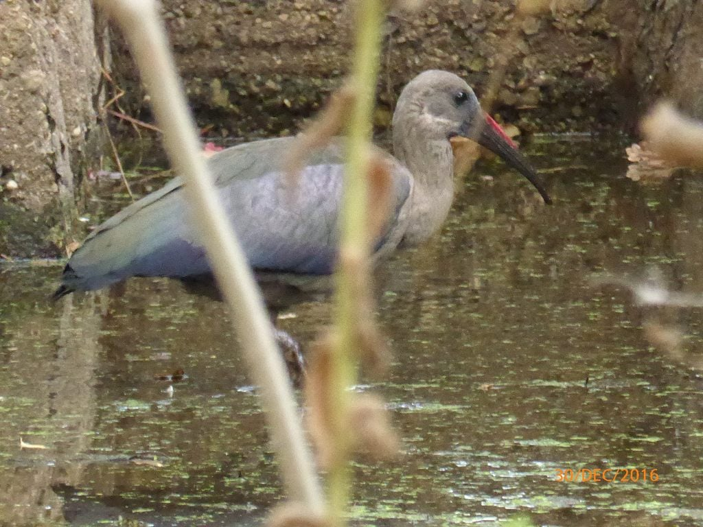 Hadida in the back garden having a drink from the small dam\[/caption\]

​

The four of us celebrated the last of 2016 with an attempted game of boule, late afternoon, after having stuffed ourselves with roasted duck legs and their trimmings, more Christmas pud.and some liquid refreshment, before, during and after eating!

\[caption id="attachment\_716" align="alignnone" width="675"\][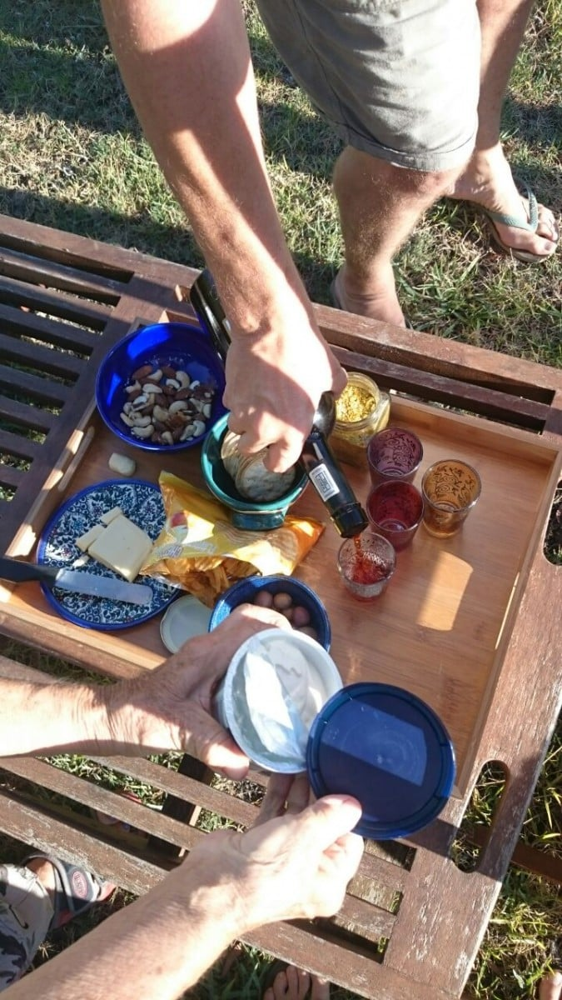](https://www.artamo.click/wp-content/uploads/2017/01/img_20170106_185130.jpg) Aperitifs\[/caption\]

​

A braai failure ! It was set to cook whilst we had a leisurely coffee in the village. "Never have a braai when the shops are shut!"... A modified saying of Mike's father, referring to working on any gas and electrical repairs !!!  So true, the coals were too few and on our return, the lack of mouth watering smells warned us that cooking was not happening. So back to convention, into the oven. This meant enforced extended aperitifs! What a shame!

\[caption id="attachment\_710" align="alignnone" width="1024"\]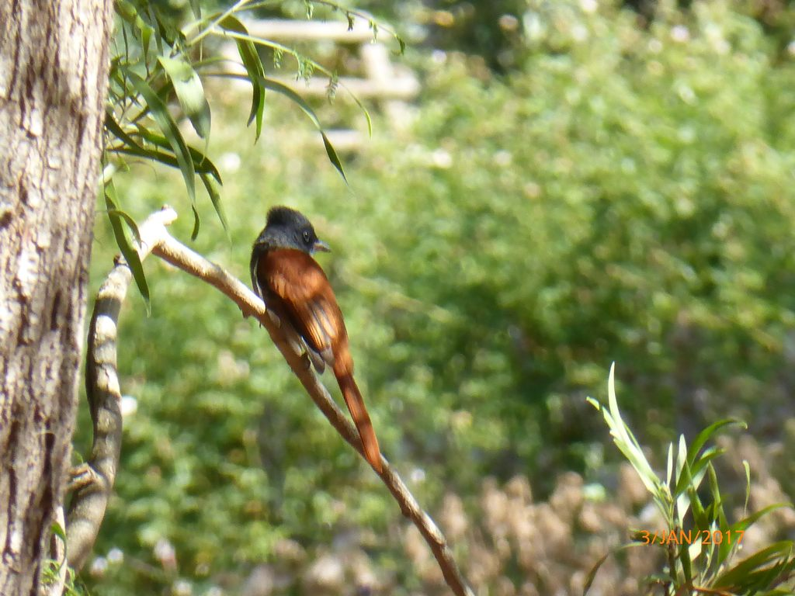 Paradise Fly Catcher in the back garden\[/caption\]

Back to the boules match, played on a wild uncut pitch, that had no boundaries, four players being ever so slightly squiffy, and a gale force wind (though warm) to boot ! Phillips seniors romped away to a 7 to I lead, so, to prevent any despondency on our opponents' part, we held back our expertise, allowing the juniors to gallop ahead and win 13 to 12!!!   Think it was the last round of Port that hindered our concentration and accelerated theirs!!!

We needed to equalise,which meant a 'banana'game in the evening. A word making game to stimulate our alcohol sodden phagocytes. Phillips seniors supremed with one game each. A few protests of cheating were nipped in the bud, interupted by a video call from Romania. A lovely surprise !  We could welcome 2017... yet another glass  of bubbly was forced upon us... with Julian and Mariana... Cheers to all!!!

\[caption id="attachment\_717" align="alignnone" width="1200"\][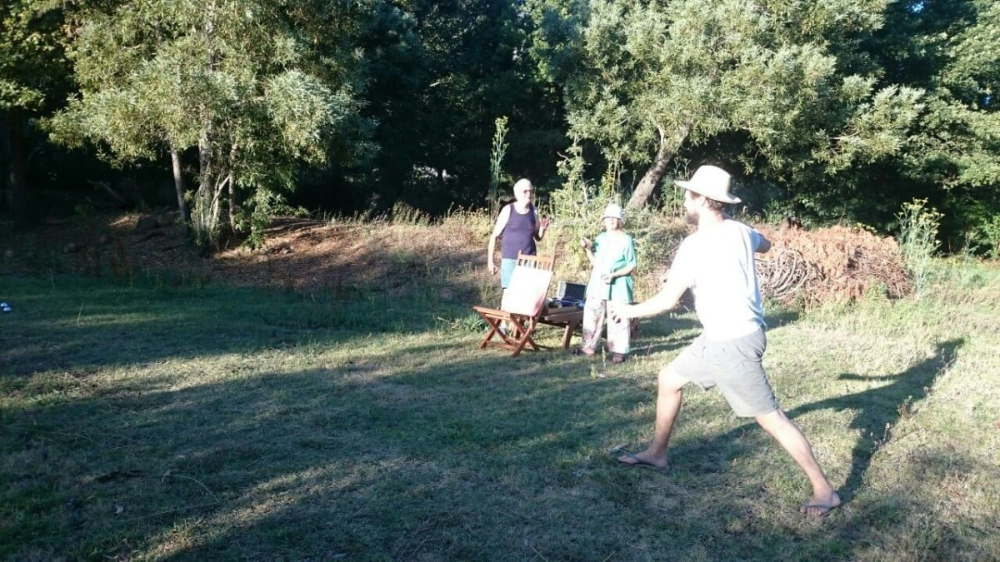](https://www.artamo.click/wp-content/uploads/2017/01/img_20170106_185233.jpg) Boule\[/caption\]

​

I am now writing under the trees facing the newly cut meadow.... Ready for the next match!     Not a job for the feint hearted.... The mower has no motor.. Should've brought our tractor over.

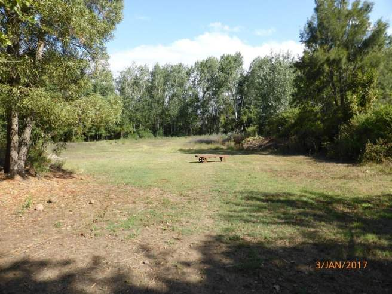​ Columba is in Park Straat (Park Steet) which leads from the village of Greyton into the Greyton Nature Reserve in the Riviersonderend Mountains. The cottage is about 750 m from the entrance and surrounded by scenic beauty. Lots of criss cross streets, all housing some beautiful dwellings, means we can take a different walk each day. Mostly  unmade, and very hot and dusty, walking demands lots of feet washing. The bath has a wooden seat for this purpose. Very cosy one can footsy in twos!

\[caption id="attachment\_687" align="alignnone" width="1024"\]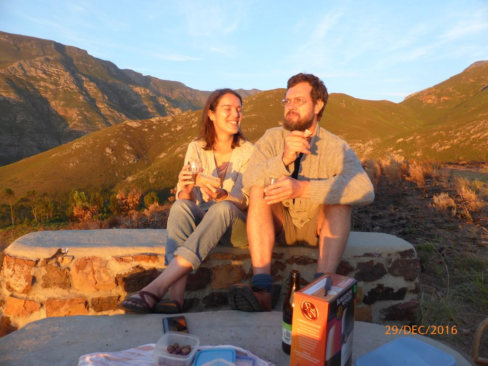 Sunset Point\[/caption\]

​

​

Shopping is very limited in Greyton. The nearest town is  Caledon , the people here are mostly indigenous, speaking  Afrikaans. Not a wealthy town, so I was surprised to see the toilets of the car park decorated with flowers a vase  for each wash basin. We also coffee'd in a delightful little cafe. My savoury tart was garnished with  rocket  whilst Mike's scone had cheese, butter, jam and shredded meat accompaniments. A worthwhile outing, but need to go to Cape Town for 'real' shops.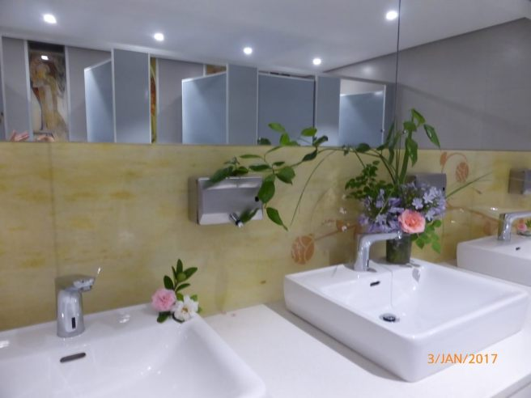​

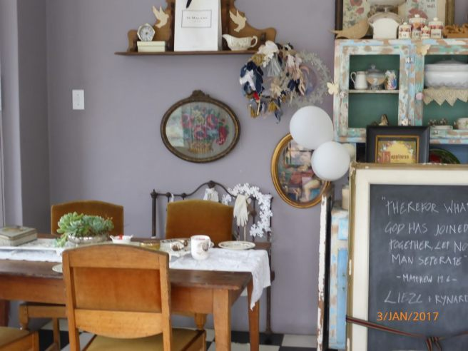​

The village centre comprises restaurants / cafes, small shops.....mostly local crafts and enterprises ; three general stores ; a post office, who has no change so owes me money! ; lots of quality charity shops... love them ; petrol pumps ; a hardware shop, that has nothing to suit the Phillips' needs, a small chocolate factory.... and I mean small... just four jolly ladies wrapping the wares and a chocolate making machine! They offered me some broken bits and shavings off the too large pieces.... delicious ....., and not least....a brewery. ​

\[caption id="attachment\_661" align="alignnone" width="640"\][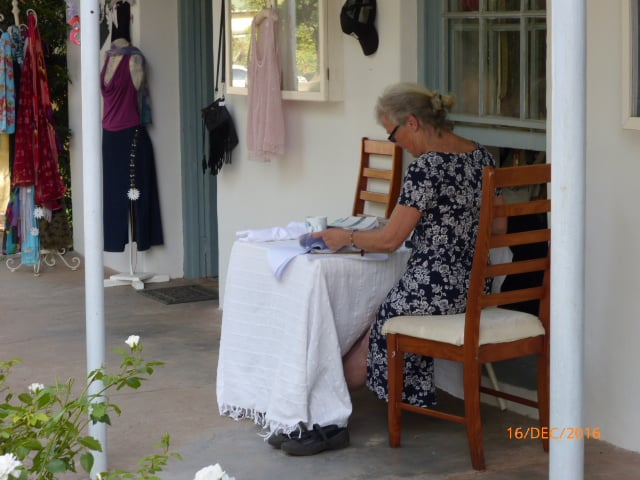](https://www.artamo.click/wp-content/uploads/2017/01/p1040646.jpg) Main Road, Greyton\[/caption\]

\[caption id="attachment\_662" align="alignnone" width="640"\][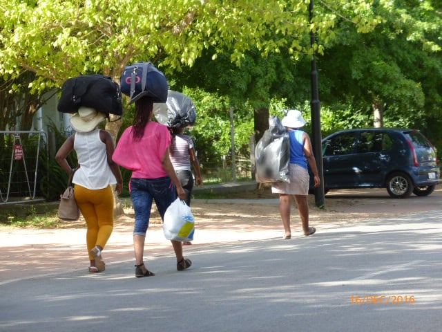](https://www.artamo.click/wp-content/uploads/2017/01/p1040645.jpg) Main Road, Greyton\[/caption\]

​ Saturday mornings there is a general market in a covered area under the trees. This is where Catherine sells her wares. Fresh coffee and many home made pies and cakes are sold here. Benches and tables are set out to enjoy these delights Our favourite is a duck and cherry pie... Yummy!!...... Saturday lunch....  Fresh fruit juices.....pomegranate, cranberry, elderflower......, yoghurt, cheeses, chutneys, fruit and vegetables promote a very healthy village. All are produced, mostly organically, in Greyton.  Home made crafts of exceptional quality add colour and gaiety to an already cheerful ambience. I want to buy everything for everybody.

[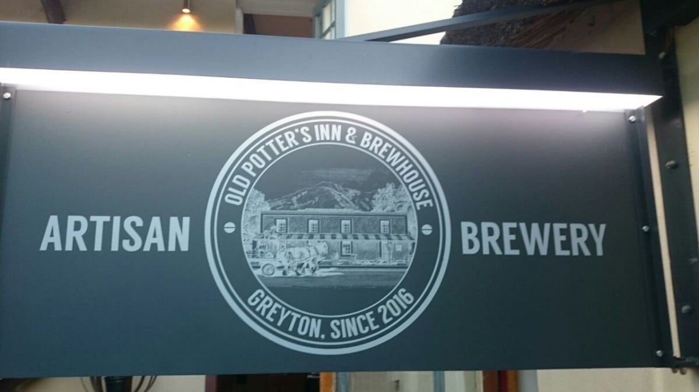](https://www.artamo.click/wp-content/uploads/2017/01/img_20170106_190524.jpg)​

\[caption id="attachment\_719" align="alignnone" width="1200"\][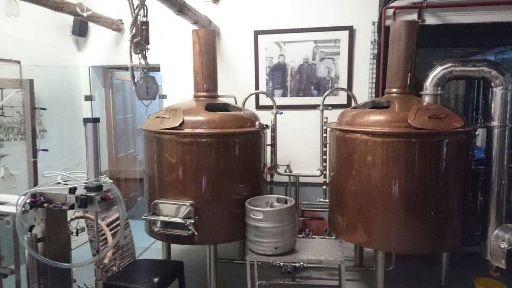](https://www.artamo.click/wp-content/uploads/2017/01/img_20170106_190515.jpg) Old Potters Inn\[/caption\]

​Wednesdays brings a local producers' market, on a much smaller scale, where any one can set up stall providing produce is home grown or home baked. Sour dough bread seems to be a favourite. It is not unusual to find an olive whilst enjoying a large jam 'doorstep'. The bar which hosts this roadside market, offers half price lunches on this day.    Not to be outdone, the brewery offers half price drinks in the evening. The Brewery was once a pottery and is now called 'The Old Potter's Inn'. It seems half of Greyton and his wife (or someone else's) meets in very jovial spirits to sup their delicious home brews made in large steel brewing tanks . We look forward to this gathering and even I have my favour tipple! This week we had a burger... not  a usual choice... but we were tempted by our neighbours enjoying a munch. They were freshly cooked from gammon and salad and were individually served in brown paper packages, tied with string. Whilst adults 'bevied'  their offspring played in a pool.... No water restrictions at the moment for businesses. An uplifting mid week treat.

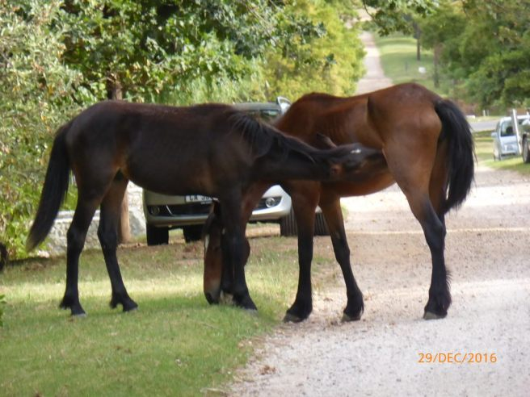​ Back home, about a dusty  1k walk , we go about our loose routine. Mike is re running the electrics (why does every one else put them in the wrong places?), between building cabinets and drawers. At last his very necessary saw bench has arrived, so he is a happy bunny. Catherine is busy pressing and preparing tinctures to build up supplies for the imminent opening of her practice, collecting flowers and making yoghurt and juices for market. She is also in control of the weekly hoover and mop. Ceilings are attended to too, as made from bamboo, can house some little undesirables! Dan is the overseer, planner, and in charge of laundry. I mean washing... I thought I was the most frugal  ironer, but they have beaten me to that title not even possessing an iron. I now have one and a mini ironing board (for a dolls house) !

\[caption id="attachment\_694" align="alignnone" width="300"\][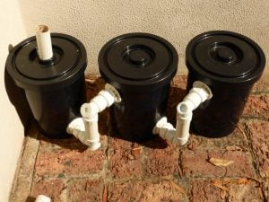](https://www.artamo.click/wp-content/uploads/2017/01/20170106_0012.jpg) DIY Grease traps for the Grey Water system\[/caption\]

[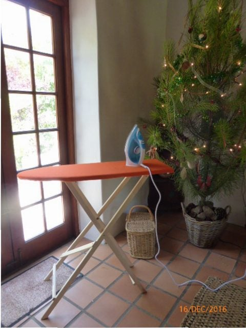](https://www.artamo.click/wp-content/uploads/2017/01/p1040643-1.jpg)​ We all have a weekly exfoliation after towels have been laundered as the sun gives the fabric that extra scouring quality.  I'm mainly cheeky, (love this predictive text! ) or even, chief 'cook and bottle washer' I also attack painting jobs around the home. We all rub shoulders quite amicably, trying to avoid each others' toes, but  aiding when needed. The lounge is very versatile. It is a bedroom; Dan's office, Catherine's apothecary, a sitting room, drawing space, games, plans are made here and where we all watch the little screen in the evenings.. . this entails a theatrical move round of settees....Such fun darling !  Our dining area is usually under the trees next to the meadow, where we trip across the lei water with trays, chair covers, bevies and all the necessities for a midday break

Must go and prepare now..... Noodles and sea food today!!  Bon appetit!!!
