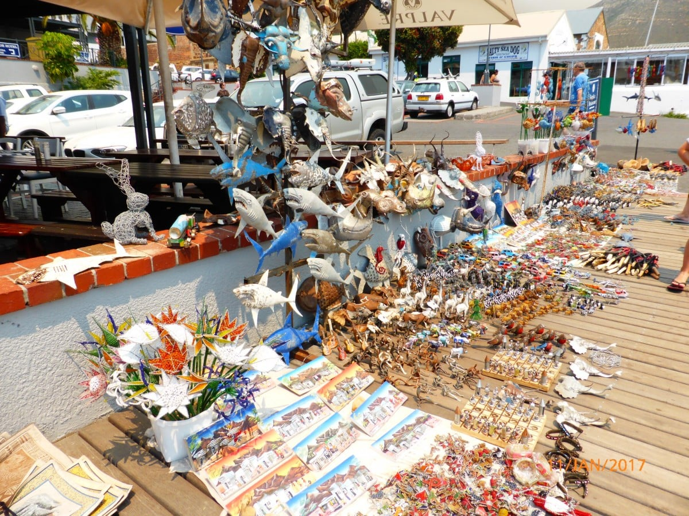
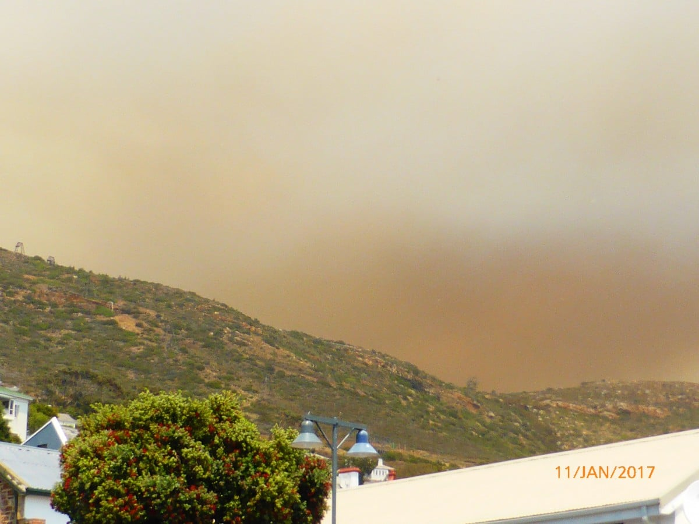
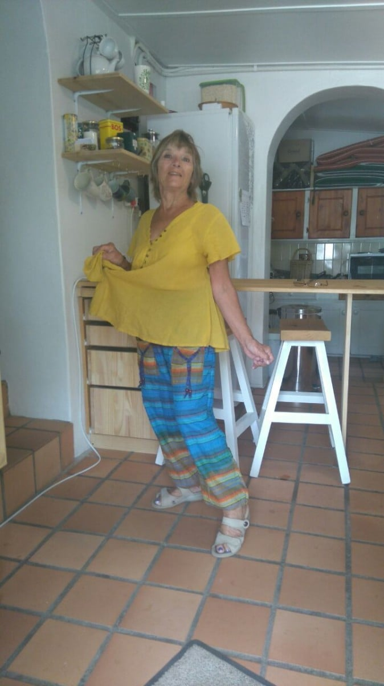
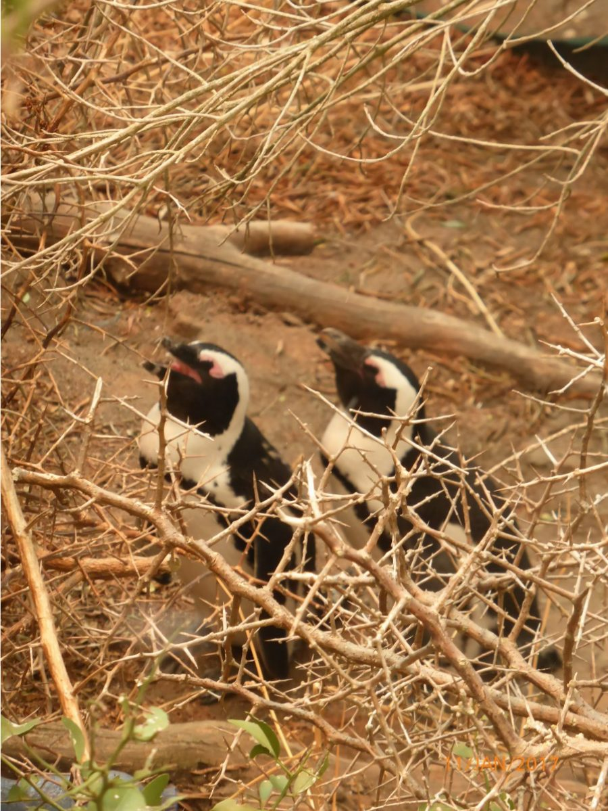
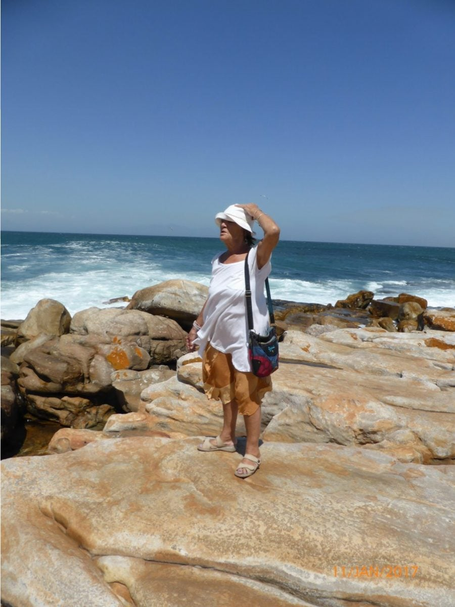
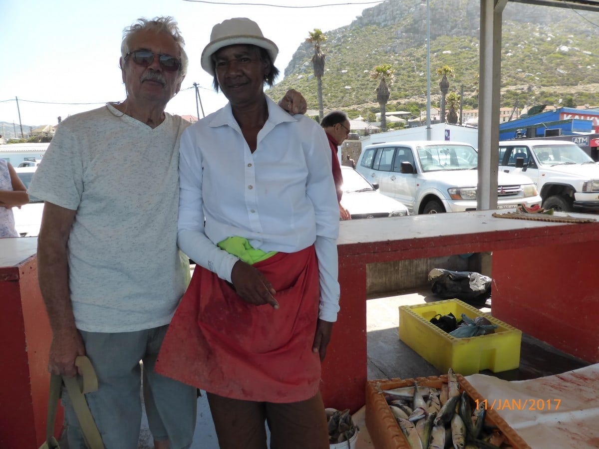
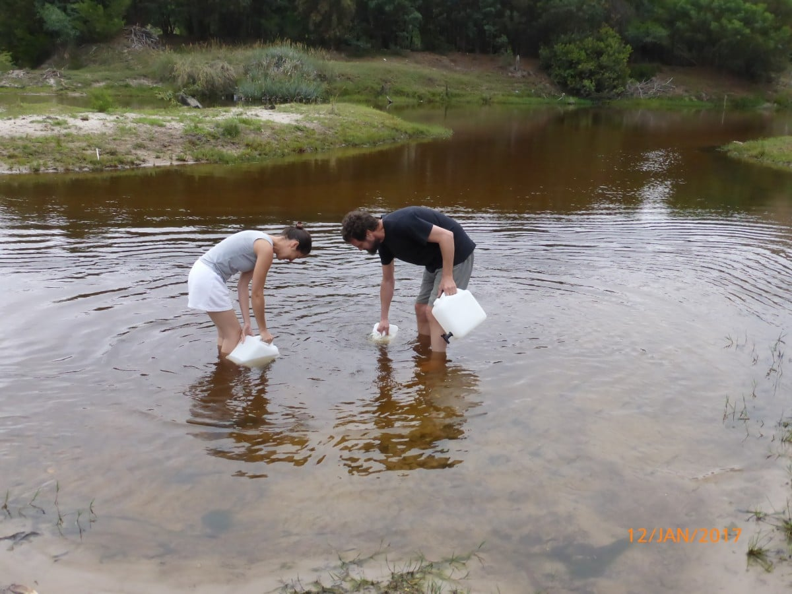
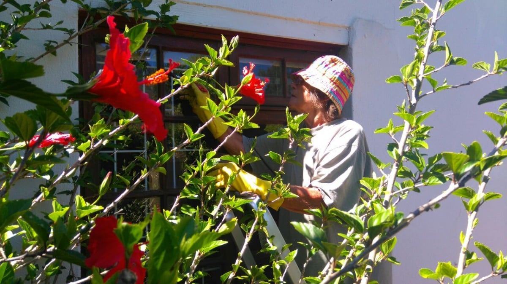
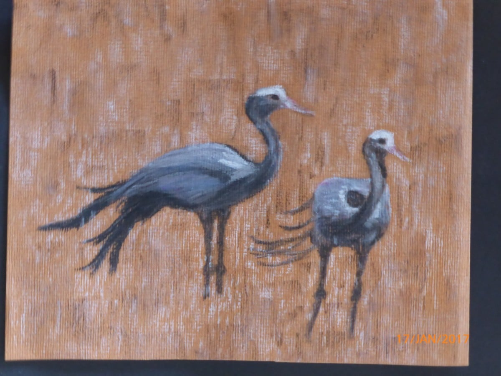

> Thank you for all your comments and thoughts, through my blog or e-mail. It's so good to hear from you , being so far from friends and family.

Life is very busy here. A lot to be achieved for Dan and Catherine to realize their dream. Two small rent-able straw bale units to be built, Catherine's practice to be launched, both giving the income to afford a larger straw bale home for themselves.  A car port is the first necessity to house the straw which is now on the site of the potential units. Being very difficult to get materials locally, meant a trip to Cape Town. Mike and I went alone as Catherine and Dan were busy. Also gave them a chance to reclaim their new, very comfortable bed, if only for a few days.

Wendy and Joe housed us, thanks to Jennifer giving up her bedroom. A good trip and a warm welcome, as usual, at Chorley and a swimming pool to boot! What more could we want?

Monday was shopping, mainly in builders and DIY stores. Tuesday we revisited some of our favourite places along the coast, buying fish on the quay, getting blown from there to Timbuktu , then on our return gust, wandering through the shops and arcades, with all their colour and smiling faces. Locals making their ware from anything they can recycle, with imagination and dexterity. ​​

Wednesday we went further down the coast hoping to swim in Boulders' Bay with the penguin colony. As we approached Simon's Town, I noticed a strange cloud formation. As it was very windy, we deduced it was formed from airborne sand particles. ​

Coffeed by the harbour, a real favourite, original shops and galleries, so much to see. Then the sky started dropping  flakes..... Dandruff from above?  Warm snow?  The sky  darkened and the sun became obscured by a smog. We made a move to the main street and sought shelter in an antique shop. The initial cloud now evidenced billowing smoke. The owner confirmed our fears. A bush fire on the mountain. Furthermore she said that it was probably started on purpose. Only the previous week a lad pointed out an old large magnifying glass in the shop, saying "that should start a good fire!" Apparently, his mum said nothing in reply.

We hurried to the car, but as fate would have it, a bright blue pair of pants called me from a doorway... They had Maureen written all over them, so in spite of my resolve not to buy, They had to be mine!

​

By now eyes were smarting, and throats getting dry, so we hastened to the next town anticipating lunch and a swim. Lunch we enjoyed by the large boulders of the bay.. Such an appropriate name!  But the beach was closed. A walk along the board walk through the penguin colony soon terminated.​

​ The wind was having a jolly time, conspiring with the fire  to cover as much ground as possible , challenging the  services to control them.  Smoke had followed us, so apart from the discomfort, thought it better to escape the vicinity. Not easy!

​

Rescue vehicles... Sirens... Flashing lights... warned us it might be a long while to drive out of town. It was, but we were fine. The mountain dwellers were moved out, ambulances and fire engines back and forth, and poor animals who could do nothing. It was shocking for us, but quite a common occurrence in a drought ridden summer here.  A volunteer animal rescue service invites anyone available to try to save these  unfortunate small creatures, especially the tortoises. We revisited the fish harbour where Mike's made himself a friend with the fish lady, but he didn't get a free fillet!!!! Yellow tail fish... Wendy cooked it to a teeee.  (where did that saying come from?) Anyway it was delicious.

​

It was good to leave the Cape Town traffic (even if we didn't actually go into town) and wend our way 'home' A lovely coast and mountain drive, lunching on the way. Big smiles welcomed us at Columba. Then they told us there was no water ! There was enough in our bottles for a cuppa,   after which a trip to a local river that was still flowing to fill up canisters for washes and bottled water for drinking.

​

All's well the next day, but it seems pipes are so old in Greyton and water supply is so low, that it can happen any time.

A warm and windy day today. Did some house painting.... Catherine now working under pressure to finish her tinctures.. Another 12 to go, from dried herbs to a liquid remedy, no easy task.

​

Some storks (grus for my French friends), flew over today, so inspired me to do a pastel of some that had landed. Magnificent birds. Also this morning we were honoured, as we  ate breakfast, with a procession of hadidas walking by... Adults,adolescents and babies.

On that note will say

Until the next time.........Love to all x

​
