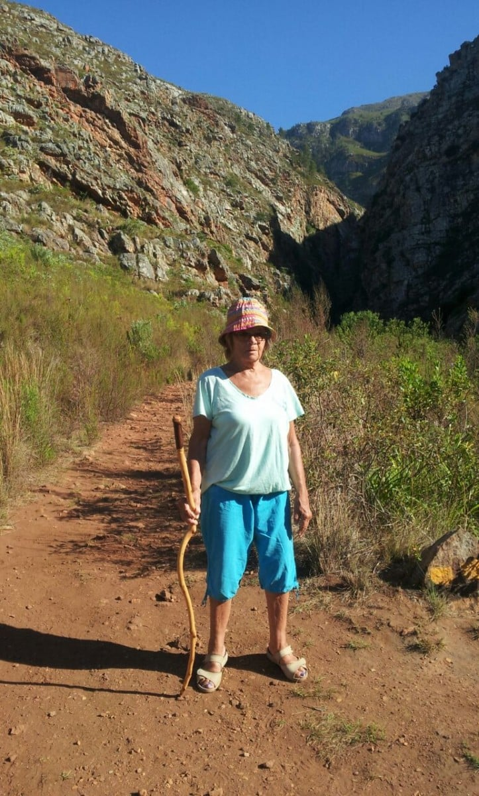
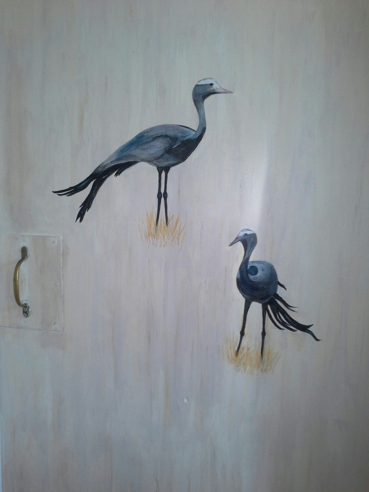

  Back again with an update.

No real excitement since I last put finger to keyboard. Thank you for your good wishes if you remembered my birthday, and if you didn't, thanks for not thinking of me getting older!!   The morning started with a 7 am walk into the mountains. Thought we'd avoid the heat of the day and find the swimming dam. Didn't quite reach our destination as the path was getting too rough and stumbly, not wearing appropriate foot wear.... flip flops a bit precarious. Another excuse... a really minor one of course... was that we could hear the baboons in close proximity, and didn't have Catherine's bush skills to protect us ! Mike caught me daring them to come any nearer..

​ ..On our return, .a hearty  birthday chorus from Dan and Catherine,  with a gift of a truly beautiful Thai silk shawl, was a cheery day's beginning.  A day of house painting  was rewarded in the evening with a lovely meal at a local restaurant.

After weeks of drought conditions, a month's  rainfall fell in 2 days. It had to be one of those 2 days we chose to take a trip to Hermanus, the nearest big town and on the coast. The elements didn't prevent us enjoying the day, however, visiting some exceptional small art galleries, craft shops, before lunching in a polythene windowed , windswept cafe on the beach. The food so fresh and delicious, made up for a murky sea view

. The last couple of weeks have flown by, working with  seemingly slow progress. Catherine is now ready to launch her practice......tinctures bottled and labelled, publicity ready to circulate and a temporary sign will hang from a rustic gallows, which Mike has made, by the front gate.

I have painted my two cranes  on  the bathroom door..... was going to be a stylized picture of loo and shower, but thought we'd leave room to guess what's within!

​​

A'pop-up'lunch, hosted by a super couple (they were actually competing to buy ' Columba', but Dan and Catherine pipped them are the post), was held in a forest... meat cooked on a bonfire..... It was fantastic..​

​ ​ Last evening we were entertained by local musicians in  Greyton Lodge's  garden, flanked by the mountains in the setting sun, it was a truly memorable event

​ . These two outings herald our  sojourn of a few days in Langabaan, Catherine's grandparents  holiday home by a beautiful  lagoon and harbour on the south west coast.

Next blog from there, 

Bye for now xx
