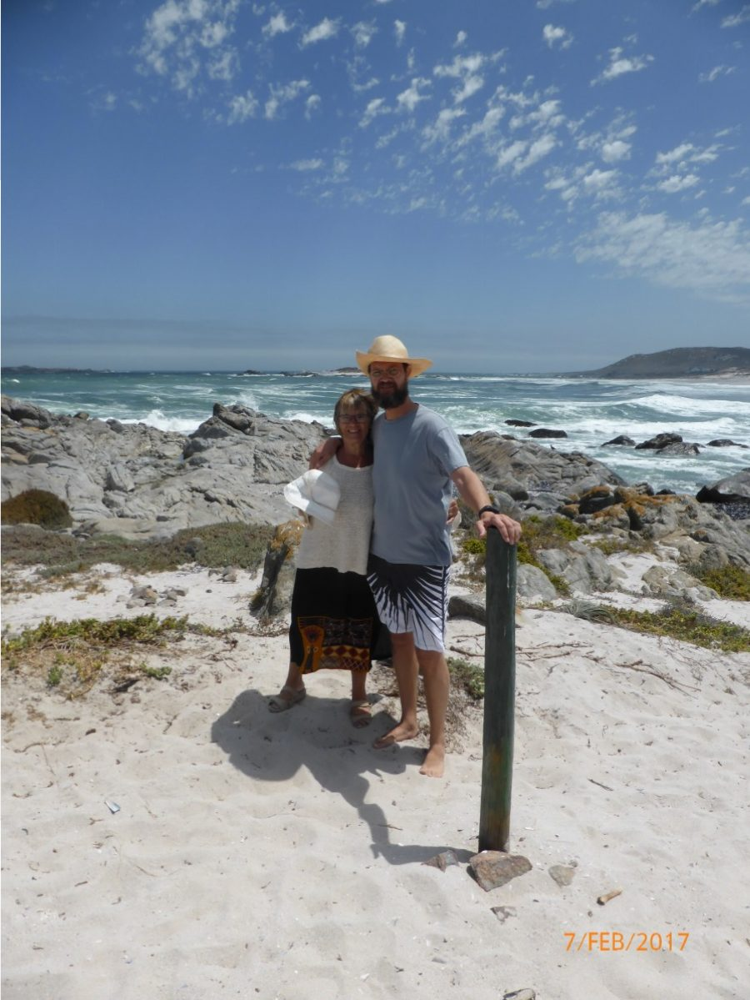
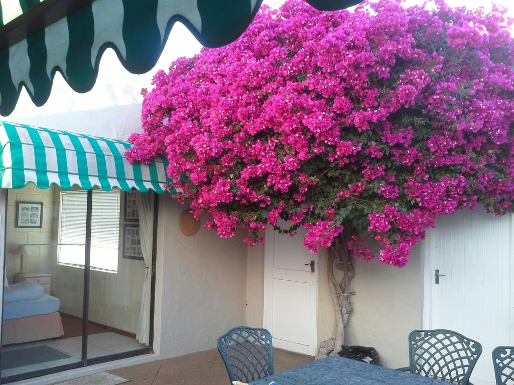
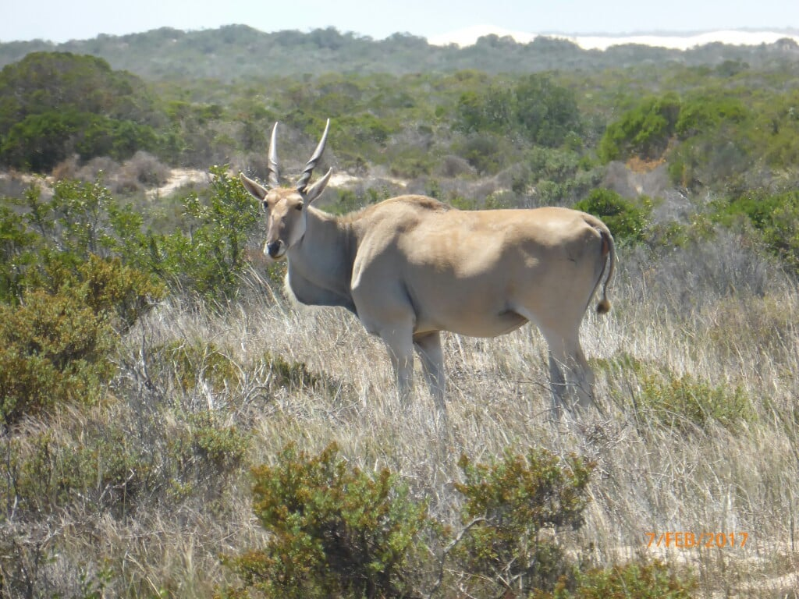
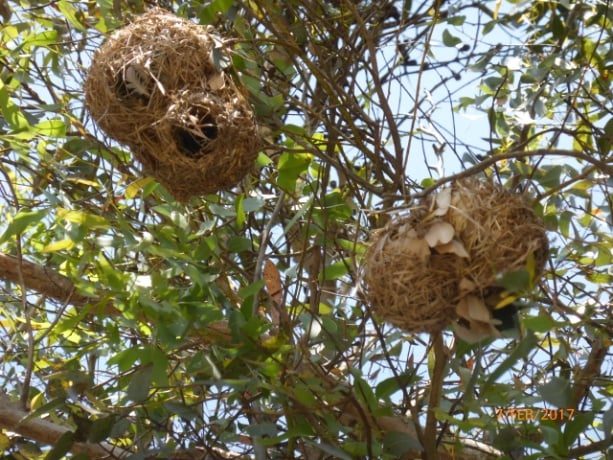
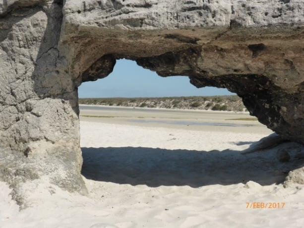
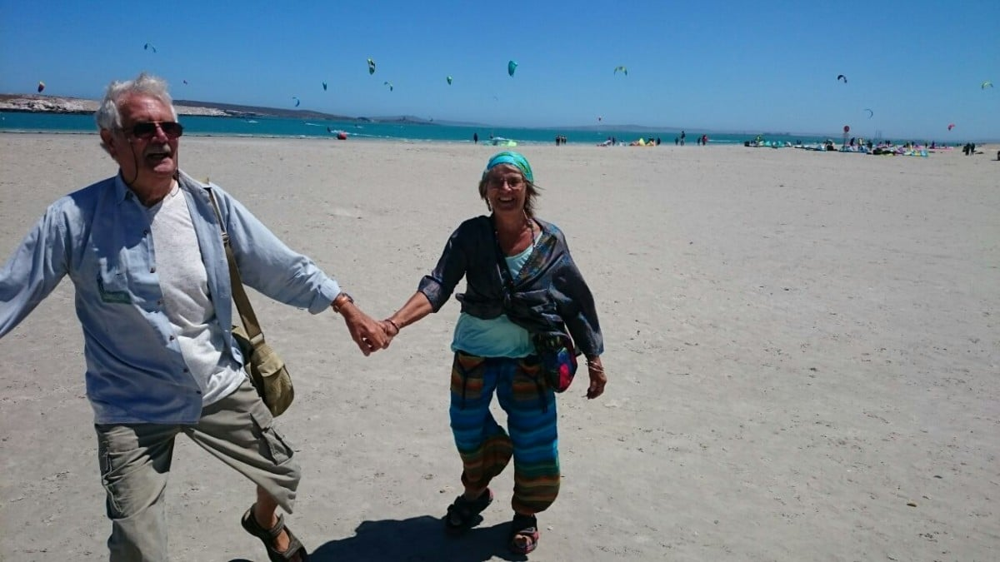
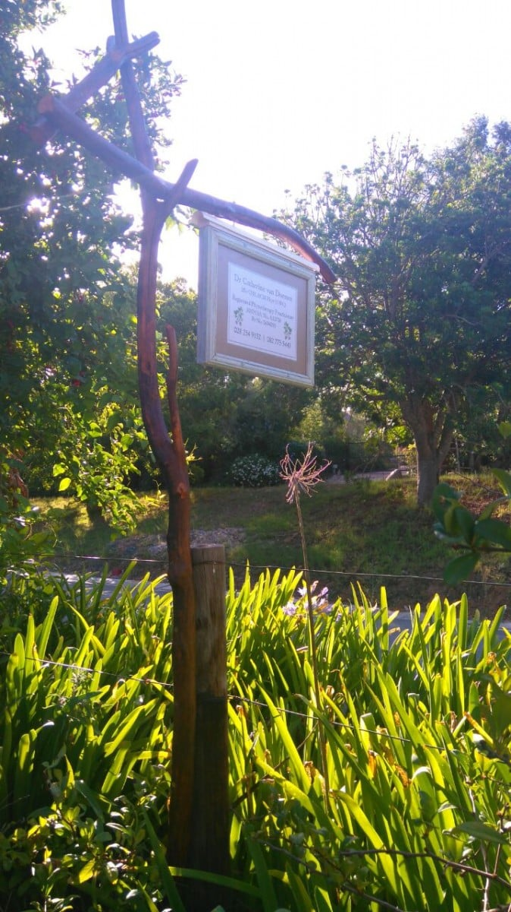

Four hours through mountain passes, across scrubland, past dried up river beds , lush lakes which in the present  drought conditions, still manage to retain water to supply towns......then to give our jolting bones  a break, a tarmac  road leading to Langabaan, our holiday destination. Catherine spent  much of her happy childhood here, canoeing on the beautiful lagoon, collecting winkles and mussels among the rocks, netting for langoustines , prawns and other crustaceans from a fishing boat, with her siblings. Her grandparents bought the property, a five bedroomed holiday home many years ago, to accommodate the whole family on fun filled vacations. It has, and still is,  fulfilling its purpose . As the family has grown, Jenny, an aunt, has bought an adjacent property, so cousins with their partners, all water sport lovers can spend time here. The town has grown , housing a yacht club, some shops, restaurants, and a sailing centre.​​​

\[caption width="900" id="attachment\_766" align="alignnone"\] Tsars Bank\[/caption\]

We arrived early evening, and our first duty, at Catherine's bequest was to baptize our toes in the lagoon water. Pity to smudge the radiance of the turquoise , but the sensation was an aperitif to a deeper submergence on the morrow. Luxury ! We now had our own bedrooms with en suites , so less tripping over each other. ...and a dish washer.The most beautiful bougainvillea shades the courtyard between our rooms

​

​

.

Next day we packed a picnic and headed for a sheltered beach bordering a game reserve. We're now experienced game and bird seekers. All eyes and ears..... What one misses another spots! Dan we first on the ball when he narrowly missed driving over a baby tortoise whose mum had crossed the track, having omitted to teach her offspring to stop look and listen. This is the first time I've seen a tortoise run! It's legs seemed to elongate and it was so tiny. Then it stopped. I could swear I could see it panting in fear. All was well .... it joined mum and was hugged after a smacked bottom. ​

​ After more viewings...  a group of Elan, a large antelope, not often seen close up, magnificent muscular creatures;  ostriches crossing our path, also needing traffic education, and other wild life venturing out of their hidey holes.  We enjoyed coffee and cake in a delightful rustic setting which had visited on our previous time here but still marvelled at its uniqueness. Above our heads weaver birds had woven their nests.... what an appropriate name ! Such clever little birds... The skill and intricacy that went into the weaving is incredible. In fact since being  so close to nature here has made us appreciate so much more, the wonder and intelligence of all creatures. ​

After a linger, we settled on a remote boulder shaded spot on the beach. ..... though apart from sea birds not another soul was in sight. We picnicked on mini cheese and bacon pies, salad, cheese, biscuits and the inevitable bread and jam! ....We know how to picnic!  The water was calm, letting us float and swim, which after the initial dunk was warm and refreshing. A visiting seal joined us. . but not too close, I hasten to add. . Apart from a lost camera case, a perfect day.​

In spite of some strong winds, I walked the shore each day, sometimes with sketch pad, book or just watching. Boats being launched and ' un-launched'. With the huge gusts, we witnessed some very skilful handling of craft, and also some very chancy moves. The more mature sailors, very experienced fishers, but now hampered by lack of agility skills (mainly due to the copious bellies of good living), to carry out necessary manoeuvrers, but against what we thought against all the odds, they managed even if a bit bruised!

​

Further into the lagoon the  windsurfers gave us hours of entertainment. The high jumps and acrobatic turns in the air promoted more ahhs and oohs from us than a French firework display.The kites dancing , twisting and turning in their aerobatic colourful display against a brilliant blue back drop . Why don't they get tangled? A family visit livened up our Wednesday. A dip in the local water, proved even more exhilarating than the last. Being buffeted in chilly waves was"such fun, darling!

Mike had to have his usual holiday medical mishap....  this time a dentist.... He now knows not to eat the nut shells in his muesli  ...and of course it had to be on a Saturday. A Monday 4 o'clock appointment.  .. broken tooth was extracted by 4 05.. and home again by 4 15 ..... Take note France !. After almost completing our challenge of the week....the longest crossword in the world...over 6 metres long in concertina'd book form, now crossword addicts, we headed back to Greyton, via 2  nights with the family.

​

We are now spending our last few days locally and maybe a visit to Betty's Bay

Loads of tablet problems, so will say au revoir before I  go crazy!!!

Hope to see you very soon

Maureen & Mike

xxx
