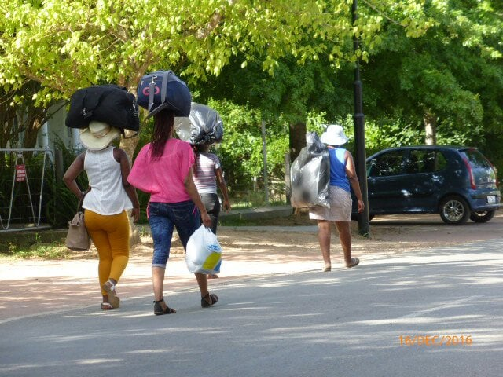
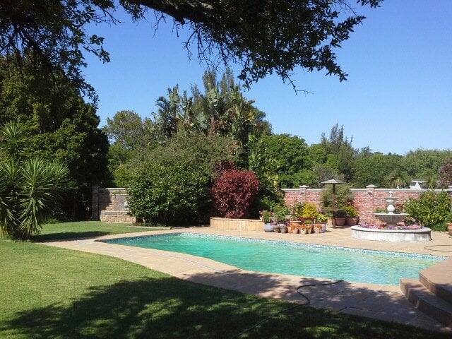
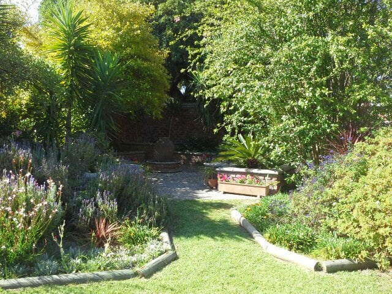
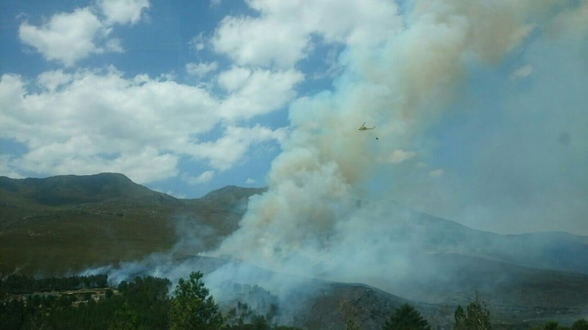
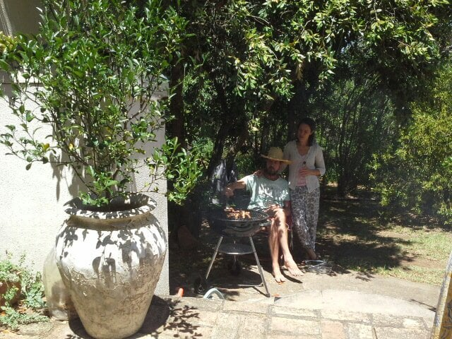
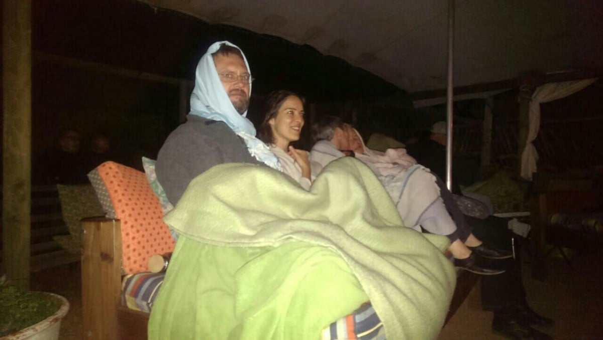
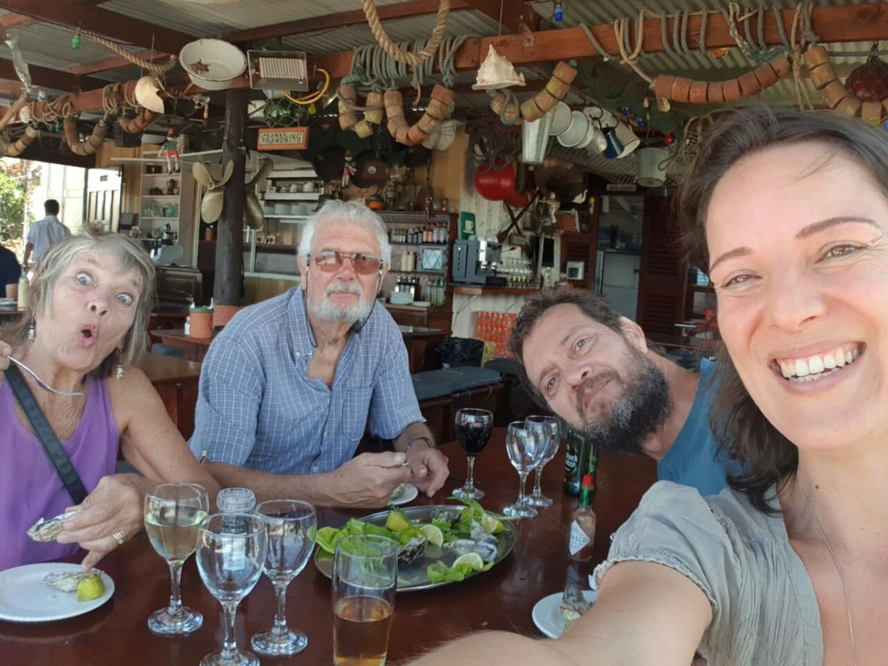

Greyton is a small village in the Western Cape, tucked against the mountains of Overberg. A town where everything is within walking distance using tree lined, dirt or tarred roads.

The pace is slow, people friendly with horses free to roam, except on Saturday mornings when they give rides from the market, a horse and' chariot' act as a taxi. The heart of the village boasts restaurants, coffee cafes,charity shops , boutiques (bring and buy good quality clothes), and unusual gift shops. Thanks to the strict building code, the Cape vernacular architectural style has largely been preserved.

We arrived at this little piece of heaven on Thursday 17th January, after two nights with Catherine's parents in Constancia, Cape Town

. We had a long trip , leaving from Bordeaux at 6 am, to Amsterdam then on to Cape Town. In all ,15 hours air borne , of which the last 10 were bumpy, maybe pot holes in the clouds!!! Perhaps some ' road repairs' needed up there too! A very welcome and relaxing 2 days including eating at a night food market with a couple of our generation entertaining with some great bluesy music.Driving the coast route to Greyton we saw smoke . Yet another mountain fire! Close enough , we witnessed the dowsing of the flames.

Just another day in the lives of these brave helicopter firemen.

Friday had cooler temperatures followed by some much needed rain. Just right for climatising ourselves! Daniel and Catherine have worked so hard since our last visit. We now have our own bedroom and Catherine a new consulting room. The Saturday morning market has been re built after it was gutted in a fire last year. It's lost some of its 'rusticness'(is this a word? ) But much more efficient for the stall holders. Apart from that the town still retains its charm and quirkiness. The same faces and smiles greeted us ,and the coffee still as good.

My birthday lunch was a braii, on the 'stoop', followed by fruit crumble with candles on.

Managed to blow them all out with one puff too.At the backpackers' Lodge in the evening we were treated to a fantastic musical evening. A married couple who had so much talent, great rapport with each other and the audience, an amazing repertoire of songs and music, delivered with emotion and feeling, ending with the most fantastic drumming I have ever witnessed. I will never forget that evening. We had food cooked round a brazier as the night was cold, wrapped in blankets supplied by the hosts.

I will never forget that evening.

The weather has remained cool apart for a predicted very hot day in Greyton, when we decided on a shopping trip, for hardware and building materials, to Hermanus, a large town on the coast, where it was cooler. After lunch on the Harbor wall,

more trudging found shops. ...bought myself some acrylic paints. ... We had tea and cake by a tidal river. We'd all taken our swimmers, but didn't take the plunge.

A bit of sad news for those of you who knew 'Whacky' Jacky and Mike, our friends for 20 years in Bertric Buree.Mike passed away last week just months after the loss of Jacky. They returned to England and were living in Norfolk. We'll never forget the fun we had with them

Now been here a week and much cooler today, so going to paint base of the Shepherd's hut, ready for construction whilst sun is hiding.

Love from us to you

M n M x
