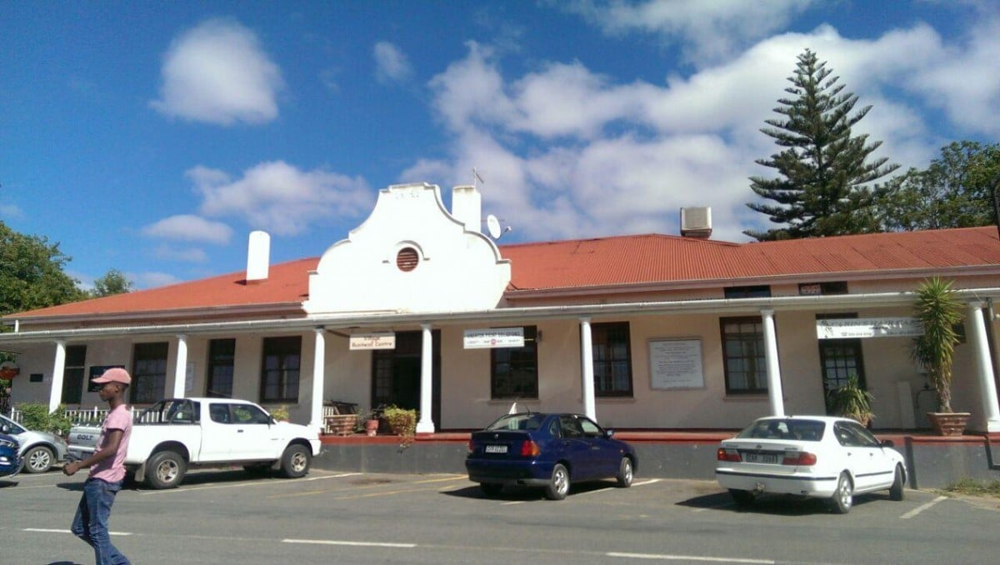
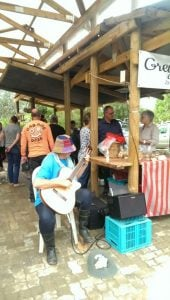
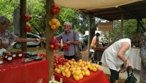
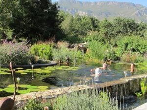
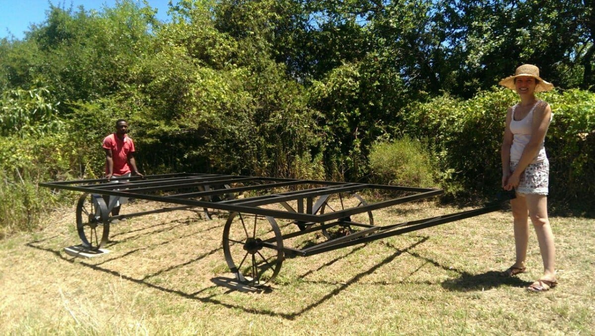
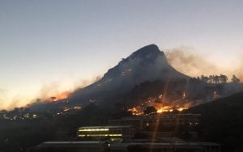
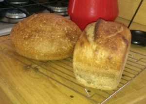

 It has been so easy settling in and wandering locally. Not much has changed, except perhaps the market place, as mentioned in my last blog, and meeting some new acquaintances of Dan and Catherine. It's about a 1/2km walk to the market. People come from as far as Cape Town to shop here on a Saturday morning. All happy, smiley folk, so friendly and ready for a chat. The main street is crisscrossed with shoppers, horses clopping along, wagging tailed dogs waiting for a titbit, all of these being avoided by the traffic meandering through town.

The usual market stalls glowing in their new surroundings. A classical guitarist whose magical chords permeate and enhance the already "good to be here" ambience;  Fresh locally grown vegetables inviting you to buy; tempting homemade products; jams, cakes, pickles, and  delicious pies wafting their tastiness to our nostrils; coffee, tea, pancakes and other mouth-watering nibbles to tantalise the taste buds; Our favourite duck and cherry pies still being made for our Saturday lunch ..... mmmm!  We were surprised that so many people recognized us. I wonder why? More artists boasting some original ideas, willing to share their thoughts and methods. A neighbour, Brian, greeted us and invited us for an afternoon swim.  
The previous day, Mike was lounging in the middle of the 'pasture'.... the lower part of the garden, when Brian yelled to him that a huge snake was heading across our land. It was a Cobra .....not the most welcome of visitors on a sunny afternoon, or any other time come to that!  Its head was ginormous with a body length of about 2 metres. It disappeared heading towards the mountains. Catherine checked it out. Rather her than me!!! Finding no local movement she assured us all was well but to keep an eye open! A snake catcher can be called if one chooses to lodge near your home.

Later in the afternoon when the temperature had dropped to a bearable level, we emerged from the cottage for a much looked forward to dip. The pool, a large pond, is complete with water lilies, frogs and other 'pondibles', so advisable to keep mouth shut whilst swimming. Strings of frog spawn, like beaded necklaces, adorned the rocky edges of the water. I was expecting to emerge draped in these ‘jewels’. Heavenly soft, refreshing mountain water tumbles from a beautifully designed yet authentic waterfall.... a bit of a paradox.... but I guess you'll get my meaning](https://www.artamo.click/wp-content/uploads/2019/02/IMG_4361.jpg)  
We had to imbibe in aperitifs, of course, chatting so much we needed to keep well lubricated. Entertainment was laid on in the form of three hounds, one of which a new puppy from the local rescue centre, who do a marvellous job of repairing and housing the unfortunate animals. One was a Boerboel with an abundance of excess skin, sporting the hugest paws ever. At just 6 months old, he still has a lot of growing to do, so could potentially compete with the ponies in giving children's rides at the market. The other, a year old 'something or other' puppy, was smaller, wiry with boundless energy. Along with their original dog, much mischief could be made. Luckily we only had to stumble across the meadow, home and timed it just as supper was ready! Thank you to Mandy and Brian for sharing their pool and fun company with us.

Desmond, Dan and Catherine's 'manpower' helped move the newly painted shepherd's hut to its permanent position so the building can begin. 

Today I decided to find a spot to paint. The, as yet unused, garage was just the place. Out of the sun with a beautiful, tranquil view. Joop, a retired artist who lives next door had already given Dan and Catherine an easel for me, with an interesting history, which I'm yet to find out. He has made some fantastic paintings, mainly in Holland, and I'm hoping some of this talent will emit from the easel. This morning I sorted through his art shed with him and acquired a table and more acrylic paints. I found a piece of wood for a palette. Before Dan and Catherine bought 'Columba', their cottage, he rented it as his art space. I'm so lucky to have on hand advice as acrylics are relatively new to me, my challenge being a metre wide painting for Dan and Catherine's bedroom. Plenty of messing about to keep me quiet for a while!  
Have now planned ‘A field of poppies’ the painting’s subject…. At this stage, it looks more like ‘after the tsunami. Perhaps the easel’s magic hasn’t started yet! Another catastrophe, the acrylic paints are indeed oil paints! Dilemma…..Do I get more materials for oil or ask Joop for acrylics. I'll have a little ponder!

Monday brought news of more horrific fires. This time in a favourite tourist part of Cape Town. Thanks to the expertise and bravery of the wonderful firemen it was relatively soon brought under control. For those of you who know Cape Town, much of Lion’s Head and Sea Point were partly destroyed. Allegedly Cape Town has suffered the worst drought for 100 years.

A heavy stormy atmosphere for several hours was quenched Wednesday night by some very welcome heavy downpours, continuing through Thursday.

I'll finish on that note and help myself to Dan’s newly baked bread plastered with fig jam. Can’'t escape the figs here either !!!!!

With love MnM xx

