\[caption id="attachment\_1078" align="aligncenter" width="700"\][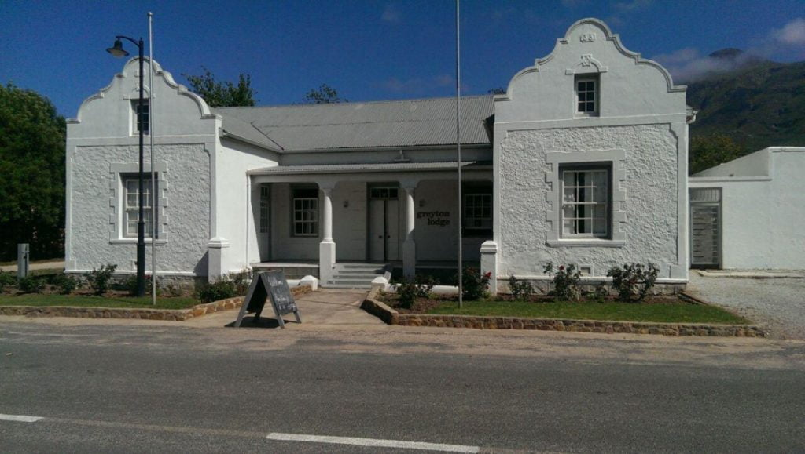](https://www.artamo.click/wp-content/uploads/2019/02/photo_2019-02-11_11-31-28.jpg) Greyton Lodge\[/caption\]

Walking around Greyton most days, we are now seeing and absorbing the true essence of the town. 'Our' cottage, 'Columba', is about 3/4 along Park Straat (Park Street) which runs the length of the town leading to a hikers'paradise, Greyton Nature Reserve. The reserve lies on the steep southern slopes of the Riviersonderend (get your tongue around  that!) Mountains forming part of the Cape Folded Belt. It homes much wildlife including baboons which may occasionally wander into gardens in hope of some tasty morsel, so secure dustbin lids! Within, a choice of walks is displayed from which you can choose according to your ability, energy or challengability (a mo-ism). One of its several mountain pools serve as a swimming hole, to where locals walk from some distance to plunge into the mountain freshness.

\[caption id="attachment\_1086" align="aligncenter" width="394"\][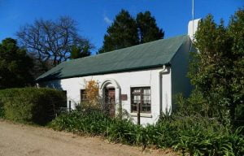](https://www.artamo.click/wp-content/uploads/2019/02/01-55-57-Park-St-Columba-cottage-from-the-road.jpg) Columba\[/caption\] \[caption id="attachment\_1098" align="aligncenter" width="394"\][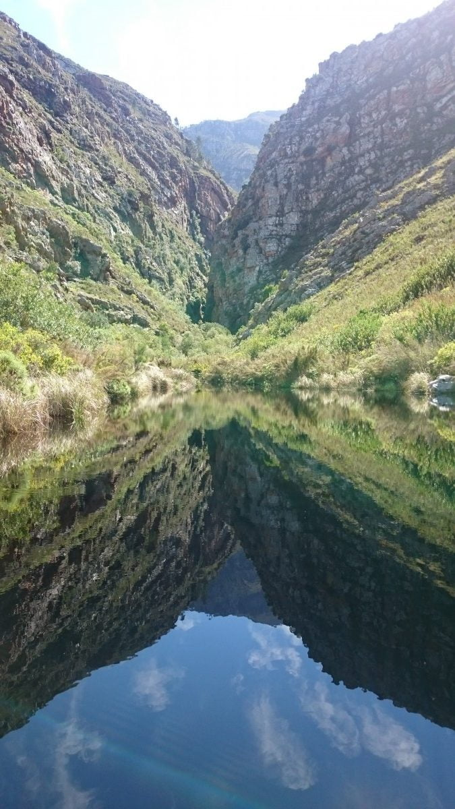](https://www.artamo.click/wp-content/uploads/2019/02/2016.09.25_11.16.08-e1549962747556.jpg) Nature Reserve - The Kloof\[/caption\]

Another area to explore is along the river, where we have swum several times when there's enough water. This borders the south of the town. We have picnicked on the mountain above this river, entailing a very tricky 4x4 drive which put Dan's driving skills and our nerves to the test, before experiencing the wonderful bird's eye view of Greyton in the sunset.

\[caption id="attachment\_1087" align="aligncenter" width="700"\][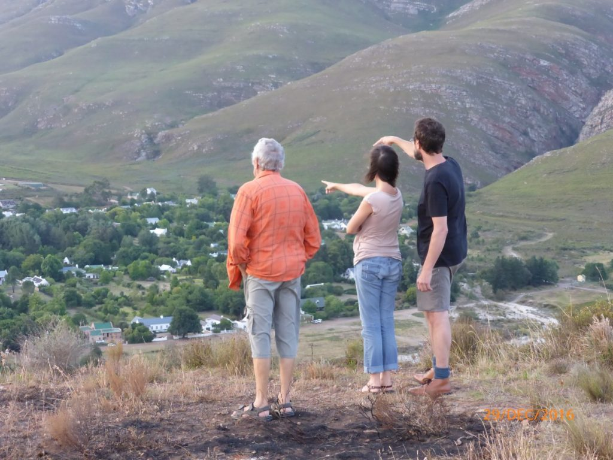](https://www.artamo.click/wp-content/uploads/2019/02/20170106_0002.jpg) Sunset Point - Greyton\[/caption\]

Another favourite walk before the sun scorches, is into the village, where we have coffee and perhaps toast with cheese and jam (worth a try if you haven't) or a home made scone or cake. One morning the newly baked shortbread that usually accompanies our coffee was missing. How disappointing ...just as we were leaving, the owner came out and thrust the newly bakes into our hands ..."they were still in the oven". The next day we were given double. Then another demonstration of kindness ... After losing my much-needed sunglasses, I retraced my route to no avail. Two days later, a local news message that Catherine subscribes to, revealed my loss. They were found in the general store.

\[caption id="attachment\_1073" align="aligncenter" width="300"\][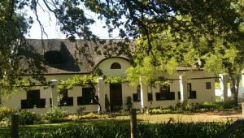](https://www.artamo.click/wp-content/uploads/2019/02/photo_2019-02-11_11-30-49.jpg) Thatched roofed cottage\[/caption\]

Greyton's population is multi faceted with a disarray of inhabitants and homes, each of which is unique in character, style and size. (inhabitants and homes !!!) Most buildings have corrugated tin roofs (like Columba above), usual in South Africa.....luckily not many cats to dance on them on a hot day!!!!! Some have impressive thatch whilst a minute few have tiles.

There are large spacious houses; architect designed homes of all sizes with their manicured gardens kept immaculate by the local workforce; new builds still growing; small rustic cottages, such as 'ours', their gardens a random but organized wilderness. Whatever, they all have to conform to the town's planning regulations. It's amongst the latter that some eccentricity is displayed.

\[caption id="attachment\_1079" align="alignleft" width="170"\][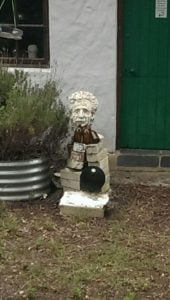](https://www.artamo.click/wp-content/uploads/2019/02/photo_2019-02-11_11-31-33.jpg) Sculpture of a head\[/caption\] \[caption id="attachment\_1081" align="alignleft" width="225"\][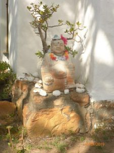](https://www.artamo.click/wp-content/uploads/2019/02/photo_2019-02-11_11-31-47.jpg) Buddha\[/caption\] \[caption id="attachment\_1075" align="alignleft" width="170"\][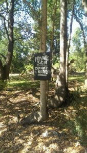](https://www.artamo.click/wp-content/uploads/2019/02/photo_2019-02-11_11-31-06.jpg) Please do not read\[/caption\]

This morning's meander took us towards the nature reserve past a cottage whose front door is 'guarded' by a sculpture of a head. I have seen this several times and noticed each time a few empty (I believe) beer bottles standing next to it. Are these offerings ?....or just a thirsty head? We turned the corner and Mike was 'accosted' by the owner of this cottage. "I need to tell you that your vest label is showing!" He obviously found vest labels offensive! He backed up this statement with some humorous stories including one of another vest label, where on a run he failed to catch the runner in front to inform him of this' maldress' (a mo ism) causing him much distress !!! A label phobia eh ?  This warmed us to this unusual character.  
Meeting him later at a bar in town, he invited home for drinks....a lovable rogue with a past methink, so we're looking forward to more of his tales. We then encountered a Buddha sitting on a doorstep. He had no evidence of a liking for alcohol, but displayed a funny look. Was he smiling or grimacing?  
  
Further along the road a tree stump glared at us, complete with eye make up and lipstick ! Has Dali walked this route? Next, a small board announced "Private notice. Please do not read".

\[caption id="attachment\_1072" align="aligncenter" width="700"\][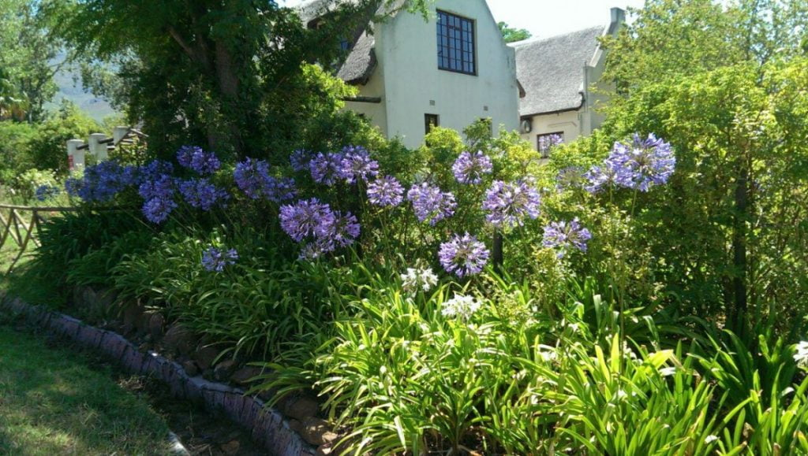](https://www.artamo.click/wp-content/uploads/2019/02/photo_2019-02-11_11-30-40.jpg) Agapanthus\[/caption\] \[caption id="attachment\_1074" align="aligncenter" width="700"\][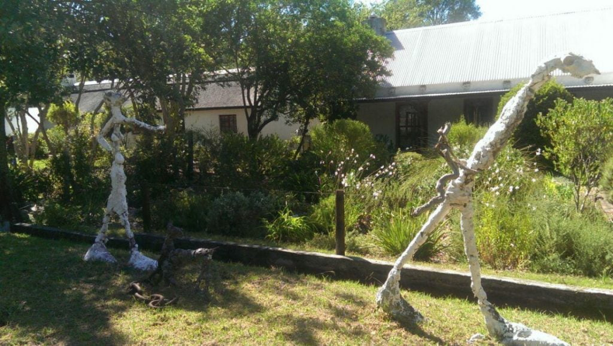](https://www.artamo.click/wp-content/uploads/2019/02/photo_2019-02-11_11-30-56.jpg) Giacometti-esque\[/caption\]

We continued 'round the block' turning right onto the main road where Giacometti has left his footprint! Two leggie figures and a dog. My camera's having a fun day!..... then right again towards home along a beautifully blue bordered street of Agapanthus. What a pleasant stroll!!!!!

The weekend brought cooler temperatures and some rainfall. Our prayer mats must be worn out and our requests for outside eating weather were not obliged. Furniture was moved into the bedroom, so we could house 15 guests in the lounge to celebrate Dan and Catherine's 10th anniversary. Wendy and Joe arrived complete with table, chairs, crockery, glasses and an anniversary gift of cutlery. It was almost as though the party was imported from Constantia. A few permutations later, the tables were arranged to comfortably seat 13 people. Unfortunately two of their friends were unable to come, but fortunate in that we did not have to sit on another's laps!

\[caption id="attachment\_1090" align="aligncenter" width="700"\][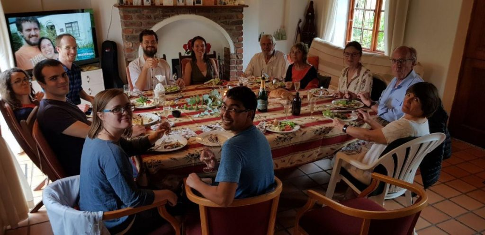](https://www.artamo.click/wp-content/uploads/2019/02/10th-group.jpg) Lunch\[/caption\] \[caption id="attachment\_1091" align="aligncenter" width="700"\][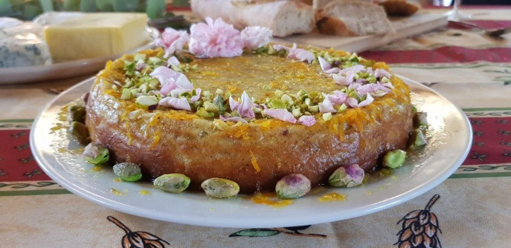](https://www.artamo.click/wp-content/uploads/2019/02/cake.jpg) Cake\[/caption\] \[caption id="attachment\_1092" align="aligncenter" width="700"\][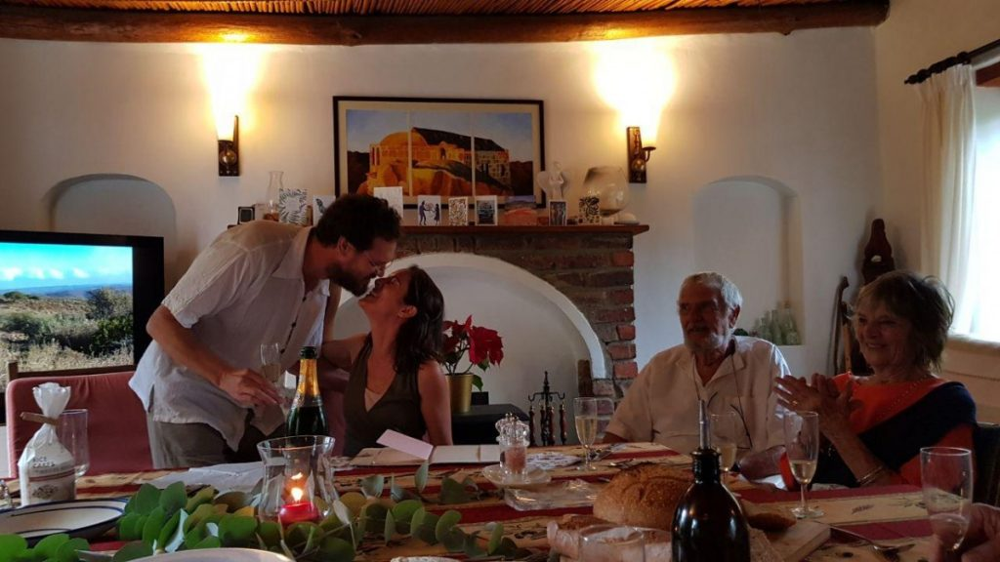](https://www.artamo.click/wp-content/uploads/2019/02/kiss.jpg) Kiss\[/caption\]

The party comprised Catherine's parents and her siblings with partners, two friends, and us. The simple, but delicious meal was chicken accompanied by salads, a cheese board and a vegan dish for David and Jennifer. Catherine had made an amazing, delicately tasty, Persian love cake, decorated with pistachio nuts and rose petals collected from a neighbour's garden that morning. The celebration started with a bang or two as champagne corks' exploded. Lots of banter and laughter followed culminating in the happy couple's speeches, which being so sincere, yet witty and funny, brought tears to the outlaws' (a name given to both sets of parents) eyes! Some of us walked in the now very light rain whist some just chatted. The family then put the cottage back to normal and departed with all the dirty dishes and glasses from whence they came to be dealt with in Chorley's dishwasher.

\[caption id="attachment\_1085" align="aligncenter" width="700"\][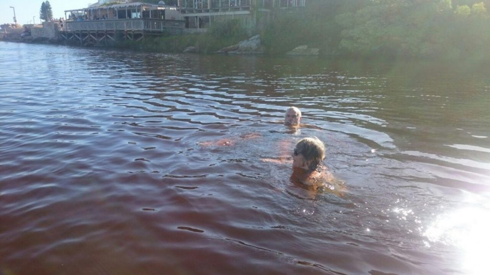](https://www.artamo.click/wp-content/uploads/2019/02/photo_2019-02-11_11-32-25.jpg) Onrus river (nr. Hermanus)\[/caption\]

Thursday very high temperatures were forecast for Greyton, so that afternoon was good for the weekly shop in Hermanus an hour away on the cool coast. I went to the art shop for more supplies, ...discount for being old too....we did the supermarket essentials and then needed to cool off. What better than an ice cream ...first one this year and a swim in the confluence of river and sea.  
Wonderful .....  
So on that note "Bye"  
Just to add 3 days of rain now...walked to village in it this morning bliss !!  
With love

MnMxx
