\[caption id="attachment\_1127" align="alignleft" width="170"\][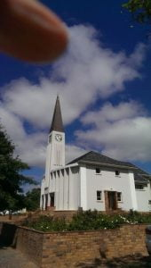](https://www.artamo.click/wp-content/uploads/2019/02/photo_2019-02-19_09-24-12.jpg) Greyton\[/caption\]

Monday 11th found us on our way to Constantia, accepting Wendy and Joe's open invitation to stay any time, leaving Dan and Catherine to their own devices. So some fun time for the 'outlaws'!! We arrived mid-afternoon, to a much cooler temperature. A hot cup of tea welcomed us. After a lovely fish supper with the family, the evening of nattering soon passed. A chilly night, we needed our long pants and sweaters.

Tuesday, the two of us drove into Cape Town. Firstly wandering around Loop Street and Long Street. The latter is a major street located in the City Bowl section of Cape Town. It is famous as a once Bohemian hang out, the street  lined with many book stores, various ethnic restaurants and bars. Long Street exhibits a diversified culture and attracts tourists from all over the world.

Architecturally it is noted for its Victorian buildings with wrought iron balconies. It boasts a lively clothes and craft's market. A fantastic atmosphere! We had coffee. Needing the loo I was directed to the side door with stairs that led to the top of this splendid old building, a bit precarious en route. Then guess who got lost? Going down too many stairs I found myself in the basement with some jolly, singing ladies scrubbing the floor and cleaning strips of brass work. They pointed me in the right (?) direction. I was then in the dustbin room. More than smelly! Totally confused, I found a chap on the stairs, who with his bundle of keys, guided me to a grid which he unlocked onto the outside pavement. By that time I needed to go again!!!  Mike then went the same route and had no problem returning ... Who's a clever boy then?!!

\[caption id="attachment\_1147" align="aligncenter" width="700"\][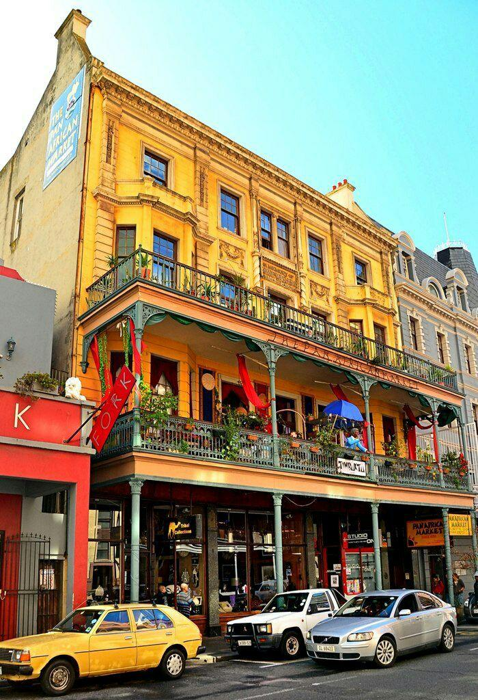](https://www.artamo.click/wp-content/uploads/2019/02/photo_2019-02-19_16-53-45.jpg) Long Street\[/caption\]

Lunch in an outside cafe was accompanied by a couple of toothless buskers. It seems a lot of men are missing teeth here. Saves dentist bills I suppose.

\[caption id="attachment\_1117" align="aligncenter" width="1024"\][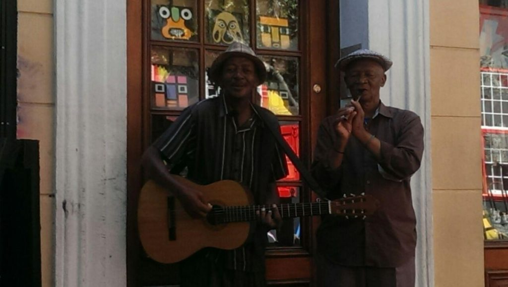](https://www.artamo.click/wp-content/uploads/2019/02/photo_2019-02-19_09-14-09.jpg) Long Street, Cape Town\[/caption\]

\[caption id="attachment\_1120" align="alignright" width="170"\][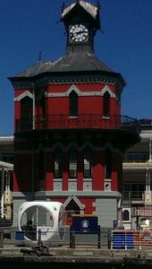](https://www.artamo.click/wp-content/uploads/2019/02/photo_2019-02-19_09-14-21.jpg) Clock Tower, Waterfront, Cape Town\[/caption\]

My Moroccan couscous lacked spices and had no tangy sauce. Mike's ostrich burger was enveloped in a dry wrap, although meat was tasty. A good job the beers were liquid. Just to complete this dehydrated lunch, we shared the cigarette smoke of 2 chain smokers on the next table!! Won't recommend this place! We moved on to the Waterfront which is still as awesome as ever.  To beautifully dressed  shops, art galleries, clothes and more crafts, but not for my purse. Incidentally this elephant is created from beads threaded by hand.

\[caption id="attachment\_1124" align="aligncenter" width="1024"\][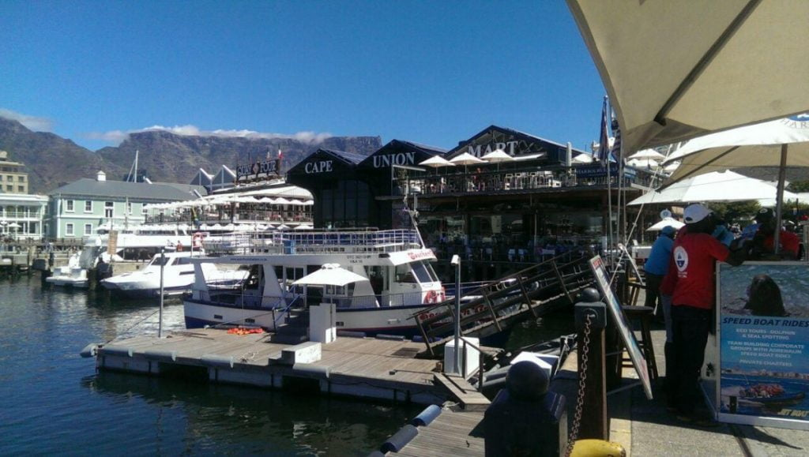](https://www.artamo.click/wp-content/uploads/2019/02/photo_2019-02-19_09-14-36.jpg) Waterfront, Cape Town (Table Mountain in background)\[/caption\]

\[caption id="attachment\_1121" align="aligncenter" width="1024"\][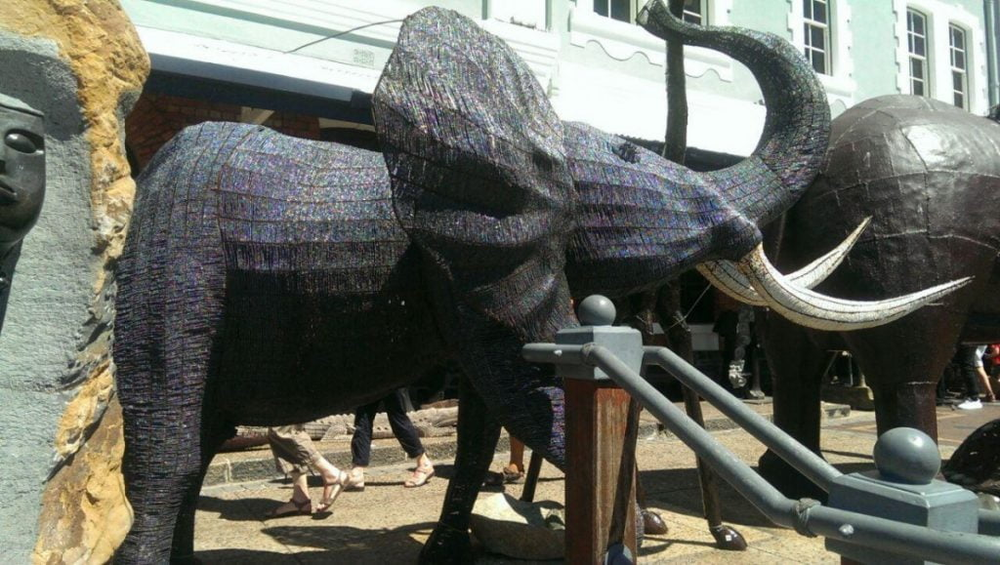](https://www.artamo.click/wp-content/uploads/2019/02/photo_2019-02-19_09-14-25.jpg) Waterfront, Cape Town\[/caption\]

After an ice cream and freshly squeezed orange juice, our poor feet were protesting, so set off for Chorley before the traffic. Or so we thought !!!

For some legitimate reason there were lots of scheduled power cuts...both in Greyton and Cape Town, so that really messed up the traffic lights, and consequently, caused chaos on motor routes. It took an hour and a quarter to move 5 kilometres. The clever folk who knew the tricks were swapping lanes in a bizarre fashion ...totally perplexing for us tourists. After two hours we arrived 'home', normally a 20-minute journey. A welcome cuppa (yet another) and a plunge in the pool, followed by a Chinese take away, (a rare treat for us), with the family. I'm not sure if it was the best Chinese meal we'd ever had or whether we had forgotten what  takeaways tasted like! Thank you for your kindness Joe and Wendy.

\[caption id="attachment\_1119" align="aligncenter" width="1024"\][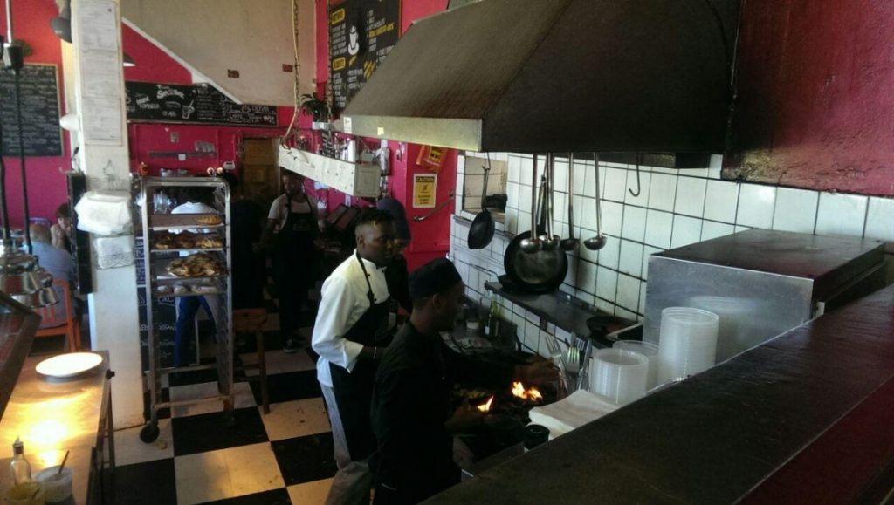](https://www.artamo.click/wp-content/uploads/2019/02/photo_2019-02-19_09-14-17.jpg) Olympia Cafe, Kalk Bay\[/caption\]

\[caption id="attachment\_493" align="aligncenter" width="1024"\][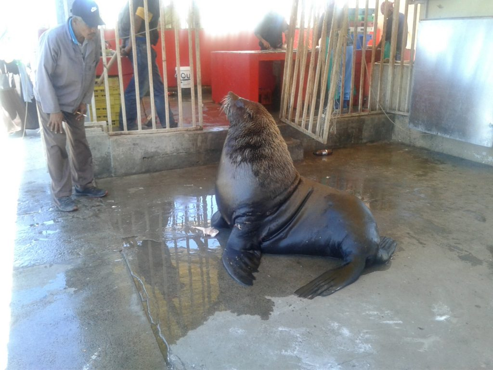](https://www.artamo.click/wp-content/uploads/2016/12/wp-1480753850668.jpg) Resident seal, Kalk Bay\[/caption\]

\[caption id="attachment\_1136" align="alignleft" width="288"\] Mongoose\[/caption\]

\[caption id="attachment\_697" align="alignleft" width="288"\][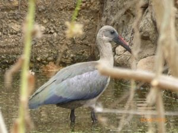](https://www.artamo.click/wp-content/uploads/2017/01/20170106_0015.jpg) The hadada or hadeda ibis (Bostrychia hagedash)\[/caption\]

Before returning to Greyton the next day, we just had to visit Kalk Bay, one of our favourite haunts along the Cape Town coast. It has everything we love, from cinnamon toast with coffee to our favourite clothes' shop. I have to buy something here each visit to S A.  Inflation has taken its toll, so we just bought one item of clothing each ...me a replica of the now worn out pants I bought a few years ago and Mike some linen trousers. Then along to the first restaurant 'Olympia' visited on our first and subsequent visits. A cheerful sea facing cafe, which cooks its own bread 'at the back';  flame throwing in the kitchen, producing delicious food. After a tasty fish linguini and a beer, we wandered to the sea front fish market to buy some freshly caught fish for supper.  Fish, displayed on the pavement, gutted to requirements, the remains thrown to open-mouthed seals who come out of the sea for their lunch. After an uneventful drive back to Greyton we were welcomed by yet another cuppa, now acquiring the English custom. Mike had a nod in the lounge, Dan and Catherine went to meditate, so I relaxed with a book under a tree beside the stoep. After some while, I closed the book and had ' time to sit and stare '. A train of hadedas entertained me by the dam, which for some reason, may be an unblocked spring, was slowly filling with water.  Let's hope it continues as it could benefit the much bereft plants and trees.  A noise from behind, distracted me. I turned to see a head appear from under the car...not a snake as I first thought. It was furry. A paw (another clue) followed, clasping something and some foil too. Had it a packed lunch?  The body then emerged, long and black followed by a bushy tail. It ran under the shed door. A squirrel like creature, but too big! With nap and meditation over, I  related my tale to the family. The shed door was carefully opened. But nothing!  A bag of  foil wrapped chicken bones, waiting for the morrow's bin crew, was also missing. Catherine allayed our ignorance. It was a mongoose, indigenous to South Africa.

\[caption id="attachment\_719" align="alignleft" width="398"\][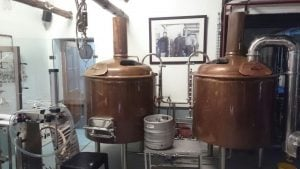](https://www.artamo.click/wp-content/uploads/2017/01/img_20170106_190515.jpg) Old Potters Inn, Greyton\[/caption\]

\[caption id="attachment\_1112" align="alignleft" width="300"\][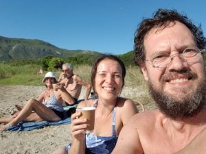](https://www.artamo.click/wp-content/uploads/2019/02/photo_2019-02-19_09-13-20.jpg) Onrus Beach, near Hermanus\[/caption\]

After a month here, the weeks are now beginning to have some optional routine, apart from reading, writing, painting or walking (sometimes all four) each day, we have a laundry day, (no ironing, unless absolutely necessary); Wednesday, Greyton local food market with half price breakfasts, of which we haven't yet participated; Wednesday evening; half price beer at Potter's bar which we definitely have; it seems half the town meet here! Must be to boost mid week; Thursday food shopping in Hermanus with swim afterwards; Friday welcomes a live musical evening from 5 to 8 pm hosted at Greyton Lodge, with accompanying snack and a drink; Saturday morning Greyton market which we haven't missed yet. This morning we met a couple of environmentalists from Mozambique. They, with their 2 children visit Greyton for 5 months of the year (affectionately called 'Swallows'). Such interesting folk, whom we'll see again next week, and who knows, maybe a future stay in their nature reserve where they protect not only the wild life, but the neighbouring villagers too. We then enrolled to be notified of events, mainly for us golden oldies, of which there are many and varied (both). Just finished a lovely Sunday roast, a Catherine special. Time to stop writing, choose and insert photos before publication. (This is where the fun starts!!)

\[caption id="attachment\_1080" align="alignleft" width="225"\][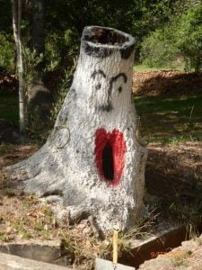](https://www.artamo.click/wp-content/uploads/2019/02/photo_2019-02-11_11-31-40.jpg) 'Dali ism' omitted from last blog\[/caption\]

With love MnM xxx
