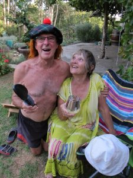

\[caption id="attachment\_1125" align="aligncenter" width="1024"\] Hello from South Africa\[/caption\]

**Thank you** for reading and sending your comments and emails. I love the contact and it makes writing the blog worthwhile. So sorry for this delay. We have been living with Mother Nature who does not facilitate technology!

These delightful children are from a small kindergarten just across the road from us. Out for a morning walk, with their cheerful carer, they were only too happy to oblige with this sunny photo, climbing over each other to make sure they were in the front! The last time I met them was on a walk in a very scarce fall of rain, all singing "It's raining, it's pouring, the old man's snoring" of course I just had to join in, much to their amusement!!!

\[caption id="attachment\_1157" align="aligncenter" width="1024"\] Masterpiece for the master bedroom\[/caption\]

This week sees all the last month's designing, planning, locating and exacting measuring put into action. Firstly, purchasing the wood. How I hate wood yards!!! Tuesday, Mike and Catherine did the window frame buying in Caledon, about a 20 minute drive. Thursday, I accompanied them to Somerset West for the main load. My role was to be dropped off at Woolworth's to get the weekly shop. Here Woolworth's is a reliable supermarket, which has links with Marks and Spencers so carries that guarantee of excellence. It was a 90 minute drive through mountain passes. After visiting a small place with immediate service, we drove on to a major yard to collect the rest. Having been in the car for more than 2 hours, I decided to have a nose around. What a place! The epitome of efficiency, organisation and above all friendliness. Such happy folk. No wonder such a well run place where the workers sang as they shifted huge planks or sheets of wood from their storage to customers' vehicles. We were attended to straight away with instructions as to which bay and in what order to pick up. I was intrigued and surprised.

\[caption id="attachment\_1181" align="aligncenter" width="1024"\] Loaded up and ready to roll\[/caption\]

Perhaps I don't hate all wood yards! Catherine was asked to reverse, the one thing she dreaded with a huge trailer in tow, but being who she is, managed it with ease.

Then we were attacked by hunger pangs, well past our lunch time so, leaving the loaded trailer at the wood-yard headed to Woolworths, to eat in their cafe, very nice too! After a relatively small shop we headed off home with Mike at the wheel, as could be a precarious drive. Having previously experienced one breakdown on a mountain pass pulling the trailer, it was decided to take the coastal route adding an extra 45 minutes to the trip. Although windy and bumpy in places, Mike kept the load in control. With beautiful sea views, it was worth the detour. The next day, after evicting me from my studio, Mike commenced on securing the garage for future tools and wood storage. Happy to say, I had finished painting in time.

\[caption id="attachment\_1155" align="aligncenter" width="1024"\] Attie finishing the garage wall\[/caption\]

Two local lads, Desmond and friend, unloaded the wood into my once studio which has now become a storage bay. To keep the wood secure and enable the storage of tools, Mike made a door frame, fitted the door and started to build an adjoining wall, which today is being completed by Attie, another worker.

\[caption id="attachment\_1159" align="alignleft" width="170"\] Sauerkraut making\[/caption\]

As a child, I remember being woken on Sunday mornings to the smell of bacon and eggs being cooked for breakfast! It was my dad's answer as to how to get his four daughters out of bed at a reasonable hour. Weren't we the lucky ones?  Here, I often awake to the smell of Dan's bread cooking in the oven and can't wait to have the crunchy doorstep with jam. Loaves are made 2 or 3 times a week and some of it is frozen. The neighbours sometimes benefit from a freshly baked loaf too. He is also now an expert on making sauerkraut, which requires a special pot and must be left for at least couple of weeks. He has assured us that this food is highly nutritious and far superior to the shop brands. We should be glowing with health especially with the wine accompaniments.

I am a well known visitor to the charity shops where there's many a bargain to be had, a lively chat with like-minded folk, and rarely come home empty handed. This week I spotted a large looking dress from which I decided I could make a long skirt. Tried my bargain on at home, and found that with needle and cotton I could modify it to fit me as a dress. Made a head band too. All for 40 rand (3 euros). I wonder what the 'Long Tall Sally' donor would think if if she saw her converted dress on 'Meeny Miny Mo'!

\[caption id="attachment\_1114" align="aligncenter" width="300"\] Evening's pastime\[/caption\]

 

\[caption id="attachment\_1154" align="aligncenter" width="170"\] Long tall Mo!!!\[/caption\]

Catherine's parents have kindly given us their time-share of a week in Port Alfred, on the Indian Ocean coast about an 8 or 9 hour eastward trip. We leave tomorrow morning for a mid-journey campsite on a river in a nature reserve. Dan and Catherine will take a tent, whilst us oldies will have the luxury of a cabin. We will stay there 3 days before continuing to the chalet. We are all so looking forward to it. This evening we will pond dip and aperitif with Brian and Mandy.

At the request of Nola, here are their crazy dogs I mentioned in an earlier blog,  Brian serving drinks and Mike looking good.

\[caption id="attachment\_1168" align="aligncenter" width="170"\] Mike looking good\[/caption\]

\[caption id="attachment\_1179" align="aligncenter" width="225"\] Brian looking good\[/caption\]

 

\[caption id="attachment\_1161" align="aligncenter" width="225"\] Ice\[/caption\]

\[caption id="attachment\_1160" align="aligncenter" width="300"\] Thandi\[/caption\]

\[caption id="attachment\_1156" align="aligncenter" width="170"\] Thuli\[/caption\]

\[caption id="attachment\_1158" align="aligncenter" width="170"\] Another patient\[/caption\]

 

Also, so we are all here, one of Catherine treating a very nervous patient with a cut finger!!!

All for now until next time.

With love MnM xxxxx
