## "Quelles Catastrophes" - Port Alfred

 

\[caption id="attachment\_1254" align="alignleft" width="300"\][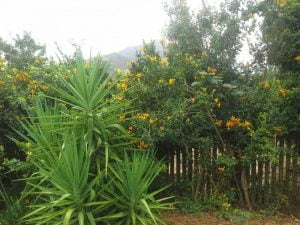](https://www.artamo.click/wp-content/uploads/2019/03/photo_2019-03-17_14-50-20.jpg) Leaving Greyton -  - autumn's arriving\[/caption\]

\[caption id="attachment\_1255" align="alignleft" width="300"\][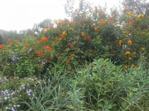](https://www.artamo.click/wp-content/uploads/2019/03/photo_2019-03-17_14-51-25.jpg) After the Agapanthus - the colourful honeysuckle!\[/caption\]

A rainy start, after all the beautiful weather of recent weeks. Loaded to the gunnels we set off for our holiday in a clean, newly valeted car. We took the gravel back roads before joining the major route. Mistake! Moving aside to allow a large farm vehicle to pass, it rewarded us by revving through a deep puddle, consequently giving us a mud bath; windows and glass roof were smothered. An hour later the sun baked it to a hard crust..... X-Trail pie!! On arrival at a planned rustic restaurant to meet friends, we found they had no electricity, so a very limited menu. Is this a bad omen? However, the lunch they managed to conjure up was delicious, and the friends very interesting company too. So many towns, all with their own rustic or historical charm. With no further incidence, three hours later, we installed ourselves in a small tent and a 'Rondavel’ in ‘Ebb and Flow’ campsite next to a meandering river, amidst a National Park, where we were to stay for 3 days.

 

\[caption id="attachment\_1204" align="aligncenter" width="900"\][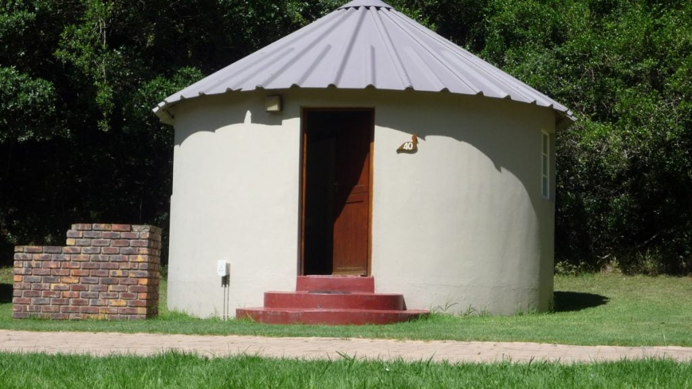](https://www.artamo.click/wp-content/uploads/2019/03/P1300029.jpg) A Rondaval   ..... no corners to dust and difficult for spiders to build their homes !!!\[/caption\]

Not just living with nature we became part of it! Mother Nature did not recognize technology here, just creatures and birds of the wild and like-minded campers. Bliss!!! Neither gift shop nor cafe to be seen!

\[caption id="attachment\_1201" align="alignright" width="335"\][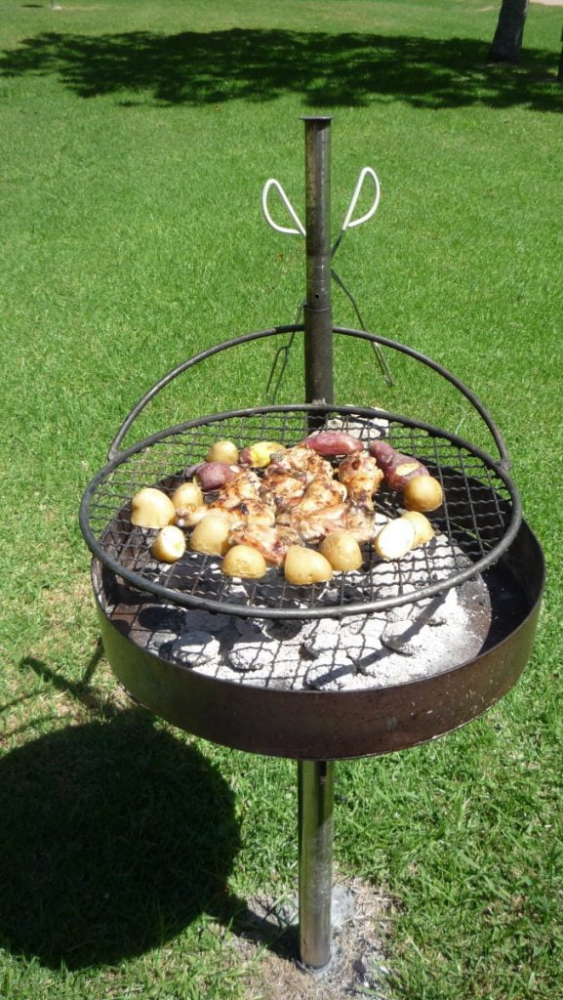](https://www.artamo.click/wp-content/uploads/2019/03/P1300025.jpg) Braai ...... nearly ready.....time for aperitifs !\[/caption\]

\[caption id="attachment\_1259" align="alignleft" width="429"\][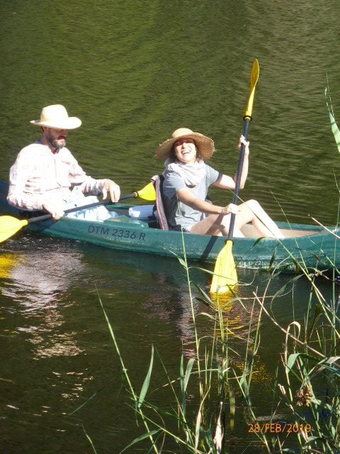](https://www.artamo.click/wp-content/uploads/2019/03/P1050627.jpg) Setting off up the river\[/caption\]

\[caption id="attachment\_1260" align="aligncenter" width="640"\][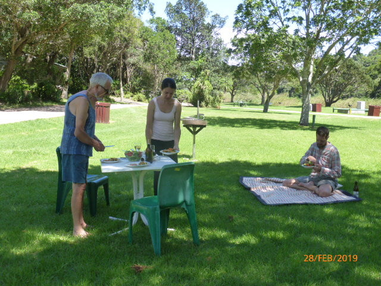](https://www.artamo.click/wp-content/uploads/2019/03/P1050632.jpg) First Braai at the site\[/caption\]

\[caption id="attachment\_1264" align="aligncenter" width="640"\][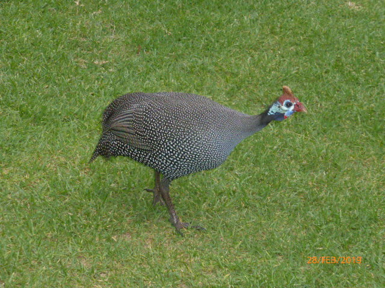](https://www.artamo.click/wp-content/uploads/2019/03/P1050639.jpg) Guinea Fowl coming to investigate our lunch !\[/caption\]

The weather was kind until departure day. At 4 am, the heavens opened once again, tipping its contents with forceful velocity. A rap on our door announced the arrival of 'Drip and Drop', our lad and lass from the tent. Not a good time to dismantle their home!!

Sunshine welcomed us to Port Alfred, an historical town on the Indian Ocean coast. Unfortunately, from our chalet (which was fantastic) the blue azure could not be seen. The steep boardwalks and steps to reach it made life difficult for Dan. It also hadn't recovered from its recent overhaul, with the suffocating smell of paint, finished only the previous day... we wondered why all the cupboards and windows were wide open on arrival! On Monday we moved. What a difference! All round sea and mountain views, near car park and swimming pool, so all was good. We could now relax and enjoy this lovely place. Mike and I swam in the mornings, if weather permitted. A family celebration around the pool, where braais were available for anyone to use, stretched into the late evening.  Their cheerful singing spontaneously developed into pure gospel singing ...all their voices in complete harmony. A joy to listen to. The coloureds and black folk are so uninhibited in expressing themselves.

\[caption id="attachment\_1274" align="aligncenter" width="936"\][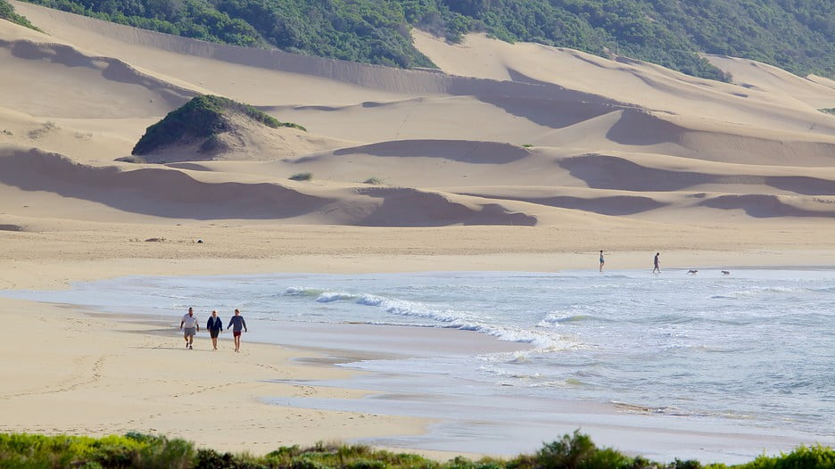](https://www.artamo.click/wp-content/uploads/2019/03/Port-Alfred-70481.jpg) Beach Port Alfred\[/caption\]

\[caption id="attachment\_1273" align="aligncenter" width="800"\][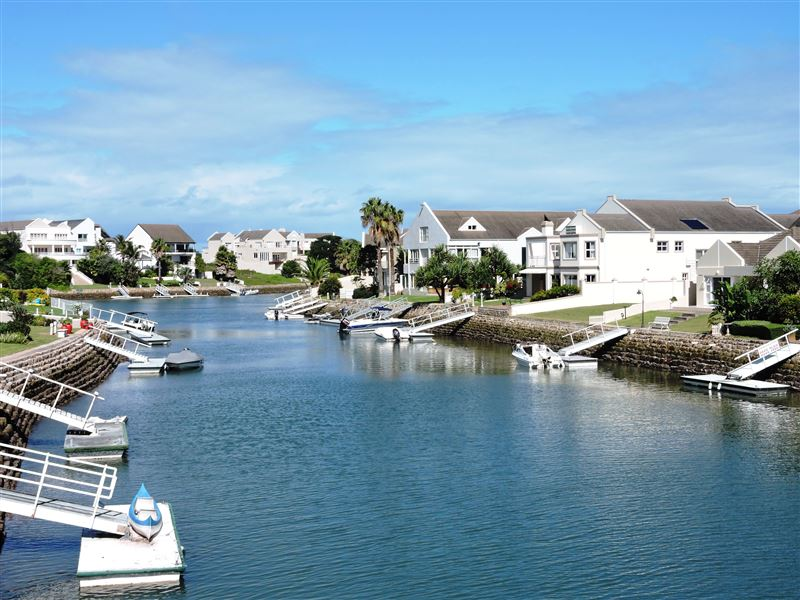](https://www.artamo.click/wp-content/uploads/2019/03/pariver.jpg) River Port Alfred, where we lunched on freshly caught hake and chips.\[/caption\]

 

\[caption id="attachment\_1268" align="alignright" width="410"\][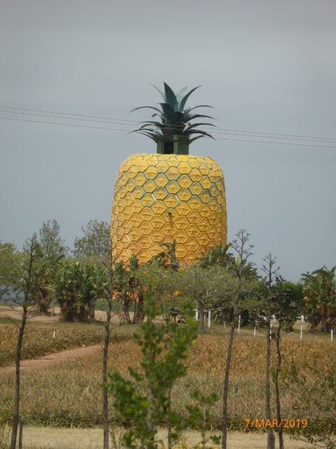](https://www.artamo.click/wp-content/uploads/2019/03/P1050681.jpg) Giant Pineapple\[/caption\]

Now there is just this monument to remind us. We were travelling to Bathurst, also renowned for having once been the pineapple capital of the world, where there are numerous craft and ethnic clothing shops ... a paradise to wander around. Coffee and toast in a delightful eclectic cafe, where there was so much to stimulate our senses, in both cultural and humorous ways, completed the morning.

\[caption id="attachment\_1267" align="alignleft" width="640"\][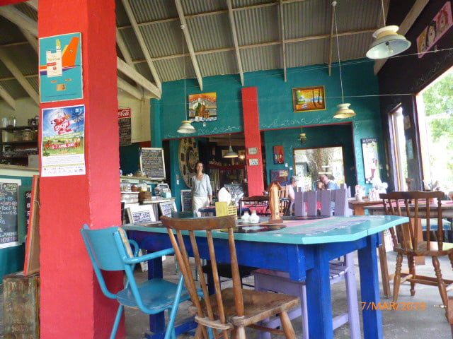](https://www.artamo.click/wp-content/uploads/2019/03/P1050665.jpg) Cafe to tantalize mind and taste buds !\[/caption\]

Along the harbour road housed well-established important businesses, like a small brewery, situated at the rear of a marvellous art gallery, where father and daughter exhibited quite different art styles. I was in heaven ....so much to learn from this talented and very approachable man. His web page is one that will be regularly frequented by me in the future A fresh vegetable  and fish shop, where we bought mussels, and a couple of tea rooms completed the line up.

Catherine visited  the museum here where she was further enlightened of the importance and history of this famous port.

\[caption id="attachment\_1229" align="aligncenter" width="1024"\][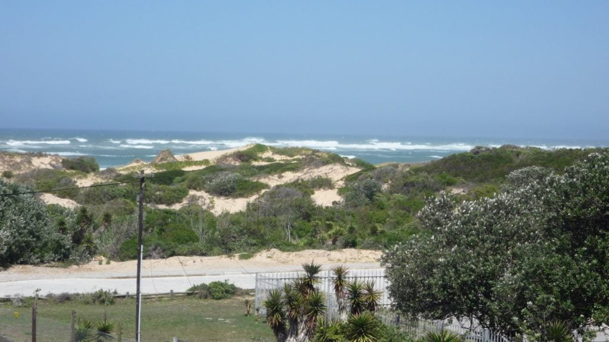](https://www.artamo.click/wp-content/uploads/2019/03/P1300061.jpg) Morning bliss\[/caption\]

\[caption id="attachment\_1227" align="alignleft" width="300"\][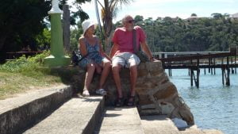](https://www.artamo.click/wp-content/uploads/2019/03/P1300056.jpg) After lunch Port Alfred\[/caption\]

No we couldn't! Mike became unwell with an upset stomach which worsened. Midnight found us at a government hospital just a few minutes away. "Private or otherwise?", we were asked. "Doesn’t matter" we replied. Ushered into a small cubicle the patient was seen to immediately and linked up to a saline drip to re hydrate. He looked very pale being the only white face there. I stayed and was given a rickety chair for my overnight stay. The air conditioning was full on and it was chilly to say the least. Dan’s fleece and a shirt kept Mike warm. I wandered outside to warm up in the night air. The waiting room was full of lots of rolled up bundles on benches and floor. This I supposed was night accommodation for the homeless. The doctor arrived at 5 am, after being on duty for 24 hours, and another drip was erected. At Mike’s insistence Dan came to collect me, so I could get some sleep. Just an hour later he was dismissed with medication for the following few days. All this for the pricely sum of 99 rand (6.50 euros). A quiet couple of days followed. The last of which invited more rain preceded by an evening light and sound extravaganza reverberating in the mountains.

[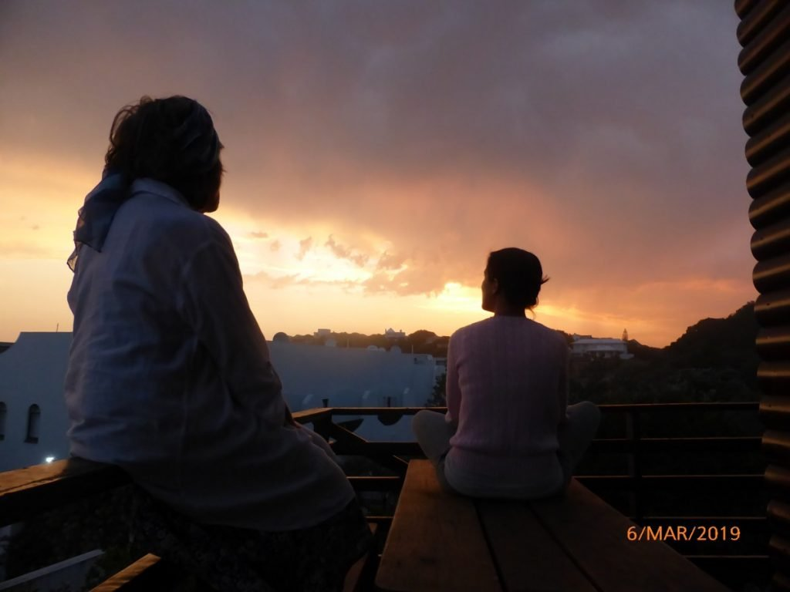](https://www.artamo.click/wp-content/uploads/2019/03/P1050647.jpg)Better than Bastille Day in Bergerac! We ate supper in complete darkness to appreciate nature’s wonderful phenomenon. Lady Luck had deserted us again making the car develop hiccoughs at the most inconvenient times, causing engine cut out, remedied by stopping, waiting and starting again. Nothing could be done in a local garage, so we had to limp on the two-day journey home.

\[caption id="attachment\_1230" align="alignright" width="600"\] Waiting for lightening\[/caption\]

Our overnight was at 'Storm's River' (couldn't be more appropriate!) in a delightful little cottage owned by an ancient man and his dog who wagged the way in. We enjoyed a doggy bag from a very generous lunch with some local chips around a blazing log fire (It was cold as well as wet now!), played some silly but hilarious word games, then retired for the night. Us oldies had the 'put u up' in front of the fire envisaging a good night's sleep before the morrow's journey.

\[caption id="attachment\_1238" align="aligncenter" width="829"\][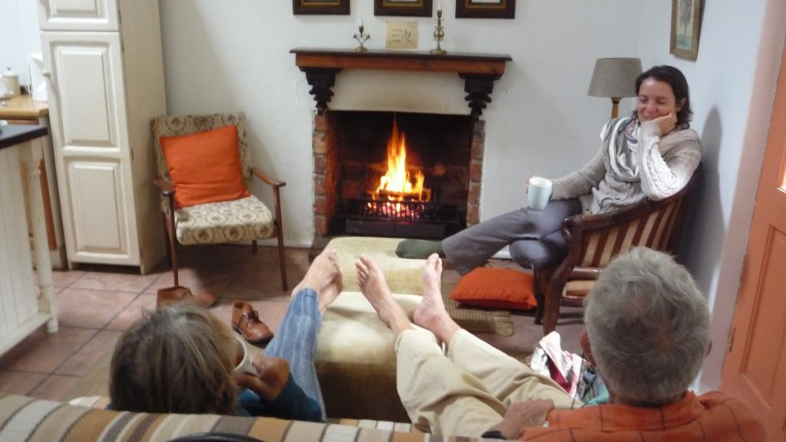](https://www.artamo.click/wp-content/uploads/2019/03/P1300074.jpg) Feet up! Arrival Storms River\[/caption\]

\[caption id="attachment\_1241" align="aligncenter" width="1024"\][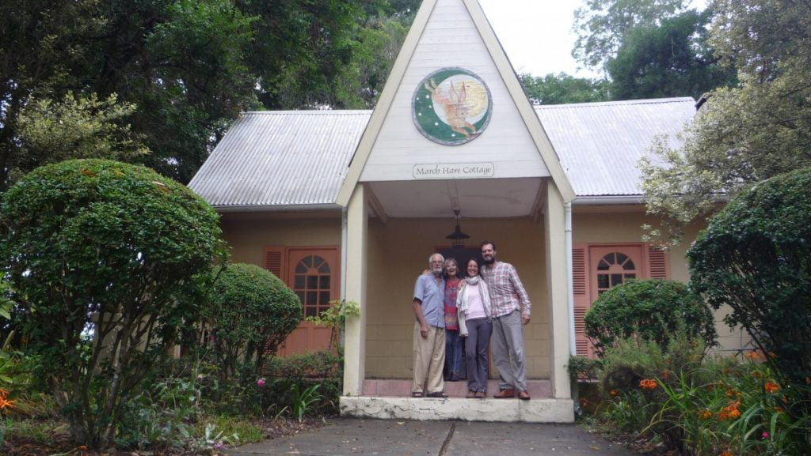](https://www.artamo.click/wp-content/uploads/2019/03/P1300077.jpg) Say sausages!\[/caption\]

But  oh no! Not to be had. A crash! I thought I had been catapulted into space! The bed had tipped its contents on the floor? Mike was trapped beside a wrought iron seat and I landed on top of him. Neither could move for laughing. Dan and Catherine whose bed was behind a screen in the same room were not perturbed. Dan just thought it was high frolics and Catherine slept through it all.

We repacked our wounded car and journeyed on. Next stop was a brilliant market at Sedgeville, where we had our second breakfast, delicious spinach omelettes, and bought some wraps for a picnic lunch. The sun was shining until we finally arrived home, when, after allowing us to unpack, a few weeks’ rainfall fell in minutes. After two days rain, (120mils.in 4 days), we returned to the challenge of building the Shepherd’s Hut.’ Nellie’, the car was checked out by a main dealer, something electronic fiddled with, and she smiles again.

Going to have coffee with an artist friend now.

Bye folks, until next excitement!!!

With love MnM xxx
