\[caption id="attachment\_1304" align="alignleft" width="170"\][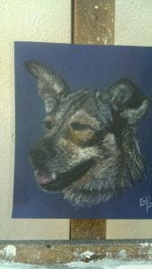](https://www.artamo.click/wp-content/uploads/2019/04/dog-1.jpg) Thuli\[/caption\]

\[caption id="attachment\_1305" align="alignleft" width="170"\][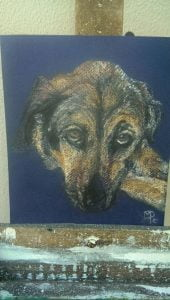](https://www.artamo.click/wp-content/uploads/2019/04/dog-2.jpg) Thandi (who sadly died just after this picture)\[/caption\]

\[caption id="attachment\_1311" align="alignleft" width="170"\][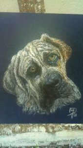](https://www.artamo.click/wp-content/uploads/2019/04/dog-3.jpg) Ice the pup\[/caption\]

It's two weeks since our return from Port Alfred. During this time we have enjoyed an Indonesian supper cooked by Henriette next door and a braai with Mandy and Brian. Henriette prepared a salad accompanied by a very moreish hot peanut sauce and toasted coconut. The evening was spent listening to illustrated stories of her and Joop's amazing life. In contrast, we were then invited to Mandy and Brian's for a South African stew cooked in a cauldron over a braai. From the trees hung lanterns creating eerie shapes and shadows so with the cauldron and their three large dogs wandering about completed this awesome atmosphere. We were eight and we jelled in such good company with lots of chatter and a laugh or two!!!

Just two weeks to assemble the Shepherd's Hut. Much has been achieved to get it to its present flat pack stage. Its site resembling an Ikea warehouse.  [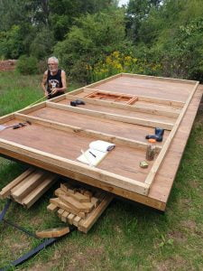](https://www.artamo.click/wp-content/uploads/2019/04/the-base.jpg)[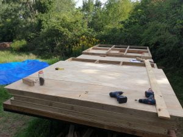](https://www.artamo.click/wp-content/uploads/2019/04/flat-pack.jpg)Successful assembly was now very weather dependent. Lady Luck frowned on us once again resulting in three days of rain, leaving only ten days to get the outer shell erected and water proofed. Mike, Dan and Catherine worked their butts off to achieve this. My contribution to this was wielding a paintbrush as per usual. I was head cook and bottle washer alongside trying to complete Mandy's three doggie paintings and another poppy picture to complement the previous one. This was also to be done outside as no room inside (as well as the smell of oils), having been evicted from my garage studio by the construction team.

\[caption id="attachment\_1307" align="aligncenter" width="1024"\][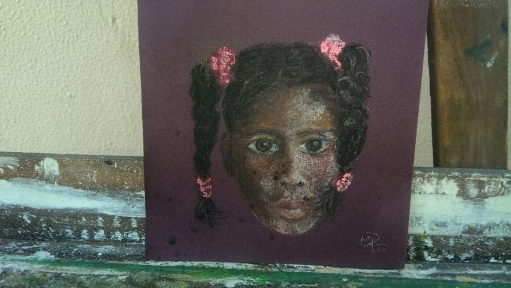](https://www.artamo.click/wp-content/uploads/2019/04/hair.jpg) My hairdresser's daughter\[/caption\]

\[caption id="attachment\_1287" align="aligncenter" width="1024"\][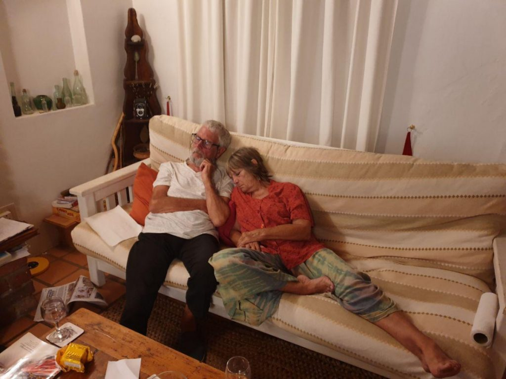](https://www.artamo.click/wp-content/uploads/2019/04/a-long-days-work.jpg) The end of the day!\[/caption\]

\[caption id="attachment\_1303" align="aligncenter" width="1024"\][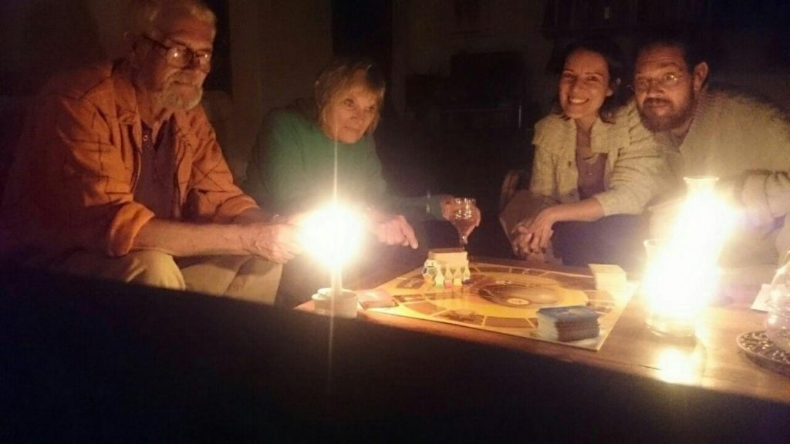](https://www.artamo.click/wp-content/uploads/2019/04/candle-games.jpg) Games by candlelight\[/caption\]

\[caption id="attachment\_1309" align="aligncenter" width="1024"\][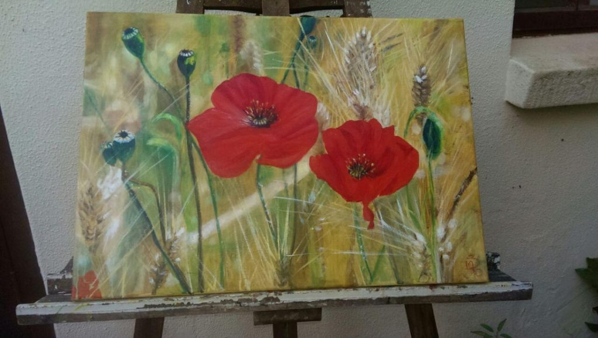](https://www.artamo.click/wp-content/uploads/2019/04/mo-paint.jpg) New art for the bedroom\[/caption\]

\[caption id="attachment\_1292" align="alignnone" width="1024"\][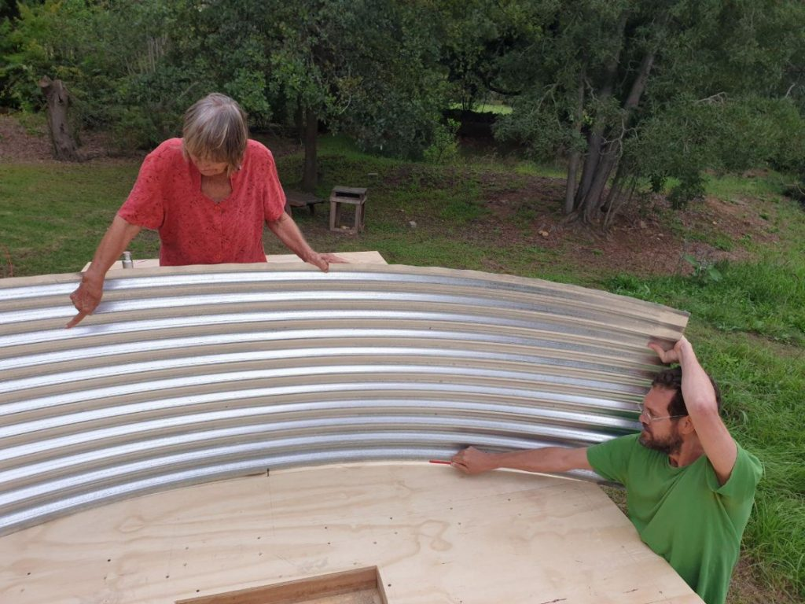](https://www.artamo.click/wp-content/uploads/2019/04/oof-marking.jpg) Drawing the curve to cut the roof\[/caption\]

\[caption id="attachment\_1289" align="aligncenter" width="1024"\][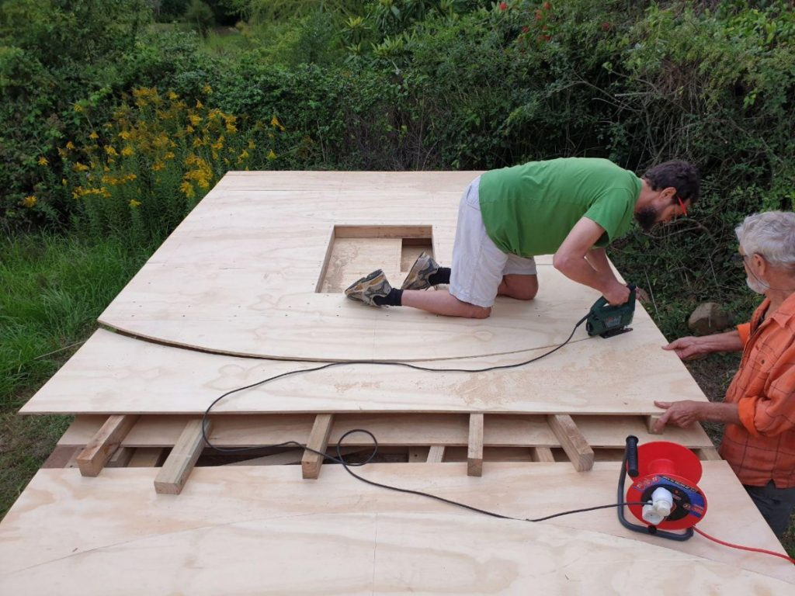](https://www.artamo.click/wp-content/uploads/2019/04/cutting-precision.jpg) Precision cutting -  the curvy roof\[/caption\]

\[caption id="attachment\_1294" align="aligncenter" width="1024"\] Walls going up\[/caption\]

[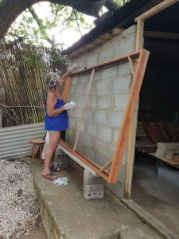](https://www.artamo.click/wp-content/uploads/2019/04/mo-paint.jpg)On the fourth day all set to go ....Oh no we weren't....because of some disputes beyond our control and understanding, we were then handicapped with organised 2 to 3 hour 'load shedding' (power cuts) two or three times a day at the most inconvenient times. Work had to be organised around these. Our evenings were candlelit with indoor games and early nights. Thank goodness for a gas hob!

Whilst immersed in my painting, an almighty crash made me grab my phone then dash down the garden, expecting to find at least one prostrate body. The neighbours had similar thoughts! Two sides of the cabin had been erected and a third was balancing, awaiting its turn. Wait, it did not, but crashed to the ground, narrowly missing Dan and Mike. Luckily, just shock and a graze or two. Two strong locals were employed for a couple of hours to help for the next stage.

 

\[caption id="attachment\_1310" align="aligncenter" width="1024"\][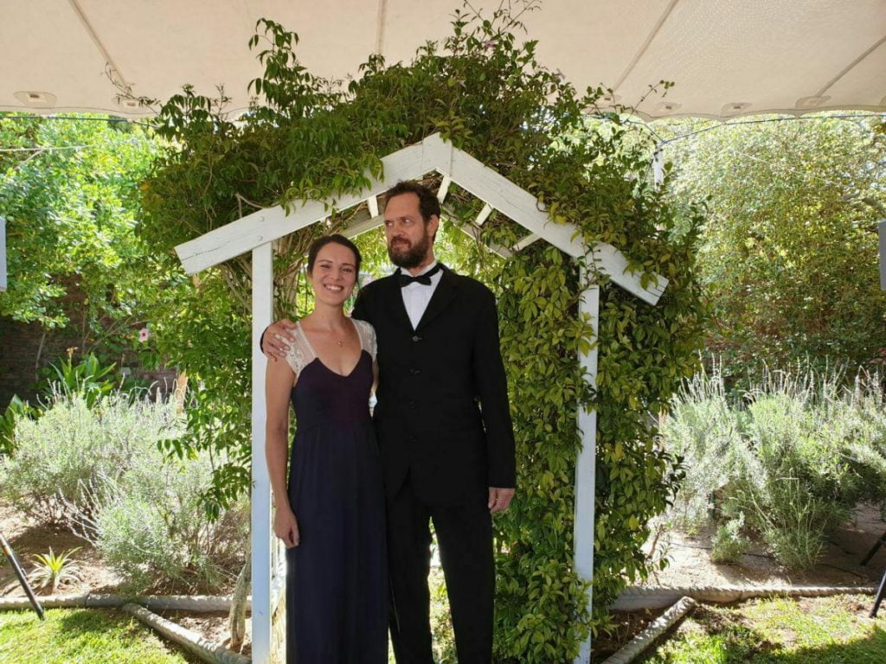](https://www.artamo.click/wp-content/uploads/2019/04/scrub-up.jpg) Don't they scrub up well?\[/caption\]

The weekend saw the youngsters off to a cousin's wedding in Cape Town leaving us to our own devices. So a Friday night out, to a local restaurant, entertained by a very talented singer and some Cajun food. Saturday night I cook Paella for Brian and Mandy. Not quite the same as in France as it is difficult to find fresh seafood here. This, alongside the boulangeries and our fantastic variety of cheeses are our biggest misses.

\[caption id="attachment\_1295" align="alignleft" width="189"\][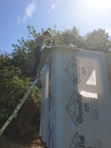](https://www.artamo.click/wp-content/uploads/2019/04/skinning.jpg) Aerobatic drilling\[/caption\]

Monday work on the cabin was resumed, but with one worker short as Dan was unwell and needed rest. This developed into full blown flu. Working like acrobatic beavers on a mission, the rest of the team achieved their aim. The stretching and balancing acts wielding power tools, performed by the two was a sight to be recorded.

 

The membrane was then in place, and waterproofed in time for us to leave for a week in Langebaan, staying in granddad's holiday home next to a beautiful lagoon on the west coast.

\[caption id="attachment\_1293" align="alignnone" width="1024"\][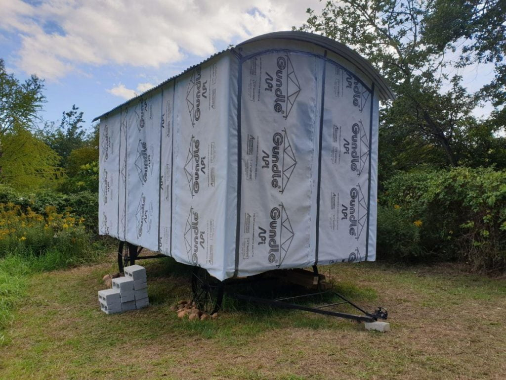](https://www.artamo.click/wp-content/uploads/2019/04/ready-for-windows-and-doors.jpg) Ready for windows and doors\[/caption\]

\[caption id="attachment\_1306" align="aligncenter" width="1024"\][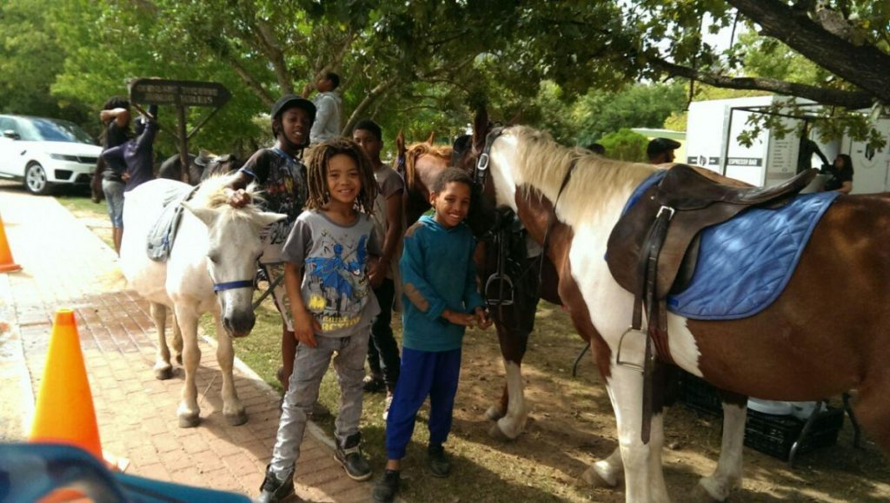](https://www.artamo.click/wp-content/uploads/2019/04/final.jpg) Children outside the Saturday market\[/caption\]

It was quite sad leaving now established friends in Greyton ..we'll be back.

## Langebaan

\[caption id="attachment\_1302" align="aligncenter" width="1024"\][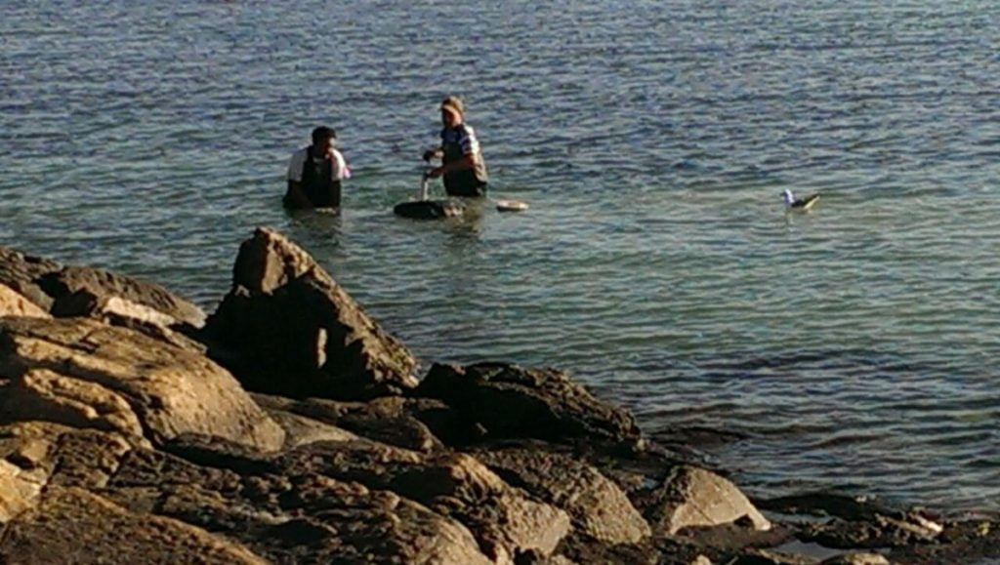](https://www.artamo.click/wp-content/uploads/2019/04/bait.jpg) Langebaan lagoon bait digging\[/caption\]

\[caption id="attachment\_1308" align="aligncenter" width="1024"\][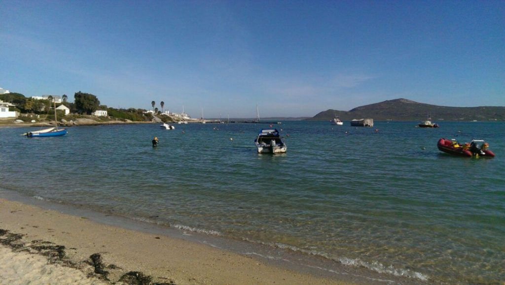](https://www.artamo.click/wp-content/uploads/2019/04/lagoon.jpg) Langebaan lagoon\[/caption\]

We dipped our toes in the turquoise blue water of the lagoon late afternoon on Sunday, just the start of many dips we'd hoped.....the jinx continues.... Catherine then succumbed to the bug, followed closely by Mike. Three bed ridden, suffering holidaymakers and me....Nurse Nightingale!!! Today is Wednesday....all still very much under the weather. I will finish this blog now and take a paddle in the rock pools, find a nice perch to sit and contemplate. So much beauty to see.

Bye all..... back in France on 12th April. Look forward to your visits 'chez nous' With love MnM xxx
