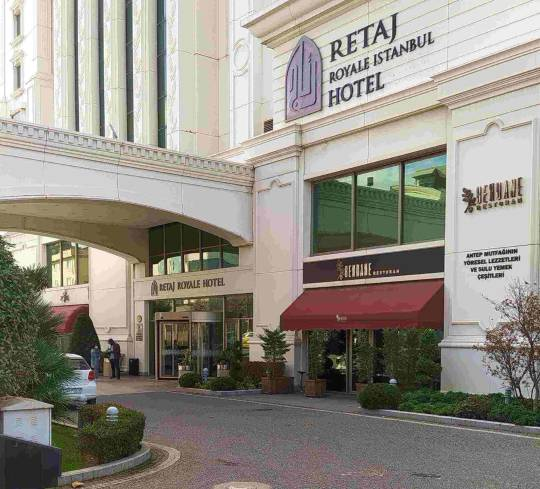
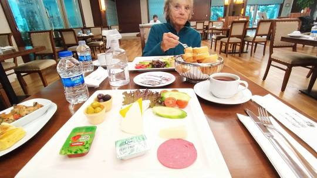

We finally made it.. Absolutely exhausted mentally and physically!  Can’t remember what I’ve told you as lost my e mails.. Too many countries, WiFi s and changes of phone etc.  A brief resume…. 

All started trying to get our covid jabs. Only us would have a flight after a bank holiday in Spain. This meant no local clinics open. We  had to travel 2 hours each way to a private clinic in Almeria twice… Not very pleasant as among possible sufferers. By some sleight of hand managed to get results in the mandatory 35 hours before flight.   

Julian drove us to Malaga Airport where we learned that our flight to Istanbul had a 2 hour delay, meaning we would miss our flight from Istanbul to Cape Town. Checked with officials who told us to sort overnight in Istanbul and change flight.  

We waited 6 hours in airport, everywhere closed except a sandwich bar with a choice of 2 fillings.. But we’re not fussy. It was bizarre so hollow and empty.  

After a  4.5 hour flight all cases had to be unloaded. Trolleys locked so had to manage baggage ourselves. Finally, after an endless trek round airport found  the Turkish Airlines hotel accommodation office.  Another hour’s wait for shuttle bus.. We were exhausted and confused. Grabbed a coffee. Lost passports  Found in my bag in wrong compartment.

Then an hour’s drive. Arriving at  hotel 4.30am..lovely hotel. Literally dropped into bed. Up for breakfast 8am then back for a sleep / lunch evening meal provided.  

