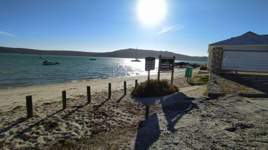
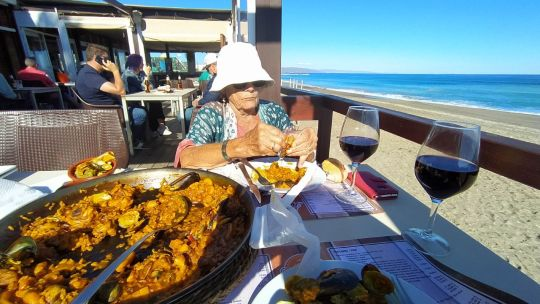
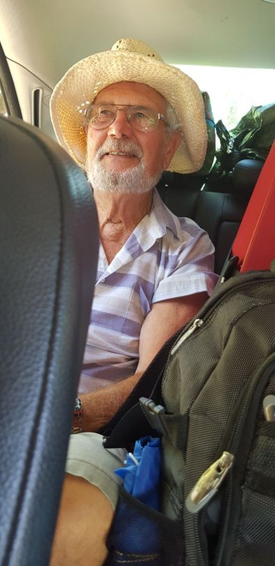
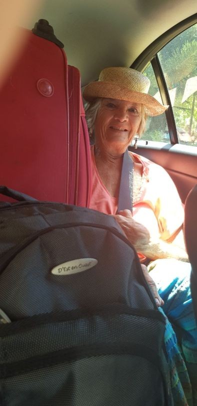
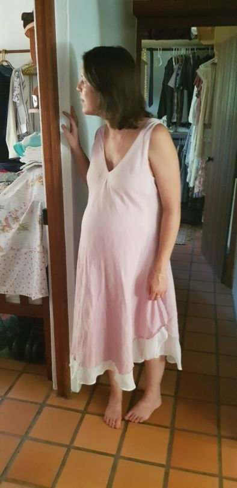
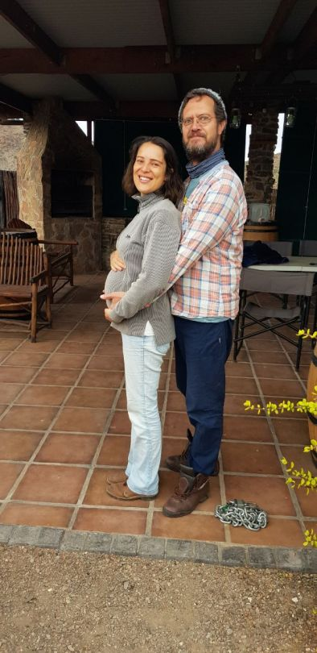
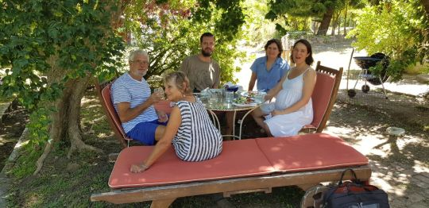

Left 11pm..flight 2.30am  More customs and case lugging .

No airline meals, just 2 packets of dryish sandwiches, cake and bottled water.

We arrrived at Cape Town 1pm..Went for reserved hire car.. Another cockup.. No car!  ….

Managed after 2 hours to find another car.. Still lugging our cases

Drove to Langebaan.. Catherine’s granddad’s holiday home.. By a beautiful lagoon on the Western coast. 

Stayed there in isolation and recuperated on our own for a week.  Such a fantastic place reviving memories too. Just what we needed. So many thanks to Bill, and Wendy who prepared it for us.  

  

After a week we drove back to Cape Town. Catherine’s father and brother met us.  More luggage than room..our stuff… plus their stuff plus dog and his stuff. Wedged us all in. Mike and me on seat with huge case and  sitting on whatever for a  2 ½ hour drive.  

Arrived at last.. Columba, Greyton .. Wonderful to see family again. Catherine has put on a bit of weight!  

More to follow……Mo xx
