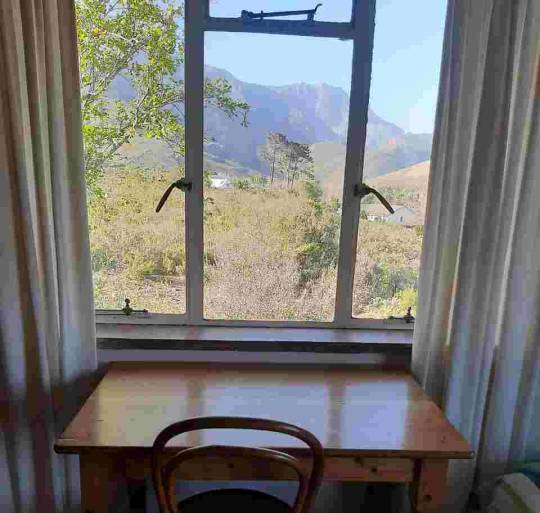
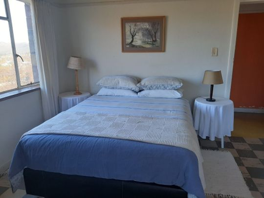
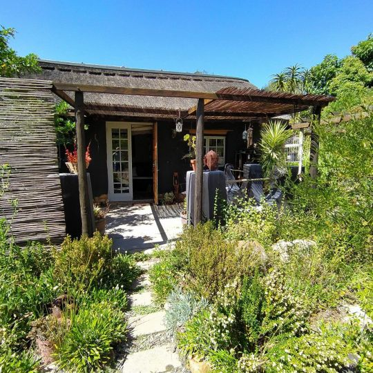
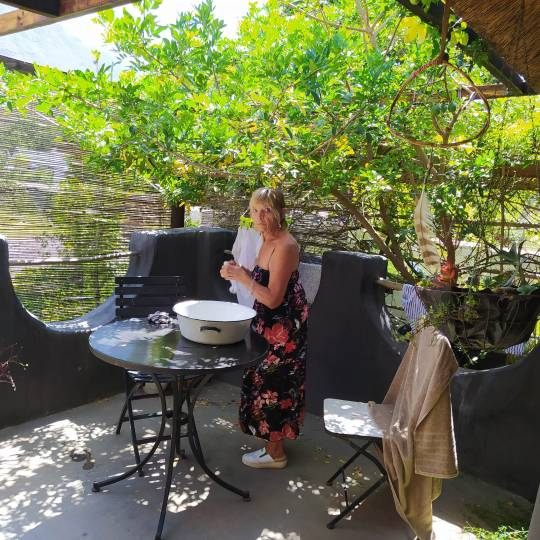
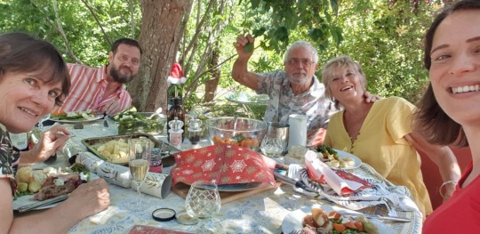

  
We had temporary accommodation, staying in a back packers eco Lodge.  
Basically a bedroom, shared bathroom and kitchen but with beautiful mountain views.  

Janet, a loved local figure, was our very welcoming host. It was a bit worrying with the comings and goings of travelers, in view of virus, and we wanted to have our own place.  

So after 2 weeks moved into the tiniest of cottages next to Greyton Nature Reserve and its mountains in Dan’s road until 16th.  
Then we will rent a lovely house in same road until we leave, hopefully extending our visas next week for 3 months. Our flight home has been cancelled.  
Who knows what next?

Christmas.. was reduced to 5 because of covid in Catherine’s family in Cape Town.  It was lovely.. Tree, pressies, duck and gammon.  

  Peanut is due any minute now.. All in good spirits.. Swim in river yesterday got peanut kicking even more..   

Since then gone into phase 3.all beaches parks etc. Closed.. No alcohol sales. Strict curfew    Peanut was due yesterday..   Looks like it’ll be a 2021 baby.    May 2021 be a better brighter healthier year for us all.      
With love MnM
