Friday 1st January.. We moved from the Back packers’ Lodge into the tiny  'gamekeeper’s\` cottage just under the mountains and next to an extensive National Park which homed families of baboons… So keep bin lid on!

Saturday 2nd January, 6 am, saw Wendy negotiating the hour’s emergency drive to Hermanus Clinic with Catherine and Dan in the back trying to control her labour pains. A family of guinea-fowl, chose the wrong moment to cross the road, one of which went under the car but just escaped the wheels.

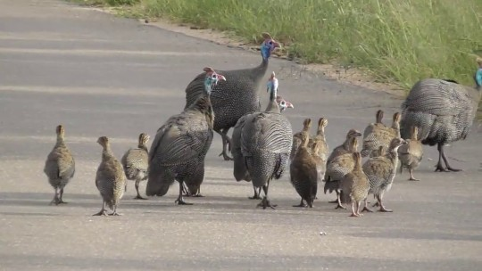

Baby Peanut was born by Caesarean section at 11.45am.  
A lusty healthy 3.67k (just over 8 lbs) daughter. Dan assisted in the birth by cutting her 9 month lifeline, welcoming her, yelling and kicking, into her new world.

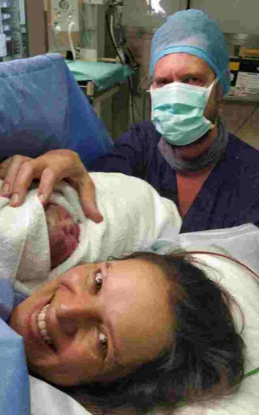
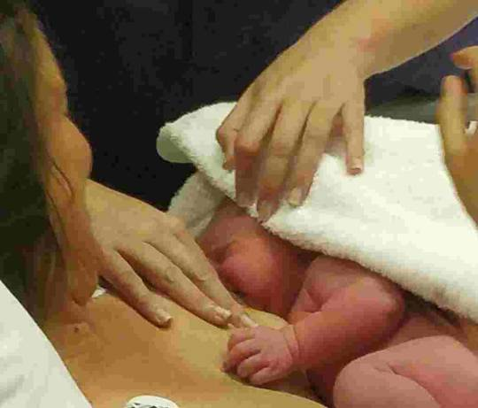
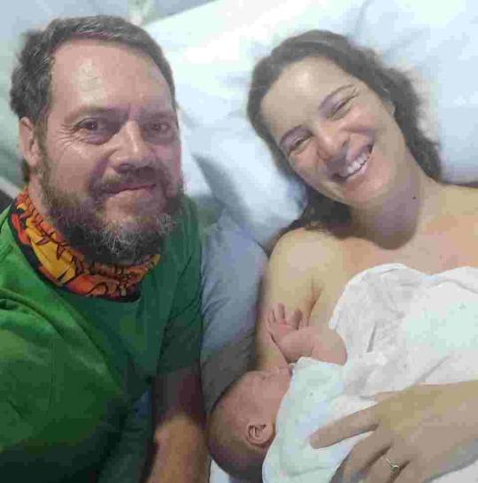
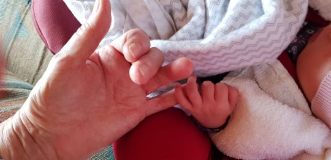

  
Joe, now able to travel, met Wendy in Hermanus and brought her back to Greyton. Us first time grandparents had a celebratory champagne supper in Columba, Dan and Catherine’s cottage.     Very happy outlaws!

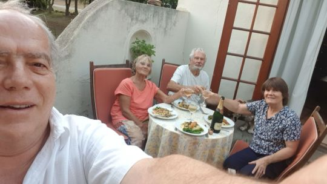

Dan was able to stay two nights at the clinic,  joining  
us Monday evening at a spacious apartment we were fortunate enough to use, close to clinic, (thanks to a  covid cancellation,) belonging to Catherine’s cousin.

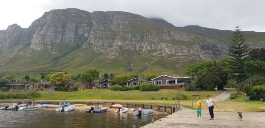
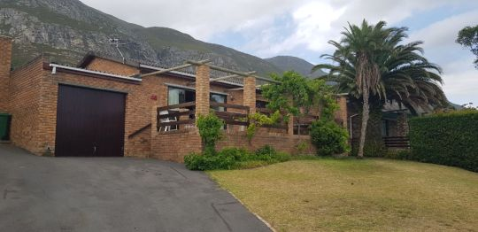
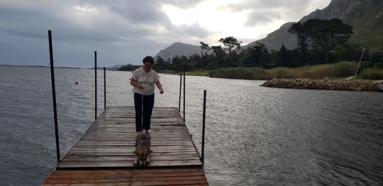

We were introduced to Peanut, Tuesday lunchtime when she arrived with her mum and dad for lunch. Eleanor Claire Phillips was named with a champagne toast, and a lusty serenade from herself.

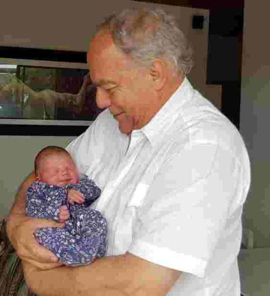
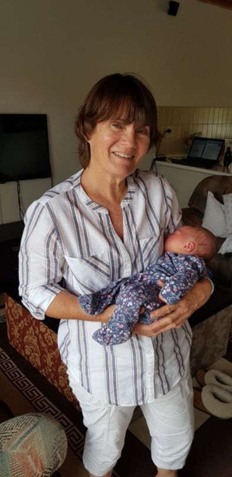
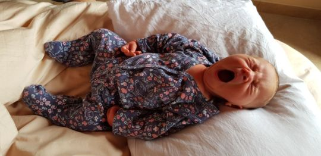
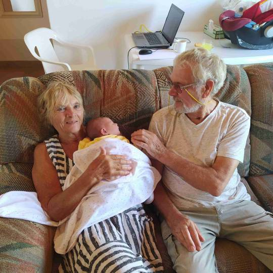

  
This spacious accommodation afforded the new family to have an annexe whilst we were in the main house. Next to a lagoon, in a  beautiful holiday village. What more could we want.?  
We all mucked in enjoying each others’ company and sharing tasks including us grans doing hand washing in the bath!

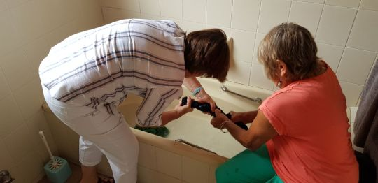

  
“Such fun darlings! “. Granpa Joe catching every moment on his forever clicking camera.

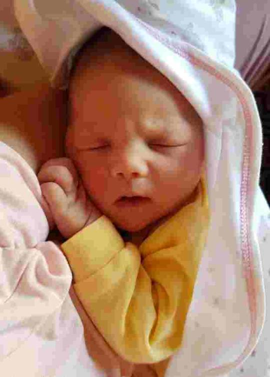
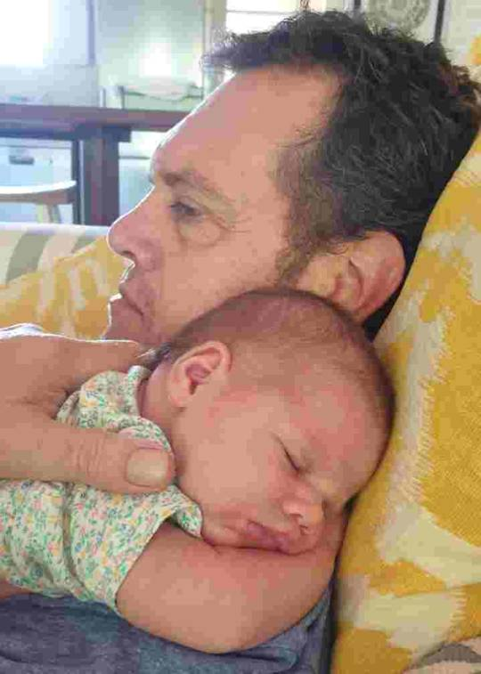
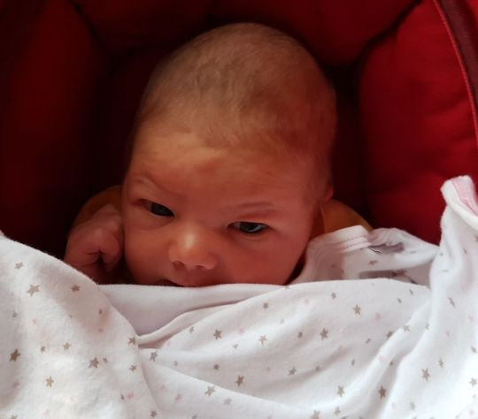

That’s all for now folks   Next one soon  
Love MnM xx
