An appointment in Cape Town  to tender our applications for a 3 month extension visa enabled Joe to return home with us to resume his work… Not all of us on holiday..!

Cape Town is the second most populated city in South Africa after Johannesburg. It is colloquially called ‘the Mother City’.It houses the South African Parliament and is the administrative centre for all localities.

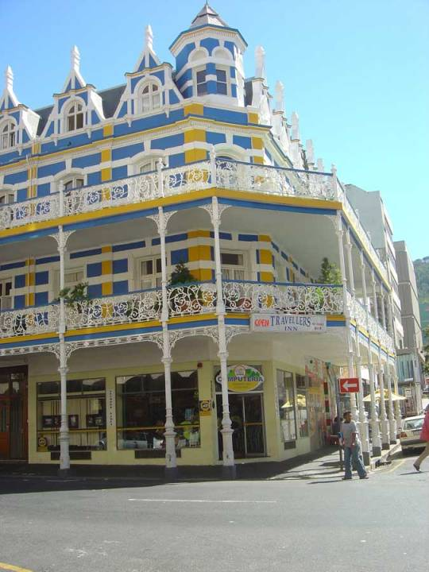
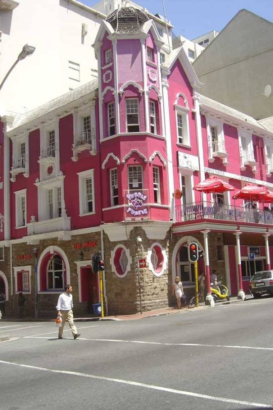
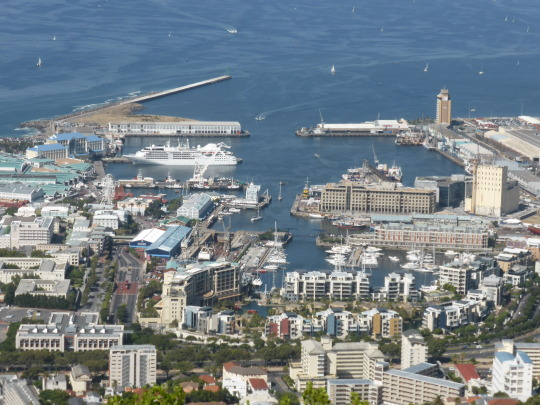

Arriving after a 2 hour drive we looked for the immigration building we needed. No bustling Cape Town now . Desolation and empty streets, apart from folk like us searching for the right office ,clutching our files . No bags allowed inside !

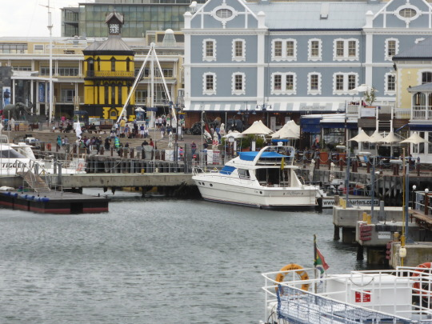

We were disinfected  and temperature checked at every turn in the corridor, then body checked on entry to main hall. a hall of different nationalities and respective clothing and habits. People watching passed the long wait. All very well organised with more than adequate social distancing. This made us feel less apprehensive in that respect.  

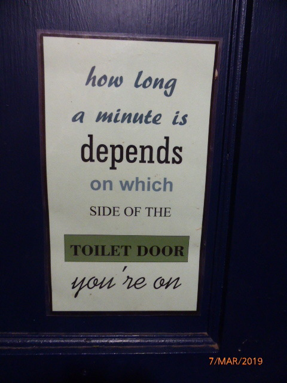

Then our turn, individually! Three interview desks… Paperwork checked.. Fingerprints.. Each finger and thumb taken twice. A formidable atmosphere .Decisions that could mean a turning point, make or break a life. Then  all the collected evidence, forwarded for approval ,for which we optimistically wait.  
Then another personal visit to collect… All for a 3 month stay! We have no flight back, as cancelled, so just as well.  

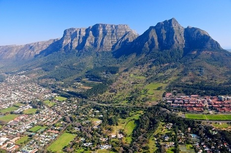
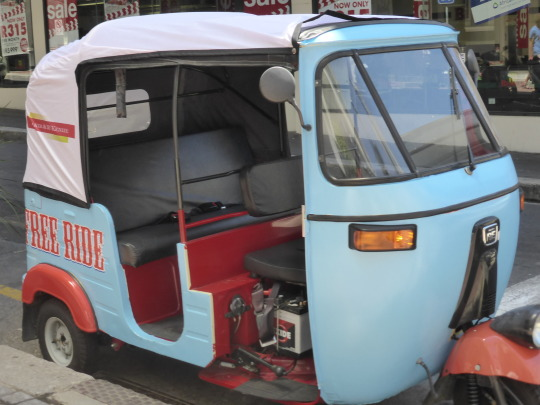

Back in Hermanus. Everything was well at check up for Catherine in clinic, Friday morning, whilst we shopped for food essentials. All back to Columba, to reinstall ourselves.

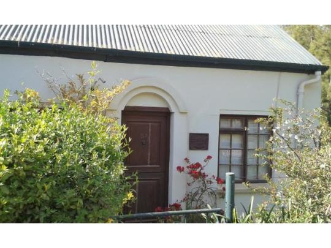

After evening meal we returned to our mini cottage further down the road.  
And..was it mini?…   It proved to be too mini for us..  
Built from cobs (mud house) with thatched roof  it looked so attractive… But the inner decor… dark grey and black walls didn’t appeal to our sensory systems. Lots of squeezing part each….. . Thought we’d returned to our youth!  

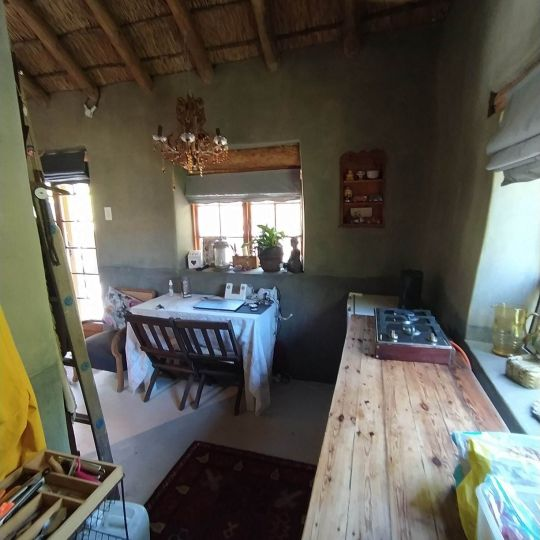
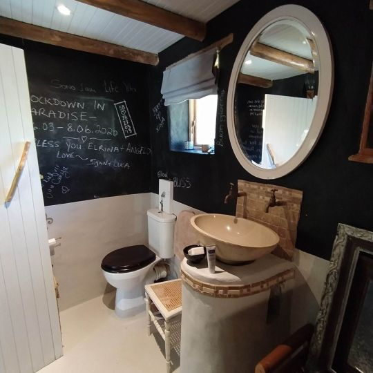
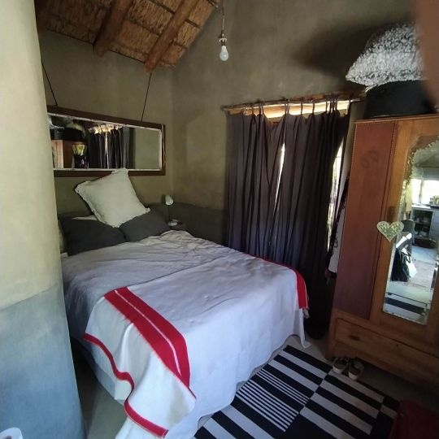

Wendy returned  home to Cape Town a week ago so we are now the carers. Dan and Catherine are adapting to their new parenting role.

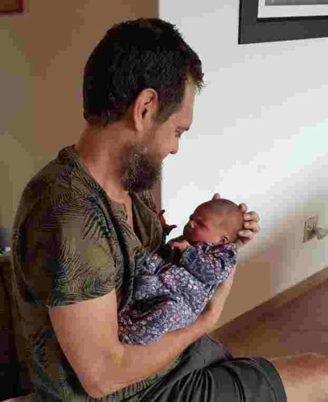
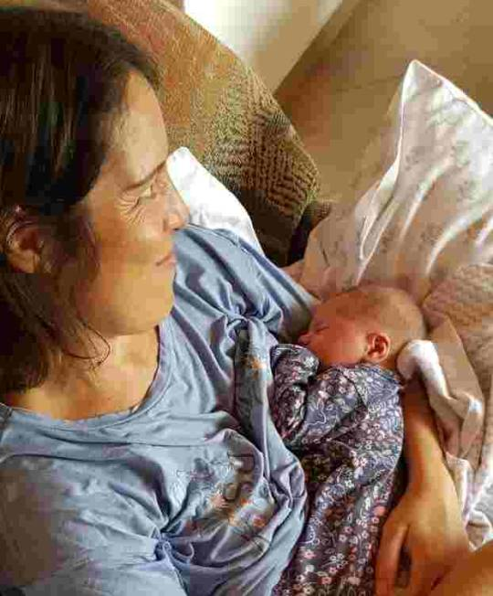

Eleanor likes to make her presence and hunger known in no uncertain terms.

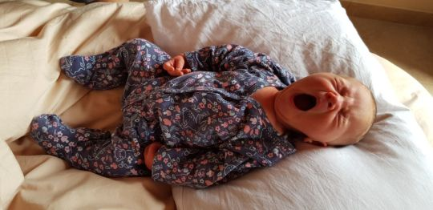

Whilst mummy fills one end, daddy is cleaning the other. She is a strong and  determined little being, already deciding who’s boss… Reviving loving memories of  a very similar offspring. 

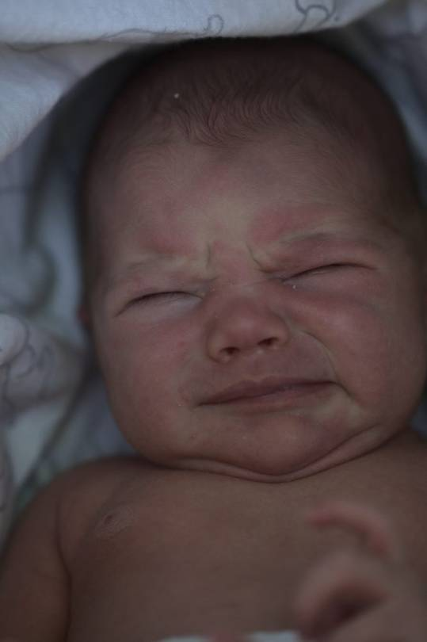
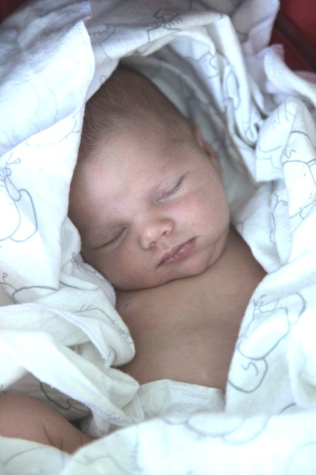

Next one soon  
MnM xx
