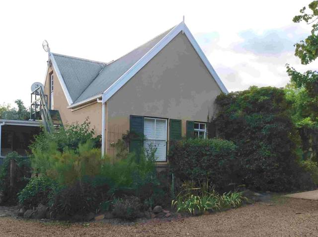
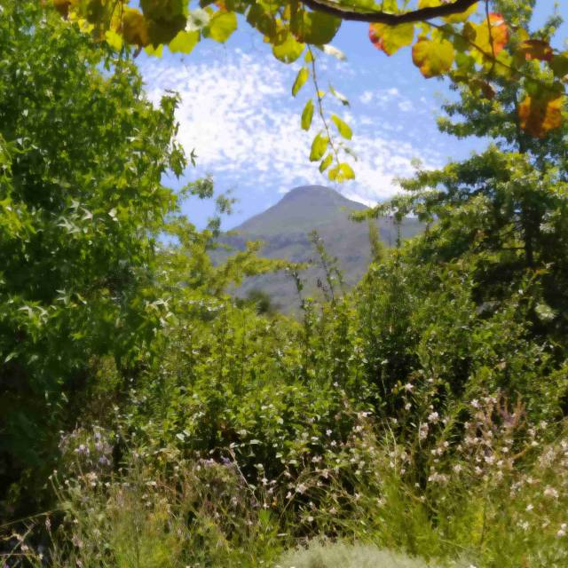
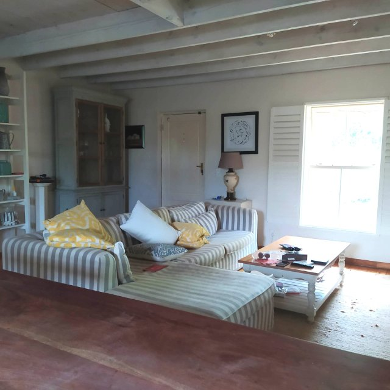
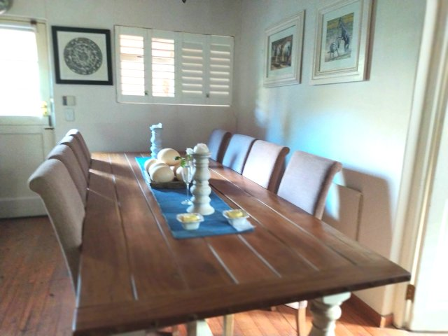
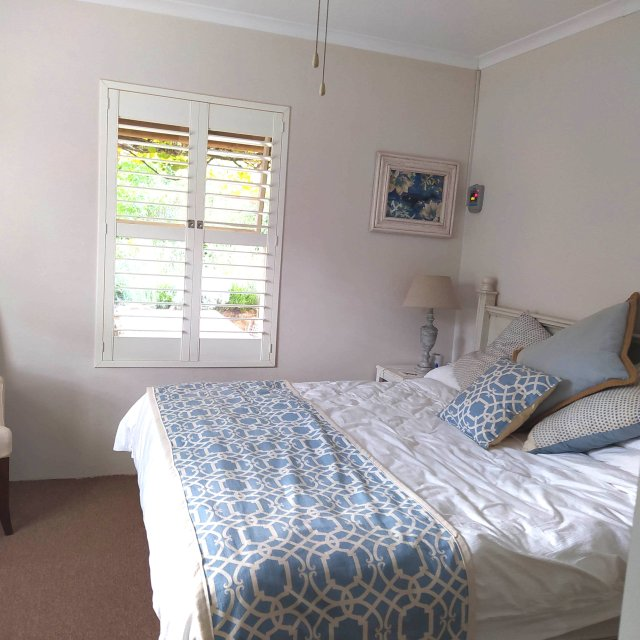
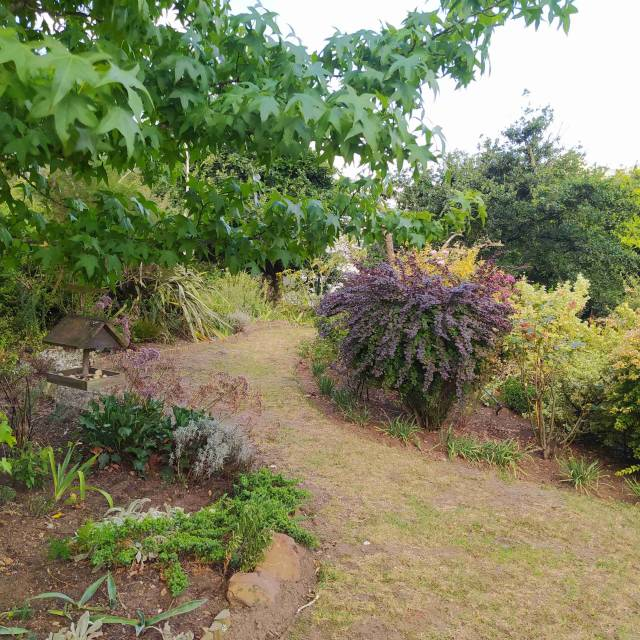
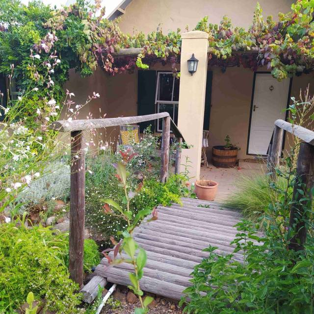

# Num 43

Saturday morning

Arose and took in the beauty of the place..

We are now really loving this next rental… 5 moves in as many weeks!

A beautiful cottage house in the same street. .. We’re no.43…..Dan’s no. 57…so just a short walk. Fantastic mountain views with our own Vesusius, especially when the clouds ‘erupt’ on a misty morning.

It has 3 bedrooms, 2 bathrooms(1 en suite ). Large lounge and fitted kitchen. Garage and ample parking space.

Very spacious with an absolutely delightful garden.. Full of all the old English flowers and shrubs… Golden Rod, Buddleia, Wysteria plus indigenous Agapanthus and Bourgainvillea.

All this is maintained by a local worker. It is an organised wilderness with lei water (water channeled from the mountains, that residents can subscribe to use in turn to fill their pools (dams)) running through it. There are 3 little bridges crossing it with bird tables and feeders around. A herb garden with a lemon tree in its midst completes the picture.

We now have it for 5 months assuming our visa applications are approved. It is an absolute paradise. We would love to buy..so may get hold of owner asking if he can stall selling until we are ready.

All very complicated as have left France…… Still under application for Spain…. So no residency anywhere.. Who will have us?

Hopefully, Julian will sign for the apartment we are buying in Spain next week.. But even then there are problems transferring funds… This nut of bureaucracy is a hard one to crack.

More next time

MnM xxx
