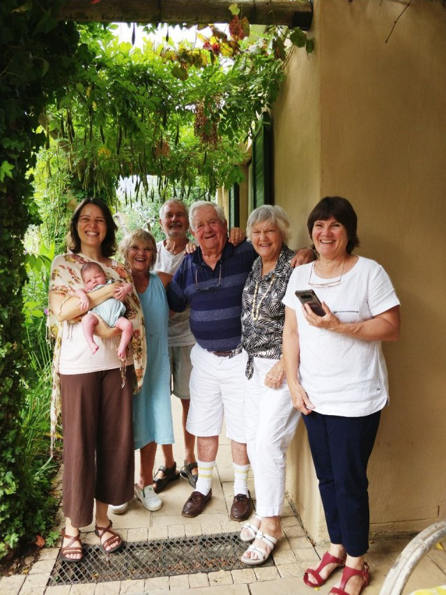
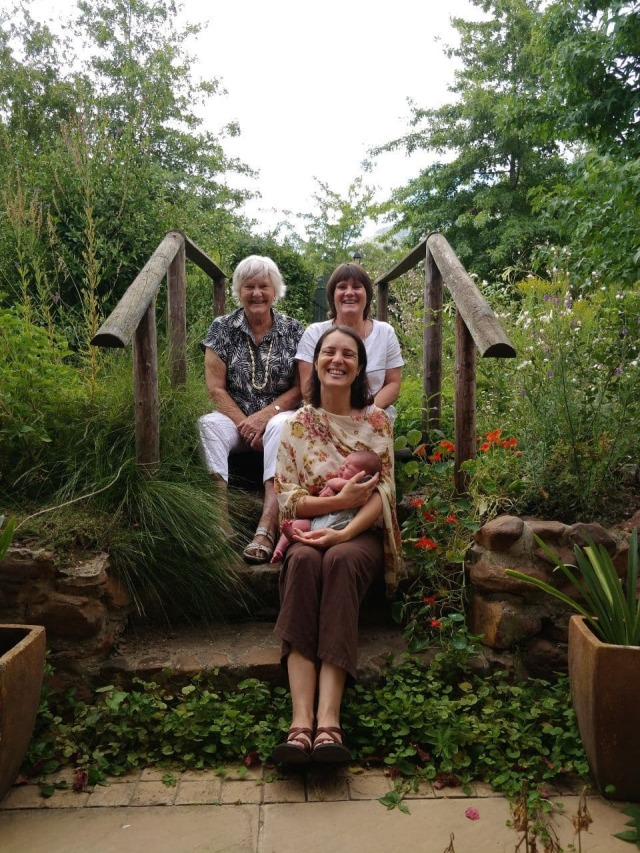
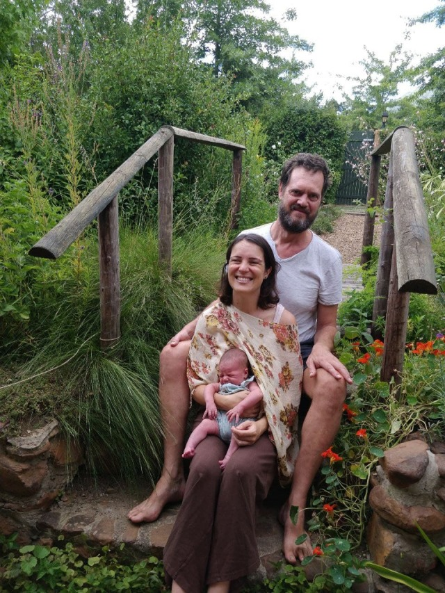
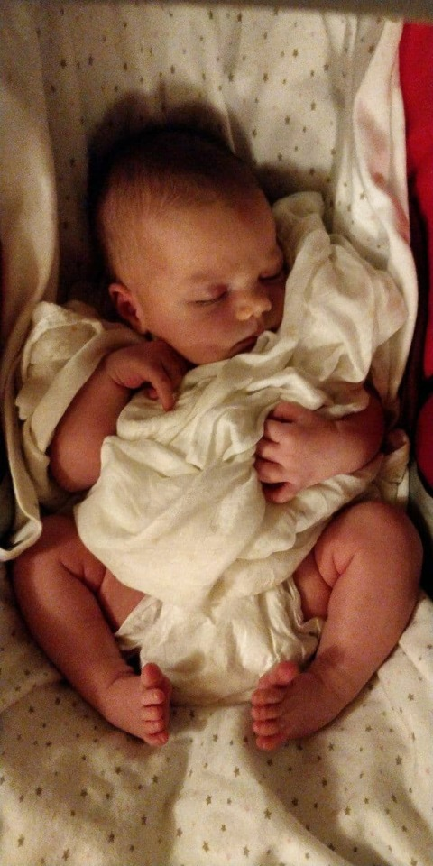
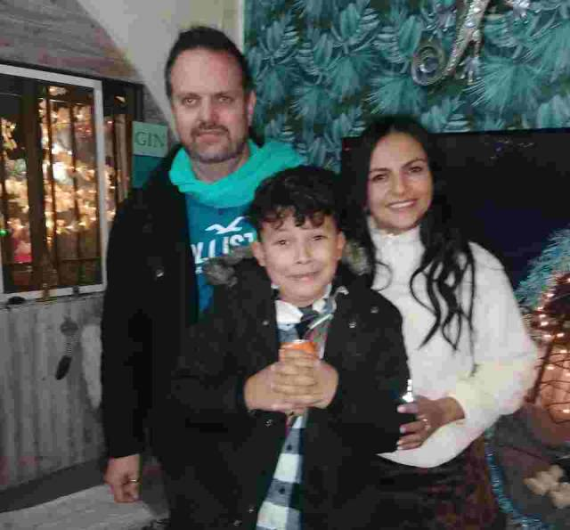
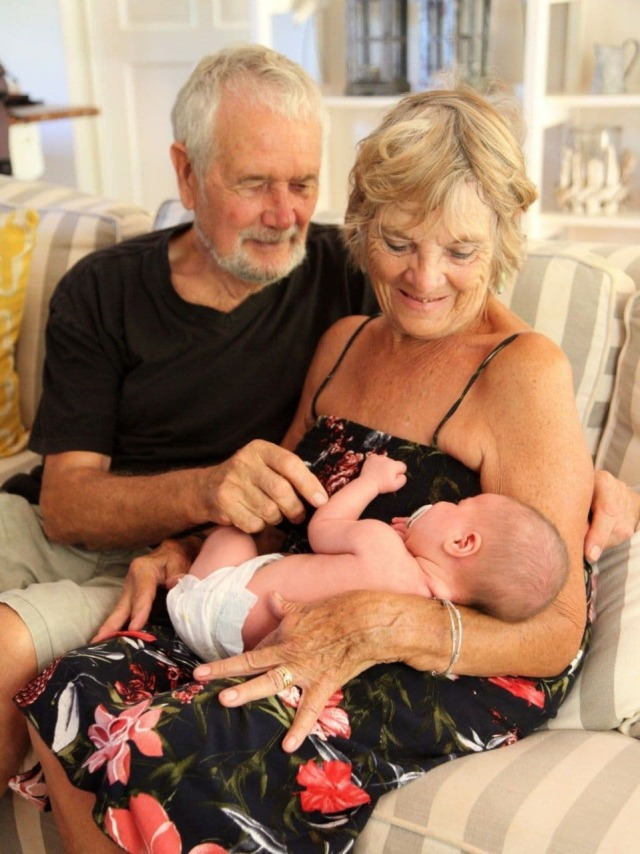
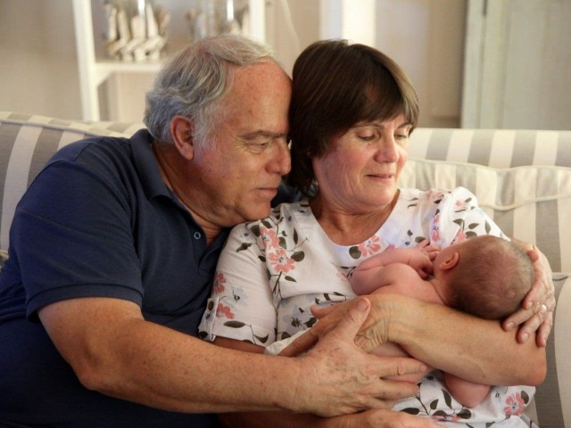
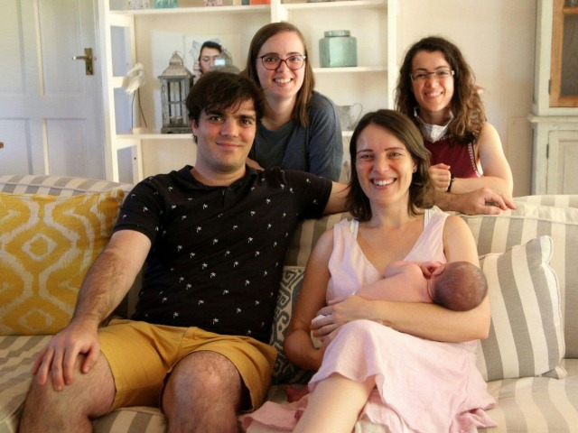

# Birthday Fun

Having been moved in 3 days we’d decided to invite the Outlaws for my birthday braii. A surprise for Dan and Catherine. Her mum, Wendy, and her parents, Bill and Peggy, came bearing gifts of a much missed beverage to accompany lunch. This commodity was gladly welcomed with hanging out tongues, sales of alcohol having been suspended for the last few weeks.

A lovely day and we had a delicious meal, lots of chatting and reliving of our previous times together. We are so happy to be welcomed as part of this all embracing family. All besotted with our new grand and great granddaughter. So many cuddles.. Eleanor must have wondered what this new world was like! We passed a lovely afternoon and were so pleased that they had made the long trip to be with us.

4 generations of lovely ladies

A video chat with Julian, Lorena and Manolo completed a very happy birthday. These times make me so appreciative of our progressive technology… being able to face chat with family. It certainly outweighs some of my blasphemous on screen moments!

A week later, with the easing of some restrictions, Catherine’s parents and siblings joined us for a buffet lunch to meet our new arrival. We had a jolly time with the family.. all 11 of us. David, her brother, Jennifer and Alison, her sisters, with partner and husband. Alison did a full entertaining photo shoot. She and Jason stayed overnight. Eleanor’s now well initiated into the social whirl of family get togethers.

No washing machine here so we take our laundry to Columba, where Mike has used his practical, modification skills to make 4 fold washing line, enough to accommodate a Chinese laundry, or the Phillips’ communal wash load. Ironing is zero to minimal, the creased casual look is fashionably in !

We’re finally able to watch the semi and finals of ’ Strictly come Dancing’ that Dan downloaded for us. We admit that we do miss English TV in spite of all the ‘Crap’ we used to moan so much about. Our morning cereal ’s not the same without Dan and Louise to deliver the same daily news bulletin ritual. Come back Breakfast TV.. All is forgiven!

Another amazing bit of technology (to me anyway) is this tiny device, a ’ USB stick ’, (aren’t I clever?) which transfers all our films, documentaries etc. from Dan’ s computer to ours, which Mike relays on to our large screen TV. Only having watched a small screen I am now enlightened as to what people really look like close up.

As a result of a second doctor’s consultation, I was referred to a specialist who then advised an MRI scan. Blood test taken and appointment made for the following week.

I then had an invoice from clinic with the cost!!!, which I then forwarded to insurance company, whose policy had been exorbitant, but needed for our travel. They checked with clinic, and needed 3 e -mail’s worth of information, before deciding they wouldn’t fund it. The reason.. We’d given a French address, where at the time of flying, had its borders closed with South Africa. In spite of documental evidence that we had moved to and consequently flew from Spain.. all legal and above board the claim was still refused. The matter is now in complaints department, and I await…..!!!

Next one to follow, as have used up photo allowance

With love MnM xxx
