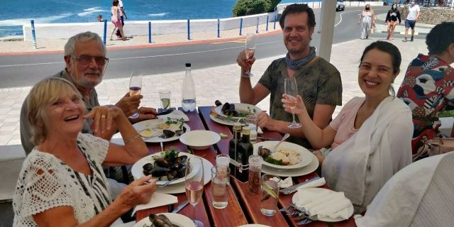
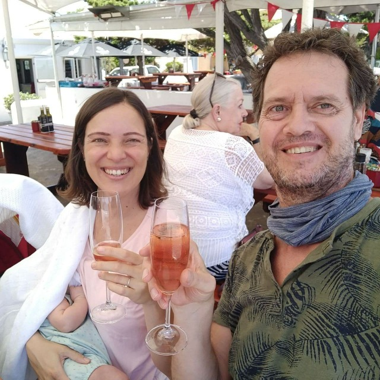
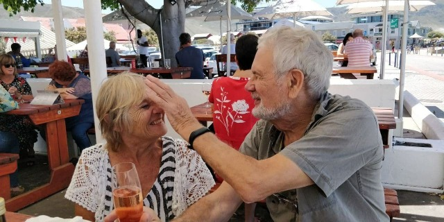
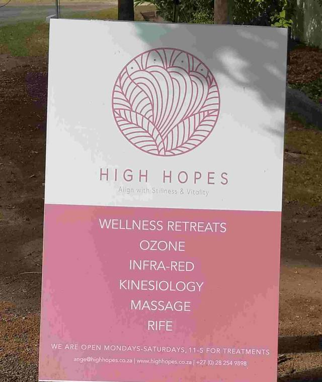
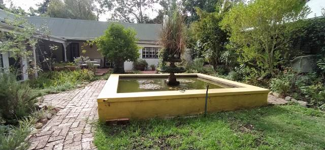
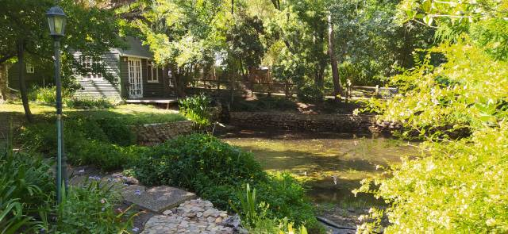
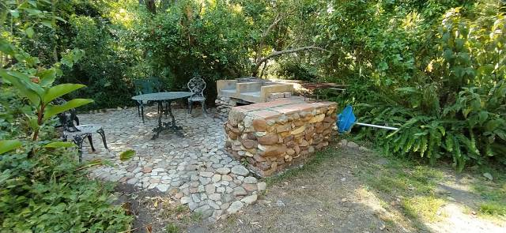
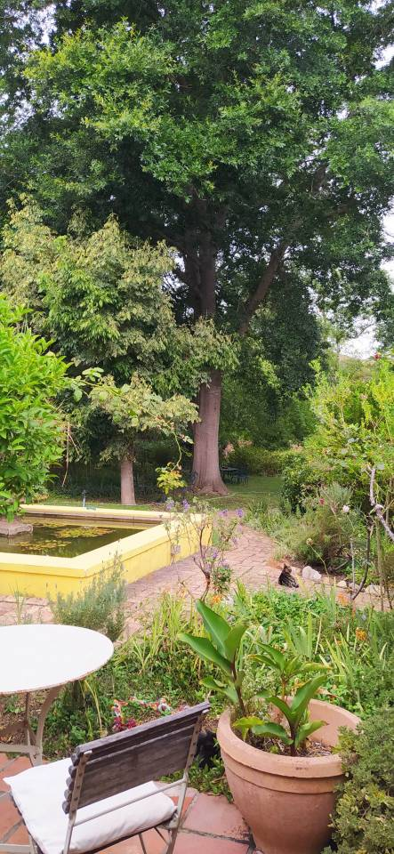
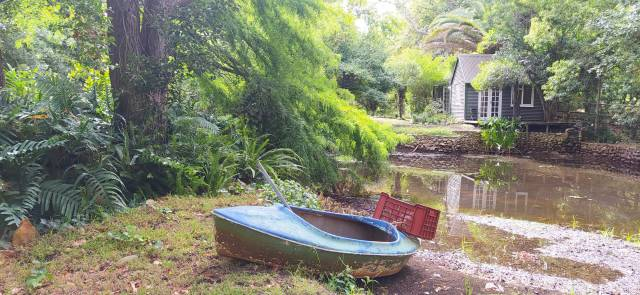
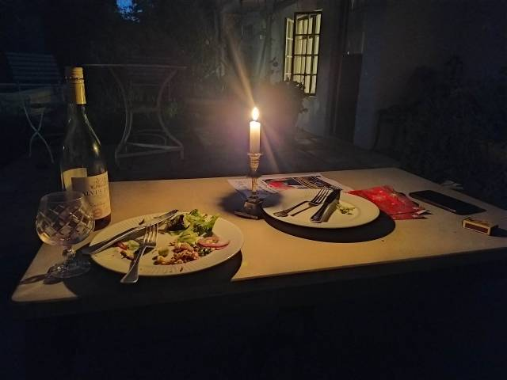

# On The Move again

A champagne lunch on the beautiful Hermanus coast celebrated Dan and Catherine’s 12th anniversary… Really that long?… and a satisfactory check at the natal clinic. Eleanor now graces us with endearing smiles and, do I hear?…. a silent chuckle too! ….definitely a ‘coo’! Not ready for a sea paddle yet!

Then a disappointment… There are buyers for our rental house, which means we have to find alternative accommodation yet again, just as we were feeling settled too. Another house a stone’s throw away suited our needs but unfortunately was a steep climb to the entrance. Apart from the wear and tear on our leg muscles, which we try to avoid at all costs, it would be difficult for Dan, even on his electric bike, and Catherine with pram to ascend.

'High Hopes’ a nearby retreat, was an adequate solution for our needs. Much smaller… But light and airy…Just a large bedroom open plan to the lounge and a good sized bathroom. The welcoming owner, Sharon, is going to turn the second bedroom into a small kitchen for us.

  

'The smallness was compensated by the delightful surroundings…. a beautiful area also housing a small swimming pool.. That’s a bonus! It is a therapy practice catering for holistic healing and meditational breaks.. Just what we need! No washing machine but a laundry service by local folk. Might even have ironed clothes.. We’ll be up market then!

We have been here just 3 days and already feeling the effects of the all enveloping comforting ambience which surrounds us. A huge American oak dominates our view with its branches high enough not to obstruct.

A labyrinth of little paths leading anywhere, a dam, beside which a small boat is moored and a small pool into which we’ve already plunged.

Outside eating accompanied by the soft sound of a gentle water fall and candle lit egg and chips. What more….. .. Such friendliness and tranquility.

I have now caught up with myself so on this note I will finish, until next time. Back soon

With love

MnM. xxx
