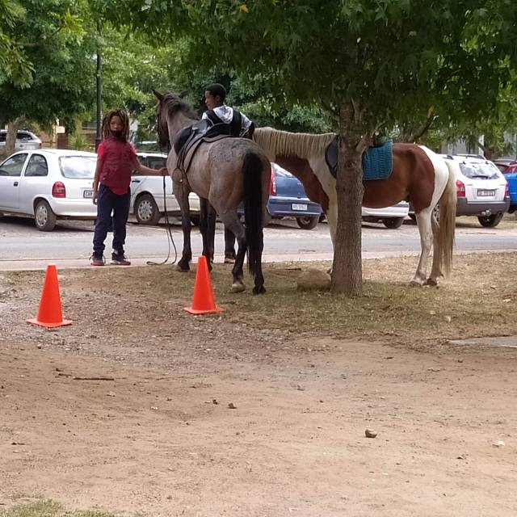
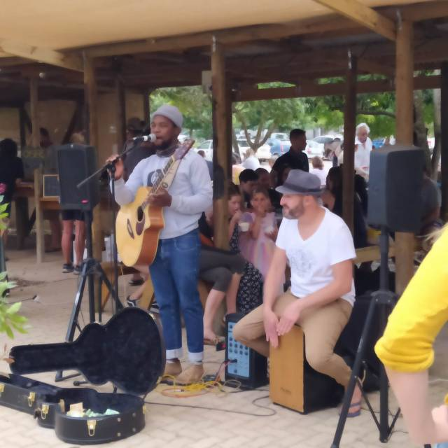
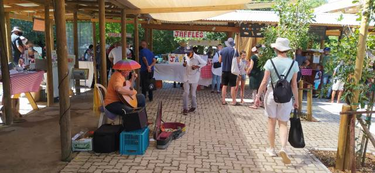
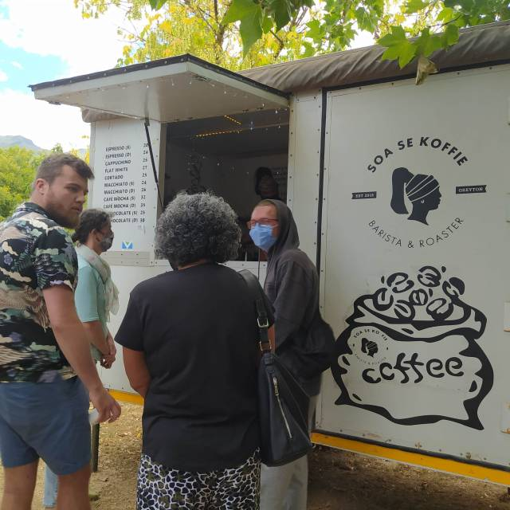
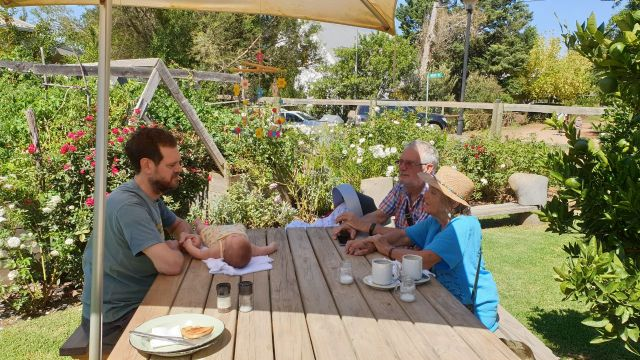
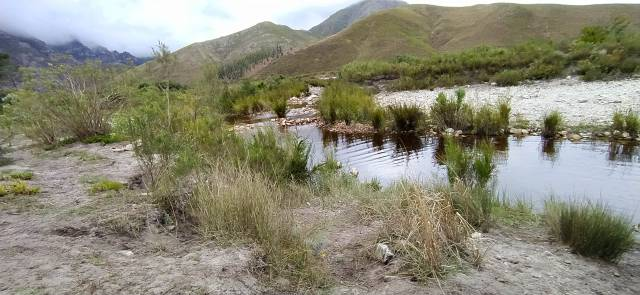
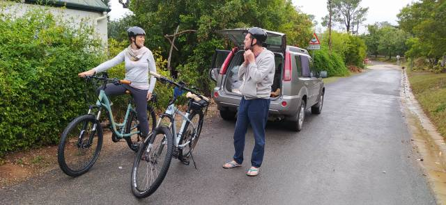
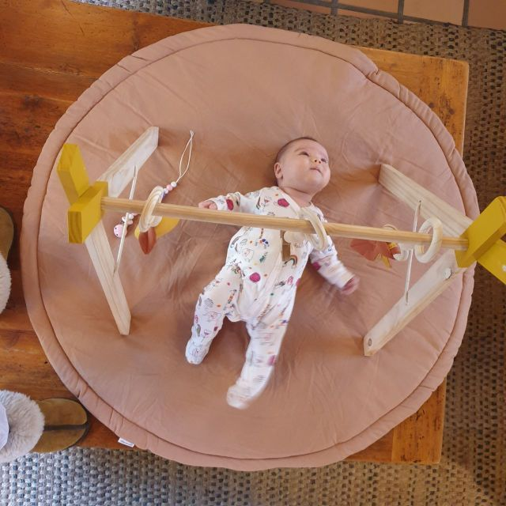
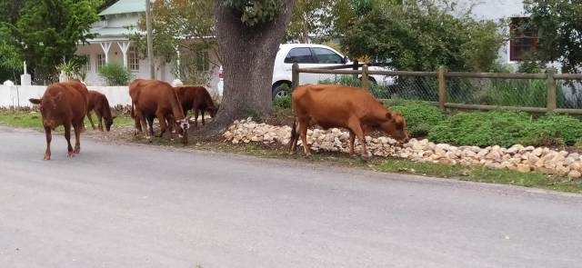

## An MRI and a following CAT scan showed I have nothing sinister as feared.The exorbitant cost was worth it for peace of mind. However, I am profoundly death in one ear, cause unknown, that cannot be corrected… but now benefit from a hearing aid for the other,. so I can dispense with the ear trumpet.!.! Another huge expense I wouldn’t have had in Europe, but I didn’t want to wait. It was so socially difficult.

##   

An MRI and a following CAT scan showed I have nothing sinister as feared.The exhorbitant cost was worth it for peace of mind. However, I am profoundly death in one ear, cause unknown, that cannot be corrected… but now benefit from a hearing aid for the other, so I can dispense with the ear trumpet.!.! Another huge expense I wouldn’t have had in Europe, but I didn’t want to wait. It was so socially difficult.

All this achieved in a week.!

After writing to complaints office of insurance company, they still refused to pay out, but as the circumstances of refusal were so unusual they will refund our premium, so that was worth the effort.

The week ended with a visit to Greyton Market as usual. This was more special as the church also had its annual bazaar.

Wonderful cooking smells to tantalize our nostrils…

(Now level one so some restrictions eased.)

Wonderful cooking smells to tantalise our nostrils…

Authentic traditional foods with nearby tables, plus accompanying music. Children sitting in trees, families picnicking on the grass, amongst colourful bunting completed the picture. Local horses have been rounded up to give rides, whether on backs or a drawn chariot (cart). The heavy rainfall and wind of the previous few days were driven away and a beautiful sunshiny day gave its blessing.

We met Dan and Catherine and had a second breakfast of egg and home cured bacon bagels … Delicious. I could not resist buying a very pretty mobile for Eleanor, which we strung up above the table. Her awareness grows daily.. she is so perceptive of sound and movement. You are so right, Nola, about savouring every moment.

Sunday, persistent rain returned but we still managed a river walk below the mountains with our very lively grand-dog, Tilia, whilst Catherine cooked Sunday lunch, from a new recipe.. Yummy!

Monday, the heavens opened even more. We had to be in Cape Town to collect our extended visas. Dan needed to return his electric bike as had a problem and Catherine’s bike was ready for collection. A family trip..up at crack of dawn, to achieve all this.

Arrived at the home office.. Usual precautionary measures and queues.. Our turn… Then our usual unluck.. We had not brought the mandatory receipt. Go home and get it they suggested.. A 2 hour journey each way!

Another official suggested we could get an affidavit from police station. A 20 minute walk.. So set sat. nav. and marched off in the pouring rain.. A not very salubrious area.. It seemed that covid was beckoning from the side streets.. .we arrived…. joined the queue.. a loud commanding voice was yelling to keep a 2 metre distance.. Not much notice was being taken.

My new aid neither liked this voice nor the cacophony of noise that surrounded us and told my brain to crowd my head out. Not very pleasant.

Our turn.. Sent away with 2 forms to fill in… Back to desk.. we had the misfortune to have the owner of the voice. It let rip again, informing us, and everyone else, that we should have used black pens…Go away and correct! .. We dutifully did so…. finished just as black pen was dying…. and crossed out the blue ink….

Back to desk… Loud voice rose a few decibels…. Not on these forms.. Get new ones… We hung our heads… Now didn’t have a black pen… Those with one were using them.. Found another at bottom of bag….

Just how many numbers can one remember… Passport numbers… Phone numbers that change with each country… New address codes… At this stage difficult to remember how old we were!

Another power walk in rain, with power running out… grabbing a banana each from a stall, cutting corners, running the traffic light gauntlet and generally jay running. My aural apparatus was over responding to traffic light noises, traffic and surrounding hubbub. A nightmare in my head. At Home affairs, it was back in its box.

Finally we cracked it.. We have our 3 month visas.. Yippee!!!

Met family with Catherine’s dad and brother, (who had picked them up from bike place) , in a tiny vegan restaurant. The six of us, plus Eleanor in her car bed, plus Tilia, who had great difficulty climbing the skiddy wooden stairs, in an area of about 6 square metres. Seating was on high stalls or very low seats and tables, nearly floor level, so we tucked in nicely.! I’ll let the mind boggle… Food was good and a lot of it.

  

Three hours later back at Columba, rain now easing off. Dan and Catherine whizzed off on their bikes, big Cheshire cat grins stretching their faces, whilst Eleanor kicked and chuckled on her new play station multi gym. Tilia took this chance to escape up the lane hoping for a frolic with the roaming horses or street wise cows which brought their new born to show off. No dull moments here.!

Back to ‘High Hopes’ where Sharon had not only done our laundry but cooked an Italian supper too. A nicer landlady one couldn’t wish for .

An eye test revealed that Mike’s bumping into things was not through over indulging, but due to cataracts. I write this whilst waiting at his appointment in clinic to discuss procedure and terms for their removal. The latter would require us to mortgage the house we haven’t got, so not likely to happen here.

I returned to the ear specialist to report on my non progress with hearing aid. Firstly I had inserted it wrongly.. Didn’t know you can hear upside down…

He then programmed it to my specific requirements. I now have car mode, restaurant mode and normal mode. All clever stuff.

With all this sensory renovation taking place, we just need to tell our bodies… ‘Yes we can do it! ’

A convenient place to finish this episode as need to pack to start a new adventure tomorrow

With love MnMxx
