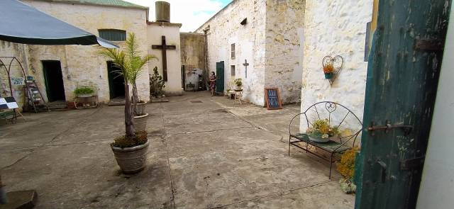
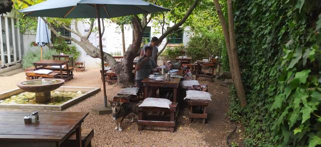
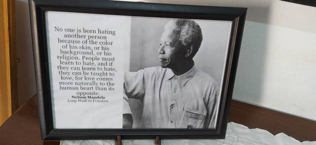
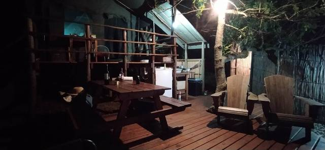
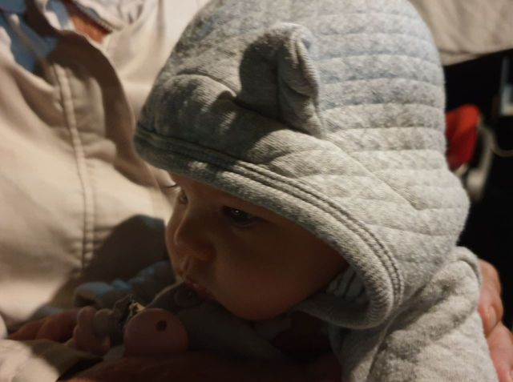
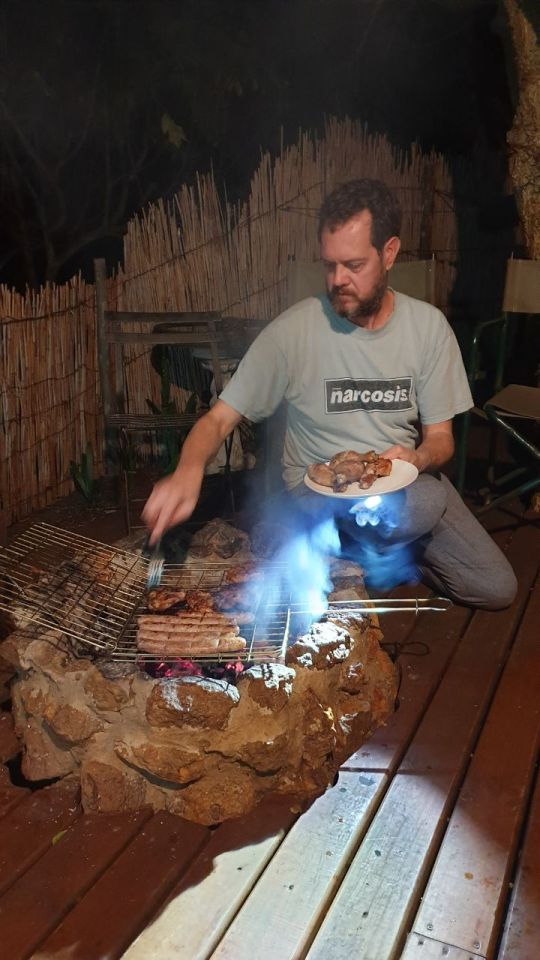
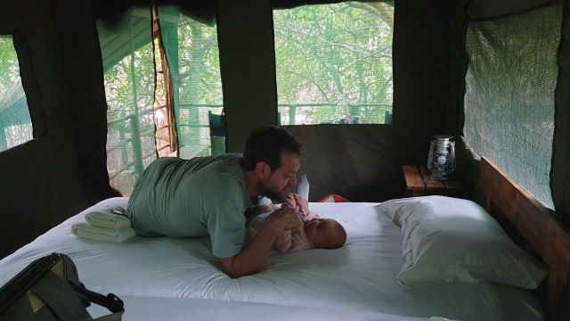
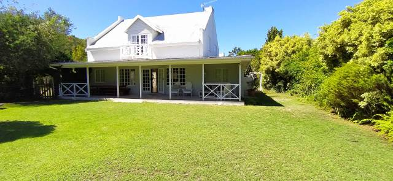
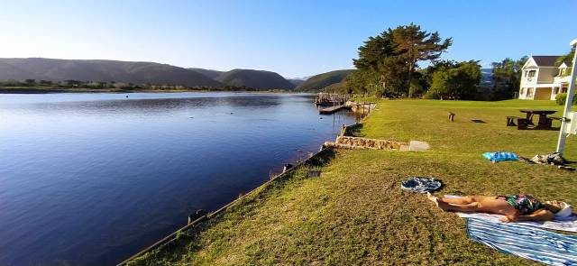
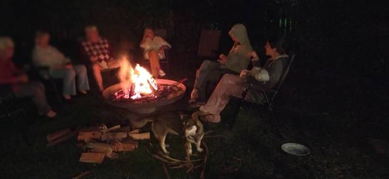

## Off on Holiday

##   

8am Friday 19th March…

A previous rainy day, hampered by a power cut, meant that washing not yet spun had to be collected early on the morning of our departure after being dried at the local laundry.

Loaded to the gunnels we set off for a 3 week holiday. The first 2 weeks being spent just outside Plettenberg, and the 3rd at the holiday farm in the Karoo ,created by Wendy and Joe.

En route, an old converted prison ‘The Old Jail House’ at Riversdale provided us with lunch. A very interesting place, the cells housing antiques and artifacts to browse whilst awaiting our food.

A bit of a let down food wise though … perhaps they went a step too far in authenticity with a jailbird menu! Not on our repeat visit list!

The sun rayed down on us as we continued along our route

stopping briefly for a cuppa.

We broke the first journey with an overnight stay at 'The Old Trading Post, ’ glamping’ (luxury camping).

Two tents, a small outside kitchen, loo, and shower. No doors so open to the elements which turned rather chilly that night.

Eleanor transfixed by the fire

Dinner was cooked on a braii… A fire built from wood which has to be left until it is cinders for cooking. So this waiting time had to be filled with aperitifs… What a shame! Our chicken, sausages and squash were cooked to perfection and we loaded more wood then sat round the embers to keep warm.

The next morning 3 of us showered outside, but I chickened out and washed with Eleanor’s baby wipes. A walk for Tilia, then off to Plettenberg.

A luxury abode, that can spaciously accommodate a dozen people…mod. cons. including en suites and a dish washer! The annexe also boasts a large table tennis table with seating for onlookers.

A walk across the complex road and there… the beauty of the River Keurbooms and its surroundings greeted us… A bit chilly but we braved it for a short reedy swim.

Catherine’s mum Wendy, her parents Bill and Peggy, and a friend Sally, arrived in time for supper.

After the camp beds of previous night we slept well in a lovely comfy bed.

Saturday was market day where we enjoyed a second breakfast of bacon rolls. All the markets we have visited never fail to surprise us with something new, be it food or unusual crafts.

Sunday we were hosts for friends of Bill and Peggy, making a delicious cold buffet. In their late eighties and nineties they thoroughly enjoyed reminiscing.

Such memories too! Bill, at 90, especially has a fantastic memory and is a fount of information. Sadly his failing eyesight necessitates wearing a miner’s type light which can be blinding talking face to face.!

The outlaws left the following day to return to Cape Town, a nine hour trip. I take my hat off to Wendy, who organises everything, is the driver, and proud to be so in their old faithful Land Rover, 'Roger’ who’s experienced a history of African adventures.

More to follow in next blog….
