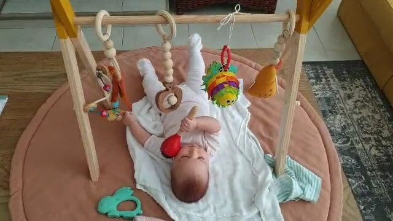
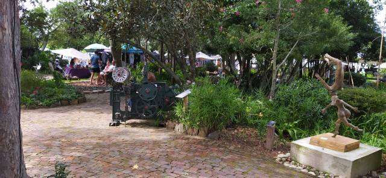
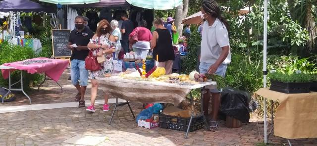
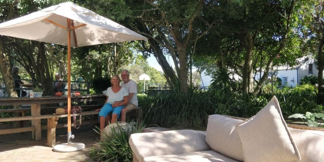
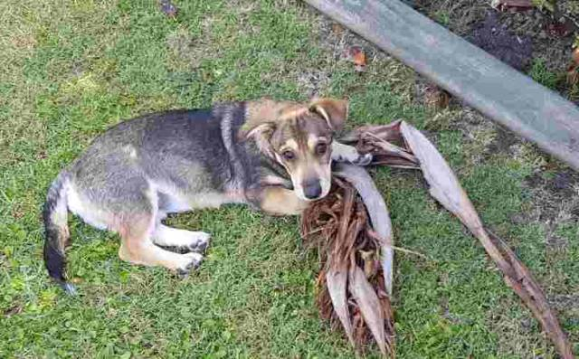
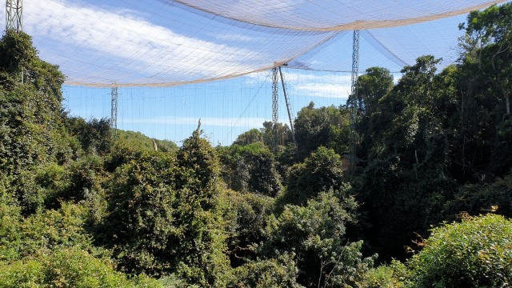
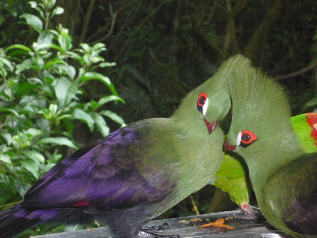
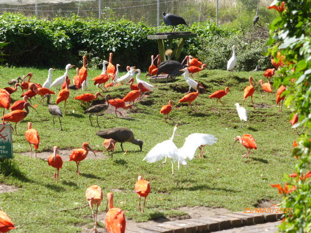
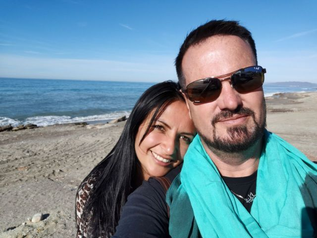
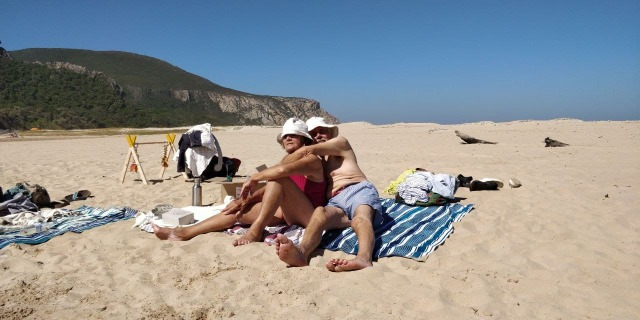

## Holiday Happenings

##   

A few days of pottering around locally, including a mid week craft market ‘Old Nick’ s, where again lots of novel craft ideas and some excellent bronze sculptures were displayed. There I bought Eleanor’s first percussion instrument.. a ladybird rattle.

Also useful to ward off Tilia’s over enthusiastic, morning licks. Daniel exhibited his body beautiful to indulge in some open air reflexology after which we bought, which proved to be, an absolutely delicious butternut quiche for lunch.

  

Tilia was in a really crazy mood on our evening walk . Finding a companion who was still wearing its lead she challenged it to a race. Along the Riverside and back they flew, like bats out of hell. The other 'bat'’s owner managed to grab his hound, but Tili, no way was she going to come when I called her. Her wild energy had been fired.. Off she ran and then leaped over the bank into the river, an amazing belly flop, startling fishermen mooring their boat. She wasn’t going to let a few sea birds have fun on their own… she’d join them… But they had one advantage…. Wings… She continue her fun by drenching me with her vigorous shaking. Still not diminished of energy she found a large banana leaf with a thick stem which definitely needed killing off. It was among many that were awaiting collection after autumn pruning on a once neat pile. In spite of now being on her lead she tussled with this treasure, which, with her antics has since given us much amusement and is now in shreds all over what was a manicured back garden… Think it’s well and truly dead now!

  

Dare we show our faces again along the riverfront?

Today we visited 'Eden Bird Sanctuary.’ This huge enclosure houses exotic birds, both indigenous and from across the world which are suitable for this climate. An amazing place whose construction by local folk trained for the skills took 4 ½ years to design and build, and is the world’s largest single dome, free flight multi species aviary, up to 34m high.

The walk was sometimes steep with bamboo swing bridges to negotiate,

This is our second visit to this place and a little disappointed, as not nearly as many species as 7 years ago. Still amazing though… A wonderful totally ecological project.

A long face chat (time that is} with Julian on his birthday so lovely day. He is currently doing the props.for a T V series in Madrid. He misses the mountains and sea, and of course Lorena, Manola and his dogs, but has another 5 weeks to go. The money is very useful though!

Had a couple of cold wet days, but a wood fire on Saturday and Sunday evenings kept us warm and cosy.

Monday called the sun out to play, so we took a picnic to a local inlet sheltered by surrounding mountains. The coast had dangerous rip tides, but this lagoon ,Tsitsikama , was calm and safe. Dan ventured in but a bit too chilly for us.

Tilia resumed her madness after 2 days of enforced rest due to a strained leg.

In spite of her short legs she could easily compete with the swiftest of animals, both on land and in water… An amphibian… Still trying hard to take off after the sea birds but not quite managing it. Still puzzling it out.

Our last day at Plettenberg, we breakfasted in Old Nick, wandered the craft shops, then home to pack for our next destination,

See you next time

love Mnm xx
