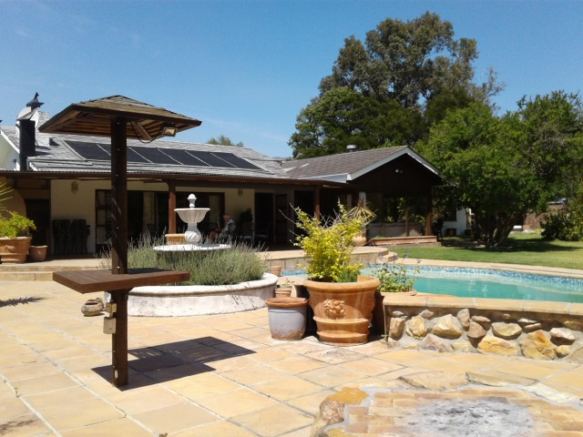
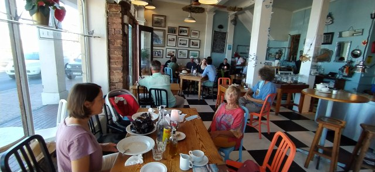
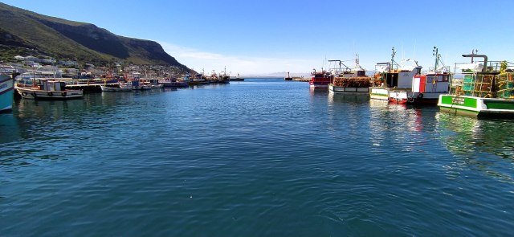
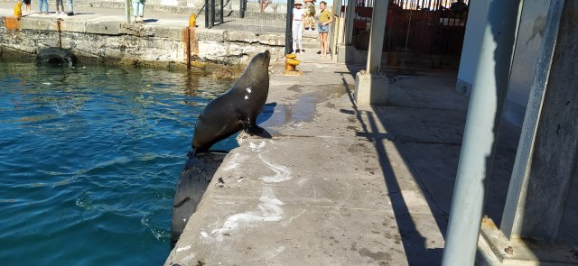
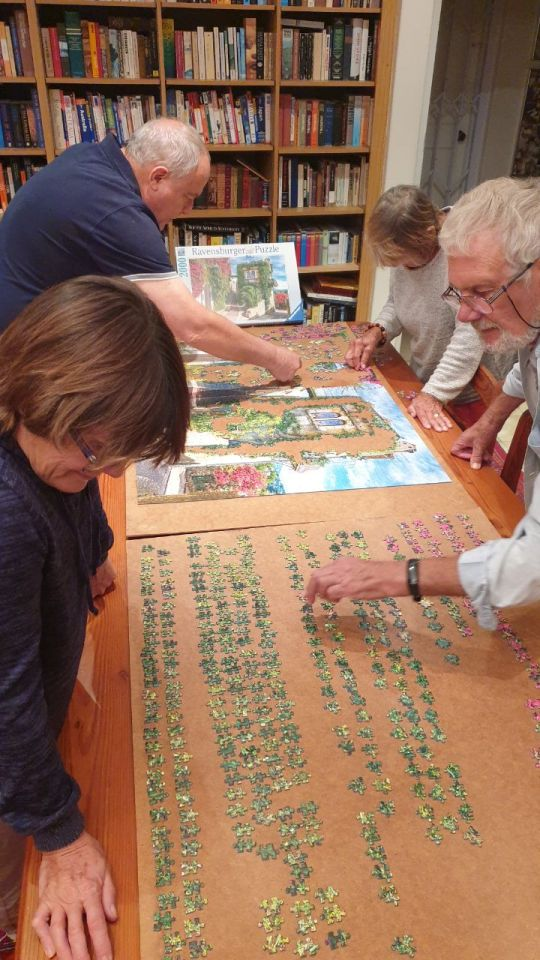
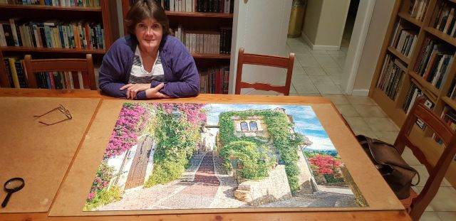
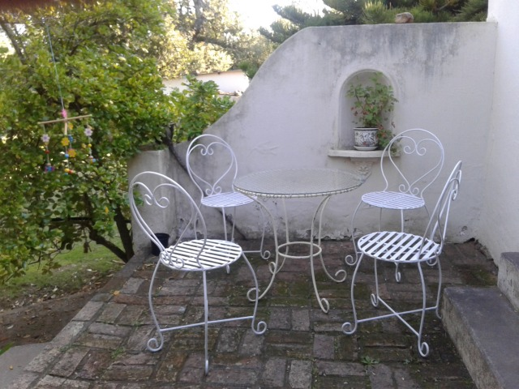
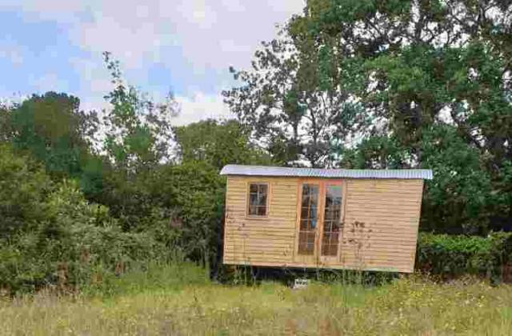
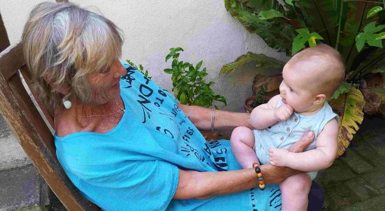

# 10 days in Constantia

Our plans to go to the farm changed due to a family bereavement. Instead we would stay with the outlaws in Constantia, Cape Town.

This is about a 9h drive from Plettenberg. The journey was broken by an overnight stop at friends of Catherine and Dan, at Swellenberg, who cooked us a delicious meal and we were entertained by their lively year old son and dogs.

We drove from there straight to Home Affairs in Cape Town to collect the outcome of Dan’s visa.. Finally after 5 years’ wait and 4 stages of approval the time had arrived. Then..‘quelle horreur!’ .. It had been refused. We were gutted! .

  

A very devastated family arrived at 'Chorley’, the family home bearing this awful news. The reason given was that Dan’s status changed from a working visa to a partner visa. Why had it got this far? With 10 days to appeal and with the help of Catherine’s father, Joe (a lawyer), the application was completed and submitted. Another hitch… Appeals were on hold. So seemingly we are back to square one… and just a tick away from applying for our retirement visa.

Matters got worse as both of us were unwell and the doctor advised for me not to return to Greyton until my infection had eased, temperature down, and fever had gone. At least after blood tests and scans I know my organs and blood are good.

After 10 days we return tomorrow.

We did have lunch out yesterday at Kalk Bay, one of my favourite coastal towns in Cape Town.

We had local mussels in the first restaurant we visited in South Africa.

Then on to the harbour to watch the seals come in for their daily rations from the street vendors, selling and gutting fresh fish.

They leap from the water and roll/lollop to the gutting shed along a well wobbled route. A tiring but lovely couple of hours.

  

Wendy and Joe had given us the challenge of a 2000 piece jigsaw… Already set up and ready to go… With many similar colours and textures.. A daunting but exciting task.

  

Completed by Wendy and Joe 2 weeks later. the town was St Paul-de-Venice in South East France.

Now back to Greyton with its beautiful fresh air and open liberty. Local shopping and coffee in town, then relaxing in the tranquility of High Hopes Gardens.

  

Mike is painting the wrought iron seats we bought for the porch at Columba. He then will help repair the shepherd’s hut, which nearing completion last year, was vandalised and copper fittings ripped out… Heartbreaking after all the thought and hard work that went into it. Also loss of summer’s rental.

I am busying myself painting a series of nine paintings from Thumbelina for the nursery. Strange using water colour on canvas but seems to work. A friend, Marguerite, an established watercolourist in Greyton lives nearby and we often paint together, so hope to benefit from her wisdom.

After an extremely hot day accompanied by a dry hot wind ,(a South African Berg) yesterday, today is winter. Cold torrential rain! Dan has lit a fire, Catherine has made an apple cake, so off to Columba for 4 o'clocks’s before it goes.

Be back soon..

Love MnM xx
