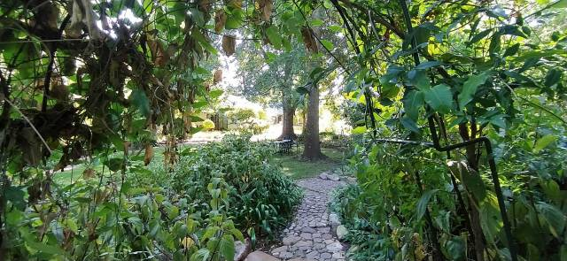
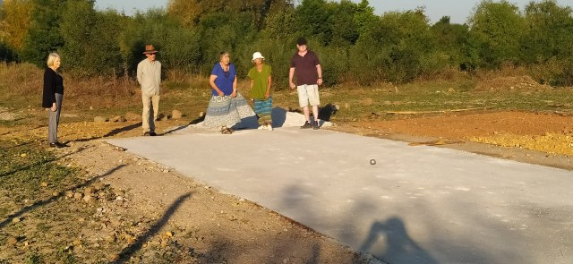
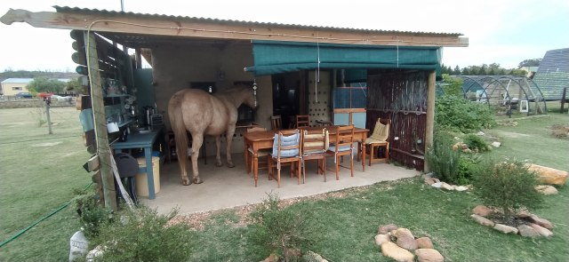
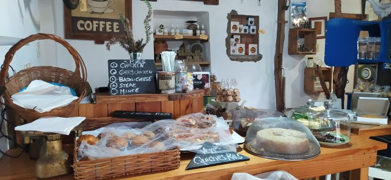
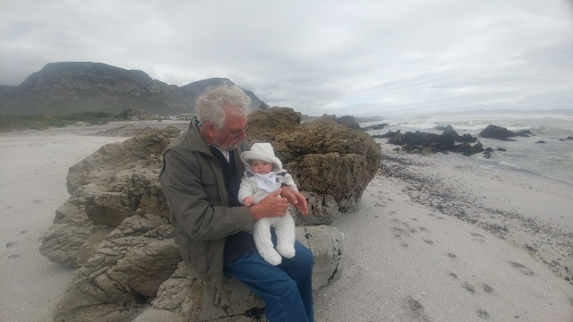
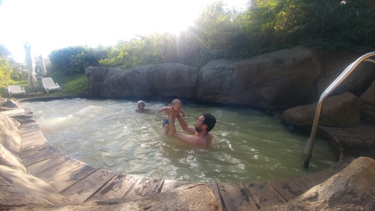
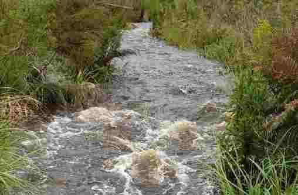
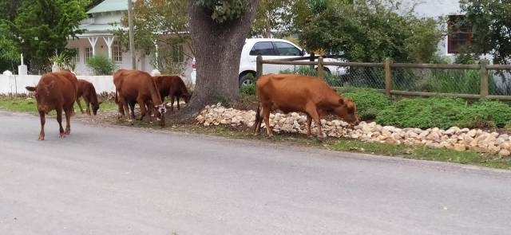
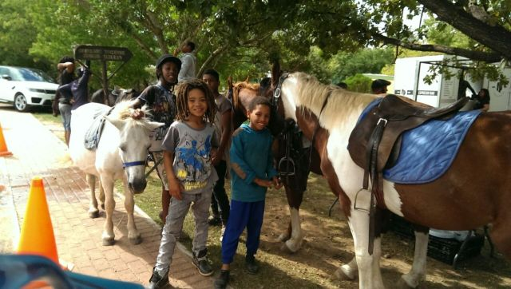
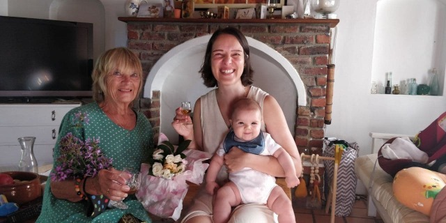

# Now at summer’s end.

Autumn has well and truly arrived with its very temperamental weather pattern, already disrupted by climate change. We need to be prepared, but with just a very small winter wardrobe it means layers when needed to keep the draughts at bay

As I start this blog from 28th April, the sun shines, but nights are cold. Today I spent the morning painting with a friend, Marguerite. We have quite different painting styles but it’s a great companionship. Lots of chatting and cuppas too!

Wednesday half price beer evenings have returned to Potter’s Bar, where the beer is brewed. We missed Dan and Catherine’s company as they know so many folk, but not ideal for Eleanor in the evening. The beer and crunchy chips, enhanced with herbs were delicious around a fire indoors if chilly.

Marguerite came to paint with me at High Hopes… She certainly knows how to capture the scene

The afternoon found us playing petang on a new boules piste at the retirement village. Our worries about being a bit rusty were soon allayed and we certainly didn’t let the French reputation down even with the distraction of wandering cows on pitch. A friendly and welcoming group with after match drinks too. Looking forward to the next game.

  

A trip to look at some completed shepherd’s huts gave us a big insight into how rural folk really live. A huge farm, with horses, (who were a bit too friendly for my liking), dogs of all varieties, from mini to maxi… A huge, intimidating Great Dane, a bit scary for someone of my stature, and any other creature looking for a bit of TLC, wandering freely around. An amazing lady ran rural retreat holidays here, practising yoga with the donkeys, meditation with the horses. The mind boggles!

We then had an amazing curry at a local restaurant, whose owners not only supplied water for Tilia, but a blanket for her to repose on. A nearby table allowed Dan to change Eleanor Al fresco… Nothing like a bit of sun on the bum!

  

Hoping to meet some like minded people, I ventured to a local art class. My water colour needs some direction. I joined 4 others in the group. Teacher gave us each a board to rest on. I had paints but no paper… neither did she.. Well not to give away anyway. Thought the fee would have covered this. Another pupil have me a sheet so we could commence.

Saw nothing ready to paint. That’s because the subject was from a beginner’s book of water colour painting from which she started to demonstrate, passing the book around,

Not for me… so I went walk about and collected some blooms and foliage from the garden. How was I to know the gardener was watching?

I dutifully did my wash, then sketched my flora scattered on the table. I sorted my colours and splashed some on each flora. Teacher came to me after advising the others. She approved the mix and application. I then asked how to paint the details. ‘Oh!,’ she said ’ you can leave it like it is. If you want detail you should have left blanks.’. Bit late to tell me now.. I obviously should have painted the hills and sky. Like a child, I scribbled all over it, had my scone and coffee, then went home and tore up my masterpiece. I won’t be returning to copy birds next week. I prefer my own experimental attempts.

Still having problems with my super sonic hearing aid and no release from muzzy head, I returned to specialist in Hermanus. He advised that it might be a good idea to read the instruction booklet re. maintenance, I didn’t know I had one. Think it’s me that needs the maintenance. I must wait for return to Spain to have a sensor fitted in my really deaf ear that transmits to other ear thus equalising my hearing. This should remedy the feeling of disorientation. All clever but expensive stuff

Whilst we were in the Clinic Dan and Catherine collected a trailer for their bikes. It is Eleanor’s carriage . We then bought some fish and chips and had a very blustery picnic on the beach. At least the rain let the sun have a turn of exposing itself. Eleanor was fascinated by the wild sea ,huge waves crashing over the rocks. It felt extremely healthy.

Next, shopping to complete an exhausting day then home to tea round the fire.

Eleanor had her first baptism in the warm spa waters of Caledon Thermal baths. As mentioned before, this beautiful historic town set in the Overberg region is blessed with mineral rich earth which provides the healing qualities of the water.

There are 4 baths of different temperatures and force. The top one is so hot and torrential its impossible to spend more than a couple of minutes in it. The others had varying degrees of heat. We chose to spend most of our time in the oldest original pool, a mere 40 degrees C. Such simple rustic surroundings with basic changing facilities. It was wonderful, and we all felt uplifted after an hour or so of wallowing. The only thing lacking was a tea room perhaps. It certainly got me moving again!

So back again hopefully soon.

4 days of constant, mainly torrential rain, meant I was able to finish some of the Thumbelina paintings for Eleanor’s room. During this awful weather, our host’s dog went missing whilst walking along the river. A search party was organised and advice of mediums sought. After searching through the night and the next 2 days, the worst was feared… The river was now surging and the 16 year old dog was blind and deaf. Then.. a miracle.. A young lad who was scouring the river saw her, marooned on a small island. He rescued her and there was a tearful reunion with owners. She is now recovering after vet treatment and had physiotherapy to help her recover from physical injury. The 3 mediums all had different predictions, but in each case their prognosis was right. This is an amazing gift of insight.

Walking Tilia, who has become very frisky of late, we encountered a gathering of cows enjoying their roadside munch. She usually ignores the horses who wander freely, but these creatures stirred her up resulting In high leaps and barking on her part and a stampede on theirs. No amount of calling would stop her. She then returned to taunt the rest of their gang on the other side of the road. A nightmare!

The following day I decided she would stay on the lead and learn some manners. Not an easy task for either of us.. She is very strong and wilful and my arms only stretch so far.

All going well.. Then a young coloured lad (they are brilliant horsemen) came galloping up the road with a small child hanging on to him.. They have no fear. The object was to round up another horse who was obviously not where he should be. This horse stood stock still then turned around toward the main road.. (Well mainish anyway) In the meantime Tilia was spooked and leaping up and down,taking my arm with her. Horse no. two then cantered along the mainish road with a few acrobats en route. Being market day there was some traffic disruption. Fortunately there are stop signs at all junctions, I think mainly because of the free wandering of animals. There is a huge awareness in drivers too, so very few, if any accidents. The horseman had circled on round the block at the speed of lightning and was now coming towards us to confront the bewildered horse. He leapt off, tied his stallion to telegraph wire and stood with his arms aloft.. Not quite sure why…Horse no. 2, ignored him and cantered off towards the market. Maybe his turn to give rides! Another galloping display, accompanied by barking dogs, concluded our supposedly dignified walk.

  

South African Mothering Sunday seems an appropriate time to finish this probably penultimate blog

I gathered some little white scented rosebuds from our garden and made a posy for Catherine from Eleanor. Dan also gave me a hand picked bouquet from his neighbours’ garden… .not just greener grass, but also flowers grow better on the other side.

We lunched in Greyton at a lovely rustic restaurant 'Heart and Soul’ offering a delicious buffet, which is paid for by the weight of your filled plate. Mine was pretty heavy. A short (now torrential) river walk then a little celebratory tipple at Columba completed a lovely day, during which the sun happily beamed down on us.

That’s it for this time.. Enjoy your new freedom.

Love MnM xx
