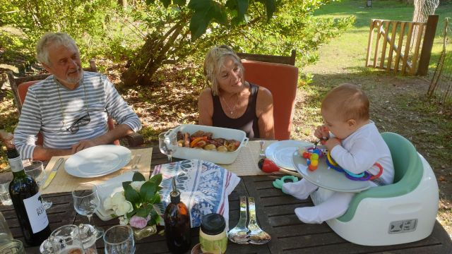
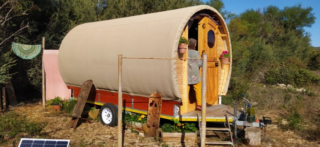
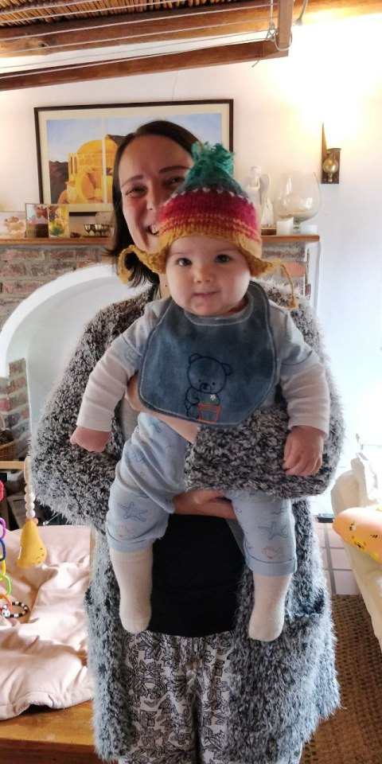
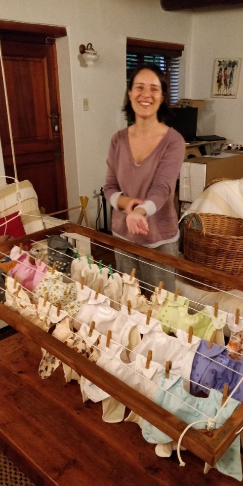
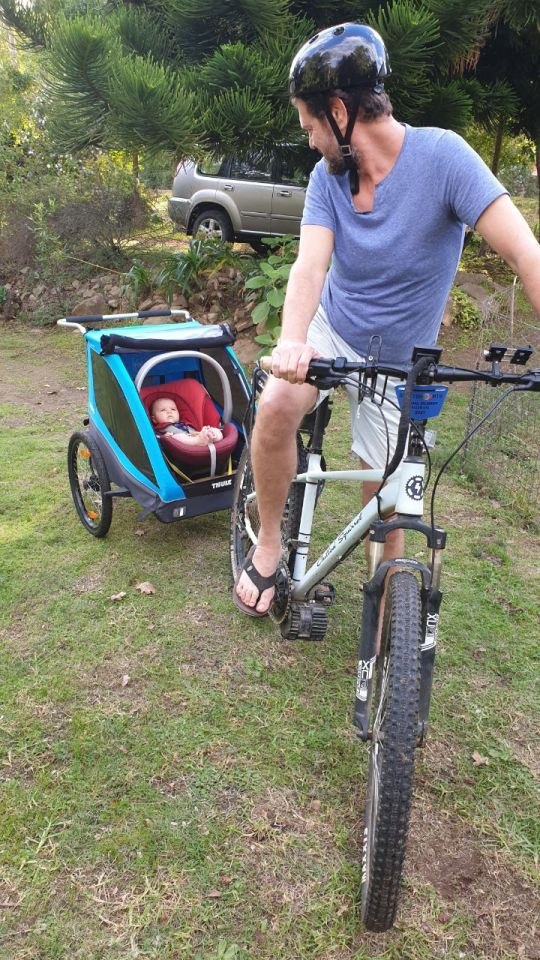
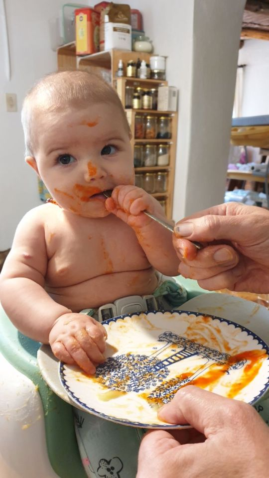
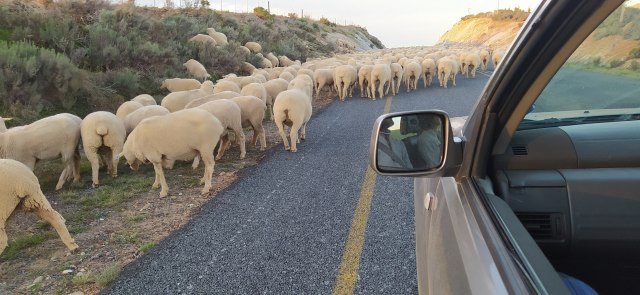

# Goodbye Greyton

Have we really arrived at the end of our 6 month stay. What a lot of water under the bridge. What a lot of memories to store.

The weather here is very erratic, with so much rain this autumn/winter. From hot sunny days to below 9°at night. So now looking forward to Spain’s welcoming all round warmth.

We’ve had a few braais which is our favourite way of eating.

Wouldn’t Eleanor love to get her hands on a drumstick? Everything she can grab now finds its way to her mouth.

  

Went to look at some gypsy caravans, how the design can change and still incorporate the authentic look and feel.

The walls are made from tenting fabric very durable and good to look at. The interiors are well organised and have all that is needed for a comfortable stay. The biggest asset is the relatively low price in comparison with the shepherd’s hut. After much investigation and discussion, Dan and Catherine are ordering one to be built to their requirements. This means they’ll have 2 rental properties hopefully this year.

  

Thoughts are now focused on the needs of our growing granddaughter. She will need somewhere safe to vent all her incessant energy. The cottage is quite hazardous for her freedom, so Mike is going to build a bed that will fold against the wall in her room, able to accommodate guests (they’ll be folded within) and she can play safely. A child /Tilia gate will open onto kitchen and lounge so she can keep an eye on mum and dad. Hopefully the wood will be delivered on time for the construction to start.

Mike has already made an airer on pulleys that can be hoisted in the to the ceiling in front of fire to dry and air her nappies. The type that most of our mums used. No disposables for her. She has brightly coloured pants with throw away liners. With adjustable poppers they will fit up to 2 years old.

Eleanor experienced her first proper trip in her trailer carriage to Greyton market. She enjoyed bumping along attached to Daddy’s electric bike. Catherine rode behind on hers with Tilia romping alongside. A family outing to get the vegs!

The trailer also makes a very roomy pram, looks like a 3 wheeler Reliant, and very easy to manipulate. So daily walks encourage a very reluctant little girl to sleep.

Joe and Wendy were able to make a brief visit for lunch and we enjoyed Eleanor’s introduction to real food. She certainly wasn’t happy about all the tastes and let us know in no uncertain terms. A few days later with the help of daddy’s enjoyment she managed a few mouthfuls. Pureed sweet potato, red pepper and quinoa with a squeeze of naartjie juice. (Google may help here!) She very definitely rejected beef.

The bed frame is now constructed, but needs more parts, so awaits completion.

Fencing for the land has arrived and the lei water channel is being renovated for next Spring. The water supply is closed off so the whole village can be done Major pruning work is happening in every street, to keep Greyton the beautiful place it is. The horses donkeys and cows are of assistance here too.

A huge surprise and great relief… Our residency in Spain has been approved. This means we have more chance of a trouble free entry into Malaga. Thanks to Lorena who kept up the pestering.

Marguerite treated me to breakfast in town to say goodbye this morning. We had our last visit to the thermal baths in the afternoon. A cloudy day with a fresh wind so it was sheer delight to submerge in the hot waters.

A slight hold up on the way home…whichever way we looked there were sheep with one very harassed herder…Tilia could have done better in half the time…..Now that’s an idea !!!

  

Now to pack for our last few days staying with Joe and Wendy in Constantia, Cape Town.

This is the last written blog from S. A… My Thumbelina pictures for Eleanor will follow.

Thank you to those who’ve written. It’s been good to hear from you in the Northern hemisphere.

Lots of love and good wishes from us both

Maureen and Mike xx
