Our covid vaccinations have been awaiting our return from SA. All very well organised and efficientally executed. This totally negated our belief in the Spanish 'laissez-faire' attitude. In this instance anyway. We were soon to learn that it indeed does still exist.... And mañana is never the next day! We thought that France slowed us down, but we're now so slow we'll soon be going backwards..!

Our first resident guests were Esha and Luna... Our grand dogs. With Julian in Madrid, and Lorena and Manolo having to go to Valencia, (5 hours away) to get the necessary paperwork to allow Manolo to visit his father and family in Columbia, gave us the pleasure of dog caring. Not ideal in a first floor apartment but plenty of space outside for walking and romping.......us the former, hounds the latter! The front balcony was shady for them to sleep and in the heat , loved to spread themselves across tiled floors, usually in a door way. Morning walking was along a lane to the mountains and open scrub-land. In the evening they reveled in the beach night time walks and swims...always a roll in the sand and a good shake after... always with a poo bag!... so obedient, a joy to have them.

[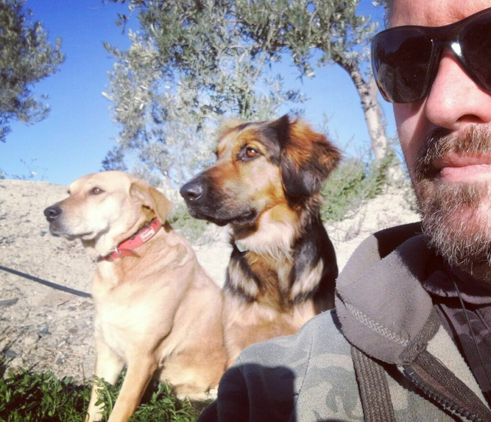](https://www.artamo.click/wp-content/uploads/2021/10/No-10b-Dogs-julian.jpg)

[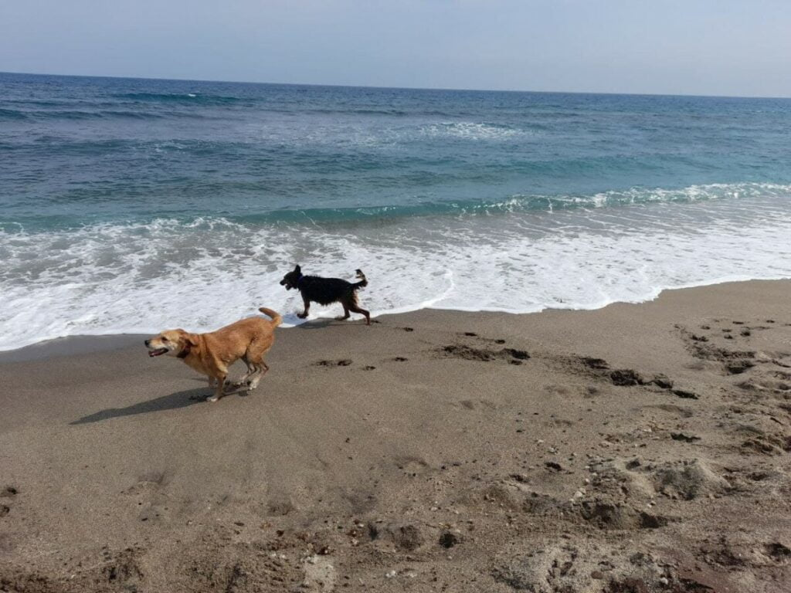](https://www.artamo.click/wp-content/uploads/2021/10/No-10-Dogs-in-sea-.jpg)

[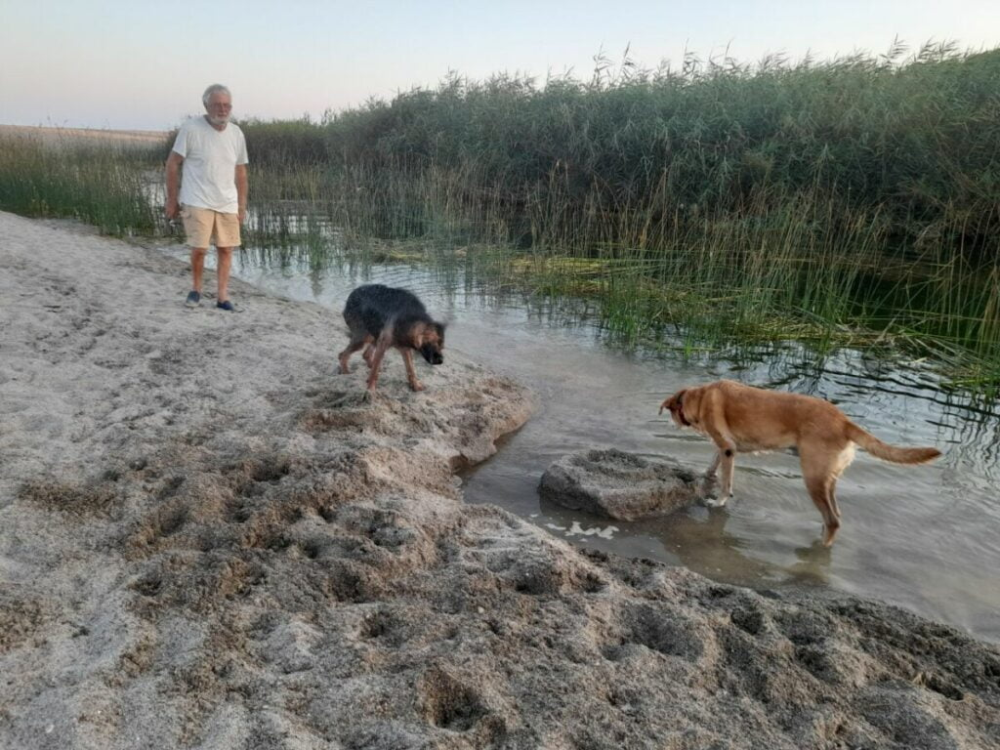](https://www.artamo.click/wp-content/uploads/2021/10/No-10a-dogs-in-river.jpg)

Internet and TV were installed. A super duper fibre optics system making life much easier. Air conditioning followed, we had already installed fans, but extreme August temperatures necessitated more. All of these operate silently and easily controlable. Just the thing for siesta time an endorsed ritual here. Everywhere shuts at 2 pm and reopens at 5pm. Noise is kept to the essential. I use the time to study Spanish, to which I have become addicted, every day for about an hour or more and am chivied along by Michel Thomas, a recorded linguistic teacher, who also helped my French. Spanish seems easier and I am now rewarded by being able to string a few words together.

[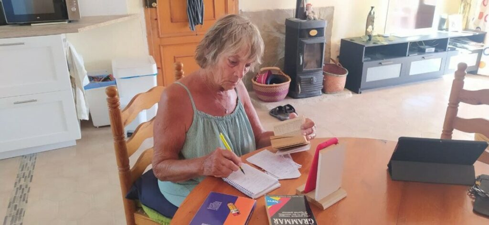](https://www.artamo.click/wp-content/uploads/2021/10/No-11-mo-spanish.jpg)

 

  My very dear friend Delia's eldest son Glen, was tying nuptial knot in an Edinburgh Castle.We have watched him and his younger brother Robbie grow up. Super young men now. Both obtained their degrees and are now in UK. Covid had delayed the wedding for a year and this time Delia was unable to go. Not to miss out we were invited as guests to 'the service' in L'ampolla, a lovely fishing port, 2 hours from Barcelona.

We donned posh frocks n hats or titivators.... Whoops sorry.... fascinators, donned buttonholes from garden, and enjoyed a Jerry (Delia's man) special lunch with champagne. All was good until the actual ceremony, when it seemed all the world and his wife tuned in and we lost contact. However Delia managed to share it on her phone with Glen's delighted grandad.. so all was not lost. A few days there recharged our batteries.

\[caption id="attachment\_1418" align="aligncenter" width="768"\][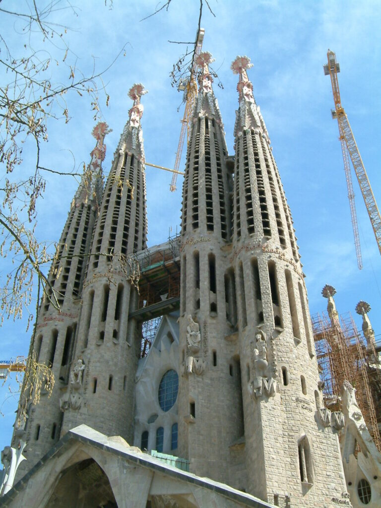](https://www.artamo.click/wp-content/uploads/2021/10/No-13-barcelona-goudy-.jpeg) Sagrada Familia Gaudi’s unfinished Cathedral. Barcelona\[/caption\]

\[caption id="attachment\_1417" align="alignnone" width="1024"\][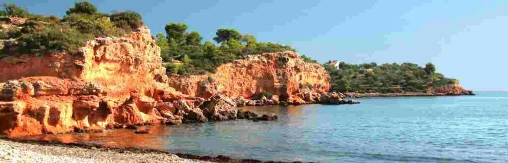](https://www.artamo.click/wp-content/uploads/2021/10/Lappolla.jpg) Swimming cove on L'Ampolla coast\[/caption\]

July and August brought soaring temperatures. Luckily South African summers had prepared us for heat and we were not too uncomfortable. A beautiful pool to cool off in and the sea virtually on our doorstep. Manola left for Colombia giving us another couple of days with Luna and Esher. Lorena took him to Madrid for a emotional goodbye... Julian returned for a short break to Tabernas. We collected our Spanish residency cards from Almería.....We are now legally here.. Whoopee!

[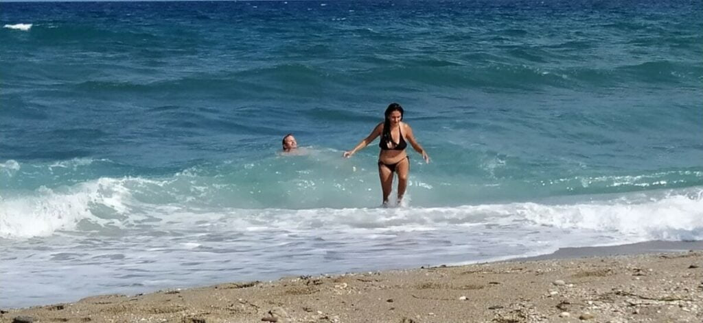](https://www.artamo.click/wp-content/uploads/2021/10/Lorena-in-sea.jpg)

 September brought cooler evenings and the scorching days subsided. The sea is more lively and the challenge of fighting the waves is so exhilarating. We take our beach chairs and books, some fruit and drink to the waters' edge Sometimes get caught out by a frisky wave..then an attempted swim

 

[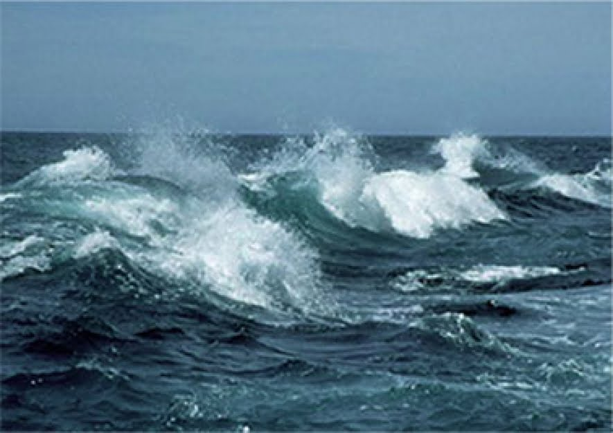](https://www.artamo.click/wp-content/uploads/2021/10/Rough-sea.jpg)

 I cleaned up the old sink, hob and oven and traded them with a local dealer for a rocking chair. Just needed a coat of paint.. or so we thought! Mike started rubbing down.... The leg fell off.. Woodworm and rot that had been cleverly hidden by wood stain. Mike being Mike decided to renovate it.. The arm fell off... Then it crumbled!.. It will be returned in bits and I'll try to trade them for a quirky mobile I saw in the shop.. We'll see!

[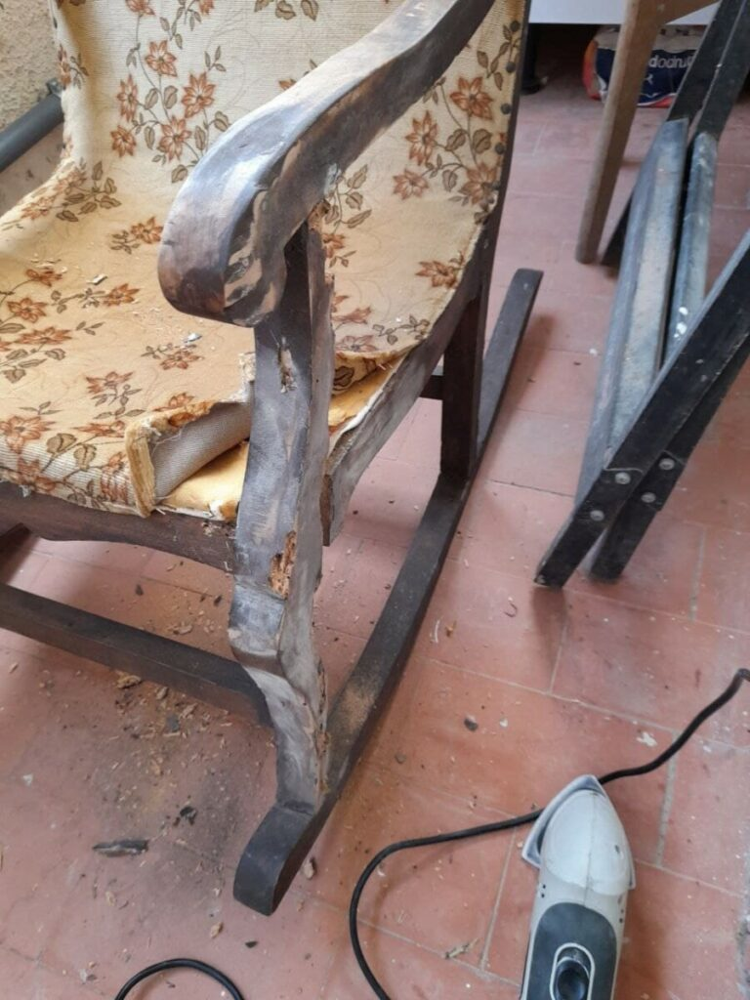](https://www.artamo.click/wp-content/uploads/2021/10/No-17-Chair-wood-worm.jpg)

 

Now we have all essential furniture, apart from a rocking chair!.. It is the wall's turn for prettying up. All my art equipment is in storage, so made do with what we have...card from packing boxes ; emulsion ; plaster ; grouting.. The cheap Chinese shop (Mike's favourite) supplied some acrylics and 3 frames. I carved cacti from the card.. A right mess too ! Painted them colourfully then a few blobs of silver and gold to satisfy my quirky new, for the moment, me!

Next an even messier task.. I love it... Spreading plaster and grout on the frames.. Into which I sunk the images. Did they want to stick..? Oh no.. Mike to my horror suggested staples... But I had a better idea.. little boulders off the beach to weigh the card and stop its edges turning up.. Let it dry and 'Voila'.. Sorry! wrong language.... ' Listo'... or 'There' (my linguistic talent eh?)

It worked.. The metalic acrylics really glow in the light..

 

[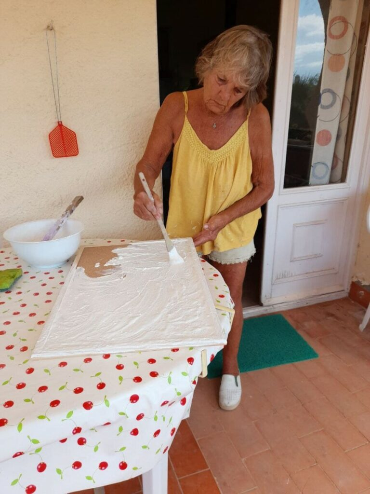](https://www.artamo.click/wp-content/uploads/2021/10/No-18-Mo-Plastered-.jpg)

 

We now seem to have some semblance of a routine..A cheery "good morning" from Eleanor starts the day, when we share our breakfast, nursery rhymes and giggles on screen.

[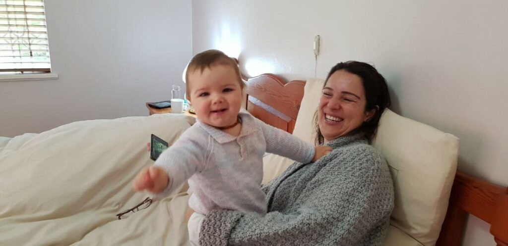](https://www.artamo.click/wp-content/uploads/2021/10/No-20-EK.jpg)

  [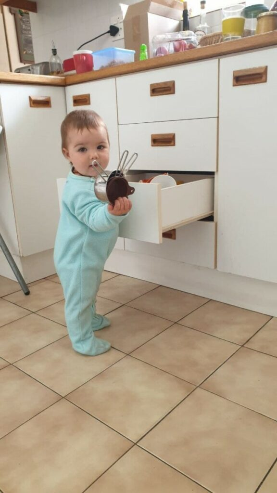](https://www.artamo.click/wp-content/uploads/2021/10/E-standing.jpg)

 

[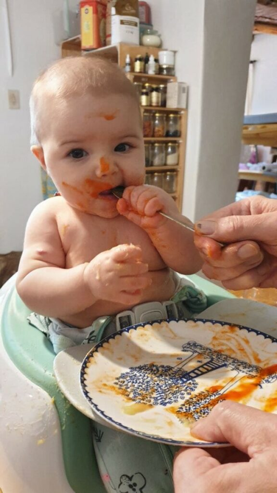](https://www.artamo.click/wp-content/uploads/2021/10/Baby-feed.jpg)

Then sometimes a walk, or shopping in the morning, a coffee break with a ' tostada aciete ' (toasted roll with olive oil and a little salt) The local bars now know us so don't have to order. Afternoons the obligatory siesta, then 4 o clocks’s.. Tea and biscuit.. Yes still have them. Then maybe a read and swim in pool and or sea. Sea first so we can wash sand off under pool showers.

We have the choice of markets each week, all with fresh vegetables.. still have the dirt on, and sometimes wiggly bits, but taste good, and of course, the cheap clothes. The Spanish vendors, louder than loud, yelling, drown any chance of hearing what could have been musical talent. Do they enter the world with these vocals?

[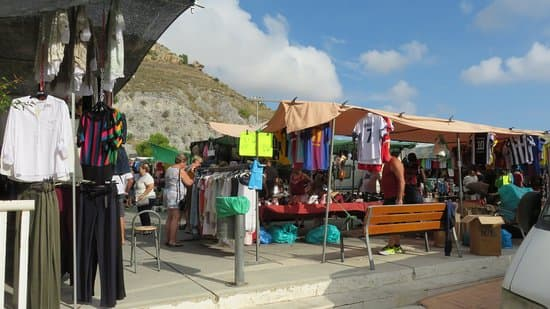](https://www.artamo.click/wp-content/uploads/2021/10/photo_2021-10-19_17-03-14.jpg)

Sundays we usually find a new location to visit. Some very interesting towns, some not so exciting.! We are hanging on to a thread of hope that we will move to Greyton, the alternative being to settle in Spain, so we're 'sussing out' suitable places.

 On such like trips I surreptitiously do a little thieving.. Succulent cuttings (they so easily snap off!) for our verandah boxes. With a good variety should make an interesting show. Need something to take the eye off our sun blind.. Well was once... Mostly strips of fabric now, after being at the mercy of the strong east coast winds for a few years. Mike has managed to see our huge safety pin them together as they offer some shade.. Now punk blinds.. We await delivery of new ones.. Mañana maybe?

[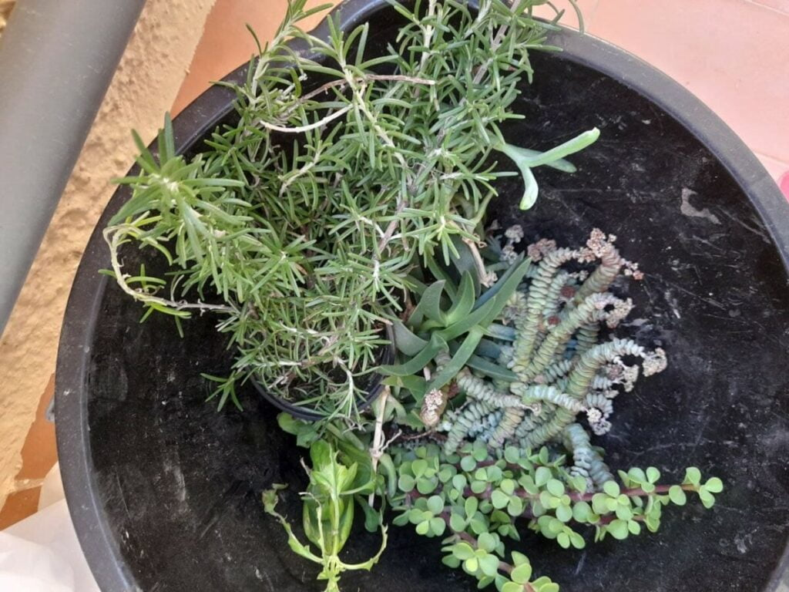](https://www.artamo.click/wp-content/uploads/2021/10/Cacti-for-pots.jpg)

We are hoping to join a Petang group if it reassembles post covid.. If not we'll start one. There is a boules' piste and club house waiting to be used. Quiz nights are hilarious on Sundays.. but more serious and brain searching (for a brain that is) on Wednesdays. Friday we are going to look round Patas/paws, a dog and cat sanctuary where we are considering voluntary work.

Then to tie up this little story, we have booked our flight to Cape Town for 30th December so will be there to celebrate Eleanor's first birthday. Daniel's visa has now been lodged in an appeal court.

. So again we wait...... Mañana.

Adios

Muchus luvus

M n M xxx

[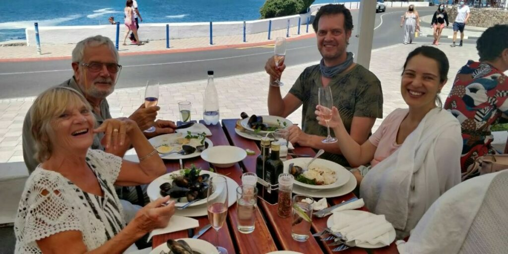](https://www.artamo.click/wp-content/uploads/2021/10/wet-the-babies-head.jpg)

[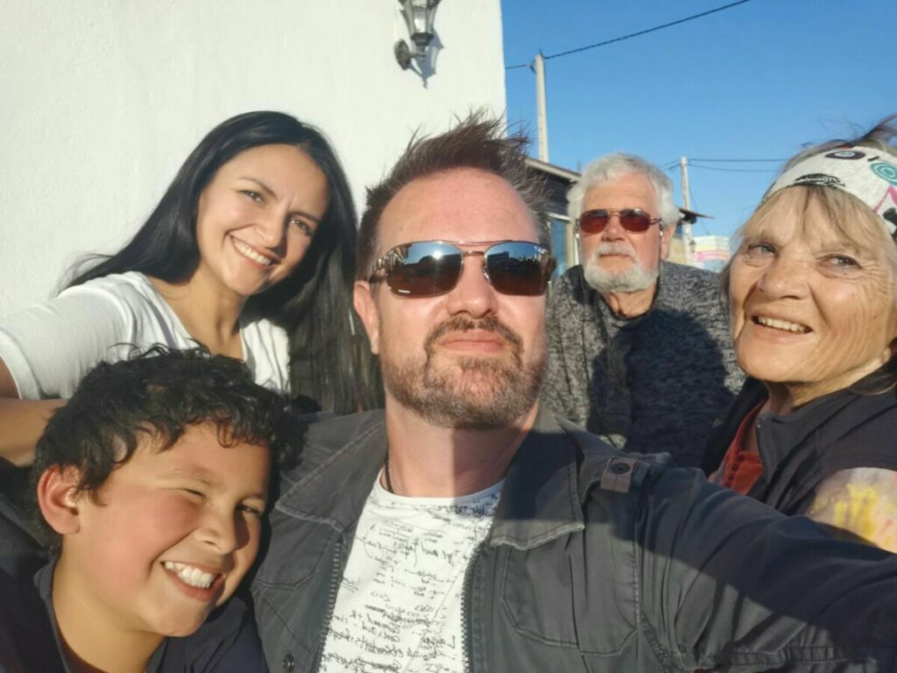](https://www.artamo.click/wp-content/uploads/2021/10/463502577_374901.jpg)

\[caption id="attachment\_1435" align="alignnone" width="1024"\][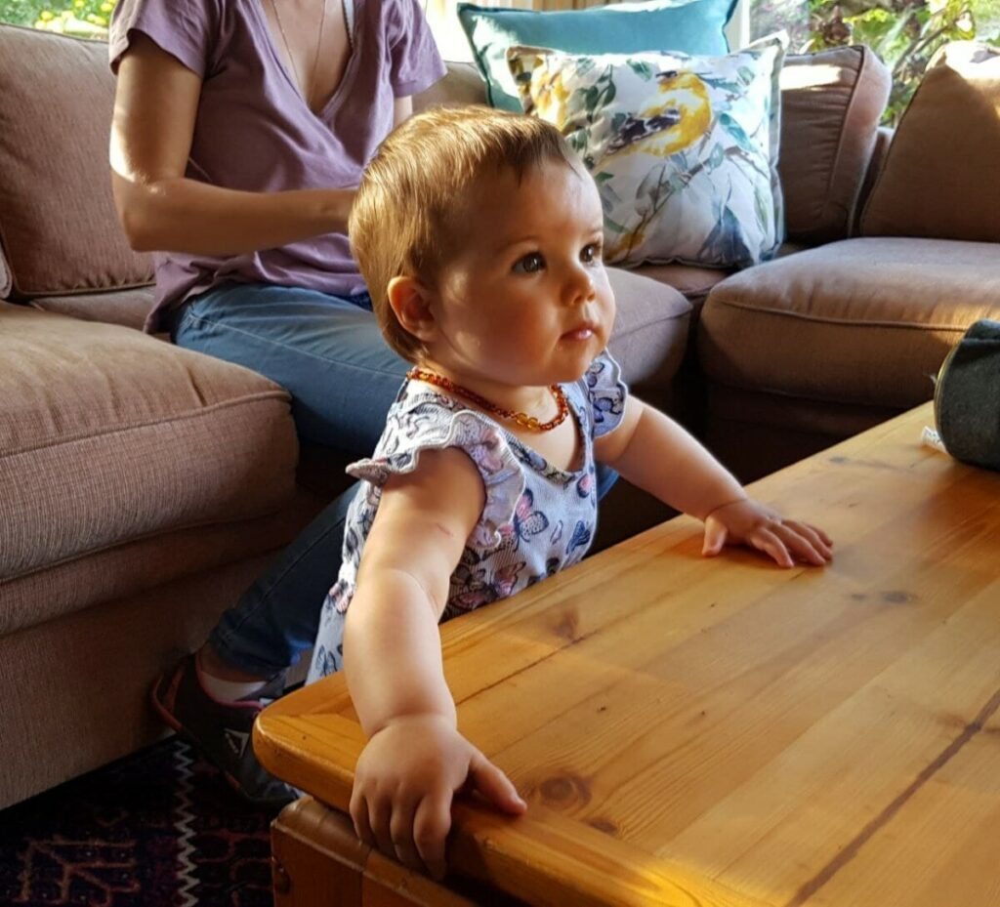](https://www.artamo.click/wp-content/uploads/2021/10/No-22-E-on-table.jpg) Medicinal beads to soothe teething\[/caption\]
