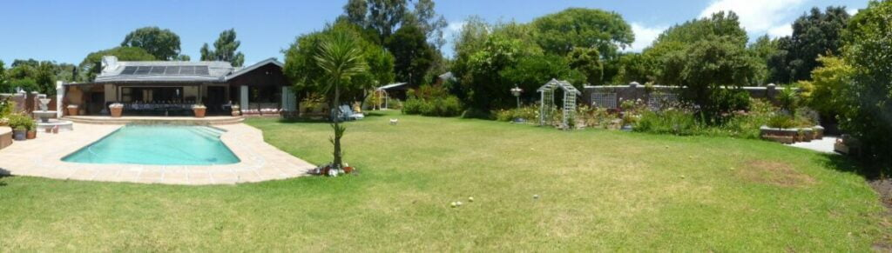
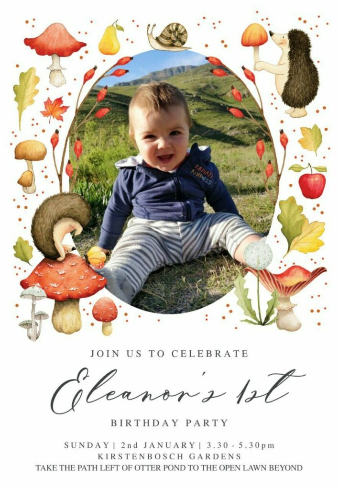
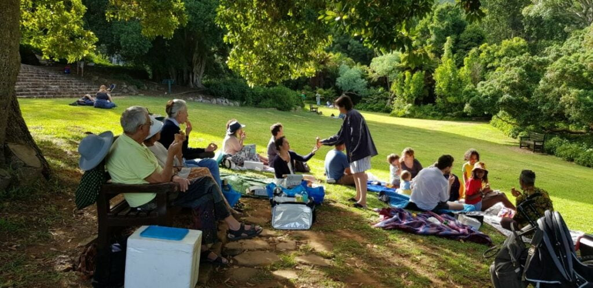
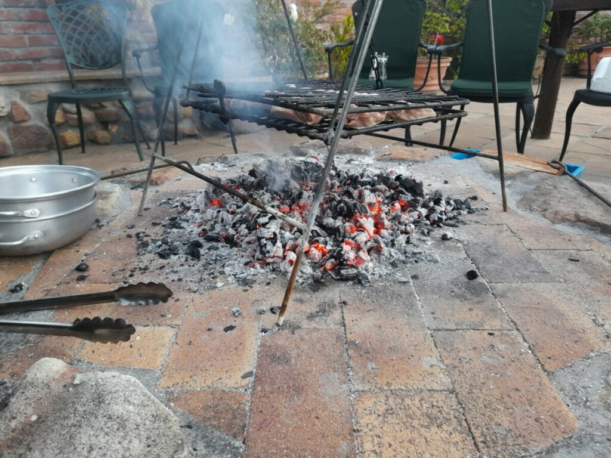
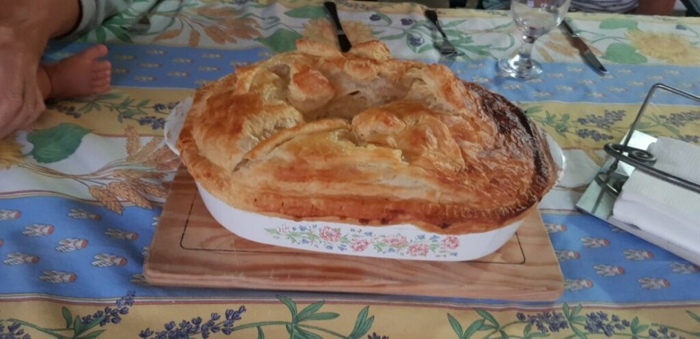

Once again we have defeated the Covid pandemic. We, the intrepid duo, will not be beaten. We did it before, we'll do it again! This time, a year later, with two  cancelled flights on airlines refusing to fly to South Africa, we sought a third, Swiss Airways. Every day until we left we dreaded that this one may follow suit, especially as the new variant Omicron raised its ugly head. Lady Luck was on our side, however, and with blood streams surging with anti viral drugs, noses and throats swabbed, and an abundance  of necessary documentation we  travelled, albeit with some trepidation. Circumstances can change so rapidly in such a precarious crisis . The journey was longer this time as involved a seven hour stop over in Zurich, but much less stressful,  and went to plan. Were we relieved to clear customs at Cape Town air port after a thirty hour trip.?

In spite of having 'seen' and 'played' with Eleanor almost daily, over the last six months she has grown up so much. A joy to see Catherine and Dan, who were smiley too, of course! Then back to Chorley, Catherine's parent's home in Constantia, near Cape Town. It was like we had never left, a warm return and a cup of tea.'

<figure>

<figcaption>

Catherine's parents' home

</figcaption>

</figure>

New Years Eve was a quiet affair. Catherine's  siblings called during the day. With Wendy, Joe, Bill and Peggy, her grandparents, we celebrated with a chicken braai, champagne and an early night.

Pictures 3,4.... braii ...nye

Sunday... It, was the big day! Our little 'peanut' bump of a year ago was now a fantastic one year old, Eleanor. First thing, with Wendy, I went to a local nursery for her present. Donating to her piggy bank, or rather the pewter Cinderella carriage we bought for her actual birth, isn't very satisfying for her at the moment, so bought her something more tangible too. A blueberry tree, the beginning of  her own orchard! She has already sampled the leaves!

Pictures 5,6..... Cards...Blueberry tree

Friends and family gathered in the beautiful Kirstenbosch Gardens for an afternoon tea picnic. Blankets and rugs spread on the ground under the trees and a bench seat close for us oldies. The birthday cake was made from Catherine's home made ice cream which was delicately decorated with edible flowers, one candle, and served in sugar cones. Little coloured jellies were made in orange cups , after fruit was extracted. This is a family tradition. No waste  no washing up.. Brilliant ideas!... And the inevitable flask of tea. Eleanor loved all the fuss.. She adores people and being man /lady handled… Tearing off wrapping paper to chew was much more exciting than the gift within. A lovely convivial hour or two with all the folk close to Dan and Catherine, and their children. The day finished with a Thai takeaway and some bubbly to aid digestion!

Pictures 7,8,9. Eleanor s party

We need to apply for a three month visa extension.. Although they have all our details down to toe nail clippings, all has to be redone on line.. A long and tedious task. Let's hope it suffices. We have an appointment at the Embassy on the 17th.

That done, the two of us, headed for Kalk Bay, one of our favourite beach towns. Colourful, cultural, ethnic and familiar. Still very aware of pandemic risk, we were assured by the precautionary measures being taken. Ice box in hand we bought our evening supper on the harbour. One large fish with glossy eyes.. a sure sign of freshness, which will last the family a couple of meals. Lunch in Olympia, the first restaurant we visited eleven years ago, was simply delicious. The place was unchanged.

Pictures..Kalk Bay 10,11,12,13

Home via the mountain road, eyes skinned for the cheeky baboons who think of the road as part of their territory. Quite capable of holding to ransom for a packed lunch !

Once there had a swim. Eleanor is definitely a waterbaby and backs her way down the steps into the non too warm pool. So we must take the plunge too. Not so bad once  rigor mortis had worn off. In fact worth another dip.

A relaxing settling in time at Chorley.. Thank you Wendy and Joe....

Pictures. 14,15....Pool

Thursday, with the car packed to the gunnels we travelled to Bill's holiday home by Langebaan Lagoon.  Another familiar place we love.

We stopped en route for a light lunch. South Africa boasts many unusual, healthy food cum craft cafés. This one was no exception. Eleanor loves new surroundings scanning every direction and detail, a ready grin for all new faces.

She adapts into the day's happenings without a qualm, having her own travelling food in handy little tubes, sampling whatever we have, plus mummy's own organic on tap dairy.

Pictures 16,17. Cafe en route Langerbaan

On arrival at Langebaan, we shopped for supplies whilst the little family went to test the Lagoon.  "Lovely" they declared, "the water's warm and calm". After dumping the shopping, we scampered down to the beach and into the briny.." Arghhh!".. Their warm is colder than our warm. We've been spoiled by the Med. and its ambient waves. We gingerly waded further. A shudder with every step. Such babies! Even Eleanor has more stamina than us!  Then the plunge.. A bigger " Arhggggg"... Once submerged and thrashing around, we relaxed and enjoyed... Divine!

Langebaan..18,19

Catherine was keen to keep up the family tradition of collecting shellfish. So complete with buckets and a little blow up boat for Eleanor, off we went ' a winkleing' (their winkles are our whelks.!) ìn a nearby a rock pool bay. A bit of precarious scrambling, more like stumbling for me , confidence gone with the strength in my legs. With baby, boat, buckets and all we found Catherine's ear marked place. Perfect for a little boat to bob about. Eleanor, however soon dispelled this illusion. Being of her inquisitive mind, in attempt to see under the boat, the bobbing became a bit more turbulent and "Whoops!".. Over she went. Her first sea dive.! After a few moments of bemused wonderment, a huge smile lit up her face as Catherine, who was right next to her, hoisted her into the air. Straight back into boat for another turn. This time with daddy's help to whisk her around like a scrambled egg. She loved it!  One bucket of winkles/whelks was collected for supper.

Pictures 20,21....Rock pool winkleing..

Tilia had also had a marvelous time racing through the pools. Perhaps a bit too marvelous! She started retching on the way home, so Catherine stopped to let her out. Dan hopped out on to the verge to assist. His hop became big jumps.. He'd landed in an ants best.... In no time they delighted in finding a host  to torment!. Back in car, after this performance to find that Tilia had already regugitated fishy remains all over the car floor!....and Dan still fighting off ants. That evening we sampled some beer tasting with friends and it was then we discovered we'd achieved the day's p trio of ill events. The whelks that Catherine had cooked for supper had been caught too near a red tide which meant they are inedible.

Picture 22,23...Tilia in water..whelks

The next bay Northwards... Sharks Bay, meant a sloped boardwalk walk down to the beach, but well worth the effort. Dan and Catherine cycled there on their electric bikes so had easier access. The beach was the right consistency to make sand pies with our new bucket and spade. It was fun for us until I whacked too hard and split it. Eleanor was not interested, anyway, being intent in crawling at a vast rate of knots down to the sea. Headlong into the briny as though she belonged there. The delight on her face and waving of arms , singing too..... maybe sea shanties... was incredible to watch. She loved being ducked and dived by her parents, who frolicked like children themselves. Fish n lunch, home for a rest, then put out imaginations to the test with. a ghostly mind stretching/boggling board game

Picture 24,25,26.....Sharks Bay... Game

Back to Chorley to prepare for our visa extension interview the following week. Even more paperwork to prepare... Filling in, photocopying, checking, remedying, checking again, a nightmare. What happened to this paperless world promised with the advent of computers?

Wendy made a huge Desperate Dan, Buffalo pie for supper... Enough for the world and its wife. It was delicious.

Wendy and Joe also had an appointment in Cape Town, so we able to deposit us at the Embassy. With an hour to kill, we wandered around the centre. The architectural design of the office blocks reminded me of those in Hong Kong. Whether purposely, or accidently planned, the buildings were juxtaposed in such a way that one aesthetically reflected another in the huge panes of glass. At the time I questioned the purpose of the boring (teacher's fault) architecture lessons at school, but perhaps they instilled a sense of appreciation to be unleashed later in life! Sorry I didn't pay more attention Miss ' Whoever'. Couldn't resist a photo, maybe a later painting! After 2 hours of rigmorole.. Really don't know why, they must have our records from last year. .. We missed our lift back by 10 minutes. Wendy had another apptointment. Had lunch and another wander, then Dan picked us up later. Back to Chorley to pack yet again, to return to Greyton, and our rental cottage.

Pictures 27,28...Architecture..
