Another nail biting long wait in the immigration office in Cape Town. We collected our visa extension results..Yippee! Not too painful either. We lunched on the way home at a favourite half way restaurant. The Yippee turned to horror, after checking our visas. Oh no!... a mistake with the expiry date......and not in our favour, having cut our return date by two months! Why, oh why did we not check this at desk?.. So much confusion at the time, we just grabbed and ran.

Here we are two months later still visa less. So now illegal immigrants. So many mails and phone calls to relevant offices, all of whom passed the buck to yet another government department. In the meantime with advice, we cancelled this visa and re- applied, demanding a refund. On being notified that the second attempt was progressing and had reached the last process we awaited the collection date, which did not arrive. More frustrating calls and mails, revealed no trace. Finally found a hopefully reliable being who would investigate. This week, my result was ready, but so far nothing for Mike and no collection date. Still we wait!

The gypsy caravan has been delivered to Columba. The gateway had been widened, bridge over lei water strengthened and the meadow cleared ready for this big event. It was very precariously, but expertly towed to its home, nestled under the trees in its beautiful surroundings. Mike has put his design and carpentry skills to good use to complete inner convenience. Catherine and Dan have given me the honour of painting an Art Nouveau ”fresco" around the entrance door. This I hope to do at a later date. All very exciting. A few more necessities and it will be ready for rental.

[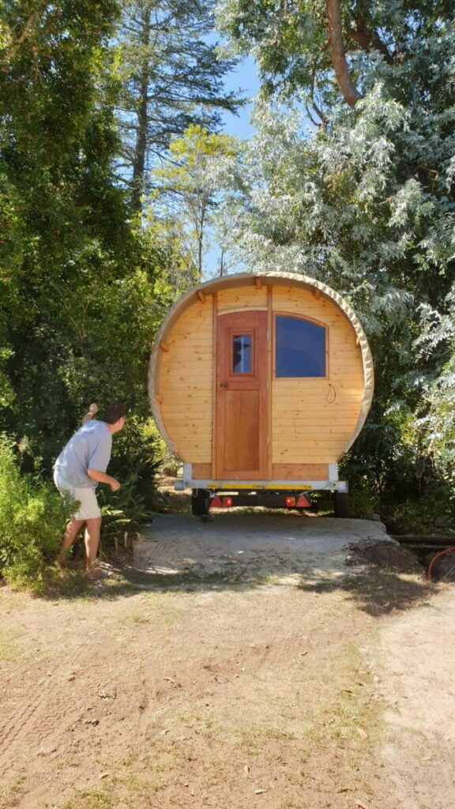](https://www.artamo.click/wp-content/uploads/2022/05/wp-1652000511479.jpg)

[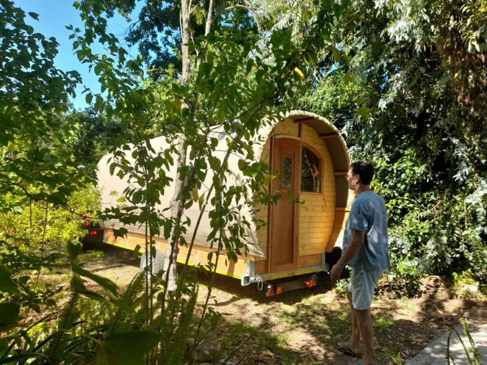](https://www.artamo.click/wp-content/uploads/2022/05/wp-1652002428418.jpg)

Their garage has now been extended to include a lovely accommodation for Catherine's consultancy. The outer wooden framework will support clear corrugated plastic and inside will be a potting shed. It will be ready for occupancy very soon and she can return to business. This will allow more space in their small cottage, with plans to extend when things are up and running.

<figure>

[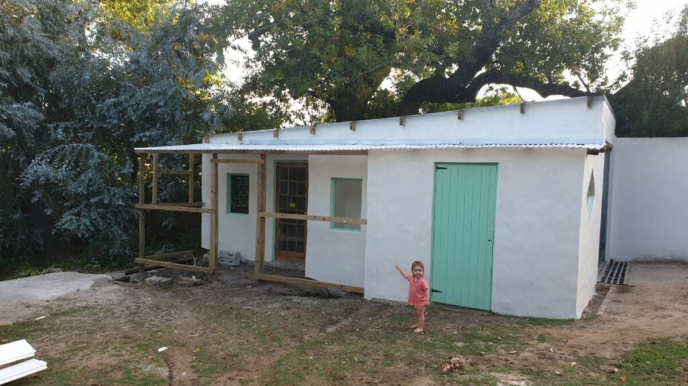](https://www.artamo.click/wp-content/uploads/2022/05/wp-1652000281752.jpg)

<figcaption>

Eleanor showing the way

</figcaption>

</figure>

The next big event was repairing their dam for irrigation and also a plunge if we want. This had already been done last year, but after torrential rain, an underground stream became a torrent and lifted the liner and displaced the boulders. It was devastating! The 'builders' made 'promises to redo, but these never materialized. Another group of builders was employed and re did the whole thing. A huge job. It is now completed, except for a jetty and a safety fence. It has aerating water spouts forming little fountains.The filtering system will be plants and natural vegetation.

<figure>

[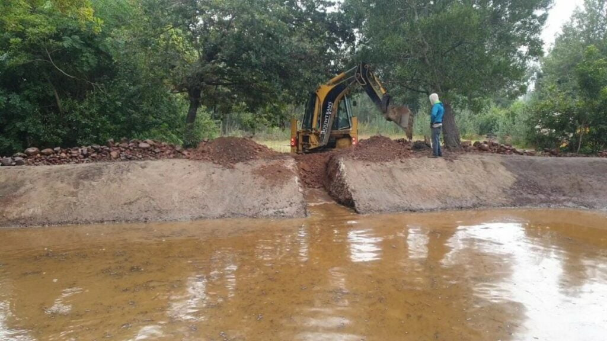](https://www.artamo.click/wp-content/uploads/2022/05/wp-1652000604138.jpg)

<figcaption>

Digging channel for under liner drainage

</figcaption>

</figure>

<figure>

[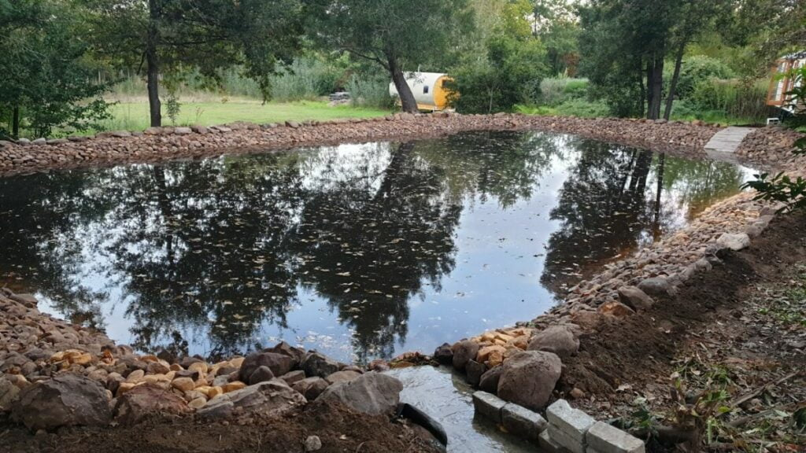](https://www.artamo.click/wp-content/uploads/2022/05/dam.jpg)

<figcaption>

Full

</figcaption>

</figure>

Prior to all these happenings, we spent a few days at Catherine's parents' farm in Little Karoo. A family retreat, on a huge piece of wilderness, in the depths of nowhere, has been planned and executed mainly by Wendy, Catherine's mother. This project has taken 20 years of their 'holiday' time enjoying every minute. We first visited about nine years ago, when it was just a shelter with kitchen toilet facilities and a dam in which to cool off. Having no services, they have installed solar power , bottled gas and even have an internet connection. \[Very necessary for Joe's work.\] This encampment now comprises; 3 rondavels \[small circular African dwelling homes\]; a wooden chalet; an all weather tent; a communal building comprises the kitchen; lounge; braai and outside eating area; a plunge/swimming pool and a boule piste. Pathways lead to each of these from the main 'house'.

<figure>

[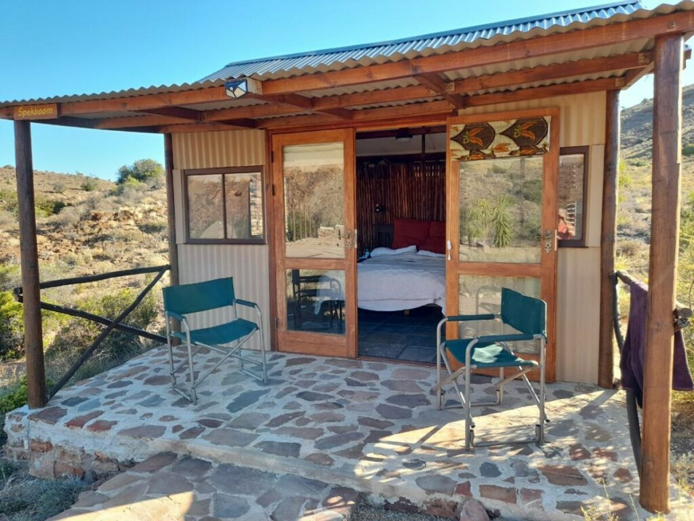](https://www.artamo.click/wp-content/uploads/2022/05/wp-1652001724912.jpg)

<figcaption>

This was our accommodation

</figcaption>

</figure>

[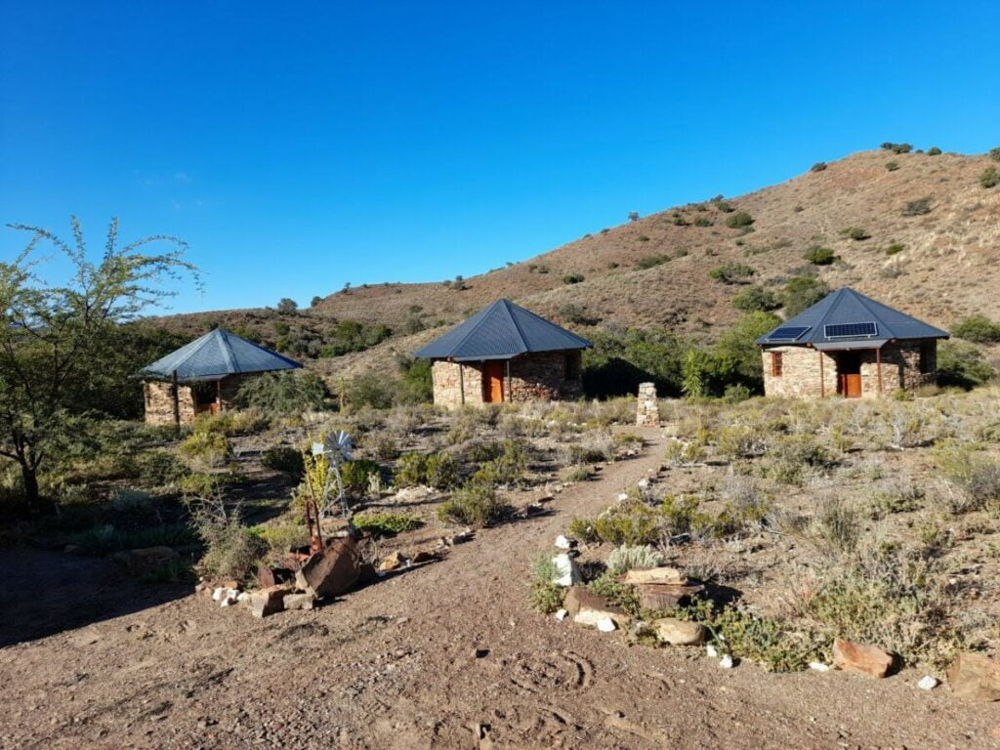](https://www.artamo.click/wp-content/uploads/2022/05/wp-1652001470949.jpg)

The dwelling places are expertly designed with simplicity, comfort and practicality in mind. They each have a double bedroom, which is separated from shower, toilet and cupboard space. Each day we read , played board games, boules and ate. Walking was difficult for us needing sturdy boots, a pair of strong legs, stamina and a 'go for it 'attitude...of which we had none. With eight adults and Eleanor, vegetable preparation was mammoth to accompany delicious nightly braais , sitting around the outside fire with just a glass or two ! It was magical! Bill and Peggy, Catherine's grandparents, 92 and nearly 90 years' old, had many a tale to tell. Eleanor was in her haven ...she was everywhere, climbing , uncovering treasures to eat ..ugh...sweeping up dirt and scattering again ..in the wrong places of course...and 'swimming'.....she favoured the irrigation holes to wash herself and clothes too. She loved her little excursions visiting everyone's home in turn. Not many toddlers have scabby knees at 15 months old. Easter Sunday, Catherine set up an Easter egg search for her....she soon cottoned on and her little basket was soon filled with eggs and chocolate, and a little tin lorry she could shovel dirt into...chocolate n all....tastes good to her. In spite of all the family attention, she determinedly set off on her own adventures ..we needed all of our sixteen eyes! I think Tilia kept a watch on her too !

[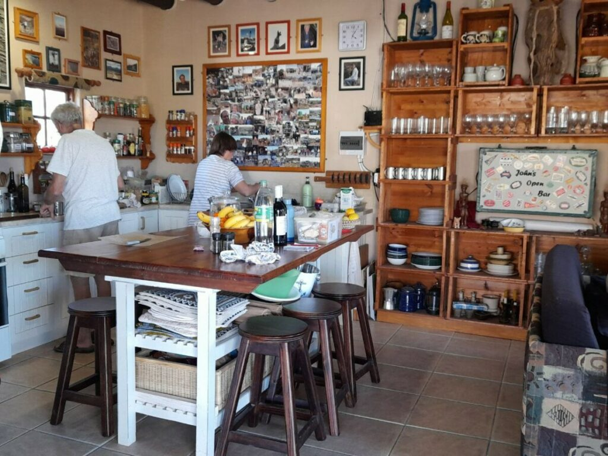](https://www.artamo.click/wp-content/uploads/2022/05/wp-1652001646259.jpg)

[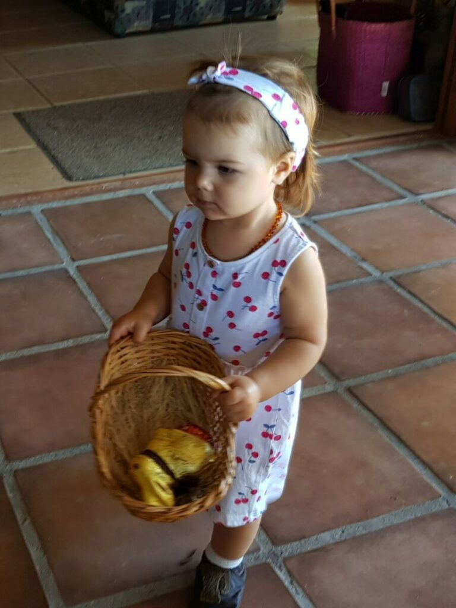](https://www.artamo.click/wp-content/uploads/2022/05/wp-1652002545275.jpg)

[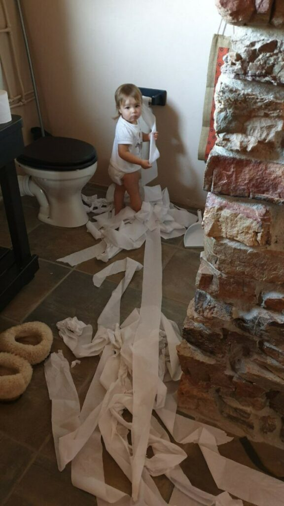](https://www.artamo.click/wp-content/uploads/2022/05/wp-1652002499086.jpg)

<figure>

[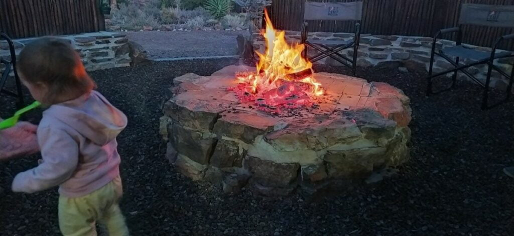](https://www.artamo.click/wp-content/uploads/2022/05/wp-1652001426736.jpg)

<figcaption>

Braai time

</figcaption>

</figure>

Back in Greyton ,our lives become somewhat routinised with daily and weekly routines, but always with room for spontaneity and maneuverability...even remember some long words!!!! Mike is using his designer skills coordinating with Dan and Catherine's ideas and then converting them into woodwork or electrical projects. He works in the large garage having transported Dan's tools. I fit an hour a day learning Spanish and now have a basic grasp of grammar and vocabulary. I just hope I can use it in practice with the locals in Spain. I need to acquire some listening skills, with my new aids. I paint whenever there is time and usually once a week with a friend and neighbour. My pleasure is taking Eleanor for coffee and toast in town. A bumpy walk there, waving to all and sundry, who adore her. We both enjoy the restaurant's little enclosed garden where she can have little discovery walks without coming to harm. She is enthralled by birds, mini beasts, and anything grubby...examining everything with a keen eye. Also mechanical bits, pipes and taps interest her inquisitive mind...maybe a future engineer ?

[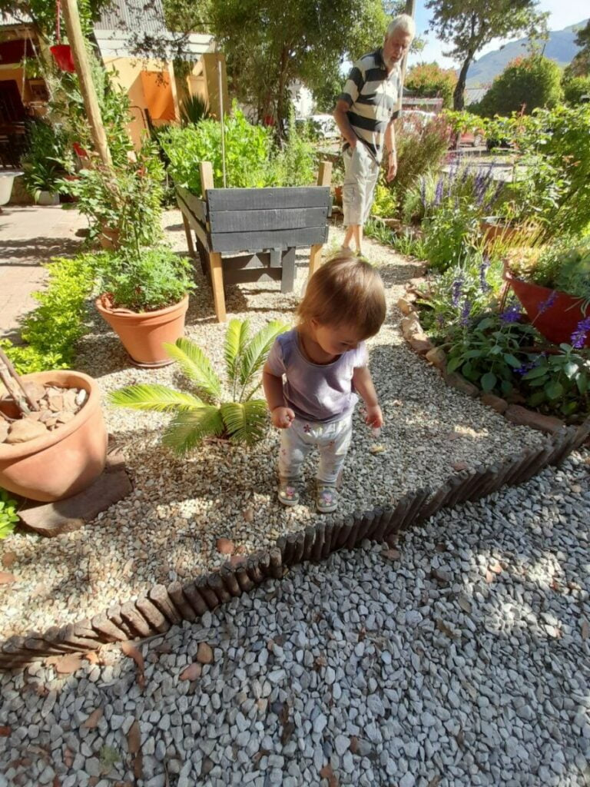](https://www.artamo.click/wp-content/uploads/2022/05/wp-1652001564016.jpg)

[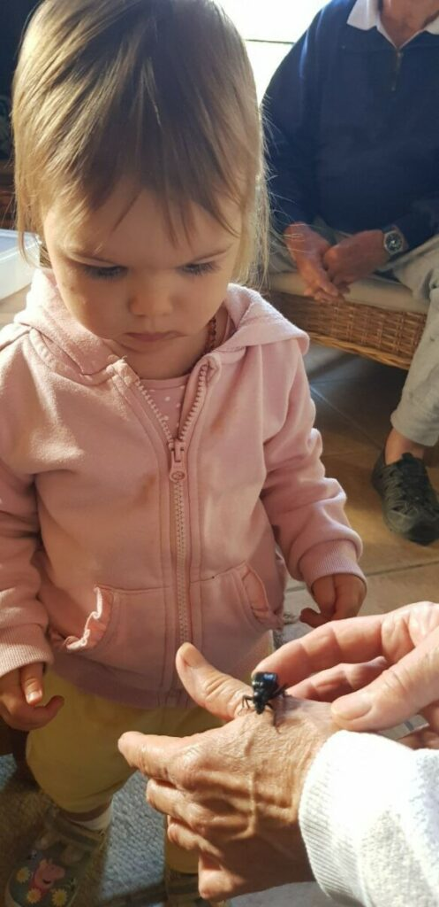](https://www.artamo.click/wp-content/uploads/2022/05/wp-1652639561583.jpg)

<figure>

[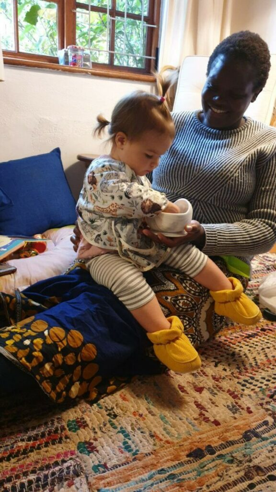](https://www.artamo.click/wp-content/uploads/2022/05/wp-1652002459598.jpg)

<figcaption>

Breakfast and African topknots

</figcaption>

</figure>

On Thursdays we play boule at the local retirement village, where we have made lots of friends and imbibe in drinks and pizzas afterwards in a beautiful garden centre cum restaurant. A couple of times at a member's house to celebrate a birthday \[I made the cake\], or a soup evening. All good fun.

[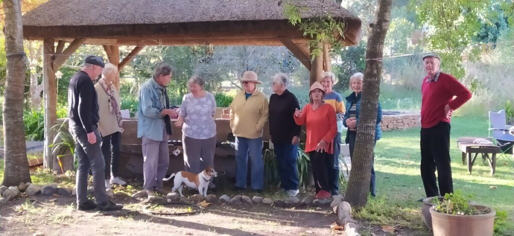](https://www.artamo.click/wp-content/uploads/2022/05/wp-1652456869998.jpg)

We needed to briefly pop to Dan's, so knowing we wouldn't be long, left the gate open. On returning we found were hosts to a few horses plus 2 foals ,who were enjoying our lush vegetation. On went the hat, with a swing of lasso, Mike bare back, heroically herded them out....!!!!!

<figure>

[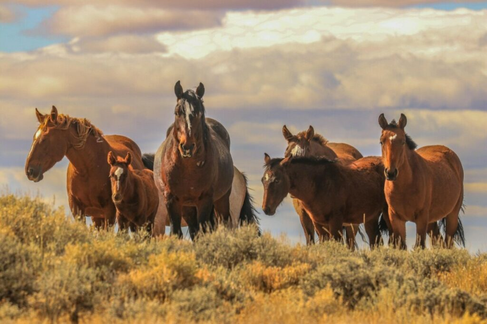](https://www.artamo.click/wp-content/uploads/2022/05/wp-1652629578772.jpg)

<figcaption>

Not our garden....had no time for photos there!

</figcaption>

</figure>

The baboons also like a trip into habitation . The lure of ripening fruit induced 2 very large ones down from the mountains at the end of our garden to quench their appetites. A bit scary first time, but Dan called the wardens who arrived almost immediately, so we felt more at ease. The next time was a family leaping over fences then across our garden ...mum with baby on back ..dad ..a real biggy, and siblings behind. The following day two more aimlessly lolloped towards the house as though they were the proprietors....We are now becoming quite complacent about them, even as far as sitting outside with our afternoon cuppa, when the wardens came rushing through.....a neighbour had reported them. We did move rather hastily ! However these happenings are quite infrequent so no cause for alarm, just close doors when house is empty.

Some painting in my spare time....

<figure>

[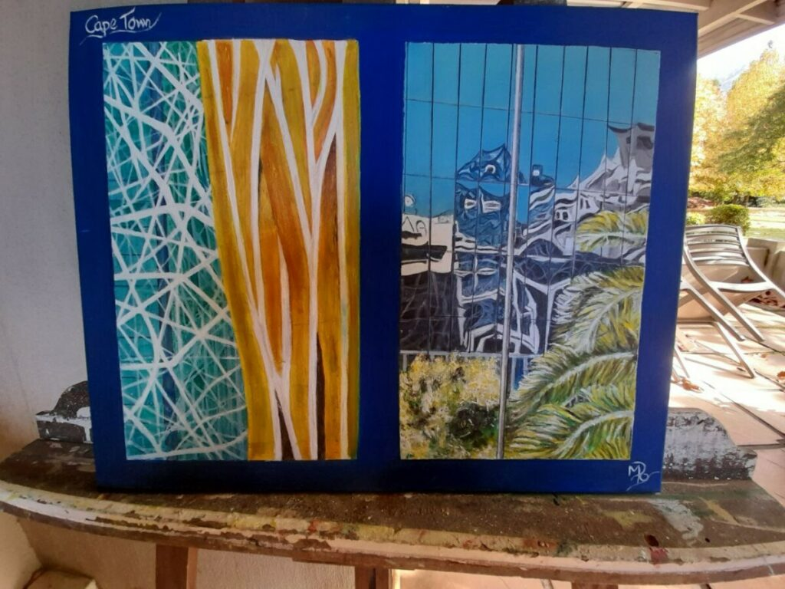](https://www.artamo.click/wp-content/uploads/2022/05/wp-1652002608057.jpg)

<figcaption>

structure and reflections ... architecture in Cape Town..oil and water.

</figcaption>

</figure>

<figure>

[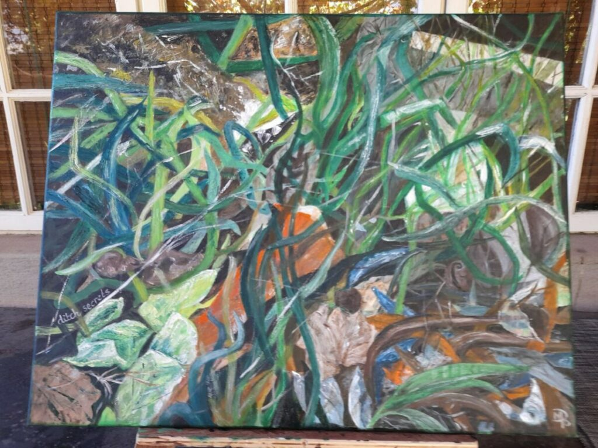](https://www.artamo.click/wp-content/uploads/2022/05/wp-1652457065881.jpg)

<figcaption>

in a ditch...oil and water

</figcaption>

</figure>

Now doing a 'triptrych'of autumn'..some glorious colours......hope I can capture them .

This is the first.

[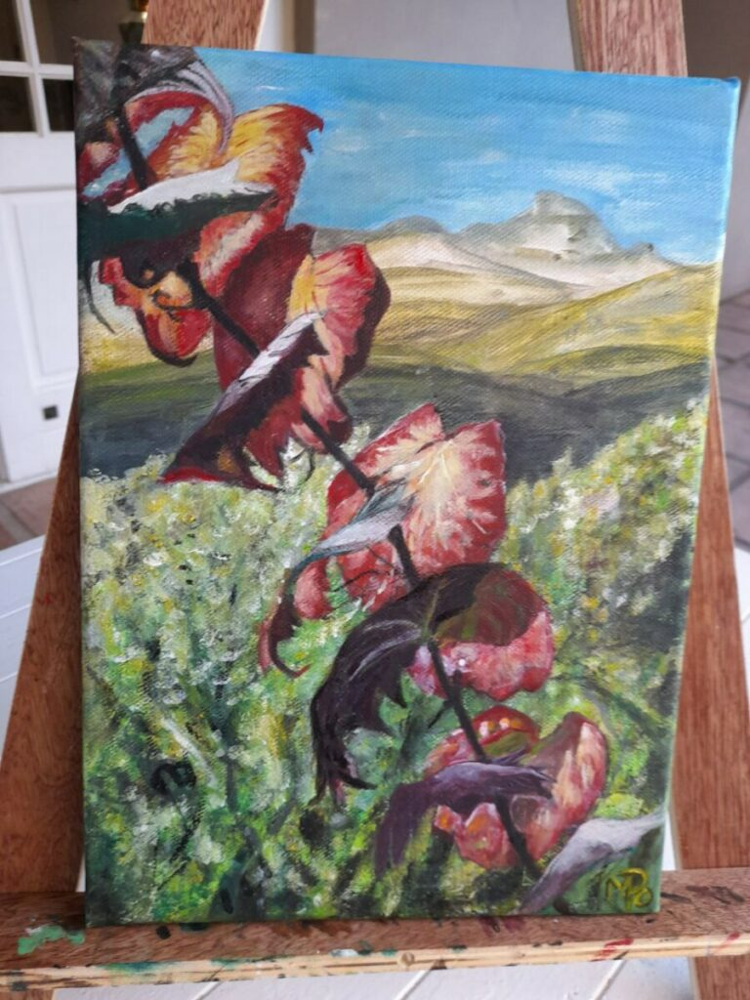](https://www.artamo.click/wp-content/uploads/2022/05/wp-1652712193847.jpg)

A couple of times we have needed medication necessitating a prescription for the Chemist . This procedure is amazing but very time consuming, even more so than in France and Spain where the hold up is usually due to family gossip at at the counter. On entry, as still in all shops here, a mandatory hand wash and mask check. Next to the check in at the dispensary section, choosing which service you require. An appropriate ticket which determines your desk is issued, after which you sit and wait your turn. At the desk an interrogation, even in spite of the fact that you are already registered ensues. The medicines are sought behind the scenes in what seems an interminable time..maybe needing a code number for entry cupboards, or perhaps a coffee machine is behind the screens ! On arrival the customer is given precise instructions of their administration, which is the repeated in writing on the container under customer's perusal. Once satisfied that all is understood, the medicaments are wrapped gift style and sealed. Then the package\[s\] are placed in a metal casket and locked. This achieved, the customer joins the queue to the checkout which serves all the aspects of the chemist, where the casket is unlocked and paid for! You need to put a morning aside for this or buy over the counter products.

This week Phillips' family junior christened the new dam, casting off in their rubber dingy for a row into the unknown . Eleanor was ecstatic just wanting to tumble into the water, or man the oars . Water wings next on list .

[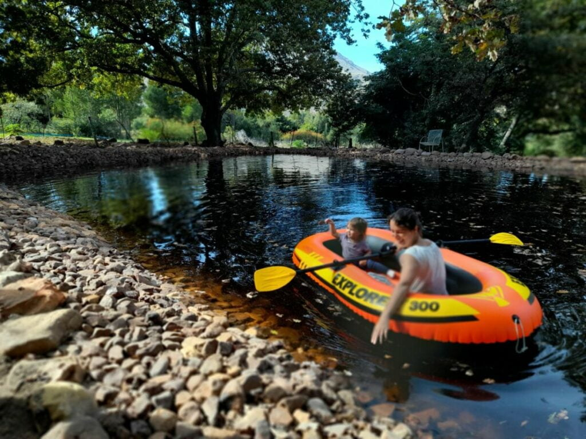](https://www.artamo.click/wp-content/uploads/2022/05/wp-1652001216638.jpg)

Now looking forward to a classical 3 days in Greyton where we are looking forward to a Spanish classical guitar concert with critically acclaimed Flamenco dancer.

So endeth my narrative and pics ...Enjoy

With love from us both Mo n Mike xx
